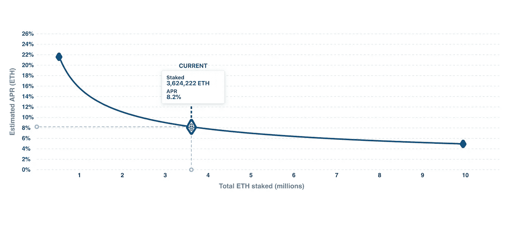

# 什么是赌注？你需要知道的一切

> 原文：<https://medium.com/coinmonks/staking-e4011874990c?source=collection_archive---------7----------------------->

亲爱的密码爱好者们，

在接下来的一系列文章中，我们将涵盖未来几个月密码行业最重要的趋势。我们要讨论的第一个话题是**赌注。**

## **赌注基础**

赌注是在你的加密资产上产生被动收入的最有吸引力且风险较低的方式之一。但更重要的是，跑马圈地是 T4 积极参与并为分散网络提供价值的一种方式。这是我们通向分散经济的大门。这到底是什么意思？

在一个非常基本的层面上，staking 是存放资产并将其作为担保品“锁定”在协议中的行为。通过“锁定”，可以提供平台长期可持续发展所需的服务。这可能是安全性、流动性、治理弹性或许多其他方面的提供(稍后将详细介绍)。此外，押记资产具有价值累积机制，并给予其持有人对协议产生的价值的要求权。

标桩可以采取多种形式。第一个是在平台层(称为区块链第一层)下注。这在区块链是可能的，他们有一个利害关系证明共识机制，比如 Polkadot，Cosmos，Cardano，还有重要的以太坊 2。

Top 10 assets staked at a platform layer. with their respective rewards. Source: [Staking rewards](https://www.stakingrewards.com/)

通过在[股权证明(PoS)](https://ethereum.org/en/developers/docs/consensus-mechanisms/pos/) 区块链中下注资产，可以充当这个区块链的**验证者**。验证器对于任何分布式分类帐都是至关重要的，因为它们有能力组织块中的交易，并将它们写入“正式”或规范的分类帐。他们扮演的角色与传统的[工作证明](https://ethereum.org/en/developers/docs/consensus-mechanisms/pow/)区块链中的矿工相似，不同之处在于，验证者不是执行高能耗的计算，而是留下抵押品(股份)来保证所有进入分类账的条目都是根据预定义的规则完成的。通过这样做，他们帮助**达成共识**和同时**保护网络。**为了执行这项重要的工作，验证者被奖励以本地协议令牌，这些令牌由用户支付的交易费或新硬币的发行(通货膨胀机制)提供。

staking 最有趣的方面之一是它**提供了向网络提供工作**的权利。Staking 获得了一个额外的含义:一个 [**数字工作协议。**](https://drive.google.com/file/d/13-s15SvCIUBukhSZiNkpd0sTff3izQ5G/view)

## **以太坊 2 赌注**

最有趣的赌注机会之一将来自以太坊 2，它最近推出了第 0 阶段。为什么？

以太坊区块链是第二大区块链，市值**2000 亿美元，**目前托管数万个应用，**资产价值>1000 亿美元**，结算 **> 1 万亿美元。**它将彻底检查其共识机制，同时保持应用层完好无损。以太坊 2 升级将大大提高以太坊的可扩展性、安全性和能效，以应对集中化风险。这次升级是几年研究的结果，可以说是过去几年中密码行业最重要的事件。

The “Blockchain trilemma” says that Blockchain can fulfill 2 but not three of the following characteristics: Decentralization, security, and scalability. It is argued that Ethereum 2 will solve this, Source: Messari

虽然以太坊 2 还没有完全发挥作用(将在 1.5 阶段之后)，但已经有可能在网络中使用以太。这种转变将改变以太，也就是资产。以太将成为**生产性资产，**产生收益的资产，或者换句话说，成为**资本资产。**

Source: What is an asset class, Anyway?, Robert Greer, 1997 popularized in the crypto Ecosystem by PlaceHolder Ventures (C. Burniske)

这种新资本资产的回报将取决于系统中锁定的 ETH 总数。目前，锁定了约 360 万 ETH，年化回报率约为 8.2%。随着越来越多的 ETH 被押下，预期收益将会下降。从长期来看，收益率预计将在 4%-6%的范围内波动。回报以 ETH 计价！

Yields on staked ETH are variable and depend on the amount of ETH staked in the system. Source [eth2 launchpad](https://launchpad.ethereum.org/en/)

这赋予以太这种资产股票的性质，也赋予债券的性质。有人称之为互联网债券的诞生。与传统债券不同，它没有交易对手风险。 Staked ETH 在协议层面提供收益，而不是通过交易对手，并且没有违约风险。以太坊区块链的设计是有偿付能力的，并被编程为向下注其以太的验证者发行新硬币。在这方面，它与美国或德国等大型经济体的国债有一些相似之处。它们被认为是“无风险”的，因为债务人(国家)可以“印钱”来偿还债务。正因如此，有人认为 ETH 2 的赌注利率可以发展成以太坊经济的**无风险利率**。

这不是 ETH Stakers 获得报酬的唯一方式。赌注者也有权从网络产生的费用中获得一定的百分比。在上述新发行的基础上收取费用。EIP- 1559 法案(对交易费运作方式的一项根本性改革)将烧掉一些费用，但这些平台的经济状况非常健康。以太坊是迄今为止产生更多费用的加密平台，每天超过 2600 万美元！

Blockchain protocols generate revenues by charging fees to their users. Ethereum is the platform that generates the most fees. [Source](https://cryptofees.info/)

在接下来的文章中，我们将深入探讨以太网 2 和定义堆栈。敬请期待！

蓝天鹅学院是一个面向区块链经济的教育平台，专注于法律和金融行业。请在这里免费查看我们的[当前课程](https://academy.blue-swan.io/)和我们的[入门课程！](https://academy.blue-swan.io/offers/EdvPmH95/checkout?utm_source=Medium&utm_medium=Article&utm_campaign=Free_Access)

在此注册订阅我们的时事通讯！