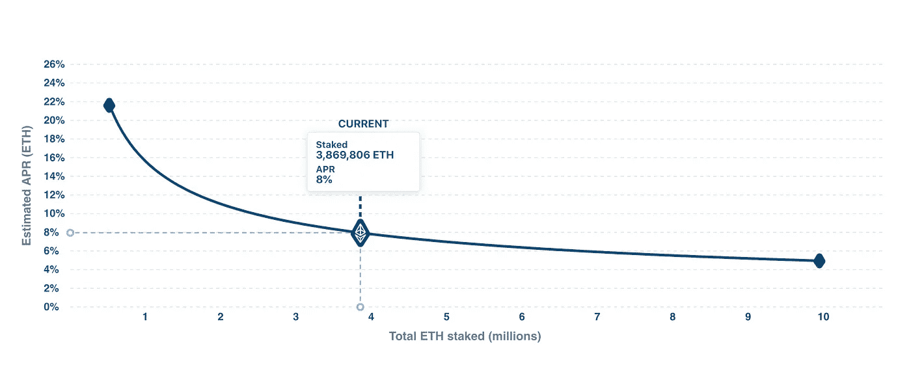
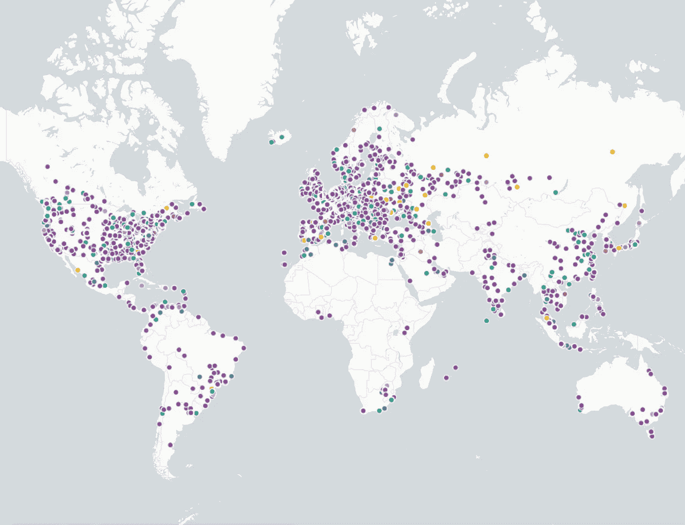
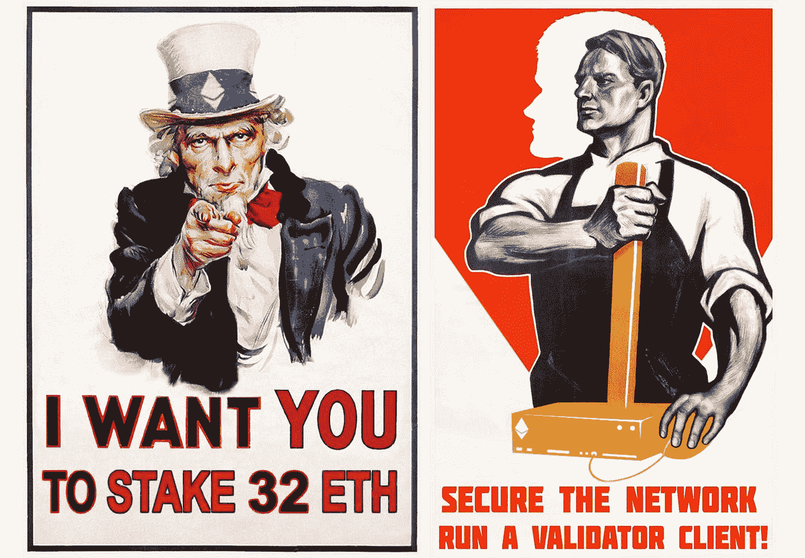

# 赌注，你需要知道的一切第 2 部分:以太坊赌注

> 原文：<https://medium.com/coinmonks/staking-everything-you-need-to-know-part-2-ethereum-staking-446f2f3cbec4?source=collection_archive---------10----------------------->

## 亲爱的密码爱好者们，

在我们的[上一篇文章](/coinmonks/staking-e4011874990c)中，我们分析了赌注的基本原理，并将其定义为一个**数字工作协议**，它让世界各地的人们接触到新的、数字化的 web 3 经济。在世界的每个角落，任何人都可以为加密网络提供价值，并因此获得回报，而无需征得任何人的许可(又名*无许可*)。现在，我们将进一步分析区块链区块链协议层(也称为第 1 层)的区块链赌注，该协议层已经或将使用[赌注证明](https://coinmarketcap.com/alexandria/glossary/proof-of-stake-pos)作为共识算法，并特别提及以太坊。

第 1 层的基本工作方式如下:

a)首先，用户**抵押价值。**记住，在区块链网络中，价值被虚拟地表示为代币或**加密资产。**区块链有史以来第一次实现了数字稀缺性，这是管理和储存价值的关键属性。这种数字稀缺在 web2 或 web1 中是不可能的，它体现在无法复制或操纵的数字令牌中。然后，该加密资产被**标桩**或锁定在协议或网络中。

b)通过锁定加密资产，一个人**获得为协议提供数字作品**的权利。例如，这项工作可以是在一台专用机器上运行一个开源软件，同步一个数字化的、分散的交易分类账(也就是运行一个区块链节点)。与其他 PoS 平台一样，在以太坊区块链中，数字工作具体包括验证交易和向区块链添加新的交易块。在这些区块链中，利益相关者也被称为**验证者、**并履行类似于[工作证明](https://coinmarketcap.com/alexandria/glossary/proof-of-work-pow)区块链中*矿工*的角色。

同步这个数据库对于在分散网络中实现 [**共识**](https://coinmarketcap.com/alexandria/glossary/consensus) 至关重要。另一个重要方面是，运行的节点越多，网络就越安全，抵御外部攻击的能力就越强。在没有中央管理人的情况下，所有这些方面对于平台的生存和发展都至关重要。

c)产生作品的权利通过通过协议发行的**数字债券**来表示。这种契约赋予“数字工作者”定期付款的权利，只要赌注者为协议提供服务。

Ethereum2 Digital Bonds were launched in December 2020 and currently have annualized yield of 8%. Source: [Ethereum Launchpad](https://launchpad.ethereum.org/en/)

数字、web3 债券与传统金融行业的债券有相似之处，主要是因为它们赋予持有者定期付款的权利。但它们也有实质性的区别，因为它们通常没有到期日(是永久的)，也没有交易对手风险:支付回报的协议在技术上被设计成有偿付能力的*协议，不能违约。正因如此，正如我们在上一篇文章中看到的，ETH 2 的赌注利率可以发展成以太坊经济的**无风险利率**。*

然而，我想强调的是与传统债券的一个重要区别:

Web3 互联网债券持有人是资本、劳动力、资源的出借者，同时也是网络的所有者和管理者。

我们将在下一篇文章中扩展治理权，但基本思想是，获得的令牌可以用于对协议的未来发展进行投票。这对于以太坊来说是不正确的，因为以太资产不授予治理权，但是对于其他区块链网络和大多数 DeFi staking 来说是正确的。绝大多数 DeFi 资产可以通过赌注或其他形式的流动性挖掘获得，同时也是治理令牌。

**成为网络 3 经济的一部分**

正如我们所见，在以太坊或其他公共区块链下注是*无许可的，*这意味着任何人都可以参与，不需要任何人的许可，只要你有互联网连接和一些投资资本。参与 Ethereum2 赌注有几种方式:

**a)运行自己的节点**

现在有了消费类硬件和基本的技术知识，就可以在自己家里运行一个完整的节点。正如我们提到的，运行的节点越多，网络就越分散，因此也就越有弹性，越能抵抗审查。

Ethereum node map. [Source](https://matallo.carto.com/builder/e70677d5-1111-40a8-9e19-f27da227a55c/embed?state=%7B%22map%22%3A%7B%22ne%22%3A%5B-71.63599288330607%2C-144.84375000000003%5D%2C%22sw%22%3A%5B81.97243132048267%2C163.12500000000003%5D%2C%22center%22%3A%5B23.32208001137844%2C9.140625000000002%5D%2C%22zoom%22%3A2%7D%2C%22widgets%22%3A%7B%22382ba308-9b92-4a88-bc6d-2ca8bda2137a%22%3A%7B%22autoStyle%22%3Atrue%7D%7D%7D)

以太坊 2 是为成百上千的验证者参与和最大化去中心化而设计的。任何人都可以运行验证器，而不需要昂贵的基础设施成本或严格的维护要求。作为完全节点参与的主要要求是入股 32 ETH。

如果你有兴趣参与，你一定要看看无银行社区的优秀教程。

b) D **委托打桩**

有许多**Staking as-a-Service**平台为您提供参与 Staking 的可能性，而无需运行您自己的节点。在委托下注中，可以从低于 32 ETH 的金额开始，这使它们更容易获得。北海巨妖和比特币基地等主要密码交易所也为所有主要的区块链 PoS 机提供赌注服务。虽然更方便且经济可行，但委托标桩也有一个重要的缺点:必须依赖和信任第三方来正确执行标桩，这存在集中化风险。从网络层面来看，存在着主要参与者(如加密交易所)集中赌注的风险，这反过来会使网络更加脆弱。[赌注奖励](https://www.stakingrewards.com/)很好地概括了不同的选择。值得一提的一个有趣的选择是[火箭池](https://beta.rocketpool.net/)，它提供**分散的赌注服务。该产品仍在测试中，但将很快提供给感兴趣的赌注者。**

The emergence of a new stateless digital economy or techno populism? Diverse memes promote the importance of staking

蓝天鹅学院是一个面向区块链经济的教育平台，专注于法律和金融行业。请在这里免费查看我们的[当前产品](https://academy.blue-swan.io/)和[入门课程！](https://academy.blue-swan.io/offers/EdvPmH95/checkout?utm_source=Medium&utm_medium=Article&utm_campaign=Free_Access)

在此注册订阅我们的时事通讯！

> 加入 coin monks[Telegram group](https://t.me/joinchat/PmKOYQ9NNKZlZGNl)学习加密交易和投资

## 另外，阅读

*   [什么是保证金交易](https://blog.coincodecap.com/margin-trading) | [美元成本平均法](https://blog.coincodecap.com/dca)
*   最好的[密码交易机器人](/coinmonks/crypto-trading-bot-c2ffce8acb2a) | [网格交易机器人](https://blog.coincodecap.com/grid-trading)
*   [3 商业评论](/coinmonks/3commas-review-an-excellent-crypto-trading-bot-2020-1313a58bec92) | [Pionex 评论](/coinmonks/pionex-review-exchange-with-crypto-trading-bot-1e459d0191ea) | [Coinrule 评论](/coinmonks/coinrule-review-2021-a-beginner-friendly-crypto-trading-bot-daf0504848ba)
*   [AAX 交易所评论](/coinmonks/aax-exchange-review-2021-67c5ea09330c) | [德里比特评论](/coinmonks/deribit-review-options-fees-apis-and-testnet-2ca16c4bbdb2) | [FTX 交易所评论](/coinmonks/ftx-crypto-exchange-review-53664ac1198f)
*   [n 平均零点评审](/coinmonks/ngrave-zero-review-c465cf8307fc) | [Phemex 评审](/coinmonks/phemex-review-4cfba0b49e28) | [PrimeXBT 评审](/coinmonks/primexbt-review-88e0815be858)
*   [by bit Exchange Review](/coinmonks/bybit-exchange-review-dbd570019b71)|[bit yard Review](/coinmonks/bityard-review-7d104239be35)|[coin spot Review](https://blog.coincodecap.com/coinspot-review)
*   [3 commas vs crypto hopper](/coinmonks/3commas-vs-pionex-vs-cryptohopper-best-crypto-bot-6a98d2baa203)|[赚取秘密利息](/coinmonks/earn-crypto-interest-b10b810fdda3)
*   最好的比特币[硬件钱包](/coinmonks/the-best-cryptocurrency-hardware-wallets-of-2020-e28b1c124069?source=friends_link&sk=324dd9ff8556ab578d71e7ad7658ad7c) | [BitBox02 回顾](/coinmonks/bitbox02-review-your-swiss-bitcoin-hardware-wallet-c36c88fff29)
*   [莱杰 vs n rave](/coinmonks/ledger-vs-ngrave-zero-7e40f0c1d694)|[莱杰 nano s vs x](/coinmonks/ledger-nano-s-vs-x-battery-hardware-price-storage-59a6663fe3b0) | [币安评论](/coinmonks/binance-review-ee10d3bf3b6e)
*   [加密复制交易平台](/coinmonks/top-10-crypto-copy-trading-platforms-for-beginners-d0c37c7d698c) | [Coinmama 评论](/coinmonks/coinmama-review-ace5641bde6e)
*   [CoinLoan 评论](/coinmonks/coinloan-review-18128b9badc4) | [YouHodler 评论](/coinmonks/youhodler-4-easy-ways-to-make-money-98969b9689f2) | [BlockFi 评论](/coinmonks/blockfi-review-53096053c097)
*   最好的[加密税务软件](/coinmonks/best-crypto-tax-tool-for-my-money-72d4b430816b) | [硬币追踪评论](/coinmonks/cointracking-review-a-reliable-cryptocurrency-tax-software-5114e3eb5737)
*   最佳[密码借贷平台](/coinmonks/top-5-crypto-lending-platforms-in-2020-that-you-need-to-know-a1b675cec3fa) | [杠杆令牌](/coinmonks/leveraged-token-3f5257808b22)
*   [block fi vs Celsius](/coinmonks/blockfi-vs-celsius-vs-hodlnaut-8a1cc8c26630)|[Hodlnaut 审核](/coinmonks/hodlnaut-review-best-way-to-hodl-is-to-earn-interest-on-your-bitcoin-6658a8c19edf) | [KuCoin 审核](https://blog.coincodecap.com/kucoin-review)
*   [Bitsgap 审查](/coinmonks/bitsgap-review-a-crypto-trading-bot-that-makes-easy-money-a5d88a336df2) | [Quadency 审查](/coinmonks/quadency-review-a-crypto-trading-automation-platform-3068eaa374e1) | [Bitbns 审查](/coinmonks/bitbns-review-38256a07e161)
*   [埃利帕尔泰坦评论](/coinmonks/ellipal-titan-review-85e9071dd029) | [赛克斯斯通评论](/coinmonks/secux-stone-hardware-wallet-review-15-discount-coupon-2020-7577032faa6e)
*   [本地比特币评论](/coinmonks/localbitcoins-review-6cc001c6ed56) | [加密货币储蓄账户](https://blog.coincodecap.com/cryptocurrency-savings-accounts)
*   最佳[区块链分析](https://bitquery.io/blog/best-blockchain-analysis-tools-and-software)工具| [赚比特币](/coinmonks/earn-bitcoin-6e8bd3c592d9)
*   [加密套利](/coinmonks/crypto-arbitrage-guide-how-to-make-money-as-a-beginner-62bfe5c868f6)指南| [如何做空比特币](/coinmonks/how-to-short-bitcoin-568a2d0b4ae5)
*   最佳[加密制图工具](/coinmonks/what-are-the-best-charting-platforms-for-cryptocurrency-trading-85aade584d80) | [最佳加密交易所](/coinmonks/crypto-exchange-dd2f9d6f3769)
*   [如何在印度购买比特币？](/coinmonks/buy-bitcoin-in-india-feb50ddfef94) | [瓦济克斯评论](/coinmonks/wazirx-review-5c811b074f5b)
*   [印度比特币交易所](/coinmonks/bitcoin-exchange-in-india-7f1fe79715c9) | [比特币储蓄账户](/coinmonks/bitcoin-savings-account-e65b13f92451)
*   [CoinDCX 点评](/coinmonks/coindcx-review-8444db3621a2) | [加密保证金交易交易所](https://blog.coincodecap.com/crypto-margin-trading-exchanges)