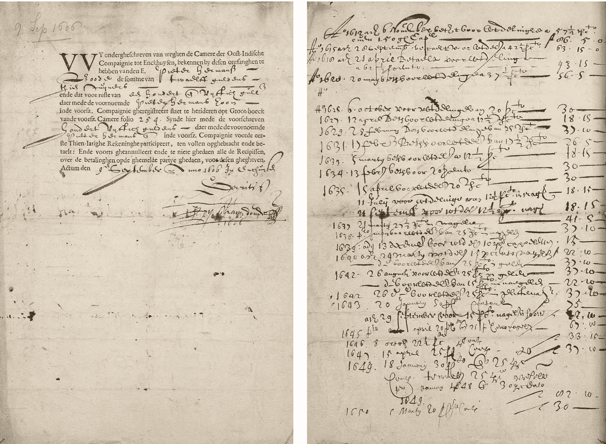
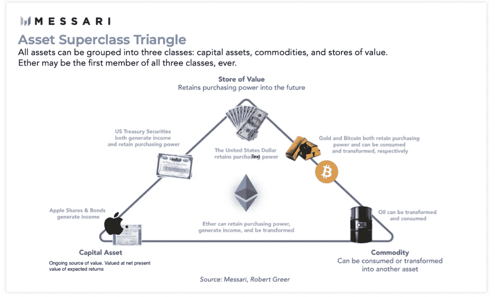
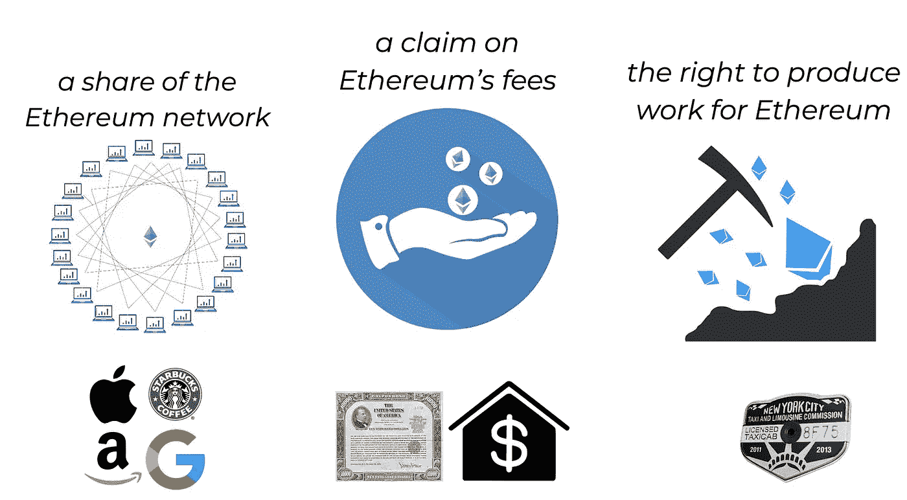
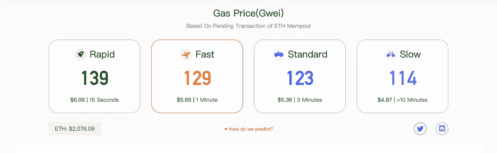
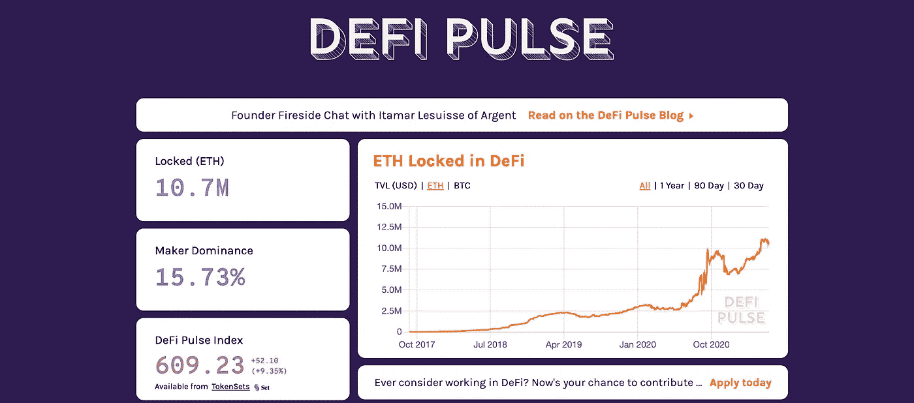

# 赌注，你需要知道的一切:第三部分

> 原文：<https://medium.com/coinmonks/staking-everything-you-need-to-know-part-iii-bf0384f404b1?source=collection_archive---------3----------------------->

## 以太坊 2 和三相点资产模型

Dutch India Stock Certificate from 1606\. [Source](https://commons.wikimedia.org/wiki/File:VOC_aandeel_9_september_1606.jpg#/media/File:VOC_aandeel_9_september_1606.jpg)

在十七世纪，荷兰帝国是西方世界卓越的经济帝国和最富有的力量。不同的技术帮助他们在全球传播他们的霸权。荷兰人拥有非常先进的造船技术，这使他们能够航行很远的距离，并与全世界进行贸易。他们还拥有高超的军事技术，这使他们能够抵御敌对势力(尤其是英国)并征服偏远地区。

但是他们有另一项重要的技术，一项经济金融技术。他们在**创新资源分配机制**来资助他们的努力和征服，并限制商人的责任。他们能够集体贷款并购买盈利项目的所有权，这在当时是一件新鲜事。在荷兰帝国统治下，**第一家上市公司**成立:荷兰东印度公司，创建于 1602 年。这是一场真正的制度革命，因为它赋予了法人地位、所有权和经营权的分离、可转让的股份，以及重要的有限责任。这是一种新的资产类别的诞生:股票。

荷兰东印度公司被认为是现代公司的前身。股票在位于阿姆斯特丹的世界上第一个股票交易所交易，并以世界上第一种储备货币荷兰盾支付。所有这些金融投资创新吸引了投资者，使阿姆斯特丹成为当时领先的金融中心。由于这些创新，许多人认为荷兰人是资本主义的发明者。

快进 400 年:区块链最大的公共智能合约以太坊网络(Ethereum network)支持着一个价值 3700 亿美元的数字经济(目前是世界第三大“银行”，仅次于比特币和摩根大通)，它向一个新的共识机制过渡:股权证明。正如我们在上一篇文章中所看到的，风险资产是一种[资本资产](https://www.investopedia.com/terms/c/capitalasset.asp)，这种资产预计会随着时间的推移产生价值，并根据其预期回报的净现值进行估值。

以太坊向股权凭证的转变将以太这一资产转化为资本资产。但这变得更加有趣:以太将是历史上第一个同时拥有所有三种资产类别质量的资产:资本资产、价值储存和商品(又名**“三相点资产”)。**一个**新资产类别的诞生？**

Ether as the “Triple — Point Asset”, thesis coined by D. Hoffmann [https://thedefiant.substack.com/p/ether-is-the-best-model-for-money](https://thedefiant.substack.com/p/ether-is-the-best-model-for-money)

让我们更详细地检查一下它的“三相点”特性:

1.  在它的**资本资产形式中，**押以太是

*   以太坊里的**股份**。在这方面，行为类似于股票。股票具有永恒的性质，比如股票。它还提供了对以太坊未来交易费用的索赔权。尽管 staked Ether 不提供投票权，DeFi 中的许多其他 staked 资产提供了治理(政治权利)，就像传统的股票一样。
*   **关于以太坊费用的一个说法**。在这方面，类似于**焊接**。以太坊是债券发行人，利益相关者是债券持有人。与传统债券的区别在于，赌注者可以“随时”赎回乙醚(无到期日)，类似于债券的嵌入式期权。特别是，以太收购了**主权债券质量**，因为该平台在设计上是有偿付能力的，没有违约风险。
*   **产生作品的权利**。在这方面，表现得像一个承包商许可证债券。作为赌注的交换，赌注者获得提供共识的许可。和安全。奖励以本地代币支付。

Ether as a capital asset. [Source](https://thedefiant.substack.com/p/ether-is-the-best-model-for-money)

这相位将股权转变成类似股权的工具，将股息永久化。

**2。**在其**商品形式中，**押醚是

*   一个**商品**用于向以太坊网络支付交易费用。在以太网中，交易费用被称为****。**比喻有传统之气，可见一斑。**

****

**Dashboard of Ether gas prices, Source [https://www.gasnow.org/](https://www.gasnow.org/)**

**汽油价格是用乙醚的亚单位 Gwei 来衡量的。Gwei 是 gigawei 的缩写，或 10 亿个 wei。作为以太的最小(基本)单位，卫就像美分和美元的关系，以及比特币和聪的关系。 *1 gwei = 0.000000001 乙醚。***

**以太坊网络的每一笔交易(发送代币或与智能合约交互)都需要花费汽油，并以 Gwei 计价。在引入 [EIP — 1559](https://notes.ethereum.org/@vbuterin/BkSQmQTS8?) (计划于 2021 年 7 月)后，这些费用将被“烧掉”，就像传统的天然气或石油一样。EIP - 1559 推出后，乙醚将变成**可消耗/可转换资产(一种商品)。****

****3。**以其**储值**形式，押出乙醚**

*   **债券、股票等传统金融资产或黄金、白银等商品的替代保值手段。此外，以太是以太经济的[储备资产，尤其是 DeFi。在撰写本文时，价值 720 亿美元的 1060 万瑞士法郎正在支持 DeFi 经济。这就是以**储值**形式存在的乙醚。](https://newsletter.banklesshq.com/p/eth-the-reserve-asset)**

****

**Ether is the [reserve asset](https://www.investopedia.com/terms/r/reserve-assets.asp) of the DeFi economy. Source: DeFiPulse**

**区块链技术使我们能够在资本分配、融资、债务和集体所有权方面进行前所未有的创新。我相信这将导致人类福利的巨大飞跃，就像十七世纪初在荷兰发生的那样。但是，有一个实质性的不同:新的金融中心将不是一个城市，而是一个公共的区块链。新的储备货币将不会是统治帝国的法定货币，而是一种数字化、无许可、抵制审查的货币。活着真是激动人心的时刻！**

****

**蓝天鹅学院是一个面向区块链经济的教育平台，专注于法律和金融行业。请在这里免费查看我们的[当前课程](https://academy.blue-swan.io/)和我们的[入门课程！](https://academy.blue-swan.io/offers/EdvPmH95/checkout?utm_source=Medium&utm_medium=Article&utm_campaign=Free_Access)**

**在此注册订阅我们的时事通讯！**