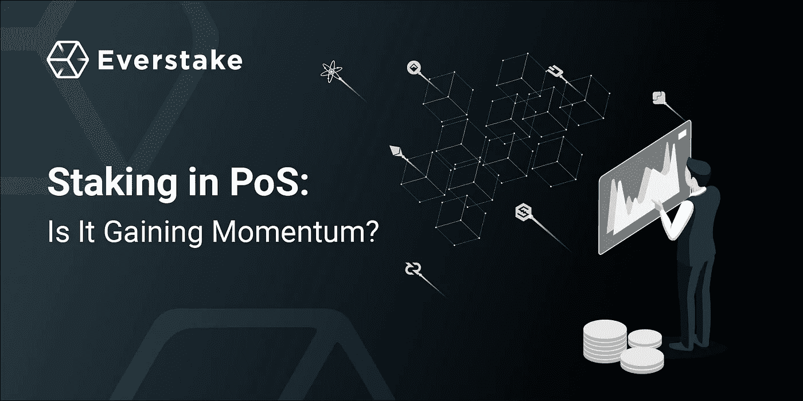

# 在 PoS 中下注:它正在获得动力吗？

> 原文：<https://medium.com/coinmonks/staking-in-pos-is-it-gaining-momentum-2138cfeea077?source=collection_archive---------0----------------------->

区块链社区发展迅速。在过去的几年中，已经创建并实现了几种共识算法，包括利害关系证明，这被认为是最有效和最经济的机制之一。此外，它已经成为一些替代协议的基础，如 DPoS、LPoS、BPoS 等。那么所有这些变化之间的区别是什么呢？

# 利害关系证明

PoS 算法创建的主要目的是优化电力使用。在这里，矿工不需要电力计算设备或耗能的采矿场。他们所要做的就是持有一定数量的加密货币——他们的股份。这就是为什么整个过程被称为打桩，而不是采矿。

在 PoS 中，赌注以一种简单且相当确定的方式进行:持有更大股份的人获得更多利润。不像 PoW，没有数学问题要完成，因此，创造一个积木没有奖励。相反，大宗商品生产商从每笔交易中获得一笔费用。

当涉及到链的安全性时，PoS 是这样工作的:万一有人试图危害网络，他们可能会失去所有下注的钱，这些钱可能会达到数万美元。

然而，PoS 并非完美无缺。当然，控制整个网络将非常困难和昂贵，因为它需要入侵者获得该链上所有加密货币供应的 51%。但 PoS 算法还有一个问题，简称为“富者愈富”。

它是这样工作的:由于 PoS 的特殊机制，钱包里有更多硬币的持有者通过验证新的交易变得更加富有。相反，加密货币交易量较小的爱好者没有机会获得那么多。这种方式对代币持有者来说仍然是相当不公平的。

由于上述原因，产生了一些 PoS 变体。

# 委托股权证明

DPoS 可能是在 PoS 基础上发展起来的最知名的共识算法之一。它是作为某种“技术民主”而产生的，并且一直保持到现在。

DPoS 将实时投票与深思熟虑的声誉系统相结合，以达成共识。这种方式 DPoS 有时被称为充分分散化:它的共识协议涉及每个令牌持有者的参与。当然，持有者对网络的影响是有限的，取决于他们拥有的股份。

网络上的交易验证者被称为块生产者，他们承担代表的角色，因为他们是通过选举选出的，并代表所有令牌持有者的利益。可能只有固定数量的代表(通常为 20–50，最多为网络上的用户)。他们的职责包括治理、确保节点启动并运行、验证事务以及将它们收集到块中。

在任何恶意的情况下，网络的其他成员会以同样的民主方式投票选出代表。在基于存款的 PoS 机中，他们甚至会丢失在选举开始时存入安全账户的资金。

DPoS 的另一个好处是，它支持高频块生成，因此与其他共识算法相比，它可以更快地验证交易。

dpo 加密货币的例子:Lisk，EOS，Steem，Bitshares，TRON。

# 股权的流动性证明

LPoS 是 Tezos 在 2018 年推出的一种全新的共识机制。它带来了一些创新的特性，使得 LPO 比其他选项更加分散。

与 dpo 不同，它在网络上没有固定数量的烘焙者(又名验证者)，他们的集合是动态的，可能会随着时间而变化。此外，他们的总人数有可能增加到 80，000 人(目前为 450 人),而不是 dpo 中的 20-50 人。

此外，该算法不再包括选举。相反，如果用户有足够的令牌，他们可能会成为块验证者，就像在传统的 PoS 区块链上一样。但是没有能力成为验证者的用户可以将他们的令牌委托给其他人，而无需保管，以换取报酬。这使得 LPO 看起来像是 PoS 和 dpo 最有特色的组合。

LPO 加密货币的例子:Tezos。

# 抵押股权证明

BPoS 与 LPoS 非常相似。它也不需要选举，用户不需要支付托管费，如果他们成为验证者，就有可能对协议进行修改。

然而，也有一些不同之处。主要区别与安全问题有关。如果验证者不诚实，BPoS 区块链可能会削减他们的股份和他们的委托人的股份。同时，在 LPoS 中，只有验证器面临风险。

BPO 加密货币的例子:Cosmos，IRISnet。

# 混合股权证明

另一个不得不提的共识算法是混合 PoS/PoW。它通常作为块创建的 PoW 和块进一步验证的 PoS 的组合。这种解决方案通过增加股东投票的散列能力来增强网络的安全性。

hpo 加密货币的例子:Decred，Hcash。

# 光明的未来在前方？

毫无疑问，将会有更多可供选择的 PoS 算法，因为密码社区不是静态的，并且倾向于为每一个新硬币开发一种单独的技术。

PoS 开发并没有就此停止，因为以太坊预计将在今年晚些时候迁移到 PoS，这将对习惯的共识算法带来轻微的偏差。Vitalik Buterin [声称](https://www.ethnews.com/vitalik-clears-up-confusion-around-casper)要做一个硬分叉，实现一个新的 Casper 协议，这被认为比任何已知的机制都要安全得多。

此外，我们可能已经谈到了 StaaS (Staking as a Service)业务开发。最近，这类业务出现了明显的繁荣，我们可能会预计它们会在市场上停留一段时间。StaaS 提供的是将您的责任委托给第三方的可能性，允许他们代表您管理日常赌注。

StaaS 商业模式似乎很有吸引力，因为硬币持有者每年仍能获得 10-20%的收入。然而，也有一些陷阱，如高度竞争和利润压缩，这可能会导致 StaaS 业务数量或受欢迎程度的下降。

总的来说，事实证明:跑马圈地的势头越来越大。PoS 共识算法有很多优点，所以在未来的几年里，它将继续被开发和改变。

## 关于 Everstake

作为赌注服务提供商，Everstake 帮助机构投资者和普通代币持有者从他们的数字资产中获利。我们在区块链经营各种各样的股权证明，为我们的客户提供众多的
选项供选择。挑选最有前途的项目，委托 Everstake，每年赚 5%-20%。

我们是一个由经验丰富的开发者、金融专家和区块链爱好者组成的团队。该公司由来自乌克兰的 EOS 砌块生产商 Attic Lab 创建。

我们使用企业级硬件为 PoS 协议运行高度安全可靠的节点，以确保最高的效率和安全性。

> [在您的收件箱中直接获得最佳软件交易](https://coincodecap.com/?utm_source=coinmonks)

