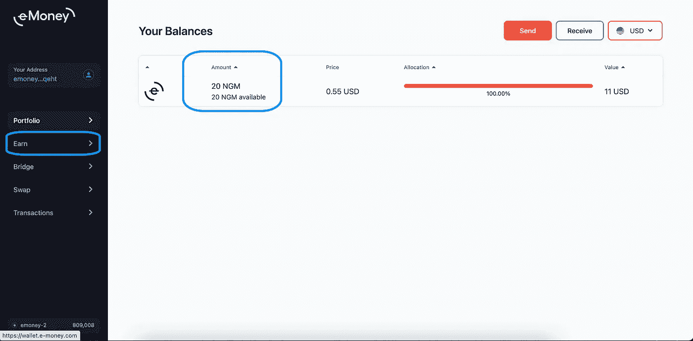
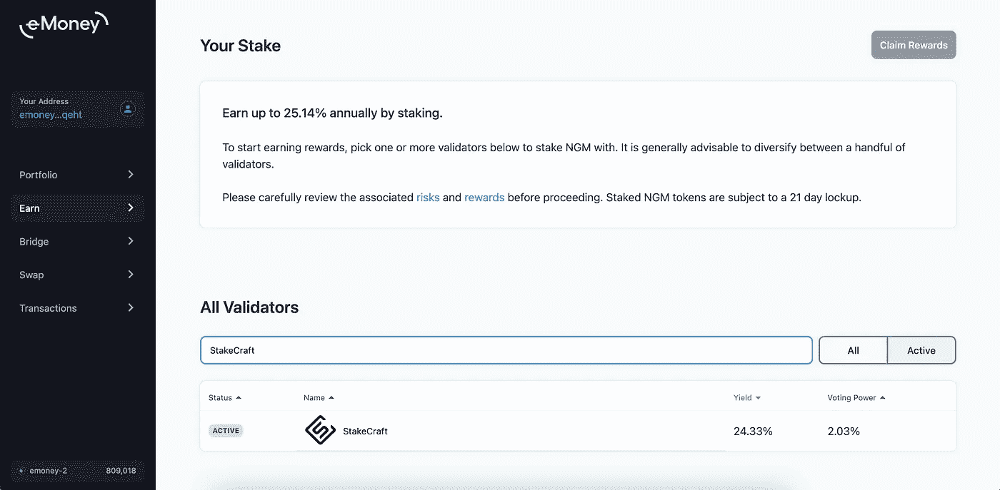
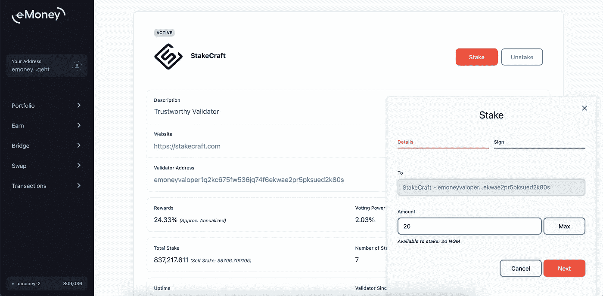
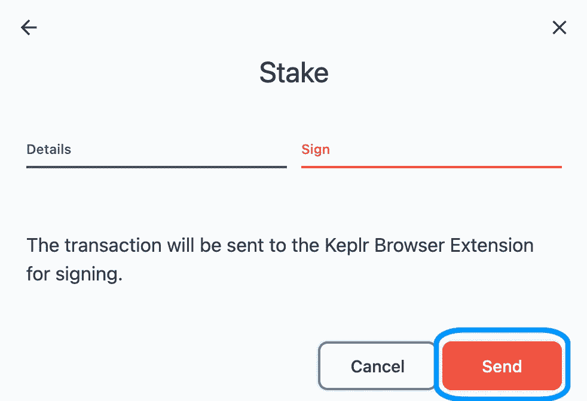
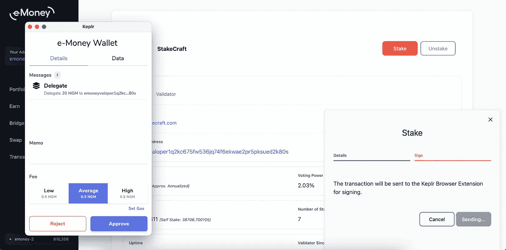

# 用 Keplr 钱包下注您的电子货币$NGM 代币

> 原文：<https://medium.com/coinmonks/staking-your-e-money-ngm-tokens-with-keplr-wallet-408f981dfa92?source=collection_archive---------6----------------------->

⚠️ Keplr 扩展仅在 Chrome 上得到官方支持。它也可以在 Brave 上使用，但某些功能可能不可用。无法从手机上使用 Keplr 扩展。

⚠️注意你的 Keplr 钱包所连接的网站，只从官方网站或你在本教程中找到的链接下载 Keplr。

**安装 Keplr &创建新账户**

**安装 Keplr 钱包 **

1.[转到此链接](https://chrome.google.com/webstore/detail/keplr/dmkamcknogkgcdfhhbddcghachkejeap?hl=en)并点击【添加】按钮

2.[添加 Keplr ]窗口将显示关闭。在这里，您必须选择[添加扩展名]

3.在下载结束时，您可以通过点击它来开始与您的浏览器扩展交互。

4.现在您有 4 个选项:从兼容*非保管钱包导入您的帐户，导入您的分类帐户，通过种子/助记短语或通过[一键登录]创建新帐户。*[兼容]是指允许您使用助记符/种子短语将您的帐户导入 Keplr 的钱包。

***创建钱包***

***如何通过助记符/种子短语*** 创建新账户

1.如果您是第一次设置 Keplr:在最初的弹出窗口中，如果您以前使用过 Keplr，请选择[创建新帐户]:在扩展中，单击右上角的轮廓，然后选择蓝色框[添加帐户] &选择[创建新帐户]

**2。** **选择一个 24 个单词的种子/助记短语，然后小心保存它们。最安全的方法是把单词写在纸上，然后存放在安全的地方。不要把这些话截屏或者复制到你的电脑或者手机笔记里。**

3.现在输入您的帐户名称(您可以稍后更改)。

4.您可以通过点击[Advanced]来改变派生路径，但是这是可选的，我们不建议如何使用 Keplr。如果您有兴趣了解更多关于高清钱包衍生途径的信息，您可以在 [Keplr FAQ](https://faq.keplr.app/) 【一般问题】部分找到更多信息。

5.一旦您确定已经正确转录了种子/助记短语，请单击[下一步]。

6.要确认新帐户的创建，您只需按单词在种子/助记短语中出现的正确顺序点击它们，然后按[注册]。

7.**如果你刚刚下载了 Keplr 扩展，是时候设置你的密码了！仔细选择，如有可能，最好使用您在任何其他应用程序中未使用的密码，然后单击[确认]。**如果您之前使用过 Keplr，此步骤将被跳过，因为您已经在创建/导入您的第一个帐户时设置了密码

***如何通过一键登录*** 创建新账户

1.注意:建议的途径是通过助记短语创建一个账户或通过分类账授权，我们描述这一程序只是因为这是第一次应用于宇宙钱包，人们可能不熟悉它。

2.选择[使用 Google 登录]选项

3.现在输入与您的 Google 帐户相关的电子邮件|电话号码及其密码，然后单击[下一步]。如果您还没有帐户，您可以按[创建帐户]按钮创建一个。

4.是时候设置您的 Keplr 钱包密码了！仔细选择，如果可能的话，选择一个您没有在任何其他应用程序中使用的密码，然后单击[确认]

***如何将电子钱包添加到 Keplr***

1.转到[wallet.e-money.com](https://wallet.e-money.com/welcome)

2.选择[Keplr 浏览器扩展]

3.[链添加请求]窗口将显示出来。
在这里你必须选择【批准】

4.现在您必须授权 Keplr 和 e-Money 之间的连接:
在[请求连接]窗口中，选择[批准]继续。

5.点击[K]扩展图标查看您的钱包:
在您可以选择的网络中，您可能会注意到[Beta Support]部分的[e-Money Wallet]现已推出。

6.[您现在可以看到您的 mainnet 地址了&通过专用仪表盘管理您的$NGM。](https://wallet.e-money.com/welcome)

**如何下注 NGM 代币？**

当你一切准备就绪，是时候学习如何 NGM 股份。

NGM 持有者可以赚取赌注奖励，从而增加他们的 NGM 持有量，只需将他们的 NGM 代币与网络上的任何一个活跃的验证者下注。

要下注 NGM 代币，你必须先购买一些 NGM 代币，然后将它们存入支持下注的钱包。

一旦您将代币转移到支持下注的钱包中，您就可以继续在网络上下注，以赢取下注奖励，请按[赢得]。

搜索并选择 StakeCraft 验证程序

下一步是决定您要委托的 NGM 代币数量，在输入字段中键入决定的数量，然后单击[下一步]。但是不要忘记留下一些 NGM 作为费用，1-2 NGM 应该足够了。

然后签署交易，按[发送]。

接下来，从显示的费用范围中选择交易费用。

⚠️:[备忘录]字段是可选的，如果您不打算将代币发送到交易所，可以将其留空。

接下来，从显示的费用范围中选择交易费用。

点击[批准]确认您的交易。

您现在已经下注 NGM 代币，将开始赢取下注奖励！

***桩工桩工账号地址***

[emoneyvaloper 1 q 2 KC 675 fw 536 jq 74 f 6 ek wae 2 pr 5 PK sued 2k 80s](https://e-money.net/validator/emoneyvaloper1q2kc675fw536jq74f6ekwae2pr5pksued2k80s)

*真诚的你，*

*StakeCraft 团队。*

您可以找到我们:

*   [推特](https://twitter.com/stakecraft)
*   [不和谐](https://discord.gg/xkYnNYV4qH)
*   [电报](https://t.me/stakecraft)
*   给我们发电子邮件[Support@stakecraft.com](mailto:Support@stakecraft.com)

 [## 可信验证器

### StakeCraft 是一个在编程、开发和管理数字资产方面拥有丰富经验的极客团队。我们使用顶级…

stakecraft.com](https://stakecraft.com) 

> 加入 [Coinmonks 电报频道](https://t.me/coincodecap)，了解加密交易和投资

## 另外，阅读

*   [尤霍德勒 vs 考尼洛 vs 霍德诺特](/coinmonks/youhodler-vs-coinloan-vs-hodlnaut-b1050acde55a) | [Cryptohopper vs 哈斯博特](https://blog.coincodecap.com/cryptohopper-vs-haasbot)
*   [印度加密交易所](/coinmonks/bitcoin-exchange-in-india-7f1fe79715c9) | [比特币储蓄账户](/coinmonks/bitcoin-savings-account-e65b13f92451) | [Paxful 审核](/coinmonks/paxful-review-4daf2354ab70)
*   [杠杆令牌](/coinmonks/leveraged-token-3f5257808b22) | [最佳加密交易所](/coinmonks/crypto-exchange-dd2f9d6f3769) | [AscendEX 评论](/coinmonks/ascendex-review-53e829cf75fa)
*   [Godex.io 审核](/coinmonks/godex-io-review-7366086519fb) | [邀请审核](/coinmonks/invity-review-70f3030c0502) | [BitForex 审核](https://blog.coincodecap.com/bitforex-review) | [HitBTC 审核](/coinmonks/hitbtc-review-c5143c5d53c2)
*   [Crypto.com 费用](/coinmonks/binance-fees-8588ec17965) | [Botcrypto 审查](/coinmonks/botcrypto-review-2021-build-your-own-trading-bot-coincodecap-6b8332d736c7) | [替代方案](https://blog.coincodecap.com/crypto-com-alternatives)
*   [有哪些交易信号？](https://blog.coincodecap.com/trading-signal) | [Bitstamp vs 比特币基地](https://blog.coincodecap.com/bitstamp-coinbase)
*   [如何在势不可挡的域名上购买域名？](https://blog.coincodecap.com/buy-domain-on-unstoppable-domains)
*   [印度的秘密税](https://blog.coincodecap.com/crypto-tax-india) | [altFINS 审查](https://blog.coincodecap.com/altfins-review) | [Prokey 审查](/coinmonks/prokey-review-26611173c13c)
*   [布洛克菲 vs 比特币基地](https://blog.coincodecap.com/blockfi-vs-coinbase) | [比特坎评论](https://blog.coincodecap.com/bitkan-review) | [币安评论](/coinmonks/binance-review-ee10d3bf3b6e)