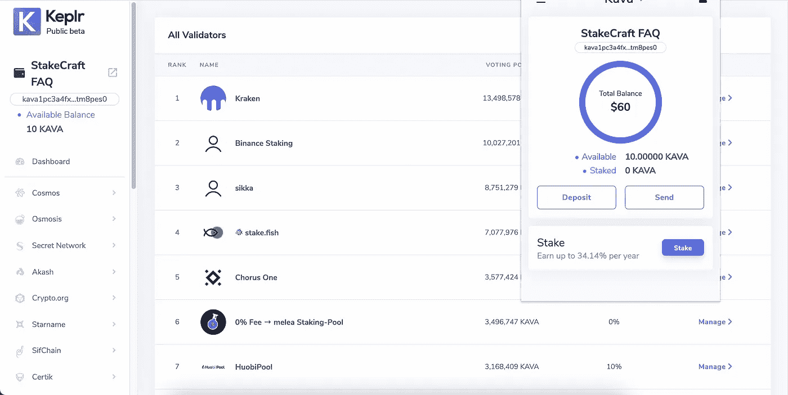
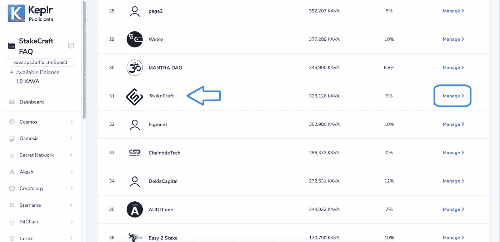
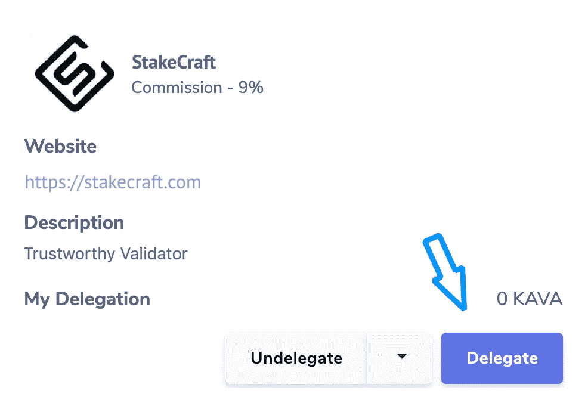
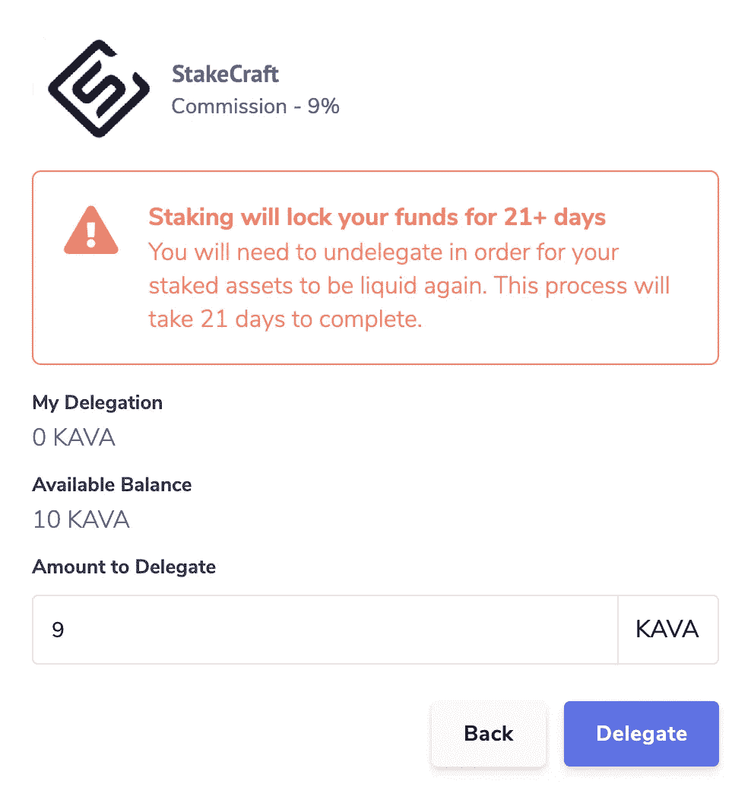
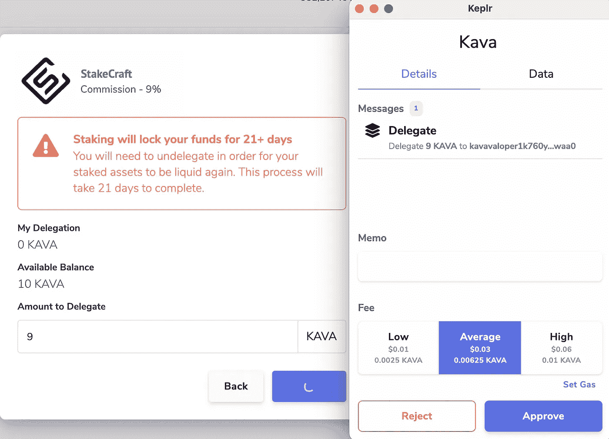
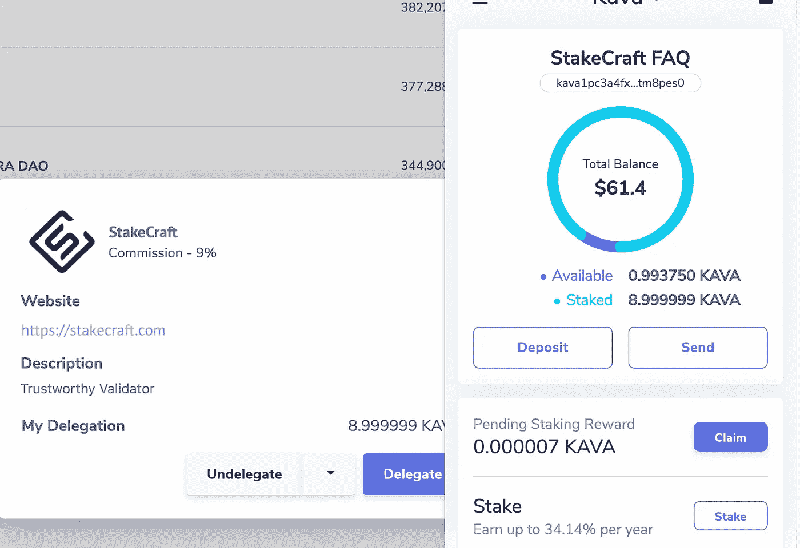

# 用 Keplr 钱包下注您的$卡瓦代币

> 原文：<https://medium.com/coinmonks/staking-your-kava-tokens-with-keplr-wallet-19f74e384e5a?source=collection_archive---------1----------------------->

⚠️ Keplr 扩展仅在 Chrome 上得到官方支持。它也可以在 Brave 上使用，但某些功能可能不可用。无法从手机上使用 Keplr 扩展。

⚠️注意你的 Keplr 钱包所连接的网站，只从官方网站或你在本教程中找到的链接下载 Keplr。

**安装 Keplr &创建新账户**

**安装 Keplr 钱包 **

1.[转到此链接](https://chrome.google.com/webstore/detail/keplr/dmkamcknogkgcdfhhbddcghachkejeap?hl=en)并点击【添加】按钮

2.[添加 Keplr ]窗口将显示关闭。在这里，您必须选择[添加扩展名]

3.在下载结束时，您可以通过点击它来开始与您的浏览器扩展交互。

4.现在您有 4 个选项:从兼容*非保管钱包导入您的帐户，导入您的分类帐户，通过种子/助记短语或通过[一键登录]创建新帐户。*[兼容]是指允许您使用助记符/种子短语将您的帐户导入 Keplr 的钱包。

***创建钱包***

***如何通过助记符/种子短语*** 创建新账户

1.如果您是第一次设置 Keplr:在最初的弹出窗口中，如果您以前使用过 Keplr，请选择[创建新帐户]:在扩展中，单击右上角的轮廓，然后选择蓝色框[添加帐户] &选择[创建新帐户]

**2。** **选择一个 24 个单词的种子/助记短语，然后小心保存它们。最安全的方法是把单词写在纸上，然后存放在安全的地方。不要把这些话截屏或者复制到你的电脑或者手机笔记里。**

3.现在输入您的帐户名称(您可以稍后更改)。

4.您可以通过点击[Advanced]来改变派生路径，但是这是可选的，我们不建议如何使用 Keplr。如果您有兴趣了解更多关于高清钱包衍生途径的信息，您可以在 [Keplr FAQ](https://faq.keplr.app/) 【一般问题】部分找到更多信息。

5.一旦您确定已经正确转录了种子/助记短语，请单击[下一步]。

6.要确认新帐户的创建，您只需按单词在种子/助记短语中出现的正确顺序点击它们，然后按[注册]。

7.**如果你刚刚下载了 Keplr 扩展，是时候设置你的密码了！仔细选择，如有可能，最好使用您在任何其他应用程序中未使用的密码，然后单击[确认]。**如果您之前使用过 Keplr，此步骤将被跳过，因为您已经在创建/导入您的第一个帐户时设置了密码

***如何通过一键登录*** 创建新账户

1.注意:建议的途径是通过助记短语创建一个账户或通过分类账授权，我们描述这一程序只是因为这是第一次应用于宇宙钱包，人们可能不熟悉它。

2.选择[使用 Google 登录]选项

3.现在输入与您的 Google 帐户相关的电子邮件|电话号码及其密码，然后单击[下一步]。如果您还没有帐户，您可以按[创建帐户]按钮创建一个。

4.是时候设置您的 Keplr 钱包密码了！仔细选择，如果可能的话，选择一个您没有在任何其他应用程序中使用的密码，然后单击[确认]

**如何下注卡瓦代币？**

当你一切就绪，是时候学习如何赌注$卡瓦。

卡瓦持有人可以赚取赌注奖励，从而增加他们的卡瓦持有量，只需将他们的卡瓦代币押在网络上的任何一个活跃的验证器上。

要下注卡瓦代币，您必须先购买一些卡瓦代币，并将它们发送到支持下注的钱包中。

将代币转移到支持下注的钱包后，您可以继续在网络上下注，赢取下注奖励。

首先，打开你的 Keplr 扩展并按下[Stake]

First, fund your account then press [Stake] button

选择您选择的验证器来委托您的令牌。我们向您推荐我们的验证器— **StakeCraft**

一旦您决定了验证器，单击[管理]，然后单击[委托]。

Choose StakeCraft Validator

下一步是决定你要委托的卡瓦代币的数量，按[委托]。

在输入字段中输入决定的金额，然后单击[委托]。

接下来，从显示的费用范围中选择交易费用。

⚠️ *The [memo] field is optional. You may leave it empty until you are not sending your tokens to an exchange.*

点击[批准]确认您的交易。

您现在已经下注您的卡瓦代币，将开始赚取赌注奖励！

***StakeCraft 赌注账户地址***[kavavaloper 1k 760 ypy 9 tzh P6 L2 RMG 06 sq 4n 74 z 0 D3 rejwwaa 0](https://kava.bigdipper.live/validator/kavavaloper1k760ypy9tzhp6l2rmg06sq4n74z0d3rejwwaa0)

*你诚挚的，*

*桩工队。*

您可以找到我们:

*   [推特](https://twitter.com/stakecraft)
*   [不和](https://discord.gg/xkYnNYV4qH)
*   [电报](https://t.me/stakecraft)
*   给我们发电子邮件[Support@stakecraft.com](mailto:Support@stakecraft.com)

 [## 可信验证器

### StakeCraft 是一个在编程、开发和管理数字资产方面拥有丰富经验的极客团队。我们使用顶级…

stakecraft.com](https://stakecraft.com) 

> 加入 [Coinmonks 电报频道](https://t.me/coincodecap)，了解加密交易和投资

## 另外，阅读

*   [如何在印度购买比特币？](/coinmonks/buy-bitcoin-in-india-feb50ddfef94) | [WazirX 审核](/coinmonks/wazirx-review-5c811b074f5b) | [BitMEX 审核](https://blog.coincodecap.com/bitmex-review)
*   [比特币主根](https://blog.coincodecap.com/bitcoin-taproot) | [Bitso 回顾](https://blog.coincodecap.com/bitso-review) | [排名前 6 的比特币信用卡](/coinmonks/bitcoin-credit-card-bc8ab6f377c6)
*   [双子座 vs 比特币基地](https://blog.coincodecap.com/gemini-vs-coinbase) | [比特币基地 vs 北海巨妖](https://blog.coincodecap.com/kraken-vs-coinbase) | [硬币罐 vs 硬币点](https://blog.coincodecap.com/coinspot-vs-coinjar)
*   [霍比评论](https://blog.coincodecap.com/huobi-review) | [OKEx 保证金交易](https://blog.coincodecap.com/okex-margin-trading) | [期货交易](https://blog.coincodecap.com/futures-trading)
*   [比特币基地跑马圈地](https://blog.coincodecap.com/coinbase-staking) | [Hotbit 评论](/coinmonks/hotbit-review-cd5bec41dafb) | [KuCoin 评论](https://blog.coincodecap.com/kucoin-review)
*   [最佳加密交易信号电报](/coinmonks/best-crypto-signals-telegram-5785cdbc4b2b) | [MoonXBT 评论](/coinmonks/moonxbt-review-6e4ab26d037)
*   [Coinswitch 俱吠罗评论](/coinmonks/coinswitch-kuber-review-1a8dc5c7a739) | [电网交易机器人](https://blog.coincodecap.com/grid-trading) | [比特币基地收费](/coinmonks/coinbase-fees-831e77d4f2c5)
*   [Bitget 回顾](https://blog.coincodecap.com/bitget-review) | [双子 vs 区块链](https://blog.coincodecap.com/gemini-vs-blockfi) | [OKEx 期货交易](https://blog.coincodecap.com/okex-futures-trading)
*   [OKEx vs KuCoin](https://blog.coincodecap.com/okex-kucoin) | [摄氏替代品](https://blog.coincodecap.com/celsius-alternatives) | [如何购买 VeChain](https://blog.coincodecap.com/buy-vechain)
*   [币安期货交易](https://blog.coincodecap.com/binance-futures-trading)|[3 comas vs Mudrex vs eToro](https://blog.coincodecap.com/mudrex-3commas-etoro)
*   [如何购买 Monero](https://blog.coincodecap.com/buy-monero) | [IDEX 评论](https://blog.coincodecap.com/idex-review) | [BitKan 交易机器人](https://blog.coincodecap.com/bitkan-trading-bot)
*   [币安 vs 比特邮票](https://blog.coincodecap.com/binance-vs-bitstamp) | [比特熊猫 vs 比特币基地 vs Coinsbit](https://blog.coincodecap.com/bitpanda-coinbase-coinsbit)
*   [如何购买 Ripple (XRP)](https://blog.coincodecap.com/buy-ripple-india) | [非洲最好的加密交易所](https://blog.coincodecap.com/crypto-exchange-africa)
*   [非洲最佳加密交易所](https://blog.coincodecap.com/crypto-exchange-africa) | [胡交易所评论](https://blog.coincodecap.com/hoo-exchange-review)
*   [eToro vs robin hood](https://blog.coincodecap.com/etoro-robinhood)|[MoonXBT vs by bit vs Bityard](https://blog.coincodecap.com/bybit-bityard-moonxbt)
*   [Stormgain 回顾](https://blog.coincodecap.com/stormgain-review) | [Bexplus 回顾](https://blog.coincodecap.com/bexplus-review) | [币安 vs Bittrex](https://blog.coincodecap.com/binance-vs-bittrex)
*   [Bookmap 评论](https://blog.coincodecap.com/bookmap-review-2021-best-trading-software) | [美国 5 大最佳加密交易所](https://blog.coincodecap.com/crypto-exchange-usa)
*   [如何在 FTX 交易所交易期货](https://blog.coincodecap.com/ftx-futures-trading) | [OKEx vs 币安](https://blog.coincodecap.com/okex-vs-binance)
*   [如何在势不可挡的域名上购买域名？](https://blog.coincodecap.com/buy-domain-on-unstoppable-domains)
*   [印度的秘密税](https://blog.coincodecap.com/crypto-tax-india) | [altFINS 审查](https://blog.coincodecap.com/altfins-review) | [Prokey 审查](/coinmonks/prokey-review-26611173c13c)
*   [布洛克菲 vs 比特币基地](https://blog.coincodecap.com/blockfi-vs-coinbase) | [比特坎评论](https://blog.coincodecap.com/bitkan-review) | [币安评论](/coinmonks/binance-review-ee10d3bf3b6e)