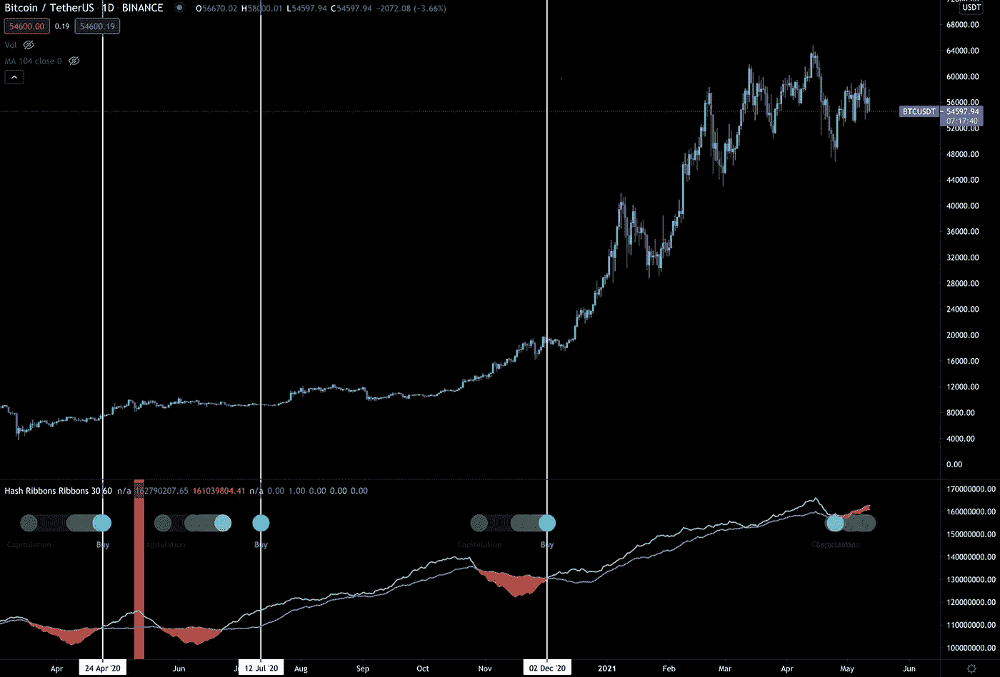

# 站在巨人旁边:比特币的蓝色“购买”点近了

> 原文：<https://medium.com/coinmonks/standing-alongside-giants-the-blue-buy-dot-for-bitcoin-is-near-3109ea1960da?source=collection_archive---------5----------------------->

站在巨人的肩膀上，我们可以获得更好的视角。

从那里，我们看得比我们知道的可能的更远。

但说到加密，这些巨头仍然在我们中间。你不会在附近图书馆的历史文献中找到它们。

他们被发现在推特和媒体上和我们一起泼墨。这意味着我们正在和现代巨人一起探索未知。

其中一个巨人是查尔斯·爱德华兹。他是一名链上分析师，也是一个广为人知的指标 Hash Ribbons 的创始人。

今天，我想解释一下这个指示器是什么，以及为什么您应该知道它将要闪烁的内容。

# 指示器

大约 20 个月前，查尔斯在他的散列丝带指示器上写了一篇文章。你可以在这里找到它。

简而言之，这类似于使用多条移动平均线来衡量价格，然后等待它们交叉产生买入或卖出信号。

对于价格，这些十字架被称为黄金和死亡十字架。

查尔斯借鉴了这种方法，并将其应用于比特币的散列率。

哈希速率是基于矿工每天创建的数据块的一种测量方法。

这往往取决于比特币的开采难度，这是对矿工开采当前区块所解决的“问题”的挑战性的衡量。大约每两周调整一次。

这两个都是独一无二的。但有趣的是，这种困难往往表现为散列率的滞后。这意味着哈希速率是要遵循的衡量标准。

这就是为什么查尔斯用它来创建他的指标，它使用一个简单的一个和两个月的移动平均散列率。

这就是散列率如何被用来寻找非常有利可图的购买机会。

当这两条移动平均线交叉时，它标志着一个在几个月到几年内运作的机会。

基于其过往记录，记下这一点是明智的。

当应用 10 天和 20 天的移动平均线时，我们得到了一个更强大的指标。

当两条交叉线看涨时，我们会在下面给你看的指标上看到“买入”的读数。

# 只有一两个星期了

观察下图下半部分的散列带状指示器，我们看到与散列率相关的两条移动平均线即将交叉。

当交叉与价格移动平均线(10d 和 20d)交叉结合时，在指标上创造了买入机会。

现在价格的 10 天移动平均线在 20 天移动平均线之上。这意味着当散列率移动平均线交叉时，蓝色的“买入”点将打印出来。

现在，我们一直在写我们预计这轮牛市将如何在未来几个月创造更高的价格。届时，价格将以更快的速度展开，并创造出比我们去年 12 月份看到的更大的兴奋感。

空间会变得疯狂。

我们会在这里不断检查你的现实。现在，一切都是为了做好准备。

昨天，我们公布了一份基于我们的公平价格扫描器的公平定价项目清单。如果您错过了，请在这里查看。

此外，市场仍然动荡不安。我们看到之前发生了一些看跌交易(纽约时间 2021 年 5 月 12 日午夜后 Pablo 的另一个 2k)。这与我们昨天所说的一致……“我们仍然处在一场狗屎风暴中”。

幸运的是，这个空间有充足的流动性来消化这种悲观情绪。

这意味着要关注一段时间内的平均值，没有必要一次买全。

对于期货交易者来说，现在还不是时候。就动力何时到来而言，没有什么明确的答案…但散列丝带是一个很好的暗示，因为矿工投降往往一年只会发生一次或两次。这也是我们今天让你注意到它的原因。

用查尔斯的话来说，“下次你看到杂凑丝带买入信号时，你最好留心一下。”

你的脉搏在加密，

本·莉莉

附注:你可以在这里找到[指示器](https://www.tradingview.com/script/kT7jIvqv-Hash-Ribbons/)。