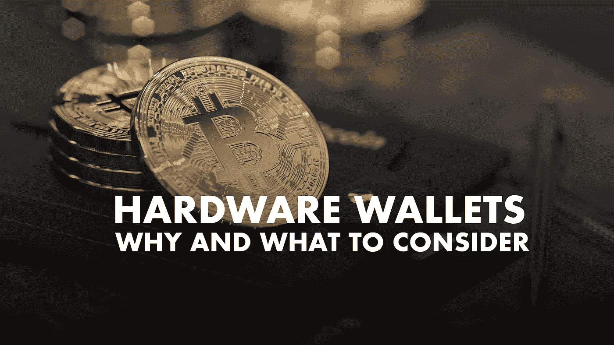

# 从加密开始:你应该使用硬件钱包吗？

> 原文：<https://medium.com/coinmonks/start-with-crypto-should-you-use-hardware-wallets-72674db28e22?source=collection_archive---------9----------------------->

硬件钱包允许投资者在物理设备上存储比特币和其他网络资产。在大多数情况下，它们类似于 USB 闪存驱动器。它们的特别之处在于，这种存储形式与互联网没有任何联系，因此黑客不可能发起攻击。

HARDWARE WALLETS — Photo by [DrawKit Illustrations](https://unsplash.com/@drawkit?utm_source=unsplash&utm_medium=referral&utm_content=creditCopyText) on [Unsplash](https://unsplash.com/?utm_source=unsplash&utm_medium=referral&utm_content=creditCopyText), edited by the author

如今有许多不同的提供商提供硬件钱包。莱杰和崔佐在…