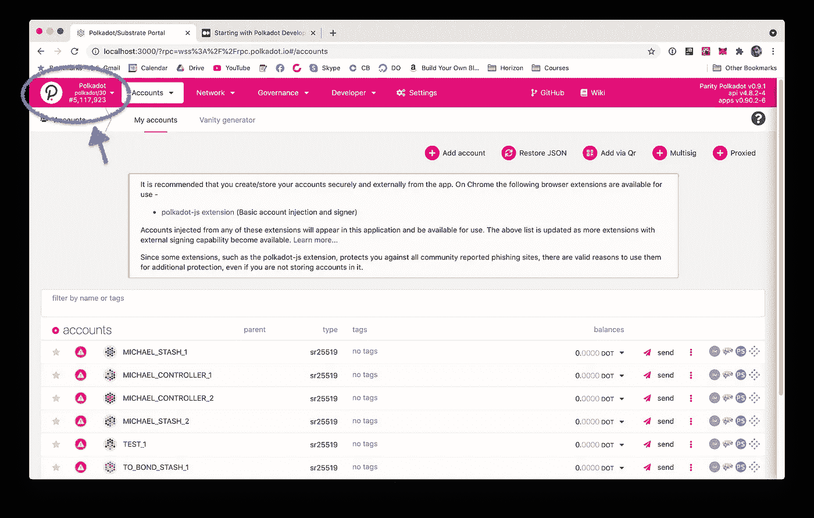
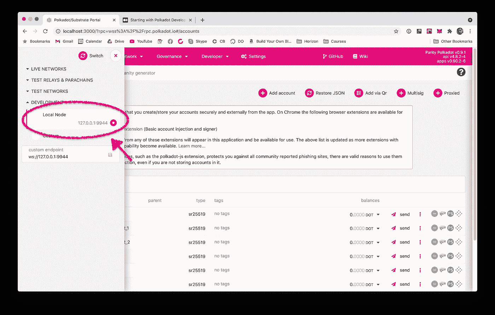
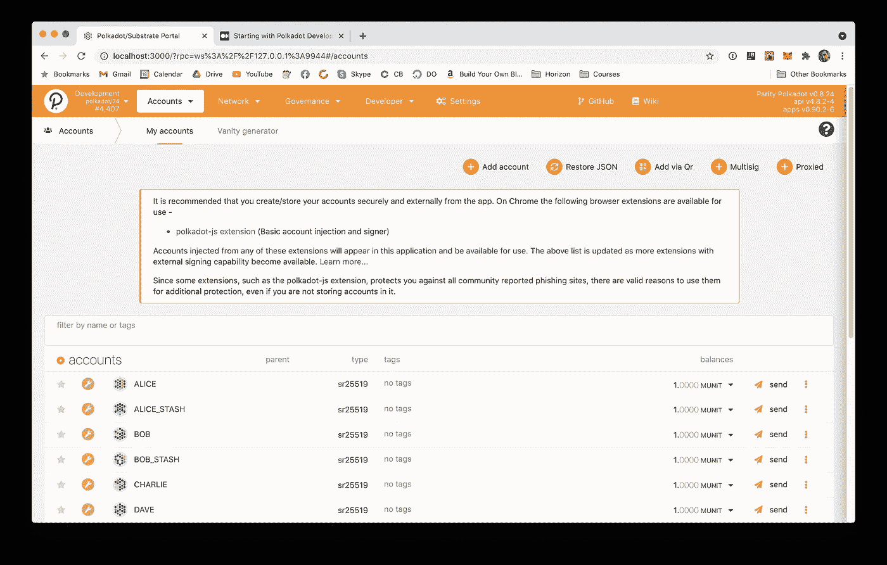

# 从 Polkadot 开发开始(第一部分)

> 原文：<https://medium.com/coinmonks/starting-with-polkadot-development-92bba9c993ec?source=collection_archive---------3----------------------->


Polkadot 是密码领域一个令人兴奋的新项目，但是尽管它有一个著名的 [wiki](https://wiki.polkadot.network/docs/en/getting-started) 网站，里面充满了关于其算法和整体哲学的细节，但实际的例子有些缺失。

由于我一直在从事这个新网络的开发项目，我想分享一些关于设置基本开发环境和开始的见解。

# 安装本地节点

像所有其他区块链一样，Polkadot 应用程序必须首先通过网关节点连接到网络:一台运行区块链软件实例的机器，在我们的例子中是 Polkadot。虽然这可以通过多种方式实现，但是一旦你连接上了，你就需要遵守这样一个网络的规则。换句话说，你在开发应用程序时执行的每一项交易都将被视为“真实交易”，即使那是在某种“测试网”上进行的，在那里硬币没有任何价值。这也意味着你的交易将被同一网络上的每个人看到，这是你可能想也可能不想的。然而，最重要的是，你需要有人给你实际的硬币来做任何事情。在测试网上，你可以通过一个公共的[水龙头](https://faucet.figment.io/faucet)来做这件事，但是这通常需要某种形式的注册，并且不断地祈祷水龙头会在你想要的时候打开并运行。由于这些公共节点是由志愿者运行和维护的，我艰难地发现情况并非总是如此。所以，长话短说，我们不仅要创建我们自己的本地节点，还要创建我们自己的本地波尔卡多特区块链，在那里我们可以用数百万个点来为自己加分。

有很多方法可以做到这一点，Polkadot wiki 提供了一些很好的文档。从可用的选项中，我发现选择 Docker 安装更容易。如果您不熟悉 Docker，您可以从 Wiki 中选择另一种类型，但是考虑到 Docker 正在迅速成为开发人员社区中的必备工具，我建议您全面了解它。

因此，一旦在系统上安装了 Docker，运行下面的命令

```
docker run -p 9944:9944 parity/polkadot:v0.8.24 --name "Local" --rpc-external --ws-external --alice --dev
```

让我们来解构这个命令:

1.  `**docker run**`您告诉 docker 运行一个在 Docker hub(Docker 容器的公共存储库)上标识为[奇偶校验/polkadot](https://hub.docker.com/r/parity/polkadot) 的容器。具体来说，我们要求它运行 v0.8.24。
2.  将本地端口 **9944** 上的所有请求转发到集装箱的内部相同编号的端口。这是默认的 Polkadot 节点端口，因此任何预先配置的应用程序都不会有连接问题。
3.  `**--name**`这可以是任何东西，但现在“本地”就可以了
4.  `**--ws-external**`允许 **WebSocket** 连接
5.  `**--dev**`在“开发模式”下运行节点这意味着**不会**与任何特定的网络同步，而是在你的本地机器上启动一个新的 Polakdot 网络。
6.  `**--alice**`用**大量**金钱创造少量钱包！(Alice 和 Bob 是密码学文献中的标准名称)。

一旦完成，您将在本地运行波尔卡多特区块链

# 安装 Polkadot.js 用户界面

这个想法当然是创建你自己的在 Polkadot 网络上运行的应用程序，但是第一步是使用别人的并检查是否一切都设置正确。 [Polkadot.js](https://github.com/polkadot-js/apps) 是一个基于 React.js 构建的开源项目，可以连接任何 Polkadot 网络，执行所有可以执行的基本动作。有一个[公共安装](https://polkadot.js.org/apps/#/explorer),您可以检查它是否可以立即访问，但是我们将在本地运行它，因为我们对代码库本身以及它可以教给我们的东西感兴趣。

```
git clone https://github.com/polkadot-js/apps polkadot-js
cd polkadot-js
yarn
yarn run start
```

一旦应用程序在本地运行(以及后台的 Docker 实例)，您可以导航到 [http://localhost:3000](http://localhost:3000/) ，在这里您应该可以看到应用程序的界面。

# 将用户界面与本地实例连接

当您的开发区块链在 Docker 容器中的本地机器上运行时，我们只需要将我们的 UI 指向它。按左上方的可用网络列表



从您看到的选项中，向下滚动到开发列表，打开它并选择“本地节点”通常，IP 和端口号是正确的，因为它们是我们启动本地节点时使用的默认端口号。但是为了以防万一，检查它们是否在 [127.0.0.1:9944](http://127.0.0.1:9944) 处。完成后，按下这个侧面板顶部的“开关”。



您应该会看到类似这样的内容。注意你有 8 个装满钱的钱包！这些在任何公共网络中都不存在，只存在于你当地的区块链。尽管如此，你仍然可以在它们之间使用与真正的区块链完全相同的功能来发送和接收资金。



# 通过阅读代码库来学习

这篇文章背后的概念是，一旦你访问了一个真实的 Polkadot 系统，你就可以阅读代码并从发生的事情中学习。现在，您应该已经在本地运行了 UI 的和实例。因此，让我们在教程的第二部分[中，看看我们可以通过使用这些现有的工具做些什么。](https://michael-m.medium.com/starting-with-polkadot-development-part-ii-53c36be5556c)