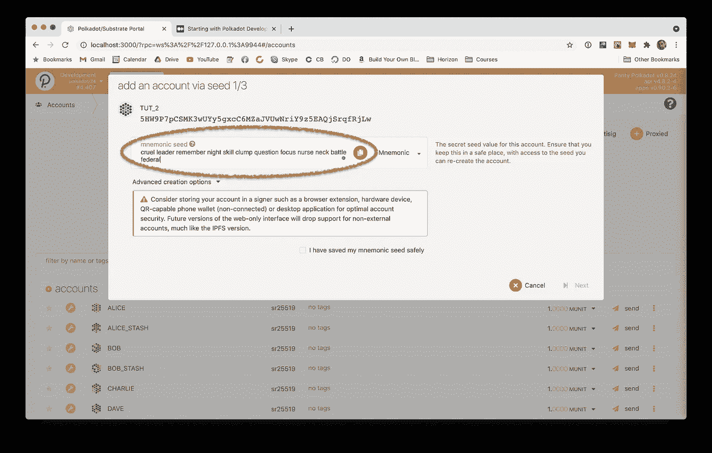
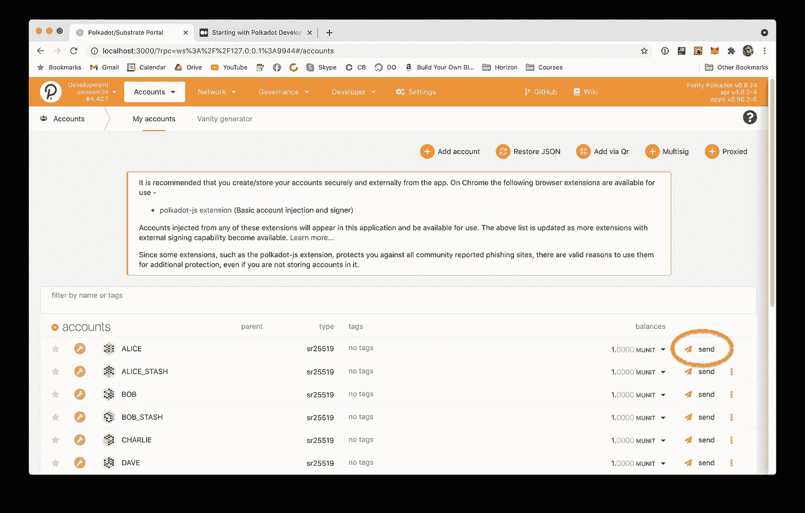
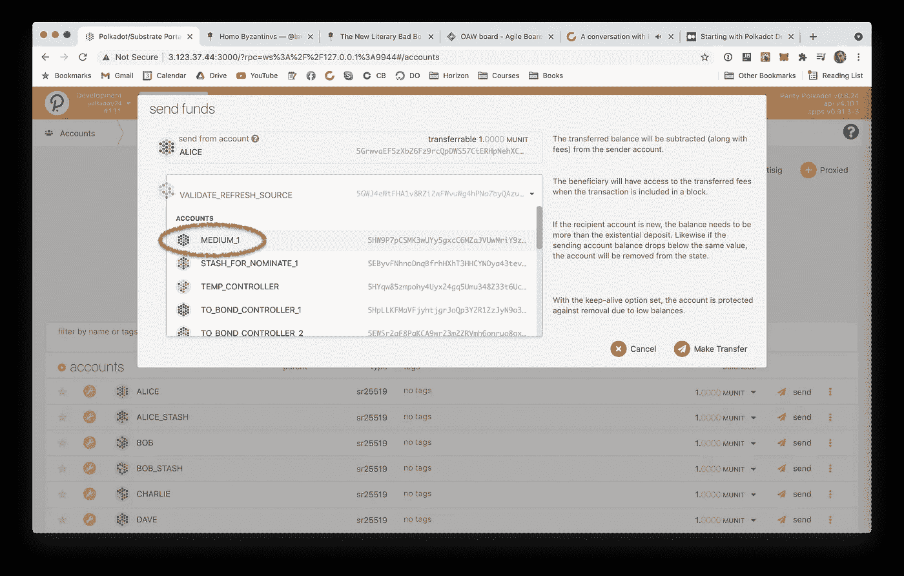
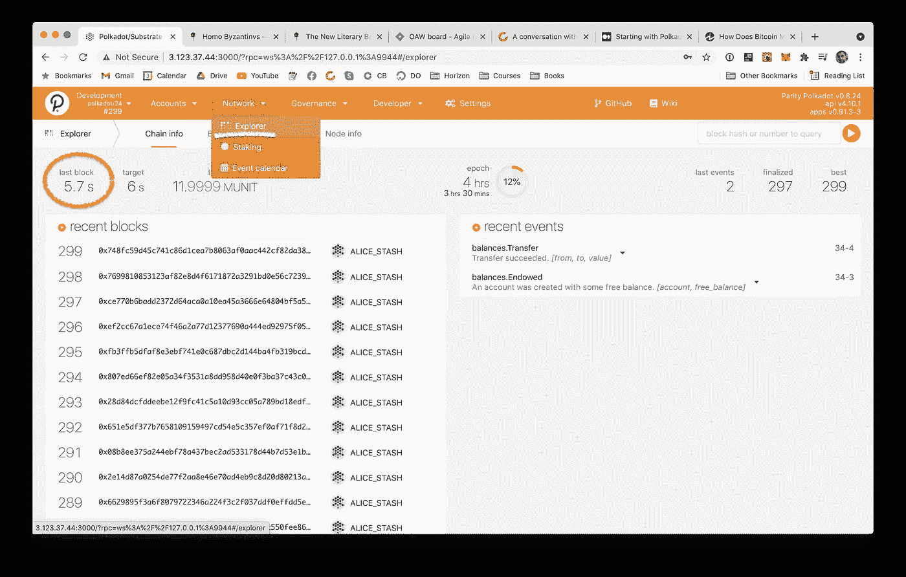

# 从 Polkadot 开发开始(第二部分)

> 原文：<https://medium.com/coinmonks/starting-with-polkadot-development-part-ii-53c36be5556c?source=collection_archive---------3----------------------->


在本教程的[前一部分](/coinmonks/starting-with-polkadot-development-92bba9c993ec)中，我们学习了如何使用 Docker 在我们的本地环境中设置一个开发节点。我们还启动了 Polkadot.js 开源 UI 项目，并与这个节点连接，允许我们在不广播到整个网络的情况下进行交易。现在我们要通过阅读代码来学习。

# 创建 Node.js 项目并连接

以开发模式启动我们的节点给了我们几个用点填充的账户(Polkadot 的货币)。我们可以(也将会)使用它们，但是一般来说，创建一个帐户对于任何开发工作都是至关重要的，所以我们最好了解一下它是如何完成的。我们的任务是通读 Polkadot.js 项目的代码，并在 Node.js 上实现它。但是由于这个项目的代码库是高度优化的，可读性较差，我们将首先使用 Node 直接跳到一个工作示例。进入一个新文件夹，然后:

```
npm init --yes # easy way to create Node.js project
```

这将创建一个 **package.json** 文件，而不会问我们太多问题。默认情况下，它期望一个 **index.js** 文件作为应用程序的入口点，所以让我们将它添加到我们的项目中。

```
touch index.js
```

现在，我们将简单地运行它

```
node index.js
```

然后我们需要安装[波尔卡多特模块](https://www.npmjs.com/package/@polkadot/api)，我们将通过它与网络进行通信。

```
npm i **@polkadot/api** --save
```

在我们的 **index.js** 文件中，我们现在可以用两种模式初始化客户端，HTTP 和 WS (Web Sockets)。还记得在本教程的第一部分[中，我们是如何启动我们的服务器 w `**--ws-external**`的吗？这意味着启用 WS 连接，我们不打算使用它。](/coinmonks/starting-with-polkadot-development-92bba9c993ec)

```
// index.js
***const*** { ApiPromise, WsProvider } = require('@polkadot/api');

***const*** connect = **async** () => {
    ***const*** wsProvider = **new** WsProvider('ws://127.0.0.1:9944');
    ***const*** api = new ApiPromise({ provider: wsProvider });
    **return** api.isReady;
};

connect().then((api) => {
    ***console***.log(`Our client is connected: ${api.isConnected}`);
}).catch((err) => {
    ***console***.error(err)
}).finally(() => ***process***.exit());
```

我们通过 WSProvide 初始化客户端，另一种方法是使用 [HttpProvider](https://learn.figment.io/network-documentation/polkadot/tutorials/intro-pathway-polkadot-basics/2.-create-a-polkadot-account) 。`**api.isReady**`返回一个在客户端实例中解析的承诺，然后我们可以用它来检查上面的连接是否为**真**。

# 创建帐户

接下来，我们需要创建一个这样的帐户。首先，我们初始化一个**钥匙圈**，你可以把它想象成一个内部商店，保存一个构成账户的**密钥对**。更具体地说，尽管我们正在大大简化，但账户是由**公共**和**私有**密钥组成的。一个地址，比如初始化时通过`**--alice**`标志免费生成的地址，本质上是一个公钥的散列，而私钥是签署交易的东西，必须保密。密钥环是一种很好的方法，可以防止私钥暴露给代码的其余部分，同时保持签署事务的能力。将此添加到我们的文件中

```
***const*** { mnemonicGenerate } = require('@polkadot/util-crypto');
***const*** { Keyring } = require('@polkadot/keyring');***const*** keyring = **new** Keyring({type: 'sr25519'});
***const*** mnemonic = mnemonicGenerate();
***const*** account = keyring.addFromMnemonic(mnemonic);**console**.log(`Address: ${account.address}`);
**console**.log(`Mnemonic: "${mnemonic}"`);
```

私钥/公钥对通常是通过一种算法创建的，该算法采用一个称为种子的输入值。这里的见解是，算法是确定性的，这意味着在没有输入的情况下，它每次运行时都会生成相同的密钥，这不是我们现在所期望的**了，是吗？种子区分了这个算法的初始变量，因此它通常是随机的。这就是`**mnemonicGenerate()**`所做的，它创造了一个随机的种子。然而，它返回的值不是一个数字，而是一个单词列表。这种方法最初由比特币提出，后来被大多数加密货币采用。你看到的单词本质上是字典中的一个偏移量。连接偏移，你得到种子。顾名思义，这是一种更简单的方式来存储初始化秘密，即使是在你自己的大脑中！**

你可能会问，为什么要保存它？请记住如何将密钥派生算法描述为确定性的。这意味着，如果您使用相同的助记符生成一个密钥对，您就会得到相同的密钥，这是不可或缺的。让我们也加入这个功能。

```
***const*** { mnemonicValidate } = require('@polkadot/util-crypto');***const*** createAccount = (mnemonic) => {
    mnemonic = mnemonic && mnemonicValidate(mnemonic) 
        ? mnemonic 
        : mnemonicGenerate();
    ***const*** account = keyring.addFromMnemonic(mnemonic);
    **return** { account, mnemonic };
}
```

在这里，我们可以选择传递一个现有的助记符，并使用它来生成我们的键。从`**.addFromMnemonic(...)**`函数返回的对象是一种叫做`**KeyringPair**`的特殊类型。如果我们在 **Typescript** 中编程，我们会得到一个显式类型，但是因为我们没有，我们不能在我们的代码中看到它，而且它还在那里。这个对象有一个**地址**字段，它将地址保存为一个字符串，所以让我们检查一下我们所做的是否有效。

```
***const*** { account: **acc1**, **mnemonic** } = createAccount();
***const*** { account: **acc2** } = createAccount(mnemonic);

**console**.log(`Mnemonic: "${**mnemonic**}"`);
**console**.log(`- Address 1: ${**acc1**.address}`);
**console**.log(`- Address 2: ${**acc2**.address}`);
```

在我的例子中，输出是这样的:

```
Mnemonic: "cruel leader remember night skill clump question focus nurse neck battle federal"
- Address 1: **5HW9P7pCSMK3wUYy5gxcC6MZaJVUwNriY9z5EAQjSrqfRjLw**
- Address 2: **5HW9P7pCSMK3wUYy5gxcC6MZaJVUwNriY9z5EAQjSrqfRjLw**
```

地址是相同的，因为我们重复使用了相同的助记符。但是这些地址(或者更确切地说，地址)“在网络上吗？”

我们可以从本教程的第一部分开始刷新我们的 Polkadot.js UI，但是我们看不到我们新创建的地址。它在哪里？我们需要向网络广播吗？简而言之，答案是否定的。除了交易中的参考，地址实际上并不存在。只要有一些包含地址的交易，它对网络是可见的，并且可以用各种工具查询，否则，它还不如不存在。

我们就这么做吧。复制打印在您的终端上的助记短语，并转到本地运行的 Polkadot UI，按“添加帐户”并将其粘贴到下面的框中:



勾选**“我已经安全保存了我的助记种子”**，点击**下一步。**“添加一个名字，姑且称之为**“MEDIUM _ 1”，**和一个密码。您应该在列表的底部看到您在 Node.js 应用程序上创建的地址。这仍然不能使该地址在网络上以某种方式“公开”，但是我们可以将资金从我们在本地启动这个 Polkadot 节点时为我们创建的其他帐户之一转移到该地址中。



在下拉列表中找到账户，设置金额，然后点击转账。因为帐户 **ALICE** 是自动创建的，所以没有设置密码。



您可能已经注意到，在您选择从 **ALICE** 发送的资金数量进入新账户之前，会有一段延迟。这是因为要完成一个事务，需要在一个新的块中“挖掘”它。在加密领域，[挖掘](http://investopedia.com/tech/how-does-bitcoin-mining-work)是将新块添加到区块链的过程，该过程包括在 Polkadot 网络上传播的所有最新事务。根据你所在的网络，一个新块的时间将会继续，但是如果你已经按照我在本教程第一部分中展示的方式[设置了你的 Polkadot 节点，这个时间间隔应该是**6**18】秒。你可以通过导航到**网络>浏览器**选项卡并检查左上方的计时器来查看生成的块。](/coinmonks/starting-with-polkadot-development-92bba9c993ec)



# 从网络上读取我们的余额

我们实际上如何检查这些资金？由于地址是确定的，只要我们保存了助记符，我们就可以随心所欲地重新创建它们。转移资金的实际交易没有保存在任何本地应用程序中，而是保存在区块链本身上，这本身是不可改变的。因此，我们实际需要的是使用我们刚刚粘贴到 UI 中的助记符重新创建地址，并调用 API 上的函数来获取资金。

Node.js 应用程序的完整代码如下所示:

```
***const*** balance = await api.derive.balances?.all(account);
***const*** available = balance.availableBalance;
```

注意`**availableBalance**`如何返回**而不是**一个数字，而是一个对象。该对象是一个“大数字”，这意味着通过将数值表示为字节数组来提高数值存储的准确性。为了得到一个可读的值，我们称之为`**.toNumber()**` 。

但是，在此之前，我们需要了解这笔金额是以何种货币计价的。Polkadot 币[被称为**点**](https://wiki.polkadot.network/docs/en/learn-DOT) ，但就像比特币一样，金额通常以更小的分数表示，这使得它们在浮点运算可能有损失的软件层上易于管理。由于 Polkadot 在某种程度上是“网络不可知的”，因为它是一个“网络的网络”，我们需要直接从我们连接的网络中获得这个分数，并用它来划分我们的数量。

```
***const*** dots = available / (10 ** api.registry.chainDecimals);
```

Node.js 应用程序的完整代码如下所示:

```
// index.js***const*** { 
    mnemonicGenerate, 
    mnemonicValidate 
} = require('@polkadot/util-crypto');***const*** { 
    ApiPromise, 
    WsProvider 
} = require('@polkadot/api');***const*** { 
    Keyring 
} = require('@polkadot/keyring');***const*** keyring = **new** **Keyring**({type: 'sr25519'});***const*** connect = **async** () => {
    **const** wsProvider = new WsProvider('ws://127.0.0.1:9944');
    **const** api = new ApiPromise({ provider: wsProvider });
    **return** api.isReady;
};

***const*** createAccount = (mnemonic) => {
    mnemonic = mnemonic && mnemonicValidate(mnemonic) 
         ? mnemonic 
         : mnemonicGenerate();
    const account = keyring.addFromMnemonic(mnemonic);
    return { account, mnemonic };
}***const*** main = **async** (api) => {
    **console**.log(`Our client is connected: ${api.isConnected}`);

    ***const*** mnemonic = 'cruel leader remember night skill clump question focus nurse neck battle federal'; ***const*** { account: **medium1** } = createAccount(mnemonic); ***const*** balance = **await** api.derive.balances.all(medium1.address);
    ***const*** available = balance.availableBalance.**toNumber()**;
    ***const*** dots = available / (**10** ** api.registry.**chainDecimals**);
    ***const*** print = dots.toFixed(**4**);**console**.log(`Address ${medium1.address} has ${print} DOT`);
};**connect()**.then(main).catch((err) => {
    ***console***.error(err)
}).finally(() => ***process***.exit());
```

> 注意:建议使用**而不是**处理普通的 JS 数值，就像我们在这里做的那样，而是使用 **BN** (大数值)实例。我们将在下一个教程中这样做。

完成交易

你可能已经注意到了

让我们在本教程的第 3 部分中看看如何以编程方式完成所有这些。