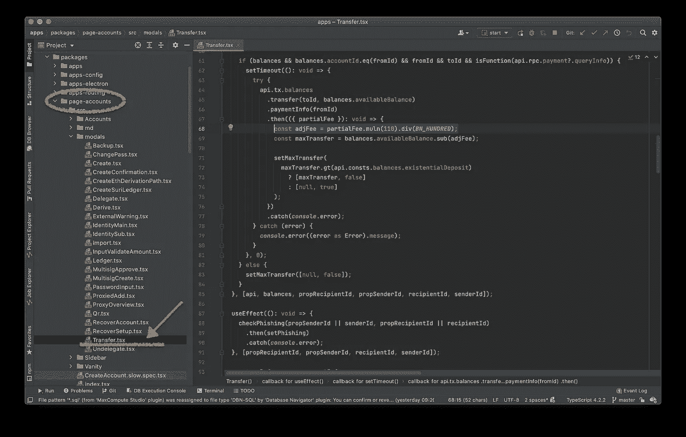

# 从 Polkadot 开发开始(第三部分)

> 原文：<https://medium.com/coinmonks/starting-with-polkadot-development-part-iii-234fc5e13687?source=collection_archive---------2----------------------->


在我们教程的最后一部分[，我们看到了如何创建地址以及这对 Polkadot 网络意味着什么。我们还通过 Polkadot.js 用户界面转移了一些资金，当我们通过 Node.js 脚本查询地址时，看到了相同的金额。现在来看一些更令人兴奋的事情:以编程方式创建我们自己的传输！](/coinmonks/starting-with-polkadot-development-part-ii-53c36be5556c)

# 创建交易

创建交易很容易。我们需要一个“from”和“to”地址，以及一个要传输的值。就像银行帐户一样，只有发送者需要在他的帐户中拥有特殊权限，接收者只能向网络上的任何人公开他们的地址，以便向他们发送一些钱。因此，用编程术语来说，这意味着发送者需要是一个 **KeyringPair** 对象(正如我们从本教程第二部分的[中看到的)，而接收者可以是一个简单的字符串(尽管传递一个 KeyringPair 也是有效的)。在我们之前的教程中，我们向 **MEDIUM_1** 账户进行了转账，我们将从该账户向一个新账户进行另一次转账。按照我们刚才所说的，我们需要使用相同的助记符在我们的代码中重新创建发送者帐户。](/coinmonks/starting-with-polkadot-development-part-ii-53c36be5556c)

```
***const* MEDIUM_1** = 'cruel leader remember night skill clump question focus nurse neck battle federal';***const*** { account: **medium1** } = createAccount(**MEDIUM_1**);
***const*** { account: **medium2**, mnemonic } = createAccount();***console***.log(`"${mnemonic}"`);***const*** amount = 15 * (10 ** api.registry.chainDecimals)***const*** transfer = api.tx.balances
    .transfer(**medium2**.address, amount)
    .signAndSend(**medium1**);
```

注意，转账只需要地址，而`**.signAndSend()**`需要完整的账户。您还可以看到，要发送的数量是在 [*普朗克*](https://wiki.polkadot.network/docs/en/learn-DOT) 中定义的，因此我们必须将所需的点数乘以 **10** 。运行代码后，我们希望看到:

```
"aunt picnic where oak result bid patch load teach cable giraffe service"
0xdbc934c6577ae4ee0d95065953731be943cf7c20aefac1149717db4fe75fbedf
```

第一个是助记符，第二个是事务散列。回到 Polkadot 界面，用这个助记符创建一个账户。称之为 **MEDIUM_2** 。您应该看到这 15 个点数被记入该账户，同时从 **MEDIUM_1** 账户中扣除。**成功了！**

# 大数字

到目前为止，我们一直在处理普通数字，在 Javascript 中，(不幸的是)[总是存储为 64 位浮点](https://www.w3schools.com/js/js_numbers.asp)。浮点运算可能会有损失，当涉及到金钱时，我们不能承受“损失！”所以在 Polkadot 中，特别是当涉及到 Javascript 代码时，我们使用一种叫做“大数”的东西，简称为 **BN** 。这是一种对象类型，它将整数值存储为一个小数组(通常是 2 个)值。在内部，它将组合这些元素并重新创建它存储的值，以便将其打印给用户，但在此之前，它将公开常见操作的方法，如加法、减法等。使用现成的 **Polkadot API 客户端**将返回 **BN** 中的所有值，因此，我们需要有工具来处理它们

```
npm i bn.js --save
```

现在，我们可以重复上述过程，将变量 amount 定义为:

```
***const*** factor = ***new*** **BN**(10).pow(***new*** BN(api.registry.chainDecimals));
***const*** amount = ***new*** **BN**(15).mul(factor);
```

我们将 10(作为 BigNumber)提升到 **chainDecimals** 的幂，通常是 12，然后我们将我们的数量乘以这个因子。

现在，在我们进行下一笔交易之前，我们应该首先确保我们有想要的资金。我们可以像在上一篇文章中那样查询余额，并执行一些简单的计算。但是首先，我们需要将我们的事务分成两部分:**创建**和**签名**。第一步，我们获得一个事务对象，通过它我们可以查询网络的潜在费用:

```
***const*** balance = **await** api.derive.balances.all(**medium1**.address);
***const*** available = balance.**availableBalance**;***const*** transfer = api.tx.balances.transfer(**medium2**.address, amount)

***const*** { **partialFee** } = await transfer.paymentInfo(**medium1**);
***const*** fees = partialFee.muln(**110**).divn(**100**);***const*** total = amount
    .add(fees)
    .add(api.consts.balances.**existentialDeposit**);

**if** (total.gt(**available**)) {
    ***console***.error(`Cannot transfer ${**amount**} with ${**available**}`);
} 
**else** {
    ***const*** txId = **await** transfer.signAndSend(**medium1**);
    ***console***.log(`Created transfer: ${txId}`)
}
```

我们得到交易的费用，并将它们加到我们希望转账的金额上。我们还添加了所谓的*“存在金额”*，这是一个帐户在网络中可见所需的最低金额。请注意，当我们查询余额时，API 返回的原生类型是 **BN** ，由于我们也在使用这种类型，所以从现在开始不需要转换它`**.toNumber()**`。

> 旁注:大多数 BN 操作都有一个“n”版本，比如 **div** 和 **divn** 、 **mul** 和 **muln** 。Theis 需要一个数字，而 standard 需要一个实例。

现在，唯一可能看起来奇怪的一行是`**.muln(110).divn(100)**` ，我们似乎将最终值乘以 **110** 并除以 **100** ，这实际上是将其乘以 **1.1** 。这直接取自 Polkadot.js 源代码，这是一个很好的资源，我们将探索如何使用这个 API。

# 阅读 Polkadot.js 代码库

就从这个开始吧。如果你从[第 1 部分](/coinmonks/starting-with-polkadot-development-92bba9c993ec)就开始学习本教程，你应该在本地运行 UI。所以去波尔卡多特回购。



这个项目中的文件夹是根据 URL 中定义的页面命名的。当我们从 UI 创建我们的帐户时，我们处于***#/帐户*** 页面，因此，从该页面执行的所有功能都可以在 page-accounts 文件夹中找到。这些动作也是语义命名的，所以 **Transfer.tsx** 包含了我们想要的代码，如上所示

> 警告:这个 repo 中的代码是非常优化的，并且大量基于 [React 钩子](https://reactjs.org/docs/hooks-intro.html)。它可能很难阅读和理解，但我可以向你保证它写得很好，美学上很优雅(是的，有美丽的代码这种东西)。

本质上，我认为他们所做的是在费用中增加一个任意的分数以确保万无一失。我相信他们的准则。

该传输的最终代码如下所示

```
***const*** { ApiPromise, WsProvider } = require('@polkadot/api');***const*** { 
    mnemonicGenerate, 
    mnemonicValidate 
} = require('@polkadot/util-crypto');***const*** { Keyring } = require('@polkadot/keyring');
***const*** BN = require('bn.js');

**const** connect = async () => {
    const wsProvider = new WsProvider('ws://127.0.0.1:9944');
    const api = new ApiPromise({ provider: wsProvider });
    return api.isReady;
};

***const*** keyring = ***new*** Keyring({type: 'sr25519'});

***const*** MEDIUM_1 = 'cruel leader remember night skill clump question focus nurse neck battle federal';

***const*** createAccount = (mnemonic) => {
    mnemonic = mnemonic && mnemonicValidate(mnemonic) 
        ? mnemonic 
        : mnemonicGenerate();
    const account = keyring.addFromMnemonic(mnemonic);
    return { account, mnemonic };
}

***const*** main = async (api) => {
    ***console***.log(`Our client is connected: ${api.isConnected}`);

    ***const*** { account: **m1** } = createAccount(MEDIUM_1);
    ***const*** { account: **m2**, mnemonic } = createAccount();
    **console**.log(`New account created with: "${mnemonic}"`); ***const*** balance = await api.derive.balances.all(**m1**.address); ***const*** available = balance.**availableBalance**; ***const*** decims = new **BN**(api.registry.chainDecimals);
    ***const*** factor = new **BN**(10).pow(decims);
    ***const*** amount = new **BN**(15).mul(factor); ***const*** transfer = api.tx.balances.transfer(**m2**.address, amount)

    ***const*** { partialFee } = await transfer.paymentInfo(**m1**);
    ***const*** fees = partialFee.muln(110).divn(100);

    ***const*** total = amount
        .add(fees)
        .add(api.consts.balances.**existentialDeposit**);

    if (total.gt(available)) {
        ***console***.error(
            `Cannot transfer ${amount} with ${available} left`
        );
    }
    else {
        ***const*** tx = await transfer.signAndSend(**m1**);
        ***console***.log(`Created transfer: ${tx}`);
    }
};

connect().then(main).catch((err) => {
    ***console***.error(err)
}).finally(() => ***process***.exit());
```