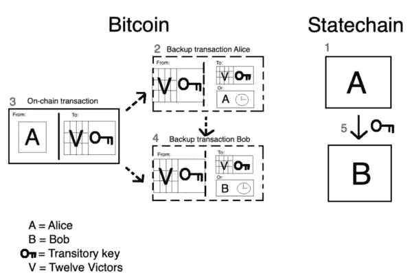
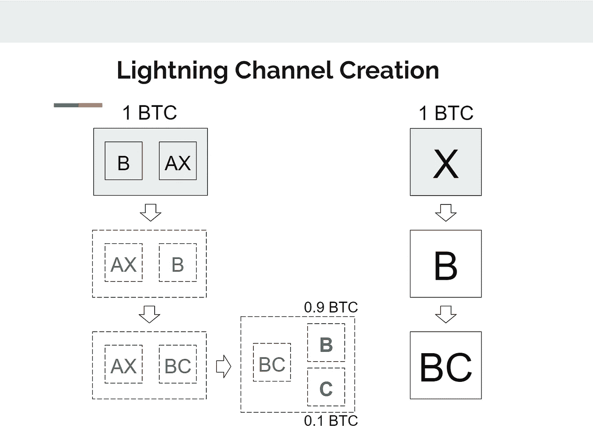
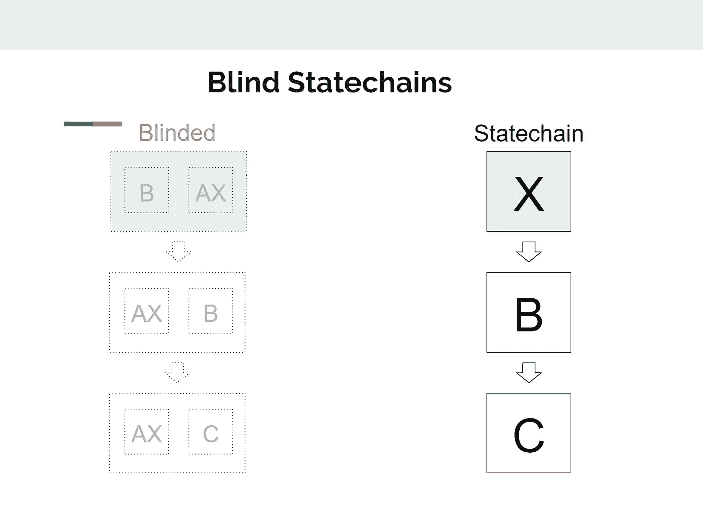

# 国家链和帮助比特币扩大规模

> 原文：<https://medium.com/coinmonks/statechains-and-helping-bitcoin-scale-off-chain-41602d617b40?source=collection_archive---------4----------------------->

比特币最令人期待的事情之一是它有多种安全、可靠、廉价和创造性的交易方式。从通过 Opendime 亲自转账到使用 Lightning 网络，我知道这仅仅是比特币能够私下和安全地离线扩展的开始。

随着时间的推移，比特币制造者将会发现新的用例，并希望以最适合他们的方式进行交易。幸运的是，比特币是开源的，如果有什么东西需要开发，我们可以做。这是另一种通过称为状态链的第二层协议进行比特币交易的方式。

Statechains 最初引起了我的注意，因为它做了一些我从来没有想到有人会愿意做的事情，那就是，他们不是直接向某人发送比特币，而是将私钥发送给所述人，这样他们就拥有所有权。这种交易方法确实涉及到一些权衡，但是就像我之前所说的，我们将需要不同的方式为不同的目的进行交易。

这使用了“两个多签名钱包中的两个”,这意味着涉及到半信任的第三方。两个多重签名中的两个的重要性有助于确保任何一方都不能欺骗对方并窃取比特币。在这种情况下，第三方有义务对所请求的交易进行签名，但前提是该交易来自发送方(或最后持有临时密钥的人)。当将临时密钥发送给其他人时，发送者必须通知第三方，以便他们现在知道谁持有它，并且可以正确地批准未来的交易。所有这些都不需要链上事务，并且可以一遍又一遍地重复。

“使用半信任的第三方进行交易？绝对不会。我怎么能相信别人呢？这就是我进入比特币的全部原因！'

我知道你们很多人都是这么想的，我也是这样想的。你如何知道你是否可以信任第三方的相应行动？嗯，有一些方法可以解决这个问题，让第三方在浪费时间的情况下无利可图，并保证你的硬币不会被盗或丢失。这个问题的一个解决方案是添加一个时间锁(通过发送到 multi-sig wallet 之前的备份交易),这样如果第三方拒绝遵守，你就安全了。时间锁启动后，硬币会被送到程序设定的地址，不会丢失或被盗。当然，如果第三方和原始参与者都签署了一个交易来这样做，这可以被加速。从那以后，让我们说这个暂时的钥匙被传了一段时间，经历了几个新主人。当前所有者可以利用 Eltoo(闪电网络功能)，允许他使用自己的备份来覆盖任何以前所有者的备份，阻止他们欺骗系统并收回硬币。

If only everyone had good intentions am I right?!

这样做的一个缺点是，你永远不可能 100%信任第三方，因为他们可能会与以前的所有者合作来获得临时密钥，并为所欲为。这就是事情变得更加复杂的地方，因为这个问题永远无法完全解决，所以需要采取更多复杂的步骤来最小化风险。对此，一个更长的解决方案是分解第三方的密钥，这样它必须得到多个其他人的确认才能得到批准。Statechains 有一些限制，因为它需要有 Schnorr 签名和 Sighash _ Anyprevout 才能正常工作。最后，整个 UTXO 必须在一次交易中花费，而不是更小的金额。但是因为您可以交易 UTXO，所以您可以创建一个类似于 [Coinjoin](https://en.bitcoin.it/wiki/CoinJoin) 的交易；因为只有你和州政府知道这件事。

现在让我们来看看这个第二层更吸引人的地方。由于每个 UTXO 本质上是锁定的，只能全部使用，因此不存在任何部分储备的风险。不存在有人借出其中任何一部分的风险，尤其是在没有许可的情况下。如果一个中央机构试图扣押或冻结比特币，这也会派上用场。他们不能抓住任何东西，因为他们很可能只有一把钥匙，而另一个参与者可以很容易地将比特币放回链上。哦，我有没有提到州链是非监管的？嗯，他们是！

Statechains 与 Lightning 网络配合得非常好，事实上，可能是一个让新用户加入的简单解决方案。这是为什么呢？状态链使 Lightning 更加灵活，允许您无缝地在频道中添加和/或删除人员，而无需接触主链。以及国家链可以随意变成闪电通道。比方说，你想和某人建立一个闪电通道，你必须首先在 statechain 上有可用的资金。然后干脆把 Statechain UTXO 改成共享闪电通道，轰！你有它！这项新技术可能是有利的，因为你可以轻松地打开和关闭通道，因为你不必把任何东西放在链上。

开设一个渠道，但不知道你可能需要多少流动性？状态链为这个问题提供了一个有用的解决方案。你可以非常便宜地打开和关闭通道，允许你用一个小的 UTXO 打开一个通道(然后意识到你可能需要更多的流动性)并把它转移到一个更大的 UTXO。当你用最少的成本完成所有工作后，关闭渠道。因为这不仅便宜而且有效，开发人员和测试人员可以发挥创造力，真正测试出他们以前可能无法测试的新实验。我真的很兴奋地看到人们将从中获得哪些创造性的想法和解决方案！

当你同时使用状态链和 Lightning 时，协议仍然是分开的。在关闭链时仍然如此，因为不需要涉及状态链，因为双方都不需要知道事务。虽然可以看到 UTXO 已经被转移，但是 Statechain 对这个事务有些隐藏。

Statechain is blinded and can't see what it's signing

隐私也因盲目的国家链而更进了一步。国家链的第一个问题是知道你的交易，并把它们传播给任何人和每个人看。但是由于您可以交换 UTXOs，这使得您的事务类似于 Coinjoin。内置于此的也是盲签名。正如您在左边的图表中所看到的，statechain 无法确切地看到它正在签名什么。可能是有人在寄钱，也可能是完全不同的东西。它所看到的是有一个交易要签署，所以它这样做了。这非常有助于增加隐私，因为您可以安全地将权限转移到私钥，而不必更改实际的密钥本身。

总的来说，我真的对未来的链外扩展和其他创造性的交易方式持乐观态度。随着时间的推移和数量的增加，我们将看到新一波聪明而热情的比特币创造者带着解决问题的新想法进入太空。我毫不怀疑，从长远来看，州链和其他第二层解决方案中的任何问题都会得到解决。有助于保护隐私的廉价解决方案让我如此看好比特币和比特币创造者，以至于我甚至无法用语言表达出来。

感谢你的阅读，祝你一天过得愉快！

引用作品:

宋，吉米，导演。Statechains，一个半可信的第二层协议！比特币技术讲座第 181 期。 *Statechains，一个半可信的二层协议！比特币技术讲座第 181 期*，YouTube，2020 年 3 月 30 日，【https://youtu.be/ZdKhNv4l5Bs. 

阿伦·范·维尔杜姆。" Statechains:发送密钥以扩展比特币链外交易."*比特币杂志*，2020 年 1 月 8 日，bitcoinmagazine . com/articles/state chains-sending-keys-not-coins-to-scale-bit coin-off-chain。

> [直接在您的收件箱中获得最佳软件交易](https://coincodecap.com/?utm_source=coinmonks)

