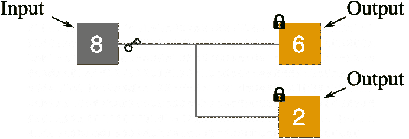
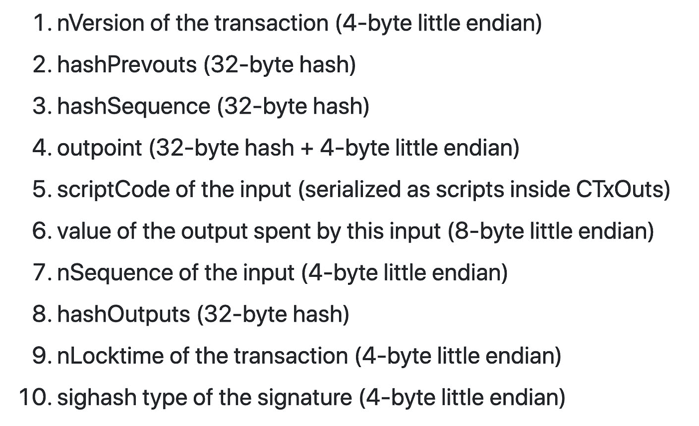
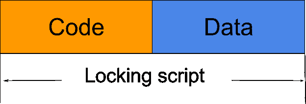
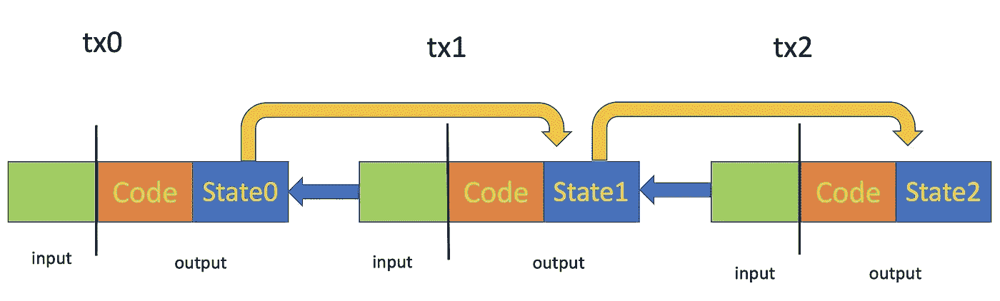

# 比特币服务上的有状态智能合约

> 原文：<https://medium.com/coinmonks/stateful-smart-contracts-on-bitcoin-sv-c24f83a0f783?source=collection_archive---------0----------------------->

# 比特币智能合约

与普遍看法相反，比特币自诞生以来就具备了[智能签约](https://bitcointalk.org/index.php?topic=195.msg1611#msg1611)能力，一种基于堆栈的原生编程语言被称为[脚本](https://wiki.bitcoinsv.io/index.php/Advanced_Bitcoin_Scripting)。每笔比特币交易都由输入和输出组成。每个输出都用一个脚本锁定一些比特币，该脚本规定了合同的义务。如果一个输入带有一个满足输出契约的脚本，它会解锁输出中的比特币，并将它们移动到新的输出中。这就是比特币所有权转移的工作原理。

[A Bitcoin Transaction](https://learnmeabitcoin.com/guide/images/transaction-data/transaction-data.svg)

脚本通常被认为是极其有限的，因此无法进行复杂的智能签约。比特币智能合约的一个经常被引用的缺陷是它缺乏状态。这是一个主要的限制[以太坊](https://github.com/ethereum/wiki/wiki/White-Paper#scripting)被认为克服了它的存在的理由。

一些合同本质上是有状态的，因为它们要求合同双方在多个阶段进行交互，并依赖于时变状态，如在线投票和游戏。我们展示了在比特币智能合约中维护状态的一般机制。我们还在 [sCrypt](http://scryptdoc.readthedocs.io/) 中实现了有状态契约，这是一种编译成本机脚本的高级语言。

# 先决条件:OP_PUSH_TX

在我们研究如何在比特币智能合约中维护状态之前，我们介绍一种强大的技术，称为 [*OP_PUSH_TX*](/@xiaohuiliu/op-push-tx-3d3d279174c1) 。它可以被视为将当前事务推入堆栈的伪[操作码](https://wiki.bitcoinsv.io/index.php/Opcodes_used_in_Bitcoin_Script)，然后可以在运行时对其进行检查。更准确地说，它能够检查在 [BIP143](https://github.com/bitcoin-sv/bitcoin-sv/blob/master/doc/abc/replay-protected-sighash.md) 中定义的签名验证中使用的原像。原图像的格式如下:

Signature hash preimage

# 有状态契约实现

一旦我们可以检查一个契约的事务上下文，我们就可以对它的输入和输出设置任意的约束。

在契约中实现状态的一种方法是将锁定脚本中的契约分成两部分:数据和代码。数据部分是状态。代码部分包含对状态转换规则进行编码的协定的业务逻辑。数据作为*OP _ RETURN<data>或*OP _ push data<data>OP _ DROP 被动追加到代码中。*即使它没有被评估，它仍然影响契约的有效性，因为前面的代码部分验证了它。*

Contract in a locking script is divided into code and data

使用 OP_PUSH_TX，我们可以从部件 *5* 获得输出的锁定脚本，从部件 *8* 获得新输出的锁定脚本。为了维护状态，我们要求锁定脚本的代码部分不能更改，并且数据/状态更改必须符合代码部分中的状态转换规则。这类似于面向对象编程中的对象概念，代码是方法，数据是对象的成员变量。方法是 immutable⁴.成员变量被封装，只能通过 methods⁵.变异从解锁脚本中调用方法，对要调用的方法及其参数进行编码。

State is carried across UTXOs in a contract

# 合同示例:柜台

让我们看一个简单的有状态契约的例子:计数器契约跟踪它的函数 *increment()* 被调用了多少次。它的[代码](https://github.com/scrypt-sv/boilerplate/blob/master/contracts/counter.scrypt)如下所示，并带有内联注释。

[Counter contract](https://github.com/scrypt-sv/boilerplate/blob/master/contracts/counter.scrypt)

第 3 行确保原映像来自当前事务。我们在第 6 行获得了前面的锁定脚本，在原图像的第 5 部分中也称为 *scriptCode* 。先前的计数器状态是从第 9 行的*脚本代码*中提取的，之后递增并放入第 15 行的新锁定脚本中。请注意，计数器是锁定脚本中唯一更改的部分。其余的确保输出包含新的锁定脚本。

[这里的](https://github.com/sCrypt-Inc/boilerplate/blob/master/deployments/counter.js)是部署契约并反复调用其函数 *increment()* 的代码。可以找到一个计数器增量从 0 到 9 的契约的实例:[0](https://test.whatsonchain.com/tx/5bde01982a262beb5f438ca36ee27ca75467ac890183b329e2fd5fcb16b488cf)->[1](https://test.whatsonchain.com/tx/1f3c9b9dfacc4ff485d6fecf01c7dd1e5d8d8493d24b259a1d57b4e759eaf926)->[2](https://test.whatsonchain.com/tx/34418a69f2dee4b2e7263f4d56a8fd5bd5e301a6e2120fde50672eed7537cb0e)->[3](https://test.whatsonchain.com/tx/a78a7d7177ad1470cb025317d9093de3e0a63b1c098b86e97338a6a5bd897db7)->[4](https://test.whatsonchain.com/tx/8d1cb08421668bb679a5f46e9cf373879173f128e4b46fecca1f5eb9ecc230f5)->[5](https://test.whatsonchain.com/tx/7d866f6809e80656064e4d7eb7309ceebf83578e833ef8cc6e14c663444cc7c9)->[6](https://test.whatsonchain.com/tx/92749b0729ed44daee598cdb97b7d316891f9b5a58144c02efeb715b8ec02f72)->[7](https://test.whatsonchain.com/tx/11ab46a5b7cba367d86e923a2a3ff3b6ac095fad500c261f4ed493ef8b72c4b9)->[8](https://test.whatsonchain.com/tx/06052a9cb7a5c82a987cf12bb66c3e71222ba9553d875092c3bf2f2e6a94c642)-[请注意，计数器状态位于第一个事务输出的脚本末尾。](https://test.whatsonchain.com/tx/92749b0729ed44daee598cdb97b7d316891f9b5a58144c02efeb715b8ec02f72)

Counter at state 9

# 结论

这是我们正在撰写的系列文章的一部分，旨在演示比特币智能合约可以做什么以及如何实现它们。许多假定的脚本限制是由于未能实现其潜力。随着我们更多地解释和演示脚本可以实现的功能，人们会发现它具有极强的可扩展性、多功能性和面向未来的特点。我们将证明，没有人为限制的比特币可以运行其他区块链可以运行的任何智能合约，同时能够无限扩展。通过经济激励，可以利用它来使跨行业的许多应用程序更加高效和安全。

# 承认

特别感谢 [nChain](https://nchain.com/) 提供了 *OP_PUSH_TX* 的原创想法。我们还要感谢 George Papageorgiou、James Belding、Brenton Gunning 和 Joel Dalais 对本文早期草稿提出的宝贵建议。

[1]:在文章中，我们将比特币 SV 称为比特币，因为它遵循了最初的协议设计。

[2]:有一个例外，一些输出包含零个比特币，标记为，例如，OP_RETURN。

[3]:操作码是脚本的基本单位。

[4]:在一些动态 OOP 语言中，这个一般规则有一些例外。

[5]:这条一般规则也有一些例外。

> [在您的收件箱中直接获得最佳软件交易](https://coincodecap.com/?utm_source=coinmonks)

