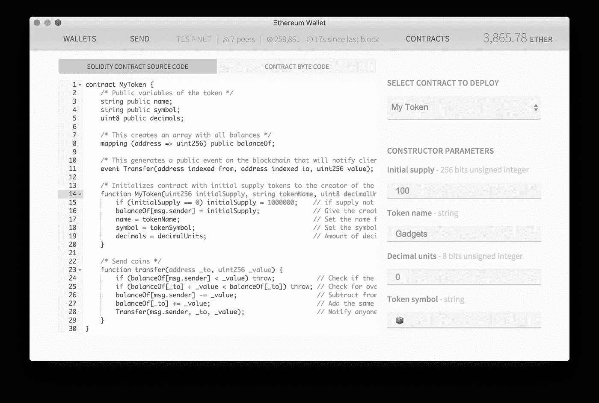

# 有状态与无状态区块链契约

> 原文：<https://medium.com/coinmonks/stateful-vs-stateless-blockchain-contracts-bcd1b0c25ff?source=collection_archive---------6----------------------->

Stateless vs. Stateful Blockchain Contracts. Credit Image David di Veroli Unsplash.

## 或者以太坊合约有什么问题，新的 Ardor 轻量级合约如何解决这个问题

查看[更多轻量级合同文章](/@lyaffe/lightweight-contracts-articles-49c3032a50da)

要了解现有以太坊智能合约有多糟糕，请查看其中一个最简单的[示例](https://www.ethereum.org/crowdsale)，向下滚动一点，查看代表 MyToken 合约示例的 30 行代码。

Crowdfund your idea — Ethereum Smart Contract example

这是每一个新的智能合约开发者都会从的例子，直接来自马嘴，ethereum.org。

那么，这样一个看起来无害的例子有什么错呢？让我们仔细分析一下合同的执行情况，找出问题所在。

**以太坊契约是有状态的**

第 8 行的 balanceOf array 是万恶之源(从计算机科学的角度来说)。该数组维护持有 MyToken 的帐户余额，用编程术语来说，我们将数组的余额称为契约的“状态”,因为该信息在契约调用之间维护，并存储在区块链上。

这种方法的错误在于，它是并发问题和各种外来攻击媒介的磁石。

例如，看看第 23 行的 transfer()方法，想想如果 transfer 方法被两个不同的线程调用会发生什么，这两个线程都将同一个消息发送者的所有余额提取到另一个帐户中，每个线程同时在自己的 CPU 上运行。

如果在一个 CPU 上，一个线程通过了第 24 行上的余额检查，但是还没有达到第 26 行上的余额扣除，而在另一个 CPU 上运行的另一个线程同时调用来自同一发送者的转移，则两个线程都将通过第 24 行上的检查，允许消息发送者加倍花费他的代币，即转移高达他的可用余额的两倍。

我们称这个问题为竞争条件，任何维护共享状态的程序，如 balanceOf array，都会受到它的影响。

这意味着以太坊契约不能并行执行。因此，即使您的桌面上有一个这样的[怪物](http://www.dell.com/il/en/business/p/poweredge-tower-servers)，您的合同仍然只在一个 CPU 上执行，使得整个服务器大部分时间处于空闲状态。理想情况下，当我们处理一个充满契约调用事务的块时，我们想要的是并行运行所有的契约，但是由于共享状态，这是不可能的。

共享状态会导致其他问题，例如，如果在第 26 行和第 27 行之间，契约开发人员决定调用外部契约，该怎么办？这个外部契约可能抛出异常，使得发送者没有他的余额，即使这个余额还没有被记入接收者的贷方。

更糟糕的是，这种外部契约调用可能会从向自身发送令牌的外部契约中恶意地再次调用 transfer 方法。下面的[资源](https://consensys.github.io/smart-contract-best-practices/recommendations/)混淆地将这个问题命名为“竞争条件”,尽管它与并发性无关，并定义了一些可以遵循的最佳实践来避免这些问题。然而，随着合同变得更加复杂和关键，这些最佳实践变得非常难以实施。

总的来说，依靠合同来保存其状态是一个坏主意，它打开了几个攻击媒介和操纵选项，并且还由于难以发现缺陷而导致锁定合同中的资金的持续风险。

**热情轻量级合同救场**

Ardor 基于 NXT 技术，已经有几种方法可以在区块链上安全地保存状态，使用消息、账户属性、别名、云数据、各种类型的令牌等实体。所有这些实体都使用自己的事务类型和 API 构建到核心区块链中。

基于这个现有的功能，我们将轻量级契约设计成无状态的。这意味着协定本身从不保存任何状态，如数组的 balanceOf。相反，合同要求的所有状态修改都作为正常交易提交，一旦被区块链接受，将修改上面列出的一些实体，以便将信息保存到区块链中。稍后，当同一个或另一个轻量级契约需要一些状态信息(如令牌余额或账户 KYC 信息)时，它将使用一个公共 API 从区块链查询它。

类似于上述以太坊契约的轻量级契约的直接 1:1 示例是不可行的，因为在 Ardor 中，为了更改令牌余额，您所需要的只是调用 transferAsset API，所以让我们看看另一个示例，看看这是如何工作的。

这个简单的 Hello World 示例演示了 Ardor 轻量级契约如何通过发送消息事务来修改区块链的状态，而不保留任何内部状态。

[https://bit bucket . org/jelu Rida/ardor/src/master/addons/src/Java/com/jelu Rida/ardor/contracts/hello world . Java](https://bitbucket.org/Jelurida/ardor/src/master/addons/src/java/com/jelurida/ardor/contracts/HelloWorld.java)

由于 HelloWorld 契约中没有存储共享数据，因此很明显，许多 HelloWorld 契约实例可以并行执行，而不会导致任何与并发性相关的问题或类似以太坊的竞态条件。

合同提交的任何交易都将由内置竞争条件预防的区块链处理，从而将处理这一难题的责任从合同开发商转移到核心区块链开发商。

由于轻量级契约由单个节点执行，而不是由所有节点执行，因此不存在重复的消息传递事务淹没区块链的风险。如您所见，合同被调用，进行一些处理，提交一些事务，然后退出。契约的下一次调用不依赖于保存在契约本身中的任何数据，因此可以并行运行。

我们相信 Ardor 使用的无状态契约执行方法将会比其他有状态方法更加安全和可伸缩。

