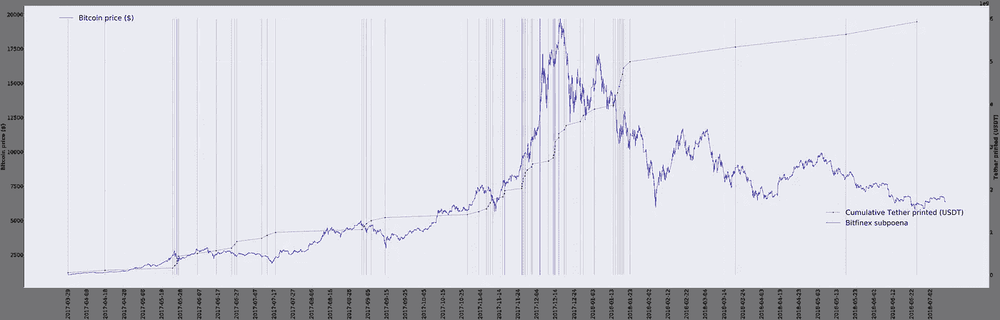
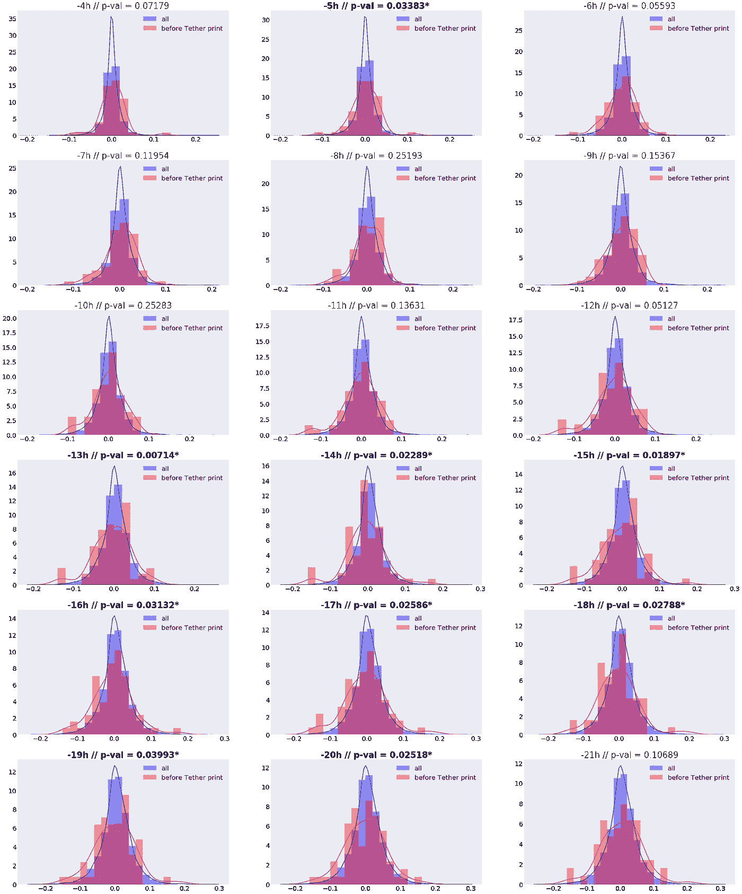
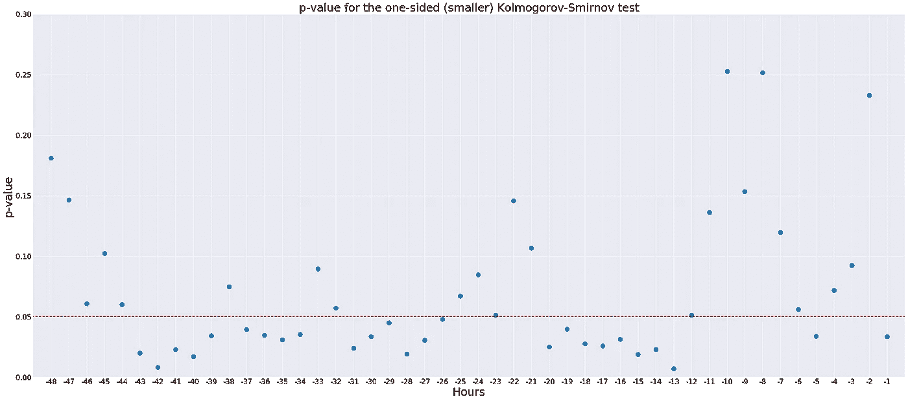
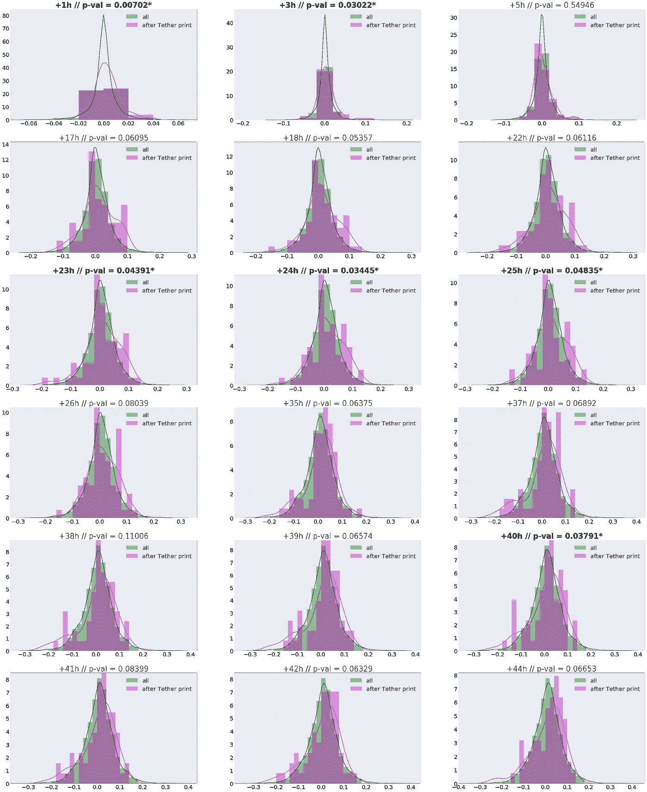
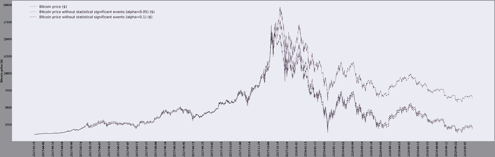
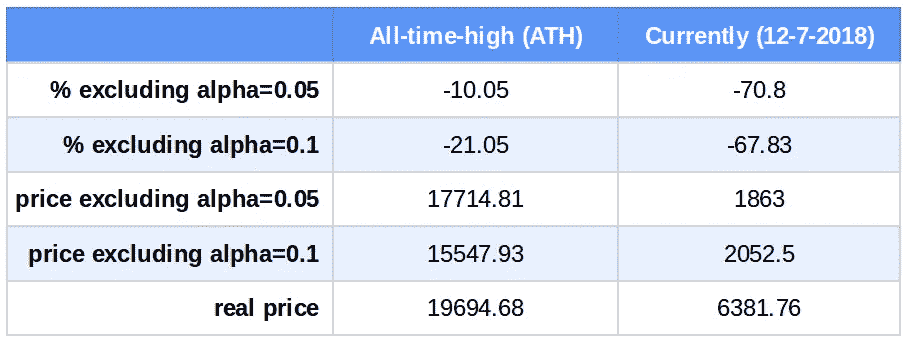

# 2017 年末系绳发行操纵比特币价格的统计分析

> 原文：<https://medium.com/coinmonks/statistical-analysis-of-bitcoin-price-manipulation-by-tether-issuance-in-late-2017-b3342b8915a0?source=collection_archive---------0----------------------->

在这篇文章中，我们分析了美元支持的美元加密货币 Tether 的新代币的印刷与 2017 年底比特币价格的上涨之间的相关性，这可能构成了最新的大规模市场操纵和泡沫之一，其后果直到最近我们才开始看到。这篇文章的思路和分析方法并不新颖，都是取自或受最近发表的论文“ [*比特币真的没有束缚吗？*](https://papers.ssrn.com/sol3/papers.cfm?abstract_id=3195066)**约翰·m·格里芬等人的*和所谓的[系绳报告](https://www.tetherreport.com/)。然而，这里显示的结果可能是目前互联网上最新的，希望比引用的出版物更容易理解。这篇文章使用的 Jupyter 笔记本可以在文章的结尾找到。*

## *系绳(或 USDT)*

*[Tether](https://en.wikipedia.org/wiki/Tether_(cryptocurrency)) 是一种明显有争议的加密货币(或者更准确地说是代币),诞生于 2014 年末，其超过 100%的可疑创造者声称由 Tether Limited 储备的美元 1:1 支持[。由于这个原因，Tether 被认为是一种“稳定的货币”，因为它的价值在美元价值附近波动很小。有趣的是，2017 年 11 月的](http://tether.to/) [Paradise Papers](https://en.wikipedia.org/wiki/Paradise_Papers) 泄露将 Tether Limited 与 Bitfinex 的两名官员联系起来，揭示了 Bitfinex 和 Tether 之间的一系列黑暗联系和互利关系。尽管所有的传言和证据表明，Tether Limited 实际上可能没有足够的美元来支持 Tether 发行的数量，以及美国商品期货交易委员会发出的[传票](https://www.bloomberg.com/news/articles/2018-01-30/crypto-exchange-bitfinex-tether-said-to-get-subpoenaed-by-cftc)，加密货币一直稳定地保持其与美元挂钩的价值，并受到世界各地交易员的信任，他们每天都用它作为对冲，以在加密货币熊市期间保持其价值。*

*从技术角度来看，Tether 在区块链并不拥有所有权。相反，它运行在比特币区块链之上，使用一种叫做 Omni Layer 的协议。在实践中，就像比特币一样，所有的系绳交易链或账本都是公开的，可以通过[https://www . omni explorer . info](https://www.omniexplorer.info)访问。事实上，为了提供透明度，Tether Limited 向[提供了最富有的 Tether 账户列表](https://wallet.tether.to/richlist)，其中出现了几个账户以及关于账户所有权的余额和注释(其中大多数是加密货币交易所)。Tether Ltd .还提供了[美元的当前储备和 Tether 打印机地址](https://wallet.tether.to/transparency)，其 id 如下:*

> *[3 mbyqmmmskc 3 agw kj 9 FMO 5 lsptw 1 zbtwxl](https://www.omniexplorer.info/address/3MbYQMMmSkC3AgWkj9FMo5LsPTW1zBTwXL/)*

*在 Tether printer 帐户的 omniexplorer 页面上，可以看到所有发布或打印 Tether 的事件。在下面的图中，我显示了 2017 年 3 月至 2018 年 7 月对应的系绳打印事件(灰色竖条)，以及红色的累计打印系绳、比特币价格演变和 2017 年 12 月 6 日的 Bitfinex/系绳传票发布。比特币价格已经从 [Coindesk 比特币价格指数](https://www.coindesk.com/price/)中以 1-h 烛台的形式获得。*

**

*关于该情节的一个有趣的观察是，大多数系绳印刷事件，以及大部分印刷量似乎发生在 2017 年 11 月至 2018 年 1 月，恰好发生在比特币泡沫的兴起和破裂期间。*

## *系绳操纵的统计分析*

*约翰·m·格里芬(John M. Griffin)的出版物和 Tether 报告中深入探讨的假设是，Tether 被印刷并转移到几个交易所，作为对比特币下跌或短暂熊市的回应，以便用它购买比特币，并提供牛市的虚假感觉，这反过来会导致其他投资者在看起来看涨的市场中购买更多比特币。因此，人们的想法是，价值达到近 2 万英镑的比特币泡沫是对比特币价格短暂下跌的反应，即系绳印刷和比特币购买事件同步进行的结果。*

*如果这个假设是真的，人们会认为:*

*   *平均来说，在每一次发行之前的几个小时，比特币的价格会走低*
*   *平均而言，在每一次系绳印刷后几个小时，比特币的价格就会上涨*

*我们可以用统计方法解决这个谜题的一个方法是比较以下各项的分布:*

*   ***(A)** 例如，每次栓带打印事件前 10 小时与打印事件期间的价格之间的价格差异(价格回报)*
*   ***(B)** 以 10h 为间隔观察到的所有历史价格差异(价格回报)。*

*然后，我们可以使用一种称为 Kolmogorov-Smirnov (KS)的统计检验，它可以告诉我们这两种分布在统计上是否可能不同，事实上，一种分布高于或低于另一种分布。这个统计测试返回给我们一个叫做 p 值的东西，它告诉我们从同一个分布中抽取两组样本 A 和 B 的概率是多少。通常，当 p 值低于 0.05 时，我们说两个分布是不同的，这意味着我们有 5%的概率(非常低)从同一分布中随机获得两组样本 A 和 B。这表明这两种分布在 95%(1-p 值)的置信度下是统计上不同的。*

## *系绳印刷前的差价分布*

*我们执行了双样本单尾 KS 测试，以查看在系绳打印前 ***x*** 小时和系绳打印时的价格之间的价格差异的分布是否低于所有 ***x*** 小时价格差异的分布。我们对范围从-48 小时到-1 小时的 ***x*** 进行了此操作。请注意，在这种情况下，KS 测试是单尾的，因为我们试图评估一个分布(例如，在系绳打印之前 10h 的价格差异)是否低于另一个分布(例如，所有 10h 的间隔价格差异)，而不是仅仅评估两个分布是否不同(这将是双尾 KS 测试)。以下是一些最重要的结果:*

**

*可以看出，在 p 值显著的情况下(p 值< 0.05) we can clearly see that the distribution is “shifted” towards the left or present several spikes on the left. The following plot shows all the p-values for ***x*** 范围从-48 小时到-1 小时)。*

**

*这表明，在系绳印刷之前，价格下跌超过平均水平，这与我们的假设一致，即系绳是在比特币下跌时印刷的。*

## *系绳印刷后价格差异的分布*

*根据最初的假设，一旦 Tether 被印刷出来并分发给几家交易所，Tether Limited 将使用 USDT 代币回购比特币。通过这种方式，可以预期在 ***+x*** 小时和系绳打印时间之间的价格差的分布应该向右移位，即应该大于所有****×小时*** 小时价格差的分布。我们使用的 ***x*** 的范围是从+1 小时到+48 小时。以下是一些有代表性的分布:**

****

**这是指定范围 ***x*** 的所有 p 值的完整图:**

****

**我们可以看到，48 个点中至少有 6 个点显示出统计差异。这向我们表明，有证据表明，在 Tether 印刷后，比特币价格的上涨超过了平均水平。**

## **相关性与因果性**

**在这一点上出现了一个有趣的困境:虽然在价格下降后的栓系印刷和栓系印刷后的价格上升之间似乎存在相关性，但我们如何才能真正知道栓系印刷实际上引起了这些变化？在这种情况下，答案很难评估。有大量的研究表明[相关性并不一定意味着因果关系](https://en.wikipedia.org/wiki/Correlation_does_not_imply_causation)，其中一些[很有趣](http://www.tylervigen.com/spurious-correlations)比如发现*掉进泳池淹死的人数*与*电影* *尼古拉斯·凯奇出现在*中的相关性。虽然辩论可能很有趣，但这个话题超出了本文的范围(请在评论中留下您的想法！).**

## **通过系绳操纵比特币的后果**

**如果我们的考虑和假设是正确的，Tether Limited 将操纵所有的加密货币市场(记住[所有的加密货币都与比特币](https://www.sifrdata.com/cryptocurrency-correlation-matrix/)表现出极大的相关性)，并将极大地助长比特币和加密货币泡沫。现在的问题是:多少？虽然很难准确评估，但我大胆计算了一些市场受其影响的模拟。**

**为了做到这一点，我认为，如果 Tether Limited 没有操纵市场，市场就不会经历我们之前检测到的“统计意义上的显著”价格上涨。因此，我已经删除了统计上不同分布的所有事件，总共包括 341 个烛台(大约。14 天)。请记住，这些分布不仅包括价格上涨的事件，还包括价格下跌的蜡烛。为了与真实的比特币价格保持一致和可比，我从所有后续烛台中移除了“删除”烛台期间经历的价格变化。最后，我用邻居蜡烛的值来插值删除的烛台的价格。**

**这些模拟得到的价格，使用 alpha=0.05 和 alpha=0.1 (alpha 是显著性水平)，以及原始的比特币价格可以在下面的图中看到。**

****

**为了量化模拟中观察到的变化，我计算了比特币历史最高价格(2017 年 12 月 17 日)的价格差异，以及截至今天真实价格和模拟价格之间的差异。**

****

**我们可以看到的是，系绳操纵是比特币价格上涨 10-70%的原因。这些数字与 *John M. Griffin 等人*报告的数字一致，他们报告说，系绳操纵对价格上涨的贡献为 50%。**

## **结论和个人意见**

**在本文中，我们探讨了系绳印刷在操纵比特币价格中的作用。一些带回家的信息是:**

*   **统计数据支持这样一种理论，即在 2017 年和 2018 年初比特币价格飙升期间，Tether Limited 和 Bitfinex corporations 在关键场合使用 Tether 购买比特币。**
*   **这些公司会在比特币价格短暂下跌后立即印刷 Tether，并将它分发到不同加密货币交易所的有组织的账户网络中(在*约翰·m·格里芬*的论文中有详细探讨)。**
*   **然后，Tether Ltd .将使用新铸造的 Tether 购买比特币，并将推动创建一个欺诈性的牛市，这将吸引更多的投资者购买比特币，从而增加泡沫(动量效应)。**
*   **作为该策略的一部分，并得到本文提到的论文的支持，Tether Ltd .将把新购买的比特币发送到他们在 Bitfinex 的账户。**
*   **在我个人看来，Bitfinex 要么(a)在自己的交易所和其他交易所慢慢出售比特币，要么(b)在场外(OTC)向私人投资者出售比特币。这最后一种操作(OTC)对 Bitfinex 来说将是非常有利可图的，因为它允许将整个操作货币化(以美元计)，同时防止通过出售比特币在集中交易所产生熊市的副作用。**

## **结束语**

**所提供的信息仅用于教育目的。它绝不代表任何财务建议，信息必须“按原样”采用，没有任何形式的保证。我与本文中提到的任何部分都没有任何关系。**

## **Python 代码**

**亲爱的程序员，你现在可以在这个 Jupyter 的笔记本里找到用来写这篇文章的 Python 实现:[https://github . com/GerardBCN/TetherManipulationStudy/blob/master/manipulation _ explorer . ipynb](https://github.com/GerardBCN/TetherManipulationStudy/blob/master/manipulation_explorer.ipynb)。我对建议和调试持开放态度！**

***这个项目是我们在*[*cryptodatum . io*](https://cryptodatum.io)*研究的一部分，这是一个加密货币数据 API，旨在提供即插即用的数据集来训练机器学习算法。如果您喜欢我们在本文中展示的数据，您可以在*[*https://cryptodatum . io*](https://cryptodatum.io.)获得免费的 API 密钥并亲自使用它**

****

> **加入 Coinmonks [电报频道](https://t.me/coincodecap)和 [Youtube 频道](https://www.youtube.com/c/coinmonks/videos)获取每日[加密新闻](http://coincodecap.com/)**

## **另外，阅读**

*   **[复制交易](/coinmonks/top-10-crypto-copy-trading-platforms-for-beginners-d0c37c7d698c) | [加密税务软件](/coinmonks/crypto-tax-software-ed4b4810e338)**
*   **[网格交易](https://coincodecap.com/grid-trading) | [加密硬件钱包](/coinmonks/the-best-cryptocurrency-hardware-wallets-of-2020-e28b1c124069)**
*   **[密码电报信号](http://Top 4 Telegram Channels for Crypto Traders) | [密码交易机器人](/coinmonks/crypto-trading-bot-c2ffce8acb2a)**
*   **[有哪些交易信号？](https://coincodecap.com/trading-signal) | [比特斯坦普 vs 比特币基地](https://coincodecap.com/bitstamp-coinbase)**
*   **[ProfitFarmers 回顾](https://coincodecap.com/profitfarmers-review) | [如何使用 Cornix Trading Bot](https://coincodecap.com/cornix-trading-bot)**
*   **[如何在无法阻挡的域名上购买域名？](https://coincodecap.com/buy-domain-on-unstoppable-domains)**
*   **[印度的加密税](https://coincodecap.com/crypto-tax-india) | [altFINS 审核](https://coincodecap.com/altfins-review) | [Prokey 审核](/coinmonks/prokey-review-26611173c13c)**
*   **[最佳加密交易所](/coinmonks/crypto-exchange-dd2f9d6f3769) | [印度最佳加密交易所](/coinmonks/bitcoin-exchange-in-india-7f1fe79715c9)**
*   **[面向开发人员的最佳加密 API](/coinmonks/best-crypto-apis-for-developers-5efe3a597a9f)**
*   **最佳[密码借贷平台](/coinmonks/top-5-crypto-lending-platforms-in-2020-that-you-need-to-know-a1b675cec3fa)**
*   **杠杆代币的终极指南**