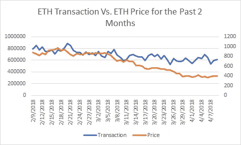

# 从统计学上讲，以太坊是否被低估？大概(更新)

> 原文：<https://medium.com/coinmonks/statistically-speaking-is-ethereum-undervalued-probably-update-fa7b01ff8b7b?source=collection_archive---------9----------------------->

有几种方法可以考察以太坊是否被低估。我研究了 ETH 交易和 ETH 价格之间的关系，并得出结论，ETH 交易是观察 ETH 价格整体趋势(而不是每日预测)的良好指标。研究表明 ETH 被低估了。

在 ETH 交易和 ETH 价格之间存在统计学上显著的(P>|t| = 0.000)正相关(R2=0.93)。ETH 交易每增加一次，ETH 价格就会增加 0.0009406。

然而，该研究无法在 ETH 交易变化和 ETH 价格变化之间找到统计意义上的显著性(P>|t| =0.216)或强相关性(R2=0.0016)。

因此，虽然 ETH 交易的每日变化可能是 ETH 价格每日变化的不良指标，但 ETH 交易可能是 ETH 价格总体趋势的良好指标。然而，最近的 ETH 交易和 ETH 价格之间的关系显示出较大的分歧。现在会变紧吗？可能吧。在这种情况下，假设交易保持稳定，我们可以预计 ETH 的正确价值约为每 ETH 600-700 美元。

有趣的是，ETH transaction 似乎与谷歌搜索以太坊这个词高度相关。因此，ETH 交易和 ETH 价格下跌的部分原因是因为公众对该项目和整个加密市场失去了兴趣。

*原载于 2018 年 4 月 11 日*[*【steemit.com】*](https://steemit.com/cryptocurrencies/@analyst101/examining-relationship-between-eth-transaction-and-eth-price-update)*。*

# ❤️喜欢，分享，留下你的评论

如果你喜欢这篇文章，不要忘记喜欢，与你的朋友和同事分享，并在下面留下你对这篇文章的评论。跟我来……