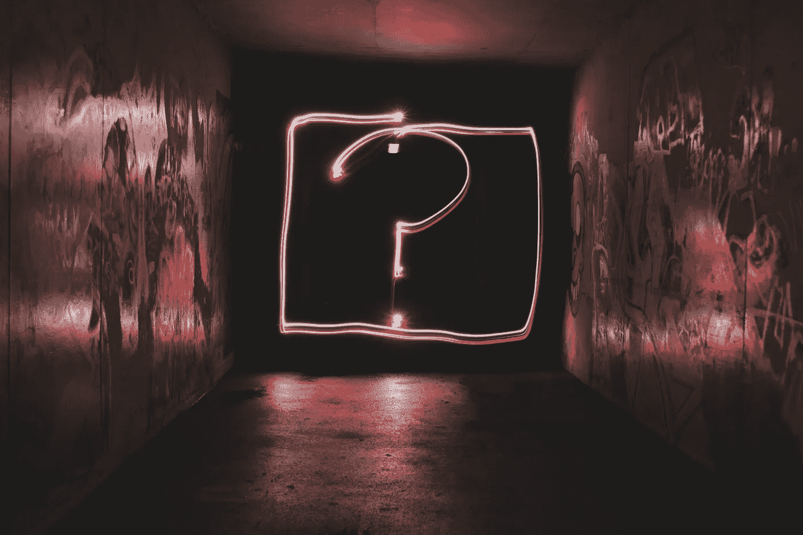
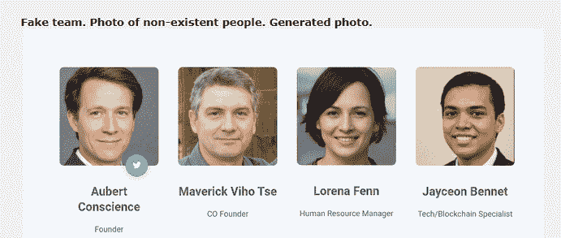
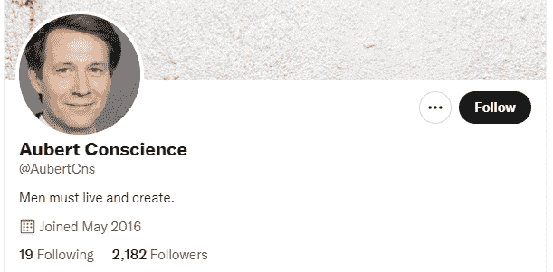
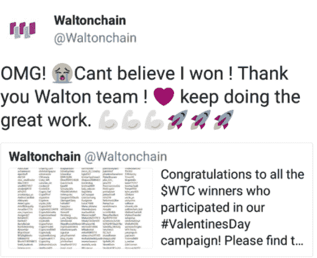
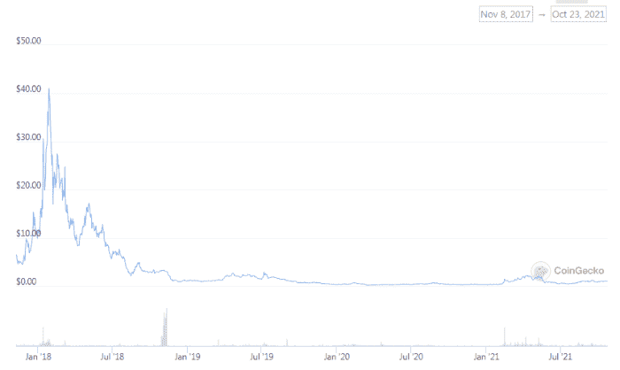

# 如何远离加密诈骗

> 原文：<https://medium.com/coinmonks/stay-safe-from-crypto-scams-cd84d23bfd27?source=collection_archive---------8----------------------->

我们对加密货币研究的一部分是研究白皮书。

对于 SmartBCH，它将与以太坊、币安智能链和所有其他支持令牌化的区块链一样。

会有骗局，在参与任何项目之前，尽职调查是最重要的。

除了白皮书可能被抄袭的事实之外，还可能有各种不一致的地方会引起怀疑。

我们不能匆忙做出决定，所以最好的行动是等待，并试图从项目中提取更多的信息，尤其是当有明显的危险信号时。

让我们来发现我们可能会发现的、应该被视为妨碍我们参与项目的主要危险信号。

# 危险信号:

## I)白皮书差异

它可能是剽窃、错别字、错误，也可能是包含各种不一致的仓促制作的白皮书。

白皮书应该不包含任何缺陷，描述项目的清晰意图，以及细节和清晰的愿景。

我们可能会发现一个想法呈现得很松散，但是，这并不意味着它已经是一个危险信号。与比特币的白皮书一样，它解释了一个总体概念，以及代币/硬币将提供的技术解决方案。

通常，诈骗项目不会花时间来创建一个完美的白皮书，但会很快编造一些东西，并从其他来源抄袭。一份可靠的白皮书应该是独一无二的、完美无缺的，并且包含对任何引用内容的参考。

## 二)团队

匿名团队不一定是危险信号。开发商可能有几个原因不想披露，而不仅仅是欺骗他们的投资者。不管怎样，crypto 的大多数人都是隐私拥护者。

经常发生的是项目将虚假成员作为他们团队的一部分。

拥有一个背景强大的团队有助于提升项目的形象，增加项目成功的机会。成员的背景、职业和知识将向公众展示，以供进一步考虑。

尽职调查是必要的，以验证每个成员都是真实的，而不仅仅是一个随机生成的假名图片。

这个假团队就是一个例子:

[*Source*](https://bitcointalk.org/?topic=5342965.0)

看起来非常真实，除了当放大时，我们发现这些是生成的脸，而不是真人。当然，有些名字也不太有说服力。

在调查时，找到一个 Twitter 个人资料也不意味着这是一个真实的项目。例如，自 2016 年以来，奥贝特良心这个名字就有了 Twitter 个人资料。虽然它在 2021 年 4 月期间被明显地改成了这个名字，并且在这个骗局被揭穿之后，这个账户变得过时了，骗子也抛弃了它。

Source: Twitter

很多年前加入 Twitter 的骗子手中有大量的 Twitter 账户。如果这个人有一张个人资料照片，但在其他地方没有其他照片，那么这就意味着麻烦了。

## iii)虚假空投/赠品

[*Source*](https://coincentral.com/busted-waltonchain-accused-orchestrating-fake-giveaway/)

这条推文看起来像是一条典型的参与赠品的人会发的“谢谢”消息。如果我没记错的话，这是 2018 年的。这条推文几分钟后被删除。

然而，当赠品是由沃尔顿·钱恩提供的，并且其中一个获胜者也是沃尔顿·钱恩时，会发生什么呢？

显然，有人从沃尔顿，搞乱了 Twitter 账户，并没有切换到另一个。沃尔顿·钱因在自己的赠品中作弊而被抓！

主要危险信号，因为这意味着这是一个假赠品。沃尔顿一直是币安的上市项目，但从那时起，它在很大程度上被忽视，在最近的牛市中从未起飞。

Coingecko — Waltonchain

当一个项目没有支付空投或奖金时，这也是一个缺点，可能是一个危险信号，这取决于团队如何处理沟通。

## iv)令牌模型

以太坊里有各种类似庞氏/传销的智能合约。有些人使用推荐，有些人声称保证回报，等等。这种仅仅是猜测的令牌组学模型总是一个骗局，虽然有时它可以工作一段时间(即十六进制)，但它长期工作而最终不会崩溃的可能性为 0%。

在智能合同中还有很多有待发现的地方，也有需要审计的原因。

2017 年的一个 ICO 骗局是牡蛎协议。这是一份 ERC20 智能合约，理应有固定供应，但事实并非如此。代码中的一行允许 dev 无限铸造新令牌，Oyster 的管理员 Elmaani(又名 Bruno Block)铸造了数百万个令牌，转储到 exchange 并退出 scammed ( [source](https://modernconsensus.com/cryptocurrencies/alt-coins/oyster-protocol-founder-arrested-for-exit-scam-tax-evasion/) )。

后来，有了 DeFi，主要的问题就暴露出来了，即使是经过审计的代码。不过，有一份经过审计的智能合同总比什么都没有好得多。它给人一个更好的印象，让人们阅读代码并找出它可能包含的问题。

## 五)社区

今天，机器人和骗子正在填满所有加密社区(telegram、Reddit、社交媒体)的空间。虽然不断谈论价格行为和“泵”是可疑的，如果这不是由管理员和项目成员执行的，那么它不是一个危险信号。

尽管如此，如果代币的唯一目的是价格升值，那就很明显了。这是决定不进行长期投资的一个因素，但要准备好停止跟踪这样的项目。

这是一个灰色地带，我不希望任何人认为价格讨论是禁区。讨论价格有很多方法，市场上到处都是研究和询问某些问题的投机者。

尽管如此，随着一些项目的波动性和极端收益，价格可能是一段时间内讨论的主要话题。我们需要的是投资时找到基本面。

同样重要的是，当网络通信渠道中存在管理员审查时。审查通常意味着论点可能不成立，让潜在投资者闭嘴对任何项目的长期目标都是不利的。

# 最后

我们已经在 SmartBCH 见证了一些以拉地毯为名的退出骗局。这种事情总是会发生，投资者有很多方法可以应对骗局。

在我看来，最好的方法是进行研究并检查所有的细节。白皮书可能是完美的，但这个项目仍然可以轻易地欺骗所有人。

被审计的令牌意味着它至少采取了证明可靠代码的方法。尽管甚至审计都是错误的，DeFi 令牌也被利用了。

一个很好的方法是多样化。我在投资前会花时间，有时我会尝试一些我不熟悉的领域，但我不会冒太大的风险。对我来说，可能是 300 美元，对其他人来说，这个数目很重要。

有时很容易发现骗局，有时你只是想知道发生了什么。当有一个危险信号时，最好开始进行更多的分析，或者完全放弃这个选项，不再浪费时间。

Follow me on: ● [ReadCash](https://read.cash/@Pantera) ● [NoiseCash](https://noise.cash/u/Pantera99) ● [Medium](/@panterabch) ● [Hive](https://hive.blog/@pantera1) ● [Steemit](https://steemit.com/@pantera1) ●[Vocal](https://vocal.media/authors/pantera) ● [Minds](https://www.minds.com/pantera99/) ● [Twitter](https://twitter.com/Panterabch) ● [LinkedIn](https://www.linkedin.com/in/panterabch/) ● [email](https://read.cash/@Pantera/localcryptos-p2p-exchange-is-now-offering-bitcoin-cash-trading-06637230#bad-link)

***支持内容创作者。***

***如果你喜欢这个故事就订阅吧！***

*原发布于*[*https://read . cash*](https://read.cash/@Pantera/stay-safe-from-scams-with-due-diligence-42c1ea96)*。*

*   [用信用卡购买密码的 10 个最佳地点](https://blog.coincodecap.com/buy-crypto-with-credit-card)
*   [OKEx 评论](/coinmonks/okex-review-6b369304110f) | [Kucoin 交易机器人](/coinmonks/kucoin-trading-bot-automate-your-trades-8cf0ca2138e0) | [期货交易机器人](/coinmonks/futures-trading-bots-5a282ccee3f5)
*   [AscendEx Staking](https://blog.coincodecap.com/ascendex-staking)|[Bot Ocean Review](https://blog.coincodecap.com/bot-ocean-review)|[最佳比特币钱包](https://blog.coincodecap.com/bitcoin-wallets-india)
*   [霍比审核](https://blog.coincodecap.com/huobi-review) | [OKEx 保证金交易](https://blog.coincodecap.com/okex-margin-trading) | [期货交易](https://blog.coincodecap.com/futures-trading)
*   [Godex.io 审核](/coinmonks/godex-io-review-7366086519fb) | [邀请审核](/coinmonks/invity-review-70f3030c0502) | [BitForex 审核](https://blog.coincodecap.com/bitforex-review)
*   [Crypto.com 费用](/coinmonks/binance-fees-8588ec17965) | [僵尸加密审查](/coinmonks/botcrypto-review-2021-build-your-own-trading-bot-coincodecap-6b8332d736c7) | [替代品](https://blog.coincodecap.com/crypto-com-alternatives)
*   [有哪些交易信号？](https://blog.coincodecap.com/trading-signal) | [Bitstamp vs 比特币基地](https://blog.coincodecap.com/bitstamp-coinbase) | [买索拉纳](https://blog.coincodecap.com/buy-solana)
*   [ProfitFarmers 点评](https://blog.coincodecap.com/profitfarmers-review) | [如何使用 Cornix 交易机器人](https://blog.coincodecap.com/cornix-trading-bot)
*   [MXC 交易所评论](/coinmonks/mxc-exchange-review-3af0ec1cba8c) | [Pionex vs 币安](https://blog.coincodecap.com/pionex-vs-binance) | [Pionex 套利机器人](https://blog.coincodecap.com/pionex-arbitrage-bot)
*   [我的密码交易经验](/coinmonks/my-experience-with-crypto-copy-trading-d6feb2ce3ac5) | [《比特币基地评论》](/coinmonks/coinbase-review-6ef4e0f56064)
*   [CoinFLEX 评论](https://blog.coincodecap.com/coinflex-review) | [AEX 交易所评论](https://blog.coincodecap.com/aex-exchange-review) | [UPbit 评论](https://blog.coincodecap.com/upbit-review)
*   [AscendEx 保证金交易](https://blog.coincodecap.com/ascendex-margin-trading) | [Bitfinex 赌注](https://blog.coincodecap.com/bitfinex-staking) | [bitFlyer 点评](https://blog.coincodecap.com/bitflyer-review)
*   [麻雀交换评论](https://blog.coincodecap.com/sparrow-exchange-review) | [纳什交换评论](https://blog.coincodecap.com/nash-exchange-review)
*   [拥护卡审核](https://blog.coincodecap.com/uphold-card-review) | [信任钱包 vs MetaMask](https://blog.coincodecap.com/trust-wallet-vs-metamask)
*   [Exness 评测](https://blog.coincodecap.com/exness-review)|[moon xbt Vs bit get Vs Bingbon](https://blog.coincodecap.com/bingbon-vs-bitget-vs-moonxbt)
*   [如何开始通过加密贷款赚取被动收入](https://blog.coincodecap.com/passive-income-crypto-lending)
*   [加密货币储蓄账户](/coinmonks/cryptocurrency-savings-accounts-be3bc0feffbf) | [加密交易机器人](https://blog.coincodecap.com/best-crypto-trading-bots)
*   [BigONE 交易所评论](/coinmonks/bigone-exchange-review-64705d85a1d4) | [CEX。IO 审查](https://blog.coincodecap.com/cex-io-review) | [Swapzone 审查](/coinmonks/swapzone-review-crypto-exchange-data-aggregator-e0ad78e55ed7)