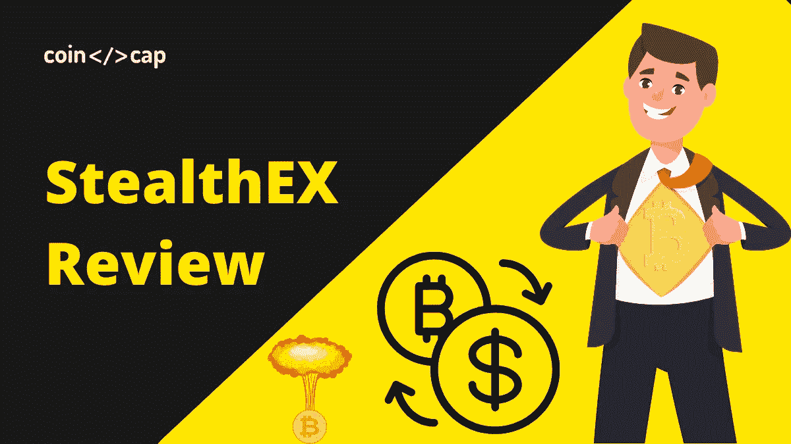
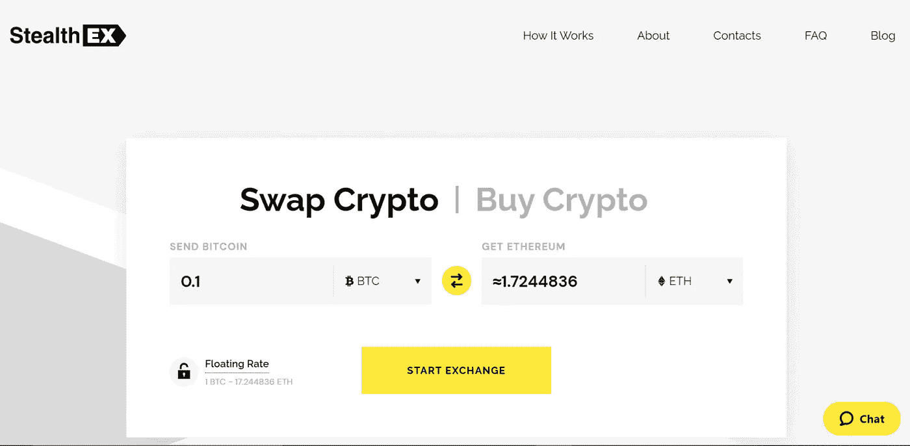
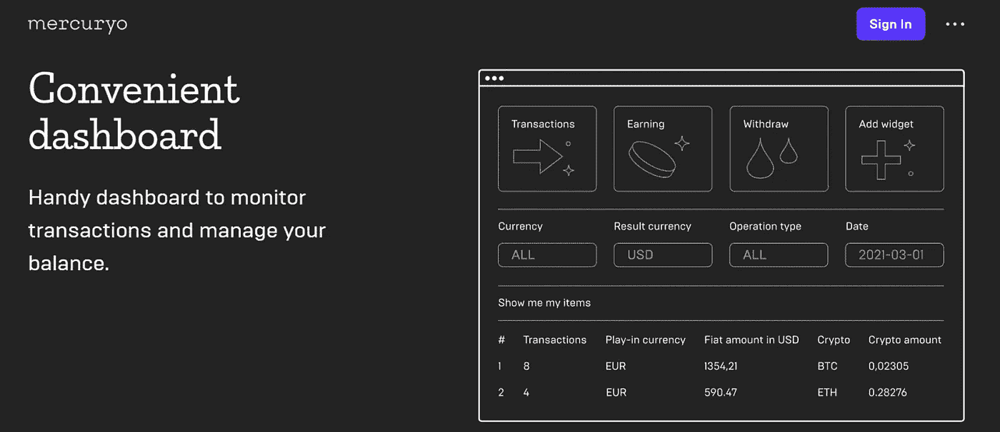
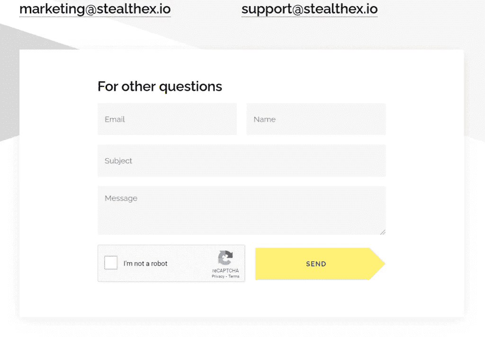

# StealthEX 评论 2021:是骗局吗？【必读】

> 原文：<https://medium.com/coinmonks/stealthex-review-396c67309988?source=collection_archive---------5----------------------->

[**StealthEX**](https://blog.coincodecap.com/go/stealthex) 是一个用户友好的平台，自 2018 年 10 月开始在[加密货币交易所](https://blog.coincodecap.com/go/crypto-exchange)市场运营。因此，在这个 [StealthEX](https://blog.coincodecap.com/go/stealthex) 评论中，我们将看看这个平台的所有特性，以及你如何使用你的信用卡购买加密资产。

# 总结(TL；博士)

*   [StealthEX](https://blog.coincodecap.com/go/stealthex) 是一个用户友好的[加密交易所](https://blog.coincodecap.com/crypto-exchange)，自 2018 年 10 月开始运营。
*   该平台提供各种功能，如即时交易，没有限制，浮动和固定汇率等。
*   通过选择一个交易对并输入接收者的地址，你可以很容易地开始使用 [StealthEX](https://blog.coincodecap.com/go/stealthex) 。
*   该平台还为您提供了使用信用卡购买加密资产的选项。

# StealthEX 评论:功能

StealthEX 拥有广泛的用户基础，并在全球范围内提供服务。此外，成千上万的用户将其列入[顶级加密交易所](https://blog.coincodecap.com/crypto-exchange)，原因如下:

*   **加密货币的大量选择:**由于 [StealthEX](https://blog.coincodecap.com/go/stealthex) 提供超过 350 种资产，这个平台是“哪个[加密交易所](https://blog.coincodecap.com/go/crypto-exchange)拥有最多硬币”的答案。新的令牌不断添加到平台中。此外，StealthEX 定期发布关于不同加密项目的文章，以帮助投资者找到最好的硬币。
*   **即时交易所:** StealthEX 是交易快捷的顶级[加密货币交易所](https://blog.coincodecap.com/go/crypto-exchange)之一。用户不需要提供太多信息或等待几个小时来获得他们的令牌。
*   **非托管平台:**用户是私钥和数字资产的唯一所有者。没有中介机构或中央权力机构来控制资金。这最大限度地降低了钱包黑客和加密货币盗窃的风险。
*   **无限制**:用户可以根据需要兑换任意数量的硬币。
*   **浮动和固定汇率**:浮动汇率是默认设置的，随市场情况而变化。但是，如果用户希望降低可能的风险并进行精确的加密到加密交换，他们可以将其更改为固定的。
*   一个用户友好的账户:加密投资者可以在那里看到他们最近交易的所有信息。
*   **合作关系** : StealthEX 提供了购买 crypto 和 partners with [Swapzone](https://blog.coincodecap.com/go/swapzone) 、 [Swapspace](https://blog.coincodecap.com/go/swapspace) 以及其他热门项目的最佳方式。

# 如何使用 StealthEX Exchange？

如果有人想购买 crypto 并想知道如何使用[加密货币交易所](https://blog.coincodecap.com/go/crypto-exchange)，他们应该遵循以下指南:

*   在 [StealthEX](https://blog.coincodecap.com/go/stealthex) 选择交换对和总和。例如，BTC 联邦理工学院。
*   然后，按下“开始交换”按钮。
*   输入硬币将被转移到的收件人地址。
*   存款。
*   接收交换的代币。

这个过程通常需要 5 到 30 分钟。精确的时间取决于交换金额、特定令牌和网络拥塞。

# 如何用信用卡购买 Crypto？

[**StealthEX**](https://blog.coincodecap.com/go/stealthex) 让每个人都可以用信用卡购买密码，没有隐藏费用。用户可以用欧元、卢布、美元和英镑购买资产。此外，更多的法定货币将很快加入。

菲亚特交易所功能是购买最常用加密货币的绝佳方式，如比特币(BTC)、以太坊(ETH)、创(TRX)、阿尔格兰德(ALGO)、基本注意力令牌(BAT)、比特币现金(BCH)等等。

如何用信用卡使用[加密货币兑换](https://blog.coincodecap.com/go/crypto-exchange)？就像有人把一个密码换成另一个一样简单。这一过程在 Mercuryo 的帮助下完成，只需几分钟。

# 用信用卡购买 Crypto 的步骤？

您可以按照以下步骤在[stealth x](https://blog.coincodecap.com/go/stealthex)使用信用卡购买加密资产:

1.  转而购买密码。
2.  从左侧下拉列表中选择合适的法定货币，并从正确的列表中选择加密货币。
3.  输入他们想要兑换的金额，并查看他们的钱包将收到多少代币。
4.  按下开始交换按钮。
5.  提供收件人的地址，确认条款和条件以及隐私政策文档。
6.  转到 [Mercuryo](https://blog.coincodecap.com/go/mercuryo) 站台，然后按照那里的步骤走。

# StealthEX 评论:客户支持

如果用户在购买加密货币时遇到问题，或者希望立即解决他们的问题，客户支持随时准备帮助他们。可以通过在线聊天或他们的电子邮件 support@stealthex.io 联系它。客户支持全天候工作，即使在晚上也能立即回答问题。

但是在联系支持团队之前，最好访问 FAQ 页面。关于交换时间、费用、限制的答案都在那里。

# StealthEX Review:摘要

毕竟， [**StealthEX**](https://blog.coincodecap.com/go/stealthex) 对于想好了[密码交换](https://blog.coincodecap.com/go/crypto-exchange)的用户来说是一个方便的平台。这个平台允许每个人使用法定货币和其他加密货币购买尽可能多的硬币。此外，由于它的非托管，所有的交易都是安全的，这个过程本身是快速和容易理解的，即使是业余加密投资者。

*   [加密交易机器人](/coinmonks/crypto-trading-bot-c2ffce8acb2a)
*   [BlockFi 信用卡回顾 2021 |你拿到最好的卡了吗？](https://blog.coincodecap.com/blockfi-credit-card)
*   [如何选购以太坊？【2021 年版】](https://blog.coincodecap.com/how-to-buy-ethereum)
*   币安卡评论:这是最好的加密卡吗？【2021】
*   [6 大比特币信用卡| 2021 年最佳加密借记卡](https://blog.coincodecap.com/best-bitcoin-card)
*   2021 年比特币基地信用卡评论:最佳加密借记卡

**披露—关联链接包括在内**

*原载于 2021 年 6 月 25 日*[*【https://blog.coincodecap.com】*](https://blog.coincodecap.com/stealthex-review)*。*