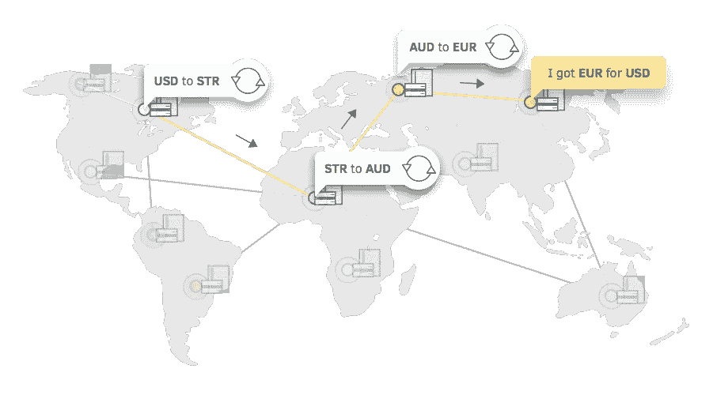

# 恒星资产创造和交易

> 原文：<https://medium.com/coinmonks/stellar-asset-creation-and-trading-3118dbf0d75a?source=collection_archive---------0----------------------->

## 在这篇博文中，我将解释什么是恒星资产，以及交易过程是如何在后台发生的。

如果你是 stellar 的新手，或者想知道 stellar 的架构和幕后是如何运作的，请查看这个博客。

## **资产**

恒星分布式网络可用于跟踪、持有和转移任何类型的**资产**:美元、欧元、比特币、股票、黄金和其他有价证券。网络上的任何资产都可以与任何其他资产进行交易和交换。

> 资产是真实世界对象的表示。我们可以用 10 个苹果资产代表 10 个苹果。

We can convert all these into assets

stellar 中的每项资产都有一个资产代码(由字母数字 4 或字母数字 12 组成)和一个发行人账户。任何账户都可以发行恒星资产。发行资产的账户被称为锚。锚可以由个人、小企业、当地社区、非营利组织、组织等经营。任何类型的金融机构——银行、支付处理商——都可以成为锚。锚可以通过所需的授权来控制资产，并且每个锚可以产生无限的资产以及无限数量的资产。

## **信用额度**

一旦我们想购买一项资产，我们首先需要信任这项资产。信任的部分不受恒星控制。例如，如果 bob 拥有 100 项苹果资产，而 Alice 想要购买 20 项。当爱丽丝把现实世界中 20 个苹果还给鲍勃时，他会把 20 个苹果给爱丽丝。在 stellar 中我们可以相信 bob 的账户里还剩下多少苹果资产，但不能盲目相信 bob 在现实世界里会有苹果。(有时他甚至没有一棵苹果树:)但只有苹果资产)。因此，为了确保 Alice 相信 bob 在真实世界中会有苹果，我们需要创建信任线。

trust-line 将确认您信任该资产，然后只有您可以从 bob 那里购买该资产。此外，资产的购买和交易并不总是与主播直接相关。有一次，爱丽丝购买了 20 项苹果资产，她可以向约翰出售 10 项苹果资产。因此，听约翰不从锚购买，但在购买之前，他需要信任鲍勃，并需要与鲍勃的苹果资产建立信任线。一个人可以使用 XLM 出售/购买资产，或者可以用他持有的另一项资产进行交易。

## **资产交易**

stellar 中的资产交易是更安全的过程，因为它将交易和交易请求存储在分类帐本身中。除了支持资产的发行和移动，Stellar 网络还充当人们添加到网络中的任何类型资产的分散式**分布式交换(DEX)** 。它的分类账既存储用户账户的余额，也存储用户账户买卖资产的报价。

如前所述，出售/购买资产有两种方式。一种是用另一个账户直接买卖，或者创建一个出售/购买和交易资产的要约。任何持有资产的账户都可以创建卖出要约，任何已经信任购买资产发行者的账户都可以创建买入要约。一旦创建了报价，它将被存储在 stellar 的订单簿中。当创建报价时，用户可以提出他需要出售或购买什么定量。举个例子，卖 1 个苹果，买 2 个橘子(1:2)。在以下情况下，要约将无效或取消:要约创建的帐户取消要约，帐户不再持有足够的资产，要约匹配并已交易，或要约匹配并被路径支付接受。

Exchange meat for fish

一个**订单簿**是恒星网络上未完成订单的记录。该记录位于任意两个资产之间。例如，爱丽丝只拿着牛奶，想买苹果。因此，当她创建一个出售牛奶和购买苹果的报价时，将检查那里是否已经有任何订单簿，如果没有，它将创建一个新的簿并在那里记录该报价。

每种资产组合的订单都有两面。在我们的例子中，一方持有所有出售苹果和购买牛奶的出价，另一方持有出售牛奶和购买苹果的出价。订单簿条目将保存每个帐户想要出售或购买的配给量。

当一个新的报价创建时，stellar 将自动检查订单簿，并与那里的最佳报价相匹配。例如，如果我正在创建一个以 2:1 的比例出售苹果和购买牛奶的报价，并且在订单簿中已经有 2 个客户喜欢出售牛奶和购买苹果，但是一个客户的比例是 1 牛奶换 3 个苹果(1:3)，另一个比例是(1:1)。因此，在这种情况下，恒星将检查和匹配我的报价与第二个帐户持有 1:1 的报价。Stellar 总是匹配相同比例或低于该比例的报价。它不会匹配大于用户创建的出价。如果报价不匹配，stellar 会将该报价作为一个条目存储在订单簿中，以备将来交易。

## **交叉资产支付**

任何帐户都可以使用资产创建付款。例如，爱丽丝拿着苹果想买蛋糕。但是卖蛋糕的人想要牛奶，不想要苹果。在这种情况下，Alice 将创建一个交叉支付，其中 stellar 将找到并提供订单簿，首先将苹果转换为牛奶，然后将牛奶转换为蛋糕。苹果->牛奶->蛋糕。在《听见爱丽丝》中，不需要相信牛奶，只需要相信蛋糕。而其他卖蛋糕的账号没必要信任苹果。在创建交叉支付时，用户可以提到它希望使用哪个账户来转换资产，或者将这部分留给 stellar。stellar 将自动匹配最佳配给量，将苹果转换为牛奶，牛奶转换为蛋糕，然后爱丽丝将收到蛋糕，另一方将获得牛奶。可以在两个资产之间放置最多 6 跳。(苹果->牛奶->奶酪->橘子->巧克力->芒果->蛋糕)。下图显示了如何使用交叉支付将美元兑换成欧元。

## **结论**

恒星资产更安全，因为它们直接存储在分类账中。此外，它还将报价存储在分类帐中。这一过程在进行跨境货币转账或交易时会很有用。因为我们可以在恒星网络中找到最佳转化率。并获得最佳匹配。此外，它还可以用来验证两个帐户之间的信任，以离线传输东西。并且也可以使用该信任线来验证用户授权。

我希望这篇文章能帮助那些想了解恒星资产和交易过程的人。期待您的反馈和评论:)。

 [## 一流开发指南|一流开发人员

### 这些指南旨在帮助您了解更多有关将 Stellar 集成到您的产品中的技术方面的信息

www.stellar.org](https://www.stellar.org/developers/guides/)  [## 解释者

### 分散式网络由相互独立运行的对等体组成。传递信息的力量…

www.stellar.org](https://www.stellar.org/how-it-works/stellar-basics/explainers/) 

> [在您的收件箱中直接获得最佳软件交易](https://coincodecap.com?utm_source=coinmonks)

