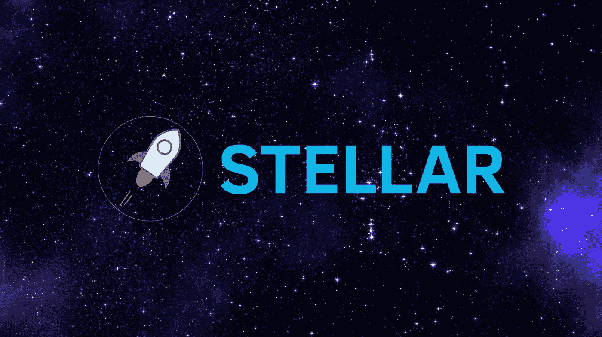
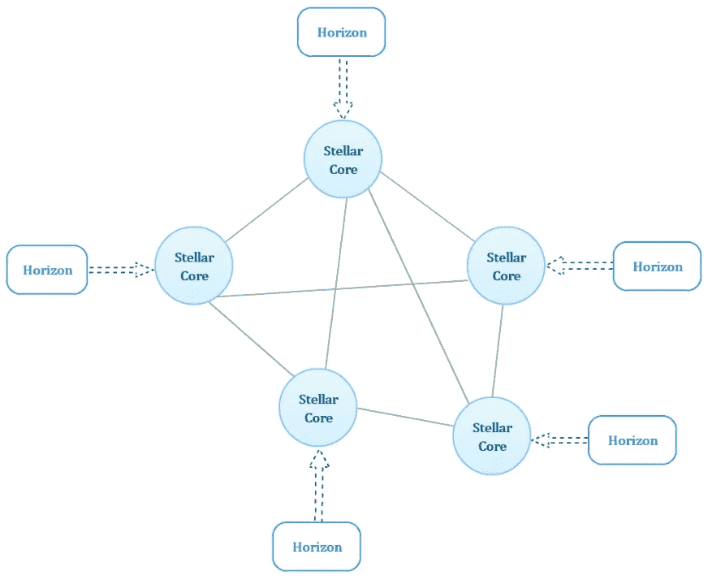
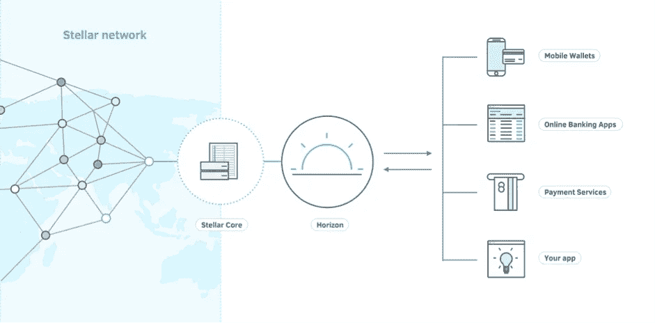
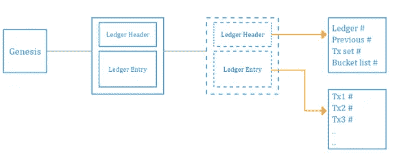
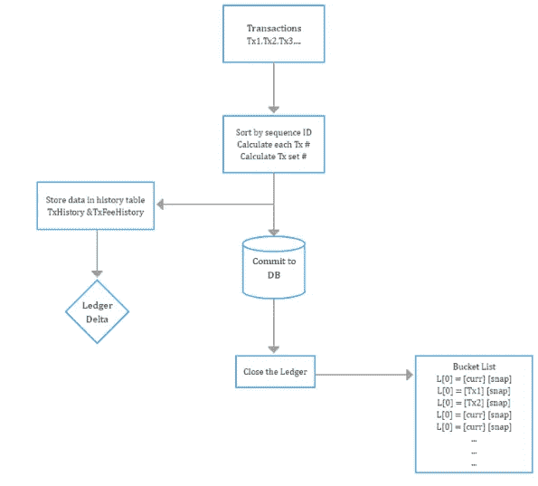
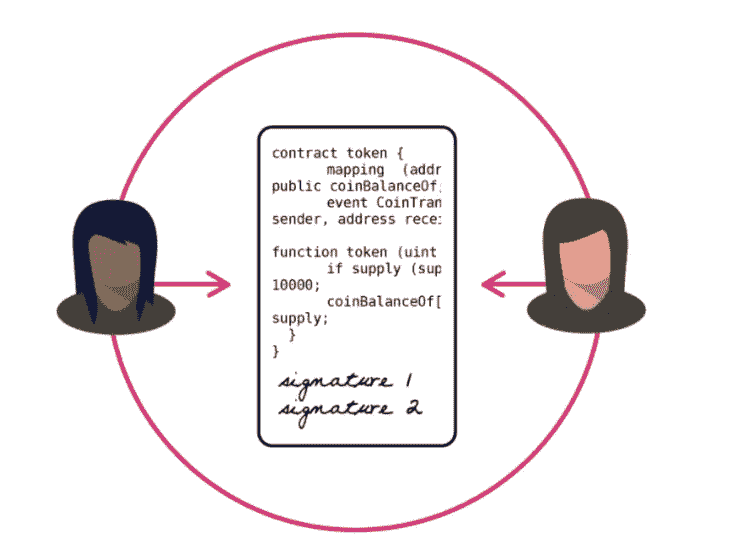

# 幕后明星

> 原文：<https://medium.com/coinmonks/stellar-behind-the-scenes-5ab66025892d?source=collection_archive---------0----------------------->

[Stellar](https://www.stellar.org/) 是使用区块链使货币交易更加快速和安全的平台之一。在这里，你可以创建移动钱包、银行工具、自动支付的智能设备，以及任何你能想到的与支付相关的东西！stellar 之所以比其他链独特，是因为它建立在包含 SQL DB + Blockchain 的混合架构之上。与其他连锁店相比，stellar 的主要优势是交易费用非常低(相当于 0.00001 XLM)。一个人可以用 1 美元完成大约 39 万笔交易。与其他链相比，吞吐量也很高。

> 流明，或 XLM，是恒星的数字货币单位。

> **注:**——在恒星没有采矿费(气)。这意味着没有矿工的工作，你不能通过采矿赚取硬币。恒星没有基于矿业的货币。在网络诞生之初，[创造了 1000 亿颗恒星](https://www.stellar.org/about/mandate/#Stellar_distribution)。唯一的另一个恒星形成机制是[膨胀](https://www.stellar.org/about/mandate/#Stellar_creation)。考虑到经济增长和失去的恒星，有一个固定的 1%的新恒星年生成率。这些新的星盘将每周生成，并通过直接投票的方式进行分配。

**恒星架构**

恒星由两个主要部分组成。一个是恒星核心，另一个是恒星视界。stellar 网络中的所有节点都需要这两个组件才能与网络通信。验证节点只需要恒星核心。恒星网络是恒星核心的搭配，每个核心由不同的人或组织维护。网络的分散性所维护的安全性和可靠性。

Stellar Network Architecture

**恒星视界**

stellar 中的所有事务都将通过 horizon 发生，horizon 是一个 RESTful HTTP API 服务器。它允许用户提交交易、检查账户和订阅事件。简单地说，任何人都可以使用他们的网络浏览器进行交流，因为它只是 HTTP。甚至使交流和开发变得更容易，stellar 包含了所有著名编程语言的各种 SDK，正如前面提到的，stellar 是开源的。

Stellar Architecture

*Stellar 目前有 SDK 的有*[***javascipt***](https://github.com/stellar/js-stellar-sdk)*，*[***Java***](https://github.com/stellar/java-stellar-sdk)***和***[***Go***](https://github.com/stellar/go/tree/master/clients/horizon)*还有基于社区的 SDK 的有*[***Python***](https://github.com/StellarCN/py-stellar-base)

**恒星核心**

恒星核心是恒星网络的骨干。每台 horizon 服务器都将连接到 stellar core。Stellar core 是进行大量工作和处理的部分，以验证和同意其他 stellar core 接受每个事务的状态。整个验证过程将通过[恒星共识协议](https://www.stellar.org/developers/guides/concepts/scp.html) (SCP)进行。Stellar 没有使用工作证明或利益证明机制来验证交易，而是使用联邦拜占庭协议(FBA)。

*更多详细说明关于* [***恒星共识协议白皮书***](https://www.stellar.org/papers/stellar-consensus-protocol.pdf) *。*

如果我们查看 stellar core，它包含当前分类帐、SQL DB 和有关历史数据的详细信息。当前分类帐将包含当前和最近的交易，数据库将保存当前交易以及交易后发生的修改或影响。例如，如果 stellar core 由于崩溃或首次加入而与对等机不同步，它将从历史档案中获取详细信息，以维护相同版本的链。我们将在下一节讨论更多关于数据库，分类帐和历史档案。

最后，stellar core 是 stellar 网络中最重要的组件，它包含记录交易的分类帐和数据库，还包含验证和批准交易的 SCP。

**恒星店如何交易(幕后)**

本节将更深入地介绍 stellar 事务流以及参与存储事务条目的每个组件。下面是存储事务条目的主要组件。

***账本:*——**账本代表恒星宇宙在给定时间点的状态。分类帐将包含最近发生的所有当前交易的详细信息。历史上第一个分类账叫做创世纪分类账(我们可以把一个分类账和一个区块联系起来)。大约每 5s 会关闭一个分类账。然后分类账经理会马上开一个新的分类账。每个关闭的分类帐将包含关闭的时间戳。每个分类账都有存储交易的哈希值和唯一的序列号。每个分类帐将通过引用散列*链接到前一个分类帐。*

***分类帐标题:—*** 每个分类帐都有分类帐标题，其中包含事务集#、时段列表#和前一个分类帐#、关闭时间和事务集结果#。

下图将清楚地展示分类帐以及分类帐标题中存储的重要信息。(发送->交易)

Stellar Blockchain

***数据库(DB): —*** 如前所述，stellar 拥有混合存储架构，数据将存储在 DB 和分类帐中。Stellar core 有一个 SQL DB，其中包含运行 stellar network 所需的所有必要的表。每个交易数据，交易历史，交易费用和所有的修改将被添加到数据库中。

*举一个有账户创建发生的例子，它会记录到账户表中。*

***桶&桶列表:-*** 分类帐条目的大集合，冗余地存储在称为桶列表的二级结构中，以便在每次对其进行更改后，高效地计算整个集合的加密散列。并且当对等体与当前分类帐状态不同步并且需要“赶上”时，高效地将最小“增量”的改变传输到集合。

桶列表包含固定数量级别，每个级别包含 2 个桶。该桶的大小将是前一级桶的两倍。交易记录将存储在存储桶中，存储桶级别的累积#将创建存储桶列表#。

每一层分为两半，一个是 curr，另一个是 snap。较新的分类帐将以 curr 格式存储，较旧的分类帐将作为快照存储在快照存储桶中。一旦 curr 的大小增加超过 snap 的 1/2，则 curr 的快照将存储在 snap 中，curr 将被清除，一旦 snap 增加，它将移动到下一级 snap。

*更详细的关于遗愿清单的结构可以找到* [*听到*](https://github.com/stellar/stellar-core/blob/master/src/bucket/BucketList.h) *。*

***历史存档:——***历史将由分类帐管理器的动作创建。一旦分类帐关闭，SQL 中的历史记录表将被更新。此外，一旦桶列表包含更多的旧分类帐，那么它会将整个事情作为一个快照，并将其存储在历史档案中。历史模块负责与“历史档案”接口，历史档案被粗略地定义为“存储和检索平面文件的地方”。记录一般是用 gzip ( [RFC 1952](https://tools.ietf.org/html/rfc1952) )压缩的 XDR 文件( [RFC 4506](https://tools.ietf.org/html/rfc4506) )。

**交易流程**

Stellar transaction entry flow

如上图所示，一旦交易被直接验证，它将被插入到打开的分类帐中。如果交易发生在分类帐关闭过程中，它将被存储在队列中，并被插入到下一个打开的分类帐中。一旦分类帐开始关闭流程，所有交易将根据顺序进行排序，并开始计算每个交易#。最后，每个计算的事务#将被合并以计算最终的事务集#。

一旦完成，所有的交易过程将被存储在数据库中，分类帐增量将通过修改或更改由于上一个分类帐发生的表来创建。然后，分类账将被关闭，交易散列将被发送到存储桶列表。

一旦到达存储桶列表，它将根据事务的年龄存储在不同级别的存储桶中。更新的修改条目将存储在低级桶中，而旧条目将存储在高级桶中。总存储桶列表#将被计算并作为存储桶列表#存储在分类帐标题中。

**恒星智能合约**

恒星没有类似以太坊的[图灵机](https://en.wikipedia.org/wiki/Turing_machine)。所以，它不能计算我们插入的任何东西。但是仍然可以执行由交易序列号和受信任方控制的智能合约。两个人可以写一份合同，根据某种条件转让某些东西，并通过使用签名授权在他们之间执行。更先进的 stellar 引入了时间限制交易，一旦我们创建了合同，在指定日期之前，没有人可以执行该交易。

Smart Contract

但是恒星契约的主要缺点是它不像以太坊那样存储在链中。它只存储定义事务，而 if then else 规则将存储在外部。由于交易序列号的特征，它看起来是安全的。除了金钱交易，IOC 和资产转让合同 stellar 在两个不可信的人之间创建合同的效率和灵活性都不高。它不在区块链内部存储和执行代码，所以也不适合 Dapp。

**结论**

作为一个结论，恒星实现了它的原因是通过提供较低的交易费用高吞吐量。Stellar 更专注于小额支付和 ICO，这就是为什么他们不专注于集成图灵机，因为这将影响他们的吞吐量。

谁想使用区块链启动 ICO 或小额支付系统，应该检查恒星。它永远不会让你失望。Stellar 缓慢而安静地开始了这一过程，在 IBM 开始使用 stellar 连接银行进行货币转账后，这一过程深入到了区块链/加密社区。

> [在您的收件箱中直接获得最佳软件交易](https://coincodecap.com/?utm_source=coinmonks)

***注:-*** *本节不讨论 Stellar Consensus 协议如何工作以验证交易。希望分享一个单独的帖子。*

期待您的反馈和评论:)。如果有任何需要修改的地方，请在评论中提出。为了写这篇文章，我研究并收集了来自 stellar.org、 [github stellar core repo](https://github.com/stellar/stellar-core) 和 stellar slack 的信息。我写这个的原因是为了支持 stellar 社区和曾经喜欢学习 stellar 后端流程的人。我希望这篇文章能帮助人们更容易地理解 stellar 的幕后，而不是深入了解更具技术性的整个 github stellar core repo。

*参考*

 [## Stellar 网络概述| Stellar 开发者

### 使用恒星网络，您可以建立移动钱包，银行工具，智能设备支付自己，只是…

www.stellar.org](https://www.stellar.org/developers/guides/get-started/index.html)  [## 恒星/恒星核心

### 恒星核心是恒星网络的主干。它维护分类帐的本地副本，通信并保持…

github.com](https://github.com/stellar/stellar-core/tree/master/docs) 

> [在您的收件箱中直接获得最佳软件交易](https://coincodecap.com?utm_source=coinmonks)

