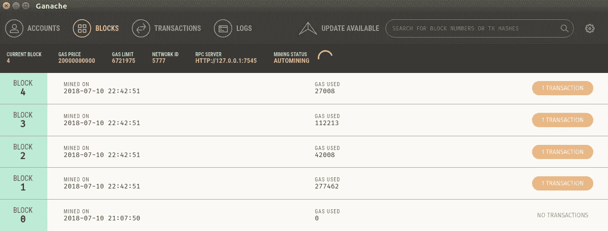

# 使用以太坊、ReactJS 和 IPFS 创建 DAPP 的逐步方法—第 1 部分

> 原文：<https://medium.com/coinmonks/step-by-step-approach-to-create-dapp-using-ethereum-reactjs-ipfs-part-1-42ea4cf69488?source=collection_archive---------1----------------------->

Source: Google

**阅读更多来自——**[**【https://blockchaindreamlab.com/】**](https://blockchaindreamlab.com/)**——**

在本文中，我们将看到使用以太坊公共区块链(使用 Solidity，ReactJS & IPFS)创建去中心化应用程序的一步一步的方法

要设置我们的应用程序，您需要满足以下系统要求。我会在有足够存储空间的 Ubuntu 16.04 中演示这一点。

> [发现并回顾最佳区块链软件](https://coincodecap.com)

# 创建第一个 DAPP 的步骤

第一步:我们需要安装 MetaMask 并在 Chrome 中启用扩展

第二步:需要安装“Ganache”

步骤 3:需要使用 NPM 安装“松露框架”

步骤 4:创建 reactJS 应用程序

步骤 5:使用 Solidity 语言创建我们的第一个智能合同

步骤 6:在 Ganache 网络中使用 Truffle 部署我们的合同

步骤 7:将 SmartContract 逻辑集成到 ReactJS 程序中，这样您就可以使用前端 GUI 了

步骤 8:初始化 IPFS 守护进程，并将逻辑集成到 ReactJS 中

步骤 9:运行 ReactJS 应用程序

步骤 10:确保元掩码和 Ganache 同步

步骤 11:通过 reactJS 应用程序触发“写”交易，并支付燃气费，以通过 MetaMask 提交交易

最后，检查结果&确保所有都连接成功。

你们准备好出发了吗？..让我们开始吧…

**步骤 1:让我们安装元掩码&启用扩展。**进入 Google，找到 metamask 扩展，点击安装&启用扩展。一旦你完成了，你应该能够在你的浏览器中看到“狐狸”符号

Source: Google(Search Metamask Extension from ChromWeb Store)

Metamask(Fox Symbol enabled in browswer)

请确保，你有强大的密码设置和存储在某个地方，没有它你不能恢复你的旧帐户。所以，保持它的坚固和安全储存。通过这个元掩码，您可以与 MainNet(用于生产)和一些测试网络进行交互

List of Accounts in metaMask

注意:第一次，您将无法看到此帐户(http://127.0.0.1:7545 —这是来自 Ganache localhost network 的帐户)。因此，如果你看不到这一点，此时忽略它是安全的。我们以后会处理的。否则，您可以继续进行第 2 步！

## 步骤 2:需要安装 Ganache

要安装 Ganache，Truffle 你必须需要 **npm(节点包管理器)。**所以假设你拿着它准备好了？，否则请按照本教程先安装 NPM-[点击此链接](https://nodesource.com/blog/installing-node-js-tutorial-ubuntu/)

好了，现在从你的终端发出这个命令来安装 Ganache，这是命令行模式。如果你正在寻找图形模式，那么选择其他选项— [图形版本](https://truffleframework.com/ganache)

> npm install -g ganache-cli

图形版——选择合适的 OS 版本，对于 Ubuntu，你会看到这个下载的镜像， **ganache-1.2.1-x86_64。AppImage** 下载完成后，双击启动图形模式。

Ganache : Graphical mode

我们将在本文中使用图形模式…

注意:它有如此多的选项，如“当前区块”，“气价”，“气限”，“网络 ID”，“RPC 服务器”，开采状态。

**当前区块:**显示有多少区块被开采。在新执行期间(无论何时打开 Ganache)，当前块将为 0。部署智能合约后，该值会相应地发生变化。

**气价/气限:**这是模拟值&虚拟值。所以它允许我们使用这个气体值来执行我们的开发工作。基本上，天然气是我们在区块链提交交易的非常重要的因素。仅基于此天然气价值，您将能够提交您的交易，交易将被挖掘。

**网络 ID :** 5777(这可以在“设置”(齿轮图标)中更改)，仅通过此 ID，我们将把我们的 reactJS 应用程序与 Ganache 连接起来。

**RPC 服务器:**[http://127 . 0 . 0 . 1:7545](http://127.0.0.1:7545)

它将有 10 个带有 100 ETH(ETH-虚拟值:o)的帐户。这个值是连接到我们的元掩码的关键。只有这个值，你将能够连接到 Ganache(10 个帐户)。

**助记符:**这是唯一的，当你卸载 Ganache &重新安装，那么你会看到不同的助记符值..该值对于连接元掩码很重要。Metamask 是一座桥梁，将我们的帐户从 Ganache 连接到 Blockchain，通过它您将提交您的交易(花汽油费/eth)

**区块:**包含已开采区块的列表

**交易:**已提交交易列表

好了，这些是 Ganache 要记住的关键因素！，让我们进入第 3 步！！

## **第三步:安装松露网**

**Truffle** 是**以太坊**的开发环境、测试框架和资产管道，旨在让**以太坊**开发者的生活更轻松。与**松露**，你得到:内置的智能合同编译，链接，部署和二进制管理，了解更多- > [点击这里](https://github.com/trufflesuite/truffle)

要安装 truffle，您需要 npm，从您的终端发出以下命令，它将全局安装 truffle。

> npm 安装-g 块菌

## 步骤 4:创建 ReacJS 应用程序

这里，我们将使用 truffle 来设置 reactjs 应用程序。背后的原因是，松露框架提供了样板文件，引导您的开发环境比传统方式更容易。让我们现在就做吧..

转到终端并执行以下命令

Setting up React App using Truffle Command

这里发生了什么事？

*   首先，我们创建一个名为 mydapp 的新文件夹
*   将我们的目录更改为 mydapp
*   使用 ***松露拆箱命令*** 拆箱 react 应用程序

拆箱和设置您的环境需要 2 到 3 分钟，所以请保持冷静..一旦完成，然后使用你最喜欢的代码编辑器。我将使用 Visual studio 代码来执行更新/配置。

After react has been UNBOXED!

**第五步:创建&使用 Solidity 部署我们的第一个 SmartContract】**

如果您使用 truffle 取消对 react 的装箱，那么您将能够在代码编辑器中看到下面的文件夹结构。

合同:它持有你的智能合同程序。由于我们使用 Solidity 语言编写，该文件夹中的所有文件扩展名都必须是 filename.sol。除了我们的合同，我们还将有 Migrations.sol，这包含了用于初始化您的合同部署的程序。

迁移:它保存部署工件的实际迁移 js 文件(智能契约)。请注意，这里的每个文件都是按编号排序的(前缀为 1、2 等等)。

Node_modules:它保存项目的所有依赖文件

Public:它包含 index.html(应用程序的起点)

脚本:构建、测试合同所需的 js 文件

Src:它保存着关键的 js 文件，这些文件是您在设置应用程序时主要花费的时间

测试:您将为您的智能合约设置测试文件。请确保，您在这里捕获了足够的测试用例。我们将在接下来的步骤中使用摩卡。

truffle.js / truffle-config.js:如果你在 ubuntu，它会用 truffle.js，在 windows 它会用 truffle-config.js

package.json:它保存了与您的项目相关的所有关键信息。这是一个关键文件，您将在其中添加您的依赖项并运行 npm install 来下载它。

好了，现在让我们部署已经可用的默认智能合约

步骤 a)启动 Ganache &确保它运行正常。

步骤 b)转到项目文件夹中的 truffle.js，将网络映射到 Ganache，网络 id 映射到 7545，如下所示

truffle.js Updates to map ganache

步骤 c)打开您的终端(指向您的项目目录)并启动这个命令(truffle migrate - network ganache)

它将在区块链当地部署您的智能合同，以确保合同成功部署。转到 Ganache 并检查“当前块”

Current BLOCK : changed to 4

如果您仔细观察 Ganache(Blocks)和事务，您会看到我们的部署挖掘了一组块。这里，块 0 是 Geneis 块(主块)，后面是其他编号的块。

在您的项目文件夹中，在 contracts 下，您可以看到“Migrations.sol ”,它包含 4 个方法，其中 3 个函数是 write transactions。请注意，在区块链写东西到区块链是要收费的！在以太坊的世界里，我们称之为气价。

好了，我们今天已经做得够多了，我相信以上 5 个步骤足以让你对不同的工具是如何互连的有所了解。我们将在我的下一篇文章中看到更多，在那篇文章中，我们将开发一个真实的应用程序。

注:喜欢这篇文章？给 Logeswaran 竖起大拇指(鼓掌)并在 Linkedin 上关注他

第二部分-> [点击这里](/coinmonks/step-by-step-approach-to-create-dapp-using-ethereum-reactjs-ipfs-part-2-1f8095dc154d)
国际泳联第二部分- > [点击这里](/@lokeshwaran.a82/step-by-step-approach-to-create-dapp-using-ethereum-reactjs-ipfs-part-3-final-851187ca9c24)

要获得本系列下一部分的更多更新，请标记这个故事！…在我的下一篇文章中，我们将看到大量的技术内容！..