# 使用以太坊、ReactJS 和 IPFS 逐步创建 DAPP 的方法第 2 部分

> 原文：<https://medium.com/coinmonks/step-by-step-approach-to-create-dapp-using-ethereum-reactjs-ipfs-part-2-1f8095dc154d?source=collection_archive---------1----------------------->

Source: Google

抱歉耽搁了！！，一直忙于生产中的产品设置…开始吧，我的下一章。

在我的上一篇文章([第一部分](/coinmonks/step-by-step-approach-to-create-dapp-using-ethereum-reactjs-ipfs-part-1-42ea4cf69488))中，我们已经看到了下面的 6 个步骤，如果你正在阅读这篇文章，请确保在开始阅读之前先阅读第一部分。

> 第一步:我们需要安装 MetaMask 并在 Chrome 中启用扩展
> 
> 第二步:需要安装“Ganache”
> 
> 步骤 3:需要使用 NPM 安装“松露框架”
> 
> 步骤 4:创建 reactJS 应用程序
> 
> 步骤 5:使用 Solidity 语言创建我们的第一个智能合同
> 
> 步骤 6:在 Ganache 网络中使用 Truffle 部署我们的合同

我们将继续下一组步骤..我们开始吧。我们已经拆箱了 react app &我们把它命名为 **mydapp。**让我们继续吧

首先阅读我们的智能合同，看看它包含什么

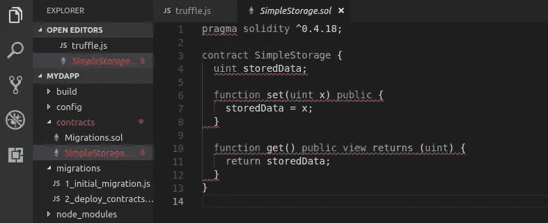

Default Solidity Program

> 注意:如果你是使用 solidity 的 smartcontract 新手，我建议你去 Youtube 上看看 solidity 教程，你会发现很多作者都很好地解释了 solidity 语言

Pragma ->这只不过是一个根或事实，在这个程序中，它表明高于 0.4.18 的 Solidity 编译器应该支持。准确地说，是兼容性检查。

contract ->每个 smartcontract 都应该以关键字“contract”开头，后跟 contractname。始终使用 camelcase 或 Propcase 以获得更好的命名约定

datatypes-> solidity 中的 data types 很多，这里我们有一个无符号整数用于“storedData”变量。默认情况下，所有变量都声明为“公共”访问。如果你不想让其他契约访问这个变量，那么使用适当的访问修饰符，比如“私有的，受保护的，内部的”等等。

这个程序有两个功能，一个是“设置”，另一个是“获取”。

Set 函数接收输入 x 并将该值存储到“StoreData”中

Get 函数返回“storedData”进行显示

> N 注:在区块链写作成本价(气价)，阅读免费..所以在这里当你调用“Set”函数时，会调用“MetaMask”来传输气体，而如果你调用“Get”函数它就不会..

使用这个简单的程序，让我们玩玩 IPFS，存储我们的文档，然后将散列检索回最终用户。

坚持住！，什么是 IPFS？

IPFS 是一个对等分布式文件系统，它试图将所有具有相同文件系统的计算设备连接起来。在某些方面，IPFS 类似于[万维网](https://en.wikipedia.org/wiki/World_Wide_Web)，但是 IPFS 可以被视为一个单独的 [BitTorrent](https://en.wikipedia.org/wiki/BitTorrent) 群，在一个 [Git](https://en.wikipedia.org/wiki/Git_(software)) 库内交换对象。(来自维基)

简单来说，如果你想在区块链中上传巨大的文件，这真的需要巨额资金(就以太而言)，而且绝对不可能花费仅仅是为了存储我们的文档软拷贝。你可以做的是，上传你的文件到 IPFS，这将密码存储它，并检索出一个独特的“哈希”。这是检索您的文件的关键。

因此，在区块链中存储这个散列会很简单&比存储实际文件的成本更低。

让我们来看看 https://ipfs.io/是如何工作的

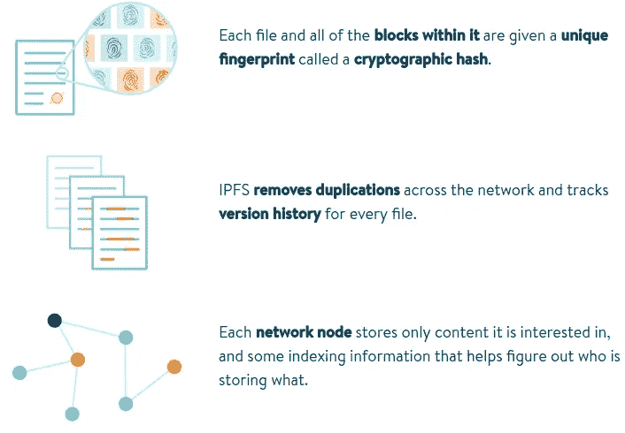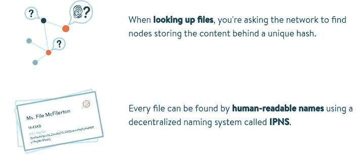

Source: IPFS.io

好了，让我们从理论部分结束吧！。现在我们清楚了，内容将存储在 IPFS &生成的散列将存储在区块链。让我们看看我们将如何实现。哈希是 32 字节的字母数字值，我们应该更新我们的智能合同来存储这个值。我将使用数据类型—字符串来更新智能合约

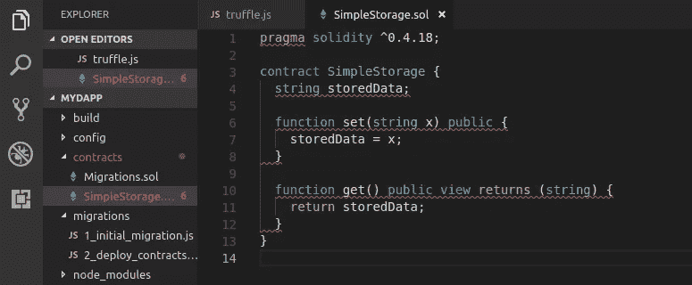

Note: error lines are not actually an error its a space indentation error.

让我们使用 truffle 命令再次编译这个智能契约，并检查 build 文件夹中的 json 文件。

使用以下命令

松露迁移-网络 ganache -重置-编译-全部

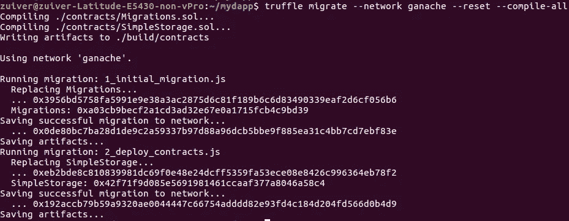

SmartContract Migrated Successfully

要验证我们的合同地址，有两种方法，你可以使用 truffle 控制台&获取合同地址，或者直接进入“build”文件夹，在那里你会找到你的 contract.json(在这种情况下，它是 SimpleStorage.json)

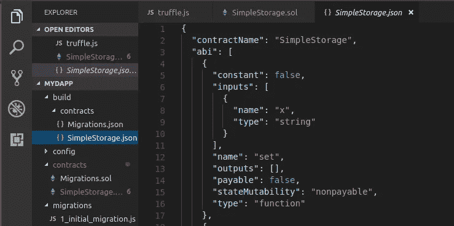

SimpleStorage.Json

只要到这个文件的底部，你会在网络配置中找到“合同地址”。如果你看这个，它会显示网络 ID : 5777(来自你的 Ganache)

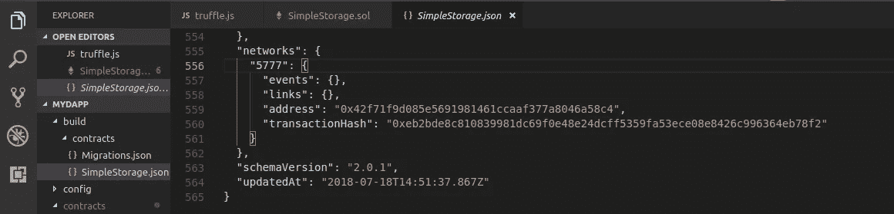

Contract Address

这个契约地址对于通过 reactJs 应用程序从我们的智能契约中调用函数非常重要。所以要记下来！。

> 注意:当您在 smart contract 中进行任何更改时，使用 reset & compile-all 标志以清除旧的已部署 smart contract 并创建新的 contract 地址非常重要。

**第七步:将 SmartContract 逻辑集成到 ReactJS 程序中，这样你就可以使用前端 GUI**

让我们看看如何整合..

在项目结构中的“Src”文件夹下创建以下两个文件。

> web3.js(坚持这个命名约定，因为我们将在许多文件中调用它)

> storemyvalue.js(用户自定义名称，您可以保留您想要的任何内容)

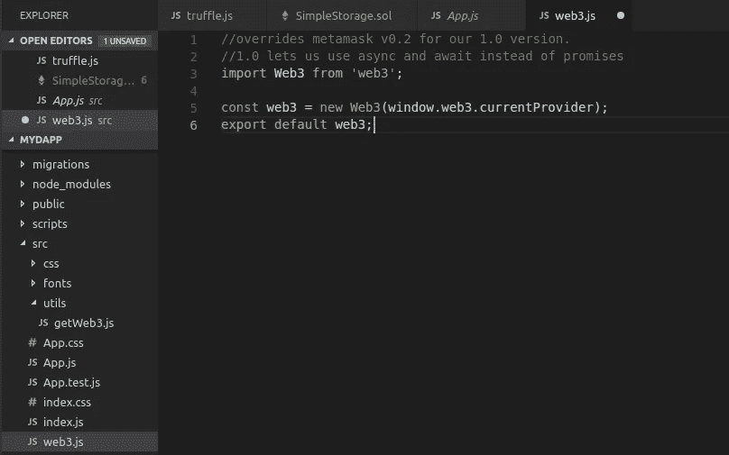

web3.js

创建 storeMyValue.js 并插入以下行

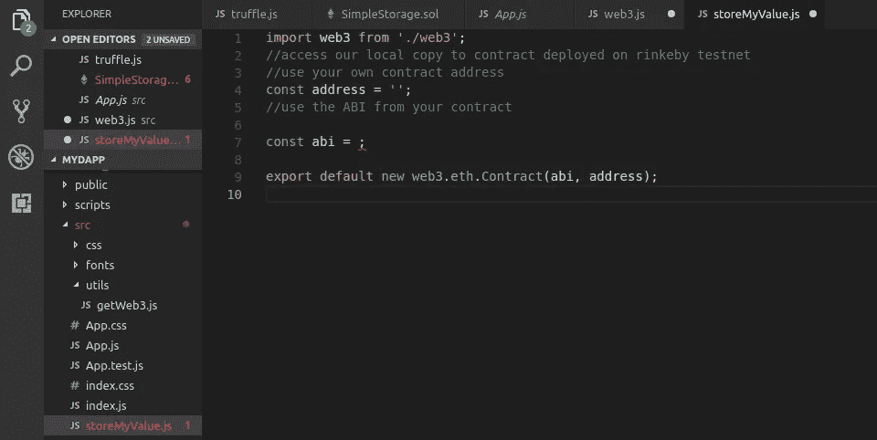

storeMyValue.Js

*   const address->是合同地址，可以从构建文件夹下的 SampleStorage.json 中获得
*   abi ->应用程序二进制接口，您可以从构建文件夹下的 SampleStorage.json 获得它

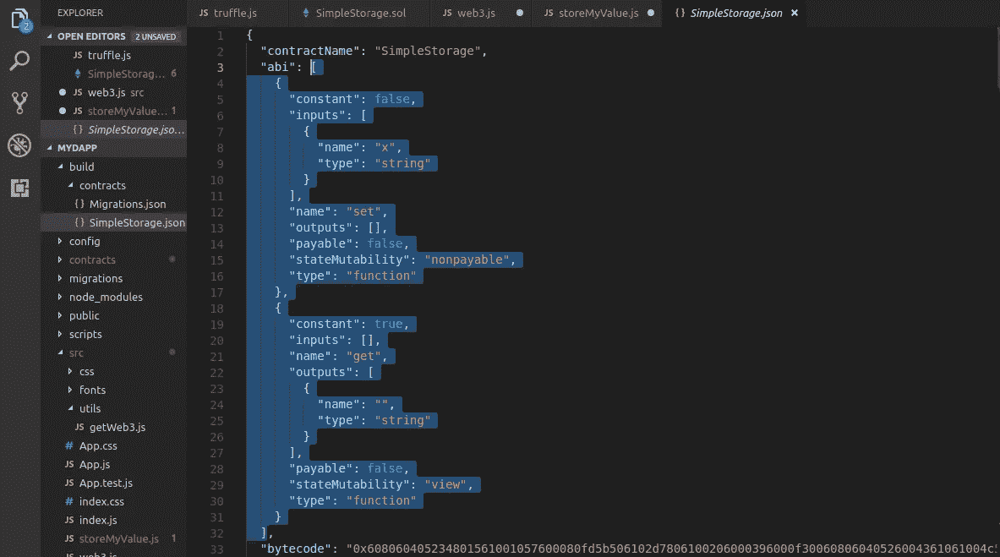

Fetch ABI from SampleStorage.Json

更新上述参数后，您的文件应该如下所示

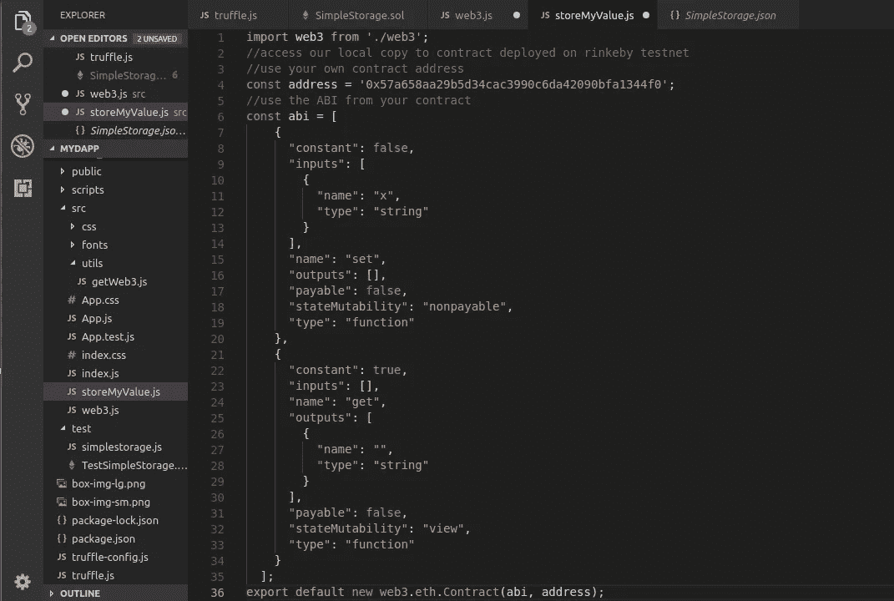

storeMyValue.js -> after updating above two params

有两种方法，您可以导入合同地址和各自的 ABI 到您的反应堆。第一，你可以像上面一样建立一个单独的文件(storeMyvalue.js)并添加 ABI(应用程序二进制接口)和网络地址

第二个选项是，当您迁移您的合同时，将生成一个包含 contract.json(contract 是您的合同名称)的构建文件夹。使用这个文件，您可以调用您的契约和各自的方法。

我们将很快在我的下一篇文章中看到这个选项(:)。

第一部分-> [点击这里](/coinmonks/step-by-step-approach-to-create-dapp-using-ethereum-reactjs-ipfs-part-1-42ea4cf69488)
国际泳联第一部分- > [点击这里](/@lokeshwaran.a82/step-by-step-approach-to-create-dapp-using-ethereum-reactjs-ipfs-part-3-final-851187ca9c24)

注:喜欢这篇文章？，给 Logeswaran 竖起大拇指(鼓掌)并在 Linkedin[/](http://www.linkedin.com/in/logeswaranaudhikesavan)[Twitter](https://twitter.com/lokeshwaran_a)上关注他

要获得本系列下一部分的更多更新，请标记这个故事！…在我的下一篇文章中再见。