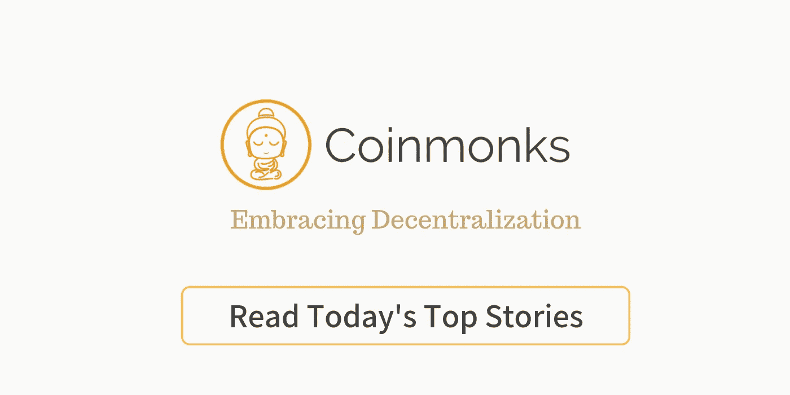

# 使用以太坊、ReactJS 和 IPFS 逐步创建 DAPP 的方法第 3 部分(最后一部分)

> 原文：<https://medium.com/coinmonks/step-by-step-approach-to-create-dapp-using-ethereum-reactjs-ipfs-part-3-final-851187ca9c24?source=collection_archive---------0----------------------->


Source: google

下面是我的最后一部分，我真诚的为延迟道歉，一直忙于 Hyperledger 项目。如果你是第一次来这个部分，请确保你在继续之前已经阅读了我的第[条第 1](/coinmonks/step-by-step-approach-to-create-dapp-using-ethereum-reactjs-ipfs-part-1-42ea4cf69488) & [条第 2](/coinmonks/step-by-step-approach-to-create-dapp-using-ethereum-reactjs-ipfs-part-2-1f8095dc154d) 条。这样你会更好地理解发生了什么。

好了，让我们马上开始让我们的 DAPP 发挥作用吧！。在我的上一个系列中，我们看到了如何获得 ABI &合同地址，所以让我们继续第 8 步..

步骤 8:初始化 IPFS 守护进程，并将逻辑集成到 ReactJS 中

步骤 9:运行 ReactJS 应用程序

步骤 10:确保元掩码和 Ganache 同步

步骤 11:通过 reactJS 应用程序触发“写”交易，并支付燃气费，以通过 MetaMask 提交交易

***步骤 8:初始化 IPFS 守护进程，&将逻辑集成到 reactJS*** 中

有两种方法，你可以初始化 IPFS。第一，您可以使用您的本地主机来启动 IPFS 守护进程或使用 IPFS。Infura.io 节点。因为 Infura 很受欢迎&很容易集成，所以我们在这里选择这个选项

***在本地设置 IPFS 守护进程***

(如果您想尝试本地 IPFS 守护进程，请遵循以下步骤)

1.  下载 https://docs.ipfs.io/introduction/install/->[IPFS](https://docs.ipfs.io/introduction/install/)
2.  检查您是否已经使用终端中的“ipfs 帮助”命令成功安装了 IPFS
3.  “ipfs init”->该命令将初始化 ipfs 守护程序

## ***设置 IPFS 信息的步骤***

1.  打开您的终端并运行以下命令来安装 ipfs-api npm 软件包。


Install npm package ipfs-api

2.创建一个文件 ipfs.js 并复制粘贴下面的内容

```
const IPFS = require(‘ipfs-api’);const ipfs = new IPFS({host: ‘ipfs.infura.io’, port: 5001, protocol: ‘https’ });export default ipfs;
```


ipfs.js

IPFS 文件的解释:这是一个 js 文件，有三行，第一行导入 ipfs-api 模块，我们将它赋值给一个名为 **IPFS(用户定义)**的变量，之后我添加了三个参数，如主机、端口、协议，以初始化 ipfs 并将我们的程序连接到 ipfs infura。因此，基本上这是默认值，您也可以使用它，最后，我们以 ipfs 的名称导出此文件。

3.确保您已经安装了最新版本的 web3 软件包。要查看您的 web3 版本，请从项目根文件夹(终端)中键入以下命令— npm ls web3


Web3 release check

4.如果你没有上述的最新版本？，然后键入以下命令以安装最新版本— npm install web3 &之后一次(成功安装)，然后再次键入— npm ls web3，如下所示


Web3 with latest release

现在，所有设置集成所有这些在一起，并创建出反应应用程序。请确保您已准备好以下内容…

a) ipfs.js

b) web3.js

c) storeMyValue.js

d) App.js ->我们现在将创建它

将以下程序复制到您的 App.js 中

```
import React, { Component } from 'react';
import './App.css';
import web3 from './web3';
import ipfs from './ipfs';
import storeMyValue from './storeMyValue';class App extends Component {state = {
ipfsHash:null,
buffer:'',
transactionHash:'',
gasUsed:'',
txReceipt: '' ,
};captureFile =(event) => {
event.stopPropagation()
event.preventDefault()
const file = event.target.files[0]
let reader = new window.FileReader()
reader.readAsArrayBuffer(file)
reader.onloadend = () => this.convertToBuffer(reader)
};convertToBuffer = async(reader) => {
//file is converted to a buffer for upload to IPFS
const buffer = await Buffer.from(reader.result);
//set this buffer -using es6 syntax
this.setState({buffer});
};onSubmit = async (event) => {event.preventDefault();
console.log("web3 value is ",web3.eth.getAccounts());
const accounts = await web3.eth.getAccounts();
console.log('Sending from Metamask account: ' , accounts[0]);
const ethAddress= await storeMyValue.options.address;
this.setState({ethAddress});await ipfs.add(this.state.buffer, (err, ipfsHash) => {
console.log(err,ipfsHash);
this.setState({ ipfsHash:ipfsHash[0].hash });storeMyValue.methods.set(this.state.ipfsHash).send({
from: accounts[0]
}, (error, transactionHash) => {
console.log("transaction hash is ",transactionHash);
this.setState({transactionHash});
});
})
};render() {return (
<div className="App">
<header className="App-header">
<h1> IPFS Dapp</h1>
</header>
<hr />
<h3> Choose file to send to IPFS </h3><form onSubmit={this.onSubmit}>
<input type="file" onChange={this.captureFile}/>
<button type="submit"> Send it </button>
</form><hr/>
<table >
<thead>
<tr>
<th>Sl No</th>
<th>Values</th>
</tr>
</thead>
<tbody>
<tr>
<td>IPFS Hash # stored on Eth Contract</td>
<td>{this.state.ipfsHash}</td>
</tr>
<tr><td>Ethereum Contract Address</td>
<td>{this.state.ethAddress}</td>
</tr>
<tr>
<td>Tx Hash # </td>
<td>{this.state.transactionHash}</td>
</tr>
</tbody>
</table>
</div>);
}
}export default App;
```

完成后，确保以下事项

*   加纳切在跑
*   已使用以下命令部署合同

```
truffle migrate — network ganache — reset — compile-all
```

*   元掩码已设置

**步骤 9 & 11:运行 reactjs 应用&通过 reactJS 应用触发“写”交易&支付燃气费通过 MetaMask 提交交易**

*   从根文件夹中键入以下命令来触发 react 应用程序

```
npm start
```

它将触发 react 应用程序，并应通过 localhost:3000 打开，如下所示。如果您没有看到如下图所示的**屏幕，请转到第 10 步**


ReactJS App

否则，点击“选择文件”，然后选择你想上传到 IPFS 的文件，然后点击“发送”，这将完成以下操作

*   将文件转换成缓冲区，并将缓冲区存储到 IPFS 中
*   IPFS 将返回散列密钥
*   哈希键将通过调用“storeMyValue.methods.set”函数来存储，这将触发元掩码，您需要在其中“确认”事务
*   它被写在以太坊合同中&作为回报，你得到如下的“交易散列”


MetaMask to Initiate the transaction


FInal results with Tranaction Hash

**第十步:用 Ganache 同步你的元蒙版**

请确保您的元掩码与 RPC(http://127.0.0.1:7545)映射，这里 7545 是来自 Ganache 的网络 id


RPC Server

如果你能顺利完成第 11 步的话！，拍拍自己的背！！。干得好！！..现在，您有一个非常简单的 Dapp，它与 IPFS 连接，并将数据存储到区块链本地的以太坊契约(Ganache)中。

注意:每当关闭“Ganache”时，您所做的所有工作都将消失，因此您可能需要重新进行合同部署。此外，当您重新部署时，请记下“合同地址”，并将其同步到“storeMyValue.js”文件中。

— — — — — — — —系列报道的结尾

— — — — — — — — — — — — — — — — — — — — — — — — — — — — — — -

您可能遇到的错误:

```
MetaMask — RPC Error: Error: Error: [ethjs-rpc] rpc error with payload {“id”:1231999223603,”jsonrpc”:”2.0",”params”:[“0xf8ec058504a817c8008301f7919469e5a32b4890e7fdc6193e3470f468d81db8ac2f80b8844ed3885e0000000000000000000000000000000000000000000000000000000000000020000000000000000000000000000000000000000000000000000000000000002e516d5568345a48433436724653487262553938586679355034346e4572734566446932347536653178784b687366000000000000000000000000000000000000822d45a0a9f7ccd62d69d55a4dafe36878702568282fb1214e6f198714342c9cf6d63883a02360d5ae5510e1c4c6d8c88bc4a6cc74c286863697f729df970bd540aa58f797”],”method”:”eth_sendRawTransaction”} Error: the tx doesn’t have the correct nonce. account has nonce of: 4 tx has nonce of: 5 {code: -32603, message: “Error: Error: [ethjs-rpc] rpc error with payload {…nonce. account has nonce of: 4 tx has nonce of: 5”}
```

解决方案:只需打开你的元蒙版，更改“账户”并刷新你的 react 应用，然后提交

注:喜欢这篇文章？，给 Logeswaran 竖起大拇指(鼓掌)并在 Linkedin[/](http://www.linkedin.com/in/logeswaranaudhikesavan)[Twitter](https://twitter.com/lokeshwaran_a)上关注他

要获得区块链文章的更多更新，请标记此故事！…在其他文章中再见..

[](http://bit.ly/2G71Sp7)

> [直接在您的收件箱中获得最佳软件交易](https://coincodecap.com/?utm_source=coinmonks)

[](https://coincodecap.com/?utm_source=coinmonks)