# 逐步指南-加密货币的自动化交易…第 1 部分

> 原文：<https://medium.com/coinmonks/step-by-step-guide-automated-trading-with-cryptocurrencies-part-1-4d1f8d48c29e?source=collection_archive---------7----------------------->

现在，我将一步一步地向您展示如何注册 Bitsgap、连接您的钱包以及您可以使用各个功能做些什么。现在，我将把自己限制在现货交易机器人。未来机器人在 Bitsgap 仍然是相当新的，处于测试阶段。另外，用期货合约交易是完全不同的门牌号，需要单独解释。但是，如果你已经有了期货交易的经验，请随意尝试这个功能。一开始，spot bot 是完全足够的，也是我使用最成功的 bot。此外，风险没有期货交易高。

在我们开始之前，请点击以下链接进入 Bitsgap 的主页。这里需要再次指出的是，通过这个链接，你可以在 14 天内免费试用机器人的所有功能。之后，你自己决定是继续还是停止。你不会被强迫做任何事情，你的会员资格也不会自动更新。

# 我们走吧！

点击链接后，您将被带到 Bitsgap 登录页面。

通过点击“注册”，您可以注册 Bitsgap。

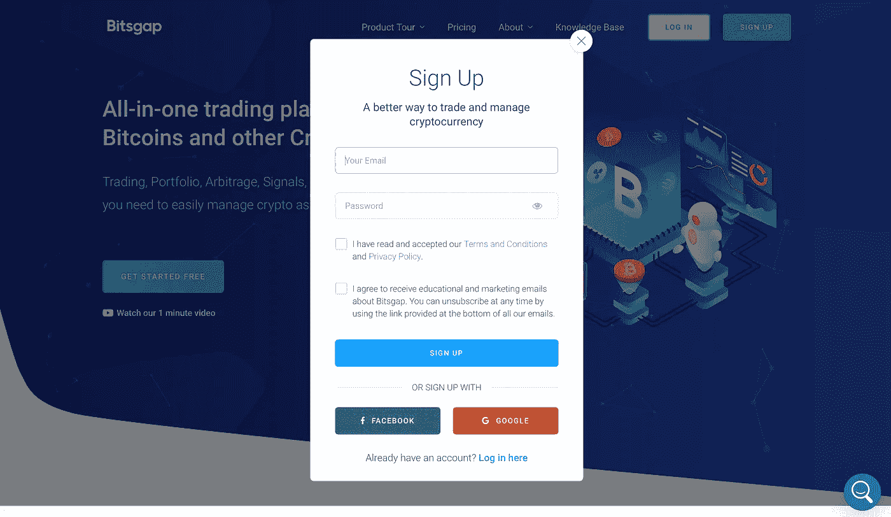

注册后，你会看到机器人的仪表板。我们先来看看菜单栏。

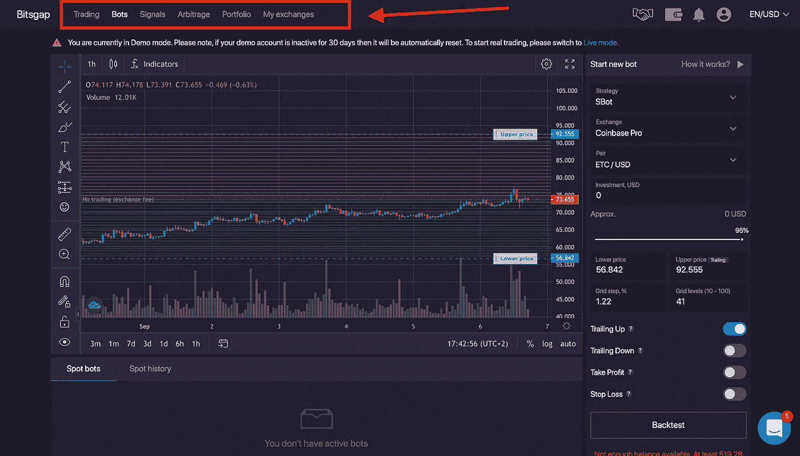

通过单击我的交换，您将看到 Bitsgap 支持的所有加密交换。

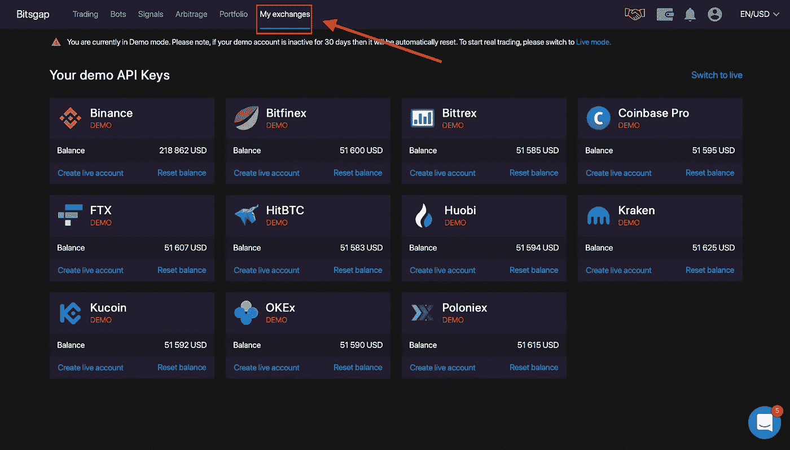

在投资组合下，你会发现你的总体看法和所有重要的数据，如你的投资回报率(ROI)。

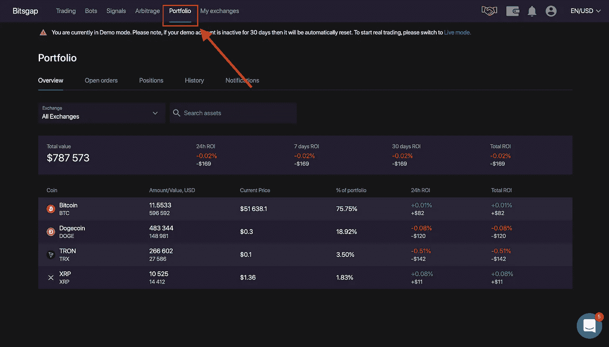

套利项目向您展示了进行套利交易的所有可能性。如果你不知道它是什么，这里有一个简短的解释。在套利交易中，你利用每个交易所的差价来获利。这些不同的价格经常在价格快速上涨或下跌时出现。由于每个交易所的交易量不同，价格的反应也不同。

示例:

比特币在交易所 A 的价格上涨，从 1 万美元涨到 1.01 万美元。然而，交易所 B 上的价格仍然是 10，000 美元，因为买方还没有对强劲上涨的价格做出反应，进行购买。所以你在交易所 A 以 10000 美元买入 1 个比特币，在交易所 b 以 10100 美元卖出，你从这笔交易中获利 100 美元。

套利交易通常被称为无风险交易，但这是不正确的。例如，如果你购买了所说的比特币，而在你将它从交易所 A 发送到交易所 B 的过程中，它的价格下跌了，那么你就亏损了。

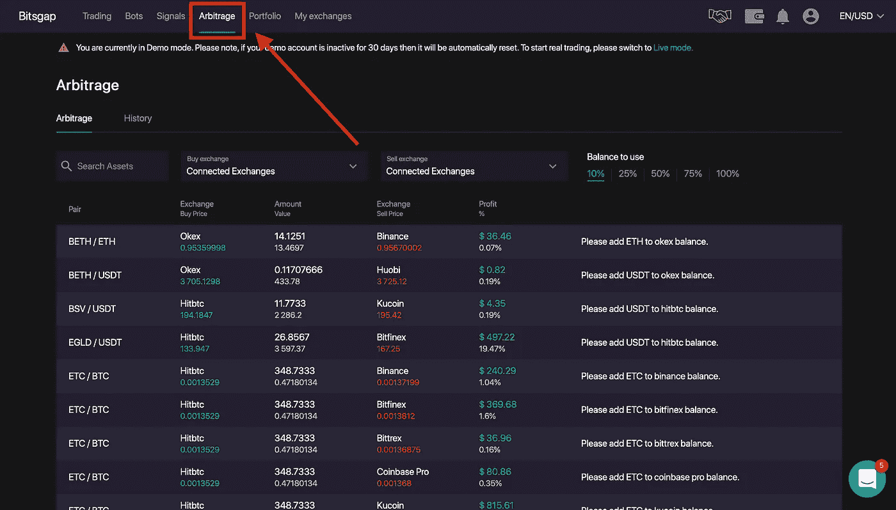

信号显示你在个人交流中的异常。市场异常是与加密市场的预期行为或趋势相反的临时价格运动。因此，系统将向您显示任何快速的价格上涨，您可以决定是建立多头头寸(买入)，还是等待回调。结合网格交易策略，可以增加你的利润。

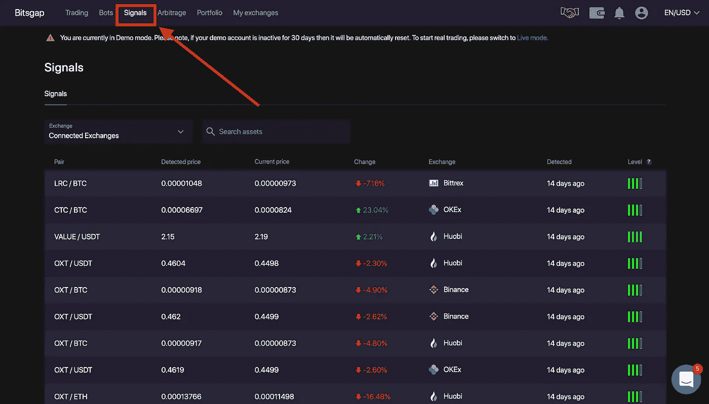

在交易下，您可以直接通过 Bitsgap 在您已连接的交易所进行交易。所以没必要离开 bot 的页面，浪费时间。

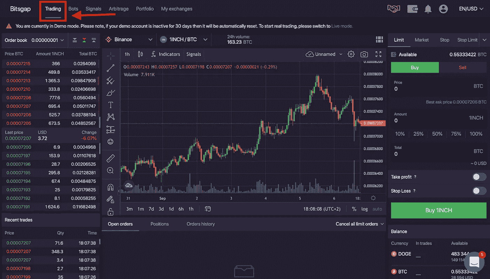

在菜单栏的右侧，您将从左至右看到您的个人推荐链接、您的钱包以及相应交易所的相应余额、通知和您的个人资料概述。

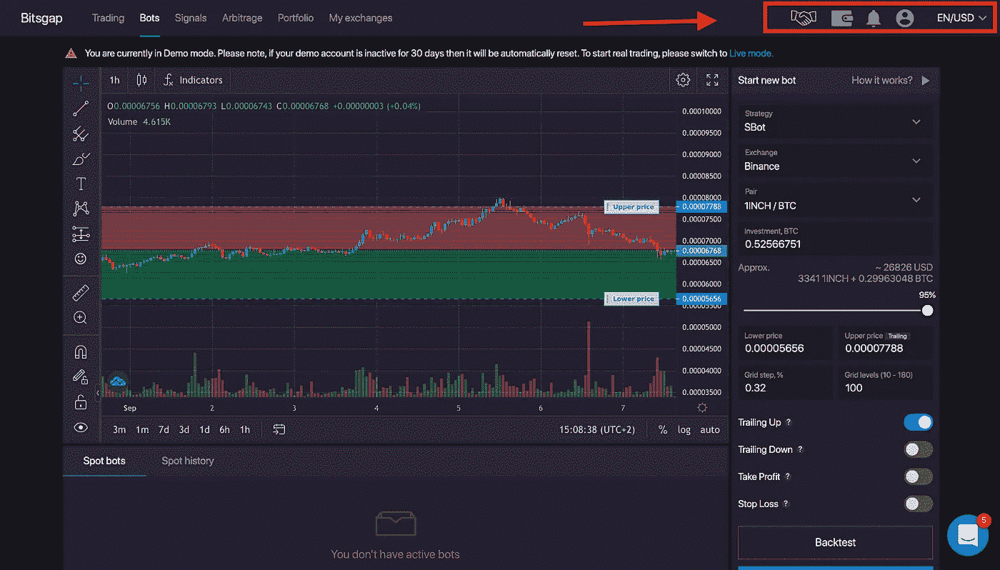

# 第一步

您可能处于演示模式。在这里，你可以用虚拟货币交易，测试你的策略。要退出演示模式，请单击个人资料图标。在演示关闭时，您可以取消演示模式。

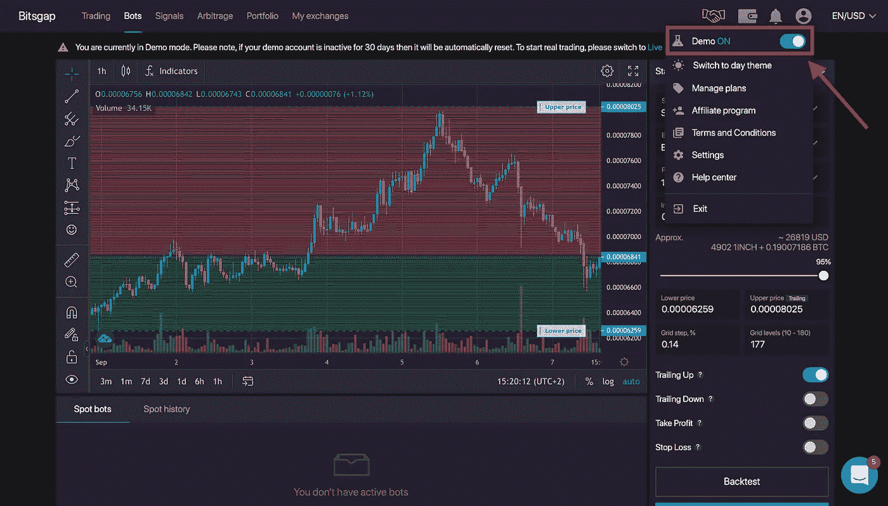

下一步是连接您的交换机。为此，请单击菜单项“我的交易所”。接下来，点击“添加新交易所”并选择您的交易所。在你输入了 API 和密钥后，系统会告诉你每次交换下的连接状态。

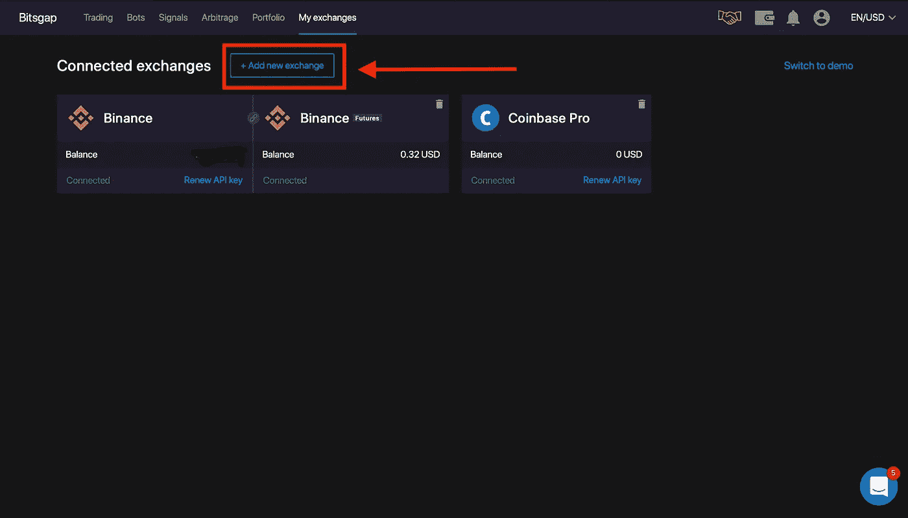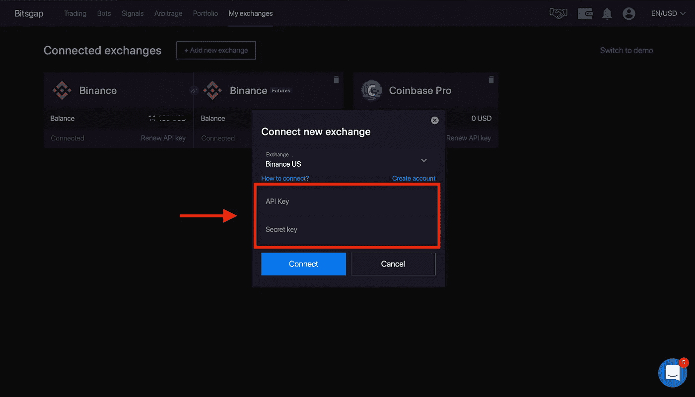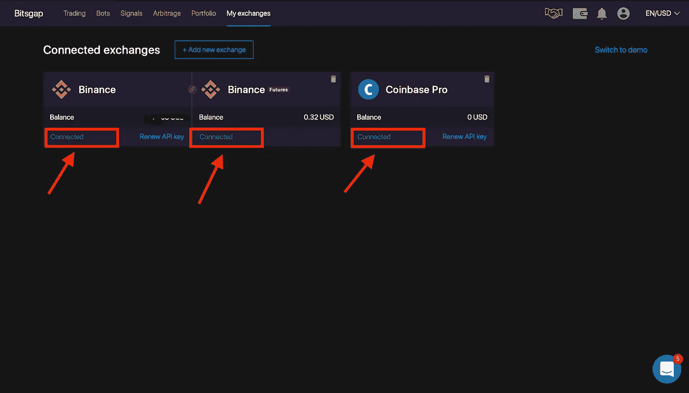

## **重要提示！！！**

“密钥”通常应该始终保密。但是，由于机器人必须访问您的帐户才能进行交易，因此机器人需要密钥。然而，这是非常重要的，你必须告诉你的设置下的交易所，不允许提取资金。

一旦交换机连接，点击机器人菜单项。

# 在第 2 部分中，我们继续深入了解这个机器人…

> 加入 Coinmonks [电报频道](https://t.me/coincodecap)和 [Youtube 频道](https://www.youtube.com/c/coinmonks/videos)了解加密交易和投资

## 也阅读

 [## 最佳加密交易所| 2021 年十大加密货币交易所

### ICON _ PLACEHOLDEREstimated 预计阅读时间:28 分钟加密货币交易所的加密交易需要知识…

blog.coincodecap.com](https://blog.coincodecap.com/crypto-exchange)  [## 2021 年 10 大最佳加密贷款平台| CoinCodeCap

### 当谈到加密货币贷款时，大量因素等同于良好的收入状况。此外，借款的一部分…

blog.coincodecap.com](https://blog.coincodecap.com/crypto-lending)  [## 2021 年最佳免费加密交易机器人

### 2021 年币安、比特币基地、库币和其他密码交易所的最佳密码交易机器人。四进制，位间隙…

medium.com](/coinmonks/crypto-trading-bot-c2ffce8acb2a)  [## 最佳 4 个加密交易信号电报通道

### 这是乏味的找到正确的加密交易信号提供商。因此，在本文中，我们将讨论最好的…

medium.com](/coinmonks/best-crypto-signals-telegram-5785cdbc4b2b)  [## BlockFi 评论 2021:利弊和利率| CoinCodeCap

### 今天，我们提出了一个全面的 BlockFi 评论，这是一个成立于 2017 年的加密贷款平台，拥有其…

blog.coincodecap.com](https://blog.coincodecap.com/blockfi-review)  [## 如何在印度购买比特币？2021 年购买比特币的 7 款最佳应用[手机版]

### 如何使用移动应用程序购买比特币印度

medium.com](/coinmonks/buy-bitcoin-in-india-feb50ddfef94)  [## 加密税务软件——五大最佳比特币税务计算器[2021]

### 不管你是刚接触加密还是已经在这个领域呆了一段时间，你都需要交税。

medium.com](/coinmonks/best-crypto-tax-tool-for-my-money-72d4b430816b)  [## 存储比特币的最佳加密硬件钱包[2021] | CoinCodeCap

### 保管您的数字资产很容易，但找到正确的存储方式却是一项繁琐的任务。在线钱包有一个风险…

blog.coincodecap.com](https://blog.coincodecap.com/best-hardware-wallet-bitcoin)