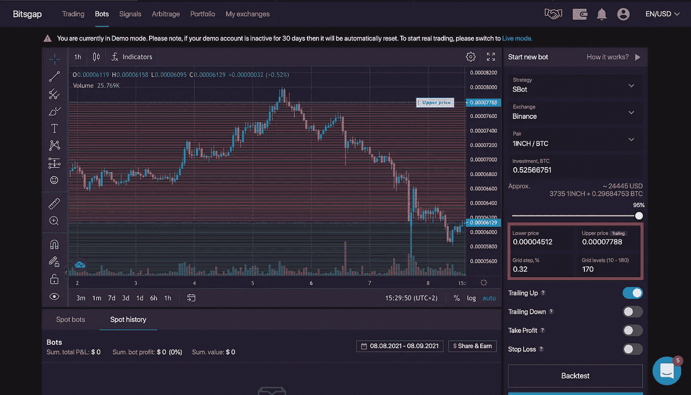

# 分步指南——加密货币的自动化交易……第 2 部分

> 原文：<https://medium.com/coinmonks/step-by-step-guide-automated-trading-with-cryptocurrencies-part-2-67a05248bae9?source=collection_archive---------4----------------------->

在第一步完成后，我们将看看如何设置机器人和具体是什么。不要被所有的信息吓倒，它并不像你最初想的那么复杂。

图表窗口占据了最大的区域。在这里，您可以看到您选择的交易对的价格趋势，并且显示您设置的网格。在左侧，您会发现执行技术分析的工具栏。图表视图与 Tradingview 中的基本相同。由于我们不执行分析，而是主要对网格和 bot 的设置选项感兴趣，所以我们不考虑各种工具。

# 机器人及其设置

在图表的右边，是我们最感兴趣的窗口。在这里你可以设置你的机器人。在我们进行的过程中，我会展示并解释每一个设置。

首先你必须决定一个策略，或者换句话说，一个机器人类型。你有两种类型可以选择，“SBot”和经典机器人。

SBot:SBot 总是以固定的数量买卖。

例如:如果您投资 800 美元，并将网格数设置为 8，则这 800 美元将被分成 8 行(网格)。这意味着机器人将在每条线上交易 100 美元。它会以 100 美元的价格买尽可能多的线路。

解释一下 Bitsgap 本身的图片:

经典机器人:经典机器人反过来总是试图购买相同数量的硬币。

例如:如果你投资 800 美元，机器人会将这 800 美元在各行之间进行分配，这样，你选择交易的加密货币的数量总是相同的。

这也是一张照片:

最常用于交易的机器人是 SBot。SBot 主要用于横向市场。但是，它也适用于其他情况。

通过下面的设置，您可以选择要运行 bot 的交易所。

在那下面，你选择你想要交易的交易对。

接下来，你决定你的总资本中有多少是你想要投资的。在滑块的帮助下，您还可以将其设置为百分比。在滑块上方，你可以看到你的投资金额是如何细分的。机器人需要两种加密货币中的一些来交易。它在当前价格上方创建红色线(卖出),在当前价格下方创建绿色线(买入)。然而，为了让机器人有东西可以买和卖，它需要一定数量的两种货币，这取决于红色和绿色分别有多少行。

有问题吗？
在这一点上，我想指出你可以通过 Instagram 向我提问。

https://www.instagram.com/automated.crypto.trader/

接下来是您可以设置范围、距离和行数的字段。

**范围(价格上限/下限):**设置你的机器人应该活动的范围。

**网格步长%**在此设置线与线之间的距离，以百分比表示。这个百分比对应于你每次交易的利润。

**网格等级:**设置你希望机器人在你指定的范围内创建的行数。

接下来的设置使得 Bitsgap 的机器人如此优秀和特别。特别是，这些是向上和向下移动。不过，在我解释这两个之前，另外两个是第一个。

**获利:**在这里设定机器人应该何时自动停止交易。可以说，你设定了你想从多少%的利润中获利。我已经多次要求 Bitsgap 通过 price 更改此设置。也许有一天会有用。

止损:这可能是交易中最广为人知也是最重要的设置。机器人会在你设定的价格停止交易并自行关闭。

这个设定太疯狂了！如果你激活 trailling up，当价格超过上限时，机器人会把线向上移动。这给了你一个跟随“上升趋势”继续获利的机会。这个设置让我可以运行我的 HOT/ETH 机器人很长一段时间，并获得了可观的利润。

**Trailling Down:** 是 trailling up 的反义词。机器人遵循“下降趋势”,将线向下移动。但你要知道，机器人一直在买入，直到趋势逆转，它可以再次卖出。因此，重要的是你提供足够的资金使这成为可能。如果你没有这样做，机器人会告诉你，它不能执行拖车下来。

在刚才提到的设置下，有两个按钮，回测和开始。从逻辑上来说，Start 意味着你点击它之后，这个 bot 就会被启动。另一方面，回溯测试允许您测试您的策略和设置。为此，在一段由你决定的时间内模拟交易，并计算你的利润有多大。我自己很少使用这个函数，甚至根本不使用，也不会特别依赖这个数据。他们可以说是完美的交易，并以 10 BTC 的股票进行交易。我不知道你看起来怎么样，但是我没有 10 个 BTC(至少现在还没有:)。

更好的选择是启动一个你在演示模式下设置的机器人。所以你也可以熟悉一下 bot 和它的设置。

在开始按钮下，你会发现“策略”和“平衡”。点击天平，你可以看到你当前的硬币存量和它们的价值。

策略，向您显示其他用户成功使用的成功策略和设置。只需点击一个策略，并使用这些设置来启动一个机器人。您也可以搜索自己选择的货币对。

最后，图表下方的窗口仍然不见了。这里显示了您的活动机器人，以及所有相关信息。在“点历史”下，你可以看到你关闭的所有机器人及其数据。

可能最有趣的信息是机器人的利润和地位。为了不需要解释每一种状态，下面是图片:

**就这样。至少目前是这样。我希望我能给你一点启发，也许我让你想试试这个机器人。如果你有任何问题，请随意提问。此外，如果你想尝试机器人，我会很高兴，如果你使用我的链接。**

## 感谢阅读

# 丹尼斯

> 加入 Coinmonks [电报频道](https://t.me/coincodecap)和 [Youtube 频道](https://www.youtube.com/c/coinmonks/videos)了解加密交易和投资

## 另外，阅读

*   [什么是融资融券交易](https://blog.coincodecap.com/margin-trading) | [成本平均法](https://blog.coincodecap.com/dca)
*   [BigONE 交易所评论](/coinmonks/bigone-exchange-review-64705d85a1d4) | [电网交易机器人](https://blog.coincodecap.com/grid-trading)
*   [新加坡十大最佳加密交易所](https://blog.coincodecap.com/crypto-exchange-in-singapore) | [购买 AXS](https://blog.coincodecap.com/buy-axs-token)
*   [投资印度的最佳加密软件](https://blog.coincodecap.com/best-crypto-to-invest-in-india-in-2021) | [WazirX P2P](https://blog.coincodecap.com/wazirx-p2p)
*   [7 个最佳零费用加密交易平台](https://blog.coincodecap.com/zero-fee-crypto-exchanges)
*   [分散交易所](https://blog.coincodecap.com/what-are-decentralized-exchanges) | [比特 FIP](https://blog.coincodecap.com/bitbns-fip)
*   [用信用卡购买密码的 10 个最佳地点](https://blog.coincodecap.com/buy-crypto-with-credit-card)
*   [加拿大最佳加密交易机器人](https://blog.coincodecap.com/5-best-crypto-trading-bots-in-canada) | [Bybit vs 币安](https://blog.coincodecap.com/bybit-binance-moonxbt)
*   [用于 Huobi 的加密交易信号](https://blog.coincodecap.com/huobi-crypto-trading-signals) | [Swapzone 审查](/coinmonks/swapzone-review-crypto-exchange-data-aggregator-e0ad78e55ed7)
*   最佳[密码交易机器人](https://blog.coincodecap.com/best-crypto-trading-bots) | [购买索拉纳](https://blog.coincodecap.com/buy-solana) | [矩阵导出评论](https://blog.coincodecap.com/matrixport-review)
*   [Coldcard 评论](https://blog.coincodecap.com/coldcard-review) | [BOXtradEX 评论](https://blog.coincodecap.com/boxtradex-review)|[uni swap 指南](https://blog.coincodecap.com/uniswap)
*   [阿联酋五大最佳加密交易所](https://blog.coincodecap.com/best-crypto-exchanges-in-uae) | [SimpleSwap 评论](https://blog.coincodecap.com/simpleswap-review)
*   购买 Dogecoin 的 7 种最佳方式
*   [最佳期货交易信号](https://blog.coincodecap.com/futures-trading-signals) | [流动性交易所评论](https://blog.coincodecap.com/liquid-exchange-review)
*   [3 commas Review](/coinmonks/3commas-review-an-excellent-crypto-trading-bot-2020-1313a58bec92)|[Pionex Review](/coinmonks/pionex-review-exchange-with-crypto-trading-bot-1e459d0191ea)|[coin rule Review](/coinmonks/coinrule-review-2021-a-beginner-friendly-crypto-trading-bot-daf0504848ba)
*   [莱杰 vs Ngrave](/coinmonks/ledger-vs-ngrave-zero-7e40f0c1d694) | [莱杰 nano s vs x](/coinmonks/ledger-nano-s-vs-x-battery-hardware-price-storage-59a6663fe3b0) | [币安评论](/coinmonks/binance-review-ee10d3bf3b6e)
*   [Bybit Exchange 审查](/coinmonks/bybit-exchange-review-dbd570019b71) | [Bityard 审查](https://blog.coincodecap.com/bityard-reivew) | [CoinSpot 审查](https://blog.coincodecap.com/coinspot-review)
*   [3 commas vs crypto hopper](/coinmonks/3commas-vs-pionex-vs-cryptohopper-best-crypto-bot-6a98d2baa203)|[赚取加密利息](/coinmonks/earn-crypto-interest-b10b810fdda3)
*   最好的比特币[硬件钱包](/coinmonks/hardware-wallets-dfa1211730c6) | [BitBox02 回顾](/coinmonks/bitbox02-review-your-swiss-bitcoin-hardware-wallet-c36c88fff29)
*   [BlockFi vs 摄氏](/coinmonks/blockfi-vs-celsius-vs-hodlnaut-8a1cc8c26630) | [Hodlnaut 点评](/coinmonks/hodlnaut-review-best-way-to-hodl-is-to-earn-interest-on-your-bitcoin-6658a8c19edf) | [KuCoin 点评](https://blog.coincodecap.com/kucoin-review)
*   [Bitsgap 审查](/coinmonks/bitsgap-review-a-crypto-trading-bot-that-makes-easy-money-a5d88a336df2) | [Quadency 审查](/coinmonks/quadency-review-a-crypto-trading-automation-platform-3068eaa374e1) | [Bitbns 审查](/coinmonks/bitbns-review-38256a07e161)