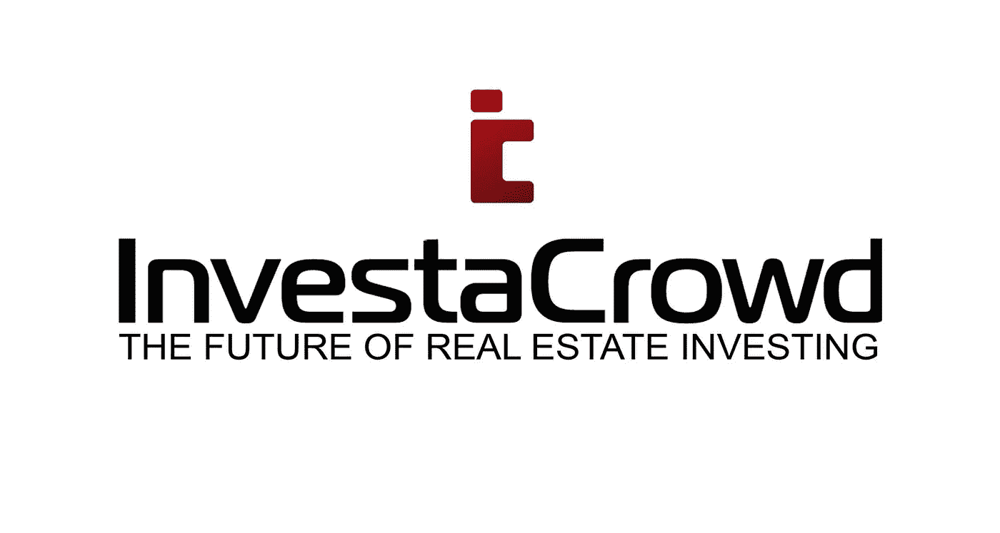

# 房地产 ico 入门分步指南—第 2 部分

> 原文：<https://medium.com/coinmonks/step-by-step-guide-on-how-to-get-started-with-real-estate-icos-5eaf812dd586?source=collection_archive---------3----------------------->

# 第二步

继续阅读入门指南，我们发现下面这张图表对 ICO 项目评估非常有用。积极的一面是，与 6 个月甚至 3 个月前相比，知识、指标和标准有了令人难以置信的升级(以及更多聪明人开始从事 ICO 相关业务),加密价格的暴跌无疑淘汰了许多普通项目，迫使人们转向质量:

因此，在评估你认为对你有意义的 ico 类型(公用事业、支付或安全)并根据上面的一些关键指标检查项目后，你需要做好准备，这样你就可以实际购买这些代币/硬币，第一步如下(请注意，有几种不同的方式可以开始，但我们只是选择一种我们知道有效且易于人们理解的方式)

最简单的方法是首先在你熟悉的加密货币交易所设立一个账户:在日本你可以试试[quoine.com](http://www.quoine.com)，在欧盟[bitstamp.net](http://www.bitstamp.net)，在美国[coinbase.com](http://www.coinbase.com)仅举几个例子，以上所有的都在各自的司法管辖区获得了许可(如果这对你很重要的话)，如果有任何问题， 你也许可以找到他们，以获得帮助或解决方案(在你的费用/交易对你不利的情况下)，顺便说一下，这在大多数不受监管的交易所/分散式交易所几乎是不可能的。

要小心声称 0%费用的交易所，因为大多数交易所只是通过提供非常差的利差将资金转移到其他地方，实际上比“公平”汇率的低佣金合法交易所从你那里拿走的更多。

举个例子，让我们以 [coinbase](http://www.coinbase.com) 为例:

你可以在 coinbase 上买到一些主要的硬币，但是我们简化了讨论，只选择了以太坊。这样做的另一个原因是大多数 ICO 项目只接受以太坊(ETH 是 ticker)

注意:当你在交易所开户时，你必须使用你的交易所钱包来购买你的第一枚硬币。你也可以把你的硬币存放在那个钱包里，但是这个行业建议你建立一个个人钱包，然后把你的硬币从你的兑换钱包转移到你的个人钱包里(更多的内容在下一篇文章里，但是简单的说见下文)。

自从 crypto 在几年前开始其短暂的生命以来，在交易所中已经有一些严重的黑客攻击，但是大多数好的交易所现在将他们的大部分硬币储存在“[冷库](https://www.reddit.com/r/btc/comments/80itg6/what_does_it_mean_by_storing_crypto_in_cold/)。这可能是一个完整的部分，但让我们继续前进，所以万岁！！！此时，您已经完成了第 1 步&第 2 步，并准备好用您的 fiat/$买卖主要硬币。

这是我今天收到的一些东西，展示了交易所为了保护投资者的利益而进行的安全改进:

在去年第四季度最热的时候，仅仅是让你的 KYC/验证得到交易所的批准就花了长达 1-2 个月的时间，所以一些可怜的人在市场顶部买入，而其他认为自己错过了的人实际上最终错过了顶部。

因此，下一步非常简单，随着交易所平台的增长(我们最近听说现在有 200 多个交易所)，普通/非技术投资者的访问权限与几年前试图购买比特币相去甚远，过去 2-3 年创建的合法“入口”数量是去年价格飙升的一个重要因素，因为越来越多的企业进入该领域，帮助参与者解决问题，许多人的第一个问题是购买他们的第一个密码时感到安全和有保障。

需要注意的重要一点是，每个投资者都应该亲自动手。安全性是与加密 IMHO 相关的最重要的问题，你需要经历这个过程，弄清楚它是如何工作的，犯一些错误，然后靠自己把它做好，不要依赖任何人。机构资本难以进入这一领域的原因之一是，整个“托管人”问题没有任何解决方案(直到最近)。有一个新的浪潮集团将机构解决方案推向市场，我可以向那些需要它们的人做一些个人介绍？？

接下来，我们将开始设置您的个人钱包，敬请关注，希望我们有所帮助。

InvestaCrowd 是一家总部位于新加坡的许可 Proptech 平台，面向全球投资者。**我们即将推出自己的 ICO**，如果你还没有注册，请在[www.investacrowd.com](http://www.investacrowd.com)注册，请关注最新的更新，我们有一个改变游戏规则的项目正在进行中。

感谢您的参与，并欢迎任何积极的投入和评论，特别是来自房地产 ICO 发行人的投入和评论，他们已经在市场上(合作)或即将推出(也许我们可以帮助)，我们是超级专业的替代和更好的投资方式。

> [在您的收件箱中直接获得最佳软件交易](https://coincodecap.com/?utm_source=coinmonks)

请收听我们的电报频道，了解最新消息

 [## InvestaCrowd ICTX

### 投资+新闻

t.me](https://t.me/investacrowd) 

我们还是以下组织的创始成员:

**房地产区块链实验室**([www.reblabs.com](http://www.reblabs.com))致力于帮助房地产行业直接受益于区块链技术的房地产行业智库

