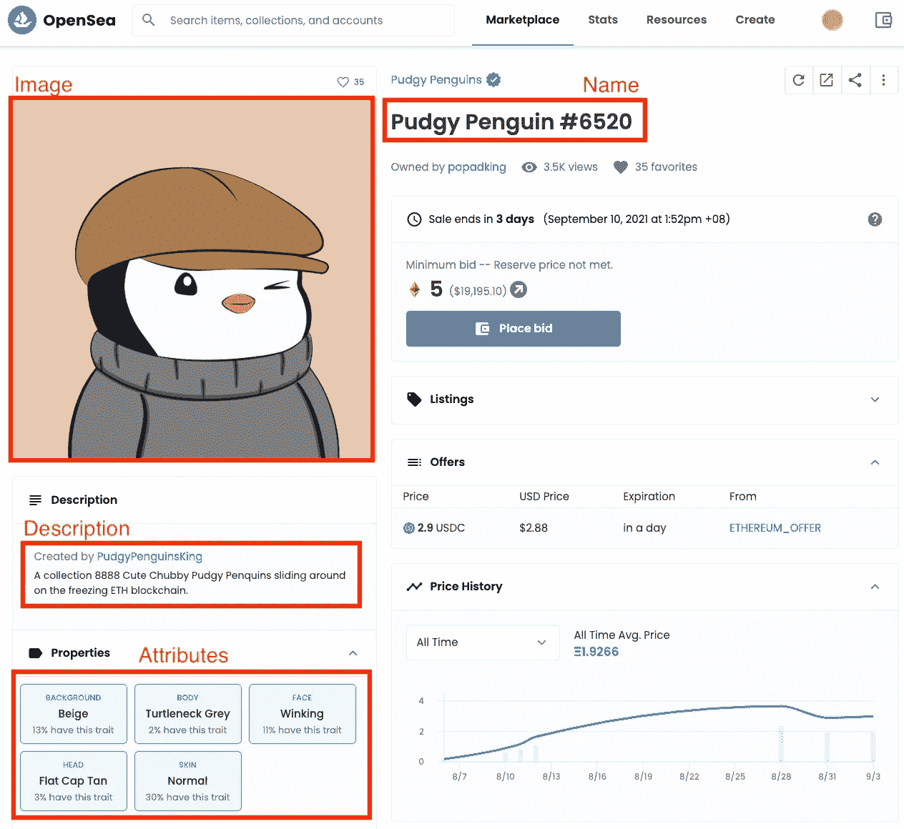
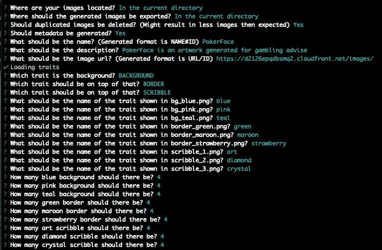
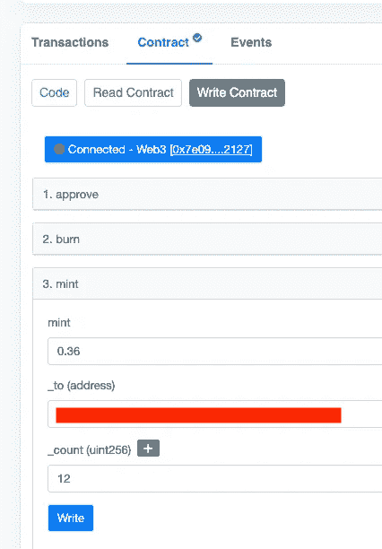

# 创建你自己的 NFT 的一步一步的指南——神秘的朋克或者矮胖的企鹅

> 原文：<https://medium.com/coinmonks/step-by-step-guide-to-creating-your-own-nft-cryptopunks-or-pudgy-penguins-67733ebce39e?source=collection_archive---------0----------------------->

NFT 代表不可替代令牌，它可以代表数字资产的所有权。NFT 可以采取游戏内物品的形式，或者是数字艺术品，甚至是像 CryptoPunks 这样的 PFP。

## 什么是密码朋克或者矮胖企鹅

如果你偶然看到这篇博文，你很有可能知道 NFT 是什么，并且是在谷歌搜索后登陆的。*隐朋克*和*矮胖企鹅*都属于 PFP(个人资料图片)类别。它们通常有大量的版本，至少有数千种。这个想法是通过编程为每个版本生成一个头像，具有不同的特征，如头、脸等..其中一些版本具有更稀有的特征，其价值可能更高。用户然后购买 NFT，并可能使用该图像作为他们的社交媒体个人资料图片。

> 如果你从未听说过密码朋克或矮胖企鹅，
> 
> 在[https://opensea.io/collection/cryptopunks](https://opensea.io/collection/cryptopunks)查看加密朋克收藏——在这篇博文发表时，大多数朋克目前的交易价格都在 6 位数及以上。
> 
> 对于矮胖的企鹅来说——[https://opensea.io/collection/pudgypenguins](https://opensea.io/collection/pudgypenguins)


An example of how different pudgy penguin looks like, each with different traits — lovely 😍

# 逐步指南

下一节将为那些渴望了解创建一个 PFP 项目的步骤的人描述一个逐步的指南。您需要有编程背景才能执行这些步骤。如果你遵循了指南，你的版本最终会在 OpenSea 上发布，例如[https://testnets.opensea.io/collection/pokerface-v2](https://testnets.opensea.io/collection/pokerface-v2)。

概括地说，这些是必需的步骤:

1.  为 OpenSea 生成 NFT 图像和元数据
2.  将图像和元数据放在 IPFS 或其他地方
3.  部署智能合同
4.  薄荷 NFT

## 步骤 1:为 OpenSea 生成 NFT 图像和元数据

根据 [OpenSea 文档](https://docs.opensea.io/docs/2-adding-metadata)，每个 NFT 需要 4 个属性，这将被 OpenSea 用来显示关于每个 NFT 的信息。

示例:

```
{
  **name**: "Pudgy Penguin #6520",
  **description**: "A collection 8888 Cute Chubby ...", 
  **image**: "[https://api.pudgypenguins.io/penguin/image/6520](https://api.pudgypenguins.io/penguin/image/6520)",
  **attributes**: [
    { trait_type: "Background", value: "Beige" },
    { trait_type: "Skin", value: "Normal" },
    { trait_type: "Body", value: "Turtleneck Greuy" },
    { trait_type: "Face", value: "Winking" },
    { trait_type: "Head", value: "Flat Cap Tan" }
  ]
}
```

上面的元数据会映射到 OpenSea 上的这个 [**矮胖企鹅**](https://opensea.io/assets/0xbd3531da5cf5857e7cfaa92426877b022e612cf8/6520)



在这一步，我们将利用[https://github.com/NotLuksus/nft-art-generator](https://github.com/NotLuksus/nft-art-generator)库来帮助我们随机生成 NFT 图像及其元数据。

**先决条件** 为了生成一个具有随机特征的 NFT，项目创建者必须为每个不同的特征准备图像，例如眼睛、头部等..为了简单起见，我已经在[https://github . com/Steve-ng/poker face-NFT/tree/main/assets/images](https://github.com/steve-ng/pokerface-nft/tree/main/assets/images)中预先生成了这些特征。请原谅我的画——我是一名毫无艺术天赋的软件工程师。

按照下面的命令生成 NFT 图像

```
// Installation steps
> git clone [https://github.com/steve-ng/pokerface-nft](https://github.com/steve-ng/pokerface-nft)
> cd pokerface-nft 
> yarn
> npm install -g nft-art-generator// Generate assets
> cd assets
> nft-generate 
```

在`nft-generate`期间，终端中会有大量的问题，您可以暂时将`image url`设置为某个随机的 URL，因为我们需要先执行步骤 2 来获取一个 URL，然后再回到这一步。

以下是我输入的值。



在`nft-generate`命令结束时，您应该会看到一个用不同的 NFT 资产创建的`output`文件夹和一个`metadata.json`文件。`metadata.json`是所有版本信息的集合，我已经将它们分成了[元数据](https://github.com/steve-ng/pokerface-nft/tree/main/assets/metadata)文件夹。

> 如果你想跳过这一步，你可以在 Github 的[输出](https://github.com/steve-ng/pokerface-nft/tree/main/assets/output)文件夹中找到结果。已经有 12 个随机生成的资产和包含 12 个资产元数据的[元数据](https://github.com/steve-ng/pokerface-nft/blob/main/assets/metadata)文件夹。

## 步骤 2:托管图像和元数据

我使用 AWS 来实现这一点，结果应该如下。对于数字 0 到 11，它们将在

*   元数据:[https://d2126epqdbsmq2.cloudfront.net/info/](https://d2126epqdbsmq2.cloudfront.net/info/1){ number }例如:[https://d2126epqdbsmq2.cloudfront.net/info/1](https://d2126epqdbsmq2.cloudfront.net/info/1)
*   图片:[https://d2126epqdbsmq2.cloudfront.net/images/{number}.png](https://d2126epqdbsmq2.cloudfront.net/images/1.png)例如:[https://d2126epqdbsmq2.cloudfront.net/images/1.png](https://d2126epqdbsmq2.cloudfront.net/images/1.png)

***创建一个 s3 桶和:***

1.  创建一个**图像**的文件夹，并上传[输出](https://github.com/steve-ng/pokerface-nft/tree/main/assets/output)文件夹中的所有内容
2.  创建一个名为 **info** 的文件夹，上传 [metadata](https://github.com/steve-ng/pokerface-nft/tree/main/assets/metadata) 文件夹中的所有内容
3.  要么将您的 S3 bucket 公开，以便公众可以访问该链接，要么创建一个映射到该 S3 bucket 的 Cloudfront。Cloudfront 是一个 CDN，如果经常查看这个映像，它将为最终用户提供更好的性能

我将保持这一步简短，并在这里结束，因为有许多方式来托管，一些 PFP 项目在 IPFS 托管他们的资产，这也有其利弊。

到这一步结束时，你应该有了`imageUrl`例如[https://d2126epqdbsmq2.cloudfront.net/images](https://d2126epqdbsmq2.cloudfront.net/images/1.png)/——你现在可以回到第 1 步`nft-generate`并且能够键入`image url`的值

## 步骤 3:部署智能合约

我把[puddy Penguin](https://etherscan.io/address/0xbd3531da5cf5857e7cfaa92426877b022e612cf8#code)契约分到了这里[https://github . com/Steve-ng/poker face-NFT/blob/main/contracts/poker faces . sol](https://github.com/steve-ng/pokerface-nft/blob/main/contracts/PokerFaces.sol)理解起来相当简单，并且遵循 ERC-721 标准。智能合约的解释超出了本文的范围。

**先决条件** 你需要在 Rinkeby 网络中有一个私钥和一些乙醚:

*   生成私钥:[https://vanity-eth.tk/](https://vanity-eth.tk/)——注意这只是为了测试，不要相信在线密钥生成工具。
*   去拿些乙醚[https://faucet.rinkeby.io/](https://faucet.rinkeby.io/)

**运行以下命令部署**

```
// From pokerface-nft folder 
> export PRIVATE_KEY=xxxx
> truffle migrate --reset --network rinkeby
```

该命令完成后，您应该会在终端中看到如下内容:

```
> contract address: yyy
```

你现在可以在以太扫描查看你的合同:[https://rinkeby.etherscan.io/address/](https://rinkeby.etherscan.io/address/0x40De8A5FCcF37A519064931974f61D1C2881F25B)yyy

通常，你会从 Etherscan 验证合同，但是因为我之前已经验证过相同的合同，所以你不需要验证。

## 第四步:铸造一些 NFT，并在公海观看！

随着合同的展开，我们可以开始铸造 NFT 了！

**造币厂 NFT**

1.  进入您的以太网扫描合同`Contract -> Write Contract`选项卡
2.  确保您的元掩码在`Rinkeby`网络上并已连接，选择 mint 功能并输入以下信息:

```
mint: 0.36
_to: <<your address>>
_count: 12
```



`0.36 ETH`因为每只企鹅是 0.03 埃特(当时的原价，你可以想象那些早期的人们赚了多少)。`12 count`因为我们已经在步骤 1 中创建了 12 个不同的资产。

如果你做对了，现在你可以在下面的页面[https://testnets.opensea.io/assets/{contract_address}/1](https://testnets.opensea.io/assets/0xe24f0717fedbecb57651cbe3dd4b8b73c5b89a57/1)查看你在 OpenSea 的所有资产

如我的 PokerFace NFT 可以在这里找到[https://test nets . opensea . io/assets/0x e 24 f 0717 fed becb 57651 CBE 3d D4 b 8 b 73 C5 b 89 a 57/1](https://testnets.opensea.io/assets/0xe24f0717fedbecb57651cbe3dd4b8b73c5b89a57/1)

> 通常会有一个很好的网站，并为用户提供一个 UI 来制作他们的 NFT，我们所做的只是简单地为我们自己制作所有的版本用于测试。

# 结论

我希望这篇文章对介绍这些 NFT 是如何创建的有用。我们几乎没有触及 NFT 的用例，我会在几年后回到这篇博客上，思考到那时事情会发生多大的变化。

如果你愿意支持我，请注册我的密码交换推荐链接，我们都会得到一些奖励。

*   [https://crypto.com/exch/habf8gekde](https://crypto.com/exch/habf8gekde)
*   [https://crypto.com/app/habf8gekde](https://crypto.com/app/habf8gekde)

# 信用

*   [https://github.com/NotLuksus/nft-art-generator](https://github.com/NotLuksus/nft-art-generator)

> 加入 Coinmonks [电报频道](https://t.me/coincodecap)和 [Youtube 频道](https://www.youtube.com/c/coinmonks/videos)获取每日[加密新闻](http://coincodecap.com/)

## 另外，阅读

*   [复制交易](/coinmonks/top-10-crypto-copy-trading-platforms-for-beginners-d0c37c7d698c) | [加密税务软件](/coinmonks/crypto-tax-software-ed4b4810e338)
*   [电网交易](https://coincodecap.com/grid-trading) | [加密硬件钱包](/coinmonks/the-best-cryptocurrency-hardware-wallets-of-2020-e28b1c124069)
*   [密码电报信号](http://Top 4 Telegram Channels for Crypto Traders) | [密码交易机器人](/coinmonks/crypto-trading-bot-c2ffce8acb2a)
*   [最佳加密交易所](/coinmonks/crypto-exchange-dd2f9d6f3769) | [印度最佳加密交易所](/coinmonks/bitcoin-exchange-in-india-7f1fe79715c9)
*   [面向开发人员的最佳加密 API](/coinmonks/best-crypto-apis-for-developers-5efe3a597a9f)
*   [40 个最佳电报频道](https://coincodecap.com/best-telegram-channels) | [喜美元评论](https://coincodecap.com/hi-dollar-review)
*   [折叠 App 审核](https://coincodecap.com/fold-app-review) | [StealthEX 审核](/coinmonks/stealthex-review-396c67309988) | [Stormgain 审核](https://coincodecap.com/stormgain-review)
*   [购买 PancakeSwap(蛋糕)](https://coincodecap.com/buy-pancakeswap) | [俱吠罗评论](/coinmonks/coinswitch-kuber-review-1a8dc5c7a739)
*   [瓦济里克斯 NFT 评论](https://coincodecap.com/wazirx-nft-review)|[Bitsgap vs Pionex](https://coincodecap.com/bitsgap-vs-pionex)|[坦吉姆评论](https://coincodecap.com/tangem-wallet-review)
*   [如何使用 Solidity 在以太坊上创建 DApp？](https://coincodecap.com/create-a-dapp-on-ethereum-using-solidity)
*   最佳[密码借贷平台](/coinmonks/top-5-crypto-lending-platforms-in-2020-that-you-need-to-know-a1b675cec3fa)
*   [免费加密信号](/coinmonks/free-crypto-signals-48b25e61a8da) | [加密交易机器人](/coinmonks/crypto-trading-bot-c2ffce8acb2a)
*   [杠杆代币终极指南](/coinmonks/leveraged-token-3f5257808b22)