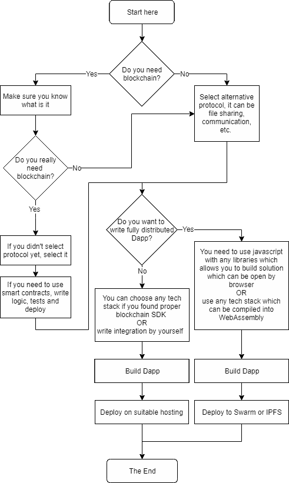

# 步入您的第一个应用程序

> 原文：<https://medium.com/coinmonks/step-into-your-first-%C3%B0app-38e485348c3c?source=collection_archive---------1----------------------->

Photo by [Bernard Hermant](https://unsplash.com/photos/z9AOxTYQBy4?utm_source=unsplash&utm_medium=referral&utm_content=creditCopyText) on [Unsplash](https://unsplash.com/?utm_source=unsplash&utm_medium=referral&utm_content=creditCopyText)

在过去的 10 年中，我们已经看到了许多类型的软件架构。我们从 monolith 应用程序开始，转向微服务，最终体验到了无服务器架构的滋味。这些类型的架构主要与 web 开发相关。

在最近 3 年中，分布式技术的巨大发展使我们能够构建分散和分布式的应用程序。数据存储可以被分布式分类账所取代。认证/授权层可以由加密技术代替。敏感数据可以归其所有者所有。业务逻辑可以极简透明。

今天，我们有许多项目提供点对点通信和可靠的隐私级别。他们解决了成千上万的参与者之间的共识的挑战，以及处理像区块链的区块链多维抽象。**这很复杂！:)**

你可能会觉得它还没有准备好。采用率低，哈希函数有碰撞的机会，密码学可以被蛮力攻击，通信信道可以被攻破，可信的对等点可以被黑……但不管怎么说，它比[这个](https://www.nytimes.com/2019/03/13/technology/facebook-data-deals-investigation.html)要好得多。

一个**(**Dapp，Dapp** ，**app**， **dApp** 或 **DApp** )是一个运行在[分布式计算](https://en.wikipedia.org/wiki/Distributed_computing)系统上的计算机[应用](https://en.wikipedia.org/wiki/Application_software)。**

## **尝试构建您的第一个应用程序！**

# **#转到**

****

# **参考数量**

## **基础**

**如果你真的不知道用哪个区块链，[这个](https://www.reddit.com/r/CryptoCurrency/comments/91aikw/an_updated_blockchain_platform_comparison_chart/)可能会有帮助。**

1.  **[比特币](https://bitcoin.org/bitcoin.pdf)**
2.  **[什么是以太坊](https://github.com/ethereum/wiki/wiki/What-is-Ethereum)**
3.  **[EOS](https://eos.io/)**
4.  **[创](https://tron.network/)**
5.  **[应用审查](https://dapp.review/)**

## **中间的**

1.  **[坚固度](https://solidity.readthedocs.io/en/latest/)(适用于以太坊和创)**
2.  **[威博](https://vyper.readthedocs.io/en/latest/)**
3.  **[网页开发技巧](https://github.com/kamranahmedse/developer-roadmap)**
4.  **[在 20 分钟内构建一个 Dapp](https://www.youtube.com/watch?v=KkZ6iYnSDRw)**
5.  **[EOSIO。CDT(合同开发工具包)](https://eosio.github.io/eosio.cdt)**
6.  **[应用程序开发](https://github.com/ethereum/wiki/wiki/%C3%B0app-development)**
7.  **IDE ( [VS Code + solidity 插件](https://marketplace.visualstudio.com/items?itemName=JuanBlanco.solidity)、 [Remix](https://remix.ethereum.org/) 、 [Embark](https://embark.status.im/) )**
8.  **图书馆( [web3js](https://web3js.readthedocs.io/en/latest/)**
9.  **DevTools ( [松露](https://truffleframework.com/truffle)，[加纳切](https://truffleframework.com/ganache))**
10.  **参考实现( [OpenZeppelin](https://openzeppelin.org/) )**

## **先进的**

1.  **[固态常见模式](https://solidity.readthedocs.io/en/latest/common-patterns.html) ( [固态积垢](/robhitchens/solidity-crud-part-1-824ffa69509a)，[模式](https://github.com/fravoll/solidity-patterns))**
2.  **[ERCs](https://eips.ethereum.org/erc) —以太坊改进建议**
3.  **安全([注意事项](https://solidity.readthedocs.io/en/latest/security-considerations.html)、[安全工具](https://consensys.github.io/smart-contract-best-practices/security_tools/))**
4.  **[ENS](https://ens.domains/)**
5.  **[网络组装](https://webassembly.org/)**
6.  **非区块链 dapps，看看 swarm 或[星云](https://github.com/okamilab/nebula)项目上的 [dapps。](https://github.com/ethereum/swarm-dapps)**

## **很高兴跟随**

1.  **[以太坊新闻周](https://www.weekinethereum.com/)**
2.  **[Reddit:/r/以太坊](https://www.reddit.com/r/ethereum/)**

**希望这有所帮助。祝你好运！**

> **[直接在您的收件箱中获得最佳软件交易](https://coincodecap.com/?utm_source=coinmonks)**

****