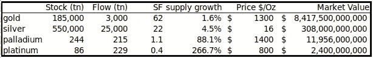
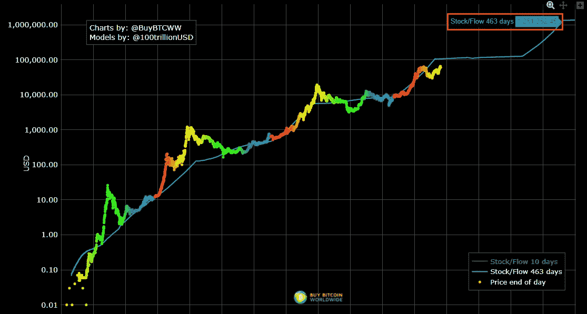
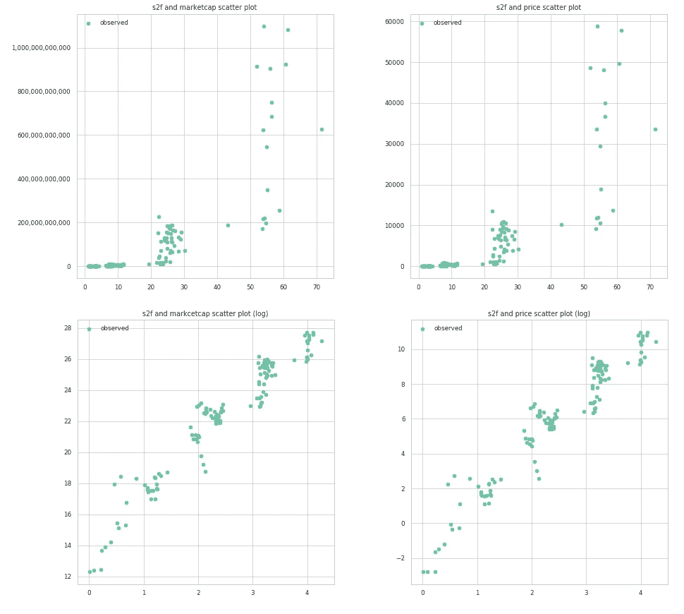
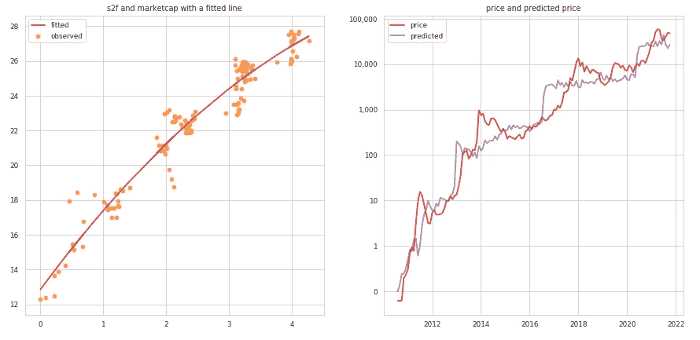
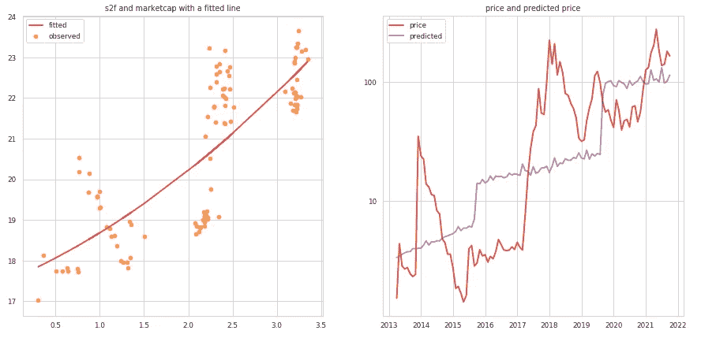

# 股票到流量模型和超越~比特币市值和价格顶部~

> 原文：<https://medium.com/coinmonks/stock-to-flow-model-and-beyond-bitcoin-marketcap-and-price-top-6bb2fedf1a2c?source=collection_archive---------4----------------------->

[在上一篇文章](https://yuyasugano.medium.com/stock-to-flow-model-for-btc-ltc-is-ltc-silver-in-crypto-7abbbd8f3f0e)中，我们复制了 PlanB 的比特币股票到流量模型，并对比特币&莱特币应用了相同的简单回归技术。结果，我们没有观察到莱特币的 ln(marketcap)和 ln(s2f)之间的密切关系。我们认为 S2F(库存-流量)是市值和产出价格的关键驱动因素之一，但我们得出的结论是，将有更多的空间来改进回归模型，使其朝着具有多个解释变量的多项式或多元回归方向发展，或者通过使用机器学习技术中更复杂的方法。[【1】](/coinmonks/stock-to-flow-model-for-btc-ltc-is-ltc-silver-in-crypto-7abbbd8f3f0e)

在这里，我想调整一下这个简单的回归模型，用曲线拟合代替直线，预测比特币的最大市值。稍后我将解释为什么我们采用曲线拟合。在未来的实验中，我们将看到来自硬币指标的假设解释变量的相关性，不仅是 S2F 比率，还会选择其他变量来模拟市值(和价格)。这些连续的实验依赖于 Python、Anaconda3、Jupyter notebook 和 scikit-learn heavy。请提前查看 github 资源库，之前的模型是如何实现的。[【2】](/coinmonks/stock-to-flow-model-for-btc-ltc-is-ltc-silver-in-crypto-7abbbd8f3f0e)

在这篇文章中，我得出结论，比特币的最大市值为 **12.8 万亿美元**，每枚比特币的最高价格约为 **61 万美元**。


Image by [Jan](https://pixabay.com/users/janjf93-3084263/) from [Pixabay](https://pixabay.com/).

# 放弃

本文既不是投资建议，也不是买卖任何投资的建议或邀约，不应用于评估做出任何投资决定的价值。不应将其作为会计、法律或税务建议或投资建议的依据。此处反映的内容可能会更改，但不会更新。这只是为了信息和娱乐的目的。

专门从事加密货币的对冲基金潘迪拉资本在 2020 年 4 月[预测，通过使用这种模型，比特币到今年 8 月可能会涨到 115，000 美元。当然，正如你已经知道的，BTC 价格回到了 60，000 美元左右，但价格还没有飙升到 115，000 美元的水平。为什么？首先，S2F 模型关注供应方资产稀缺性，并应用回归技术预测未来价格。如果没有需求和购买力，供给就没有任何意义。"如果你不渴，为什么要买一瓶水？"](https://blog.panteracapital.com/out-performing-bitcoin-pantera-blockchain-letter-june-2020-1d0ac9ec3482)

我还看到了 S2F 线性回归模型的一个缺陷。随着一些加密货币的减半机制或枯竭性质，它们的通货膨胀率将会下降。这显然意味着 S2F 值会在某个点收敛到无穷大。为什么？因为当流量收敛到零时，SF =股票/流量会收敛到无穷大，不是吗？如果你对这个数学不熟悉，在[这个链接](https://www.britannica.com/science/convergence-mathematics)里有一个清晰的解释。当 x 趋近于零时，y = 1 / x 收敛到无穷大。

但这有什么关系呢？这是我的观点，它违背了我的直觉。市值不应该随着 S2F 比率的增加而趋于无穷大。当我们得到一个相当低的比特币通货膨胀率时(可能在 20xx 年末？)比特币 S2F 会是一个超出我们理解的大数字。比如看下面[全球买比特币](https://stats.buybitcoinworldwide.com/stock-to-flow/)中 S2F 模型的现场图。即使在 2026 年，比特币的 S2F 也达到了 1251。我觉得这是一个很可笑的数字，不是吗？请比较一下商品的 S2F 值和这个大数字。



[Bitcoin stock to flow model live chart](https://stats.buybitcoinworldwide.com/stock-to-flow/)

事实上，S2F 模型已经[显示了比特币的背离](https://finance.yahoo.com/news/bitcoin-stock-flow-model-rooted-153030252.html)，加上上面提到的怀疑，这些因素导致我考虑使用二次公式而不是线性公式来使用线性回归。请看下面上一篇文章中的散点图。我认为曲线拟合将适合 ln(市值)或 ln(价格)和 ln(s2f)之间的关系的两个底部数字。我不确定你是否同意我在这一点上的观点，但让我们尝试对我们在上一篇文章中使用的比特币数据点应用二次多项式，看看有什么变化。



scatter plots for relationships between price, marketcap and s2f ratio

其结果优于只有一个解释变量 x 的单项线性回归。R2 得分约为 0.942，之前的得分约为 0.929。RMSE 的价值远不如以前。斜率:[ 4.88866069 -0.34410739]和截距:12.823011544354943 是新值，因为我们对数据应用了 2 次多项式特征。在下面的左图中，您可以看到 ln(marketcap)和 ln(s2f)之间关系的抛物线拱，看起来很好。根据这个公式，即使流量接近于零，市值也不可能无限增长。必须有一个极限值。

```
RMSE value: 0.7885547671768061
R2 score: 0.9420852514169283
Slope: [ 4.88866069 -0.34410739], Intercept: 12.823011544354943
F-statistic: [1742.51558568  603.35556066], P-value: [2.68246322e-78 2.86127359e-51]
```



linear regression fit for bitcoin price, marketcap and s2f ratio with polynomial

酷毙了。这个抛物线拱应该有一个顶部，这是最高市值和最高价格所在的点。我们如何计算呢？让我们回忆一下小时候的高中数学。可以通过求 f'(x) = 0 来求解。这是抛物线拱门的顶部。现在我们得到了回归公式 ln(market cap)= 4.88866069 * ln(s2f)-0.34410739 * ln(s2f)+12.823011544354943 因此 ln '(market cap)= 4.88866069-0.68821478 * ln(s2f)。是的，然后在 ln(market cap)中填零。ln(s2f) = 7.103393928854594。现在是派对时间。我们可以在模型中给出计算出的 ln(s2f)来预测比特币的最大市值。 **12.8 万亿美元**是这个公式中市值的顶部。

```
# Predict the maximum marketcap for Bitcoin in theory
import math
lncap_pred_2d_max = clf_reg5.predict(poly2d.fit_transform(np.array([7.103393928854594]).reshape(-1, 1)))
print(math.exp(lncap_pred_2d_max))
**12871706837897.213**
```

接下来让我们对最高价格做同样的事情。同样，我们得到了 ln(价格)的公式。ln(价格)= 4.12114332 * ln(s2f)-0.25017018 * ln(s2f)-2.3420495638245775 因此 ln '(价格)= 4.12114332 -0.50034036*ln(s2f)。ln(s2f) = 8.23667976734877 为 s2f 比值。我在后一个模型中给了这个值 8.23667976734877 来预测最高价格。每枚比特币大约相当于**22.5 万美元**。你可能已经注意到它会自动折叠。为什么？如果一个比特币达到 225，000 美元，总市值应该是 225，000*21，000，000 = 47.25 亿美元。只有 4 万亿美元。在这种情况下，我考虑了 ln(marketcap)和 ln(s2f)之间的关系，回到了基本的库存流量比的含义。

```
# Predict the maximum price for Bitcoin in theory
import math
lnprice_pred_2d_max = clf_reg6.predict(poly2d.fit_transform(np.array([8.23667976734877]).reshape(-1, 1)))
print(math.exp(lnprice_pred_2d_max))
**2258518.401289206**
```

那么一个比特币应该是多少钱呢？12.8 万亿除以 2100 万等于 609523。因此，让我们说，在这种关系中，每比特币的目标最高价格大约是 **61 万美元**。我希望这能在一定程度上为你的投资组合管理和交易提供线索。同样，这篇文章只是为了提供信息和娱乐目的而写的。请记住我们谈到的一些假设，这只是根据过去的数据做出的预测。此外，由于 API 质量和供应数据中流量和 S2F 比率的计算，使用的数据点可能不太准确。一些数据点可能错误地误导了模型中的关系，这可能会彻底改变模型。

库存到流量(S2F)模型只是从供给侧的角度，没有考虑需求侧。S2F 一直用于商品和自然资源，历史上用于供应和库存有限的稀缺资产，流量比率被认为是市值驱动力的因素。本文从 PlanB 对比特币采用 S2F 模型的预测出发，用多项式二次回归改进了单项线性回归。这里只涉及一个解释变量，但你也可以通过引入其他变量来做实验。例如，所有加密货币的总市值是一个良好的开端。

这对于比特币来说听起来很现实，不是吗？现在让我们以同样的方式尝试 Litcoin。从之前的实验中，我们已经知道直线拟合对 Litecoin 来说效果不好，因为数据点非常分散，但我认为这种多项式方法可以稍微改善模型。实际上我们需要做更多的实验来找到一个通用的密码模型，这是我自己下一步研究的课题。我会继续在刊物上发帖。下面我们来看看 Litecoin 的一个结果。

```
RMSE value: 1.276074289131451
R2 score: 0.6321432338250261
Slope: [0.949971   0.19375913], Intercept: 17.54290185046642
F-statistic: [169.42702697 167.51519204], P-value: [2.49723157e-23 3.58060760e-23]
```



linear regression fit for litecoin price, marketcap and s2f ratio with polynomial

嗯……不太好用。ln(价格)上的参数是正的，这意味着这是一个与我们在比特币案例中看到的相反的抛物线。当莱特币减半时，价格运动滞后，导致数据点的市值和价格下降。我认为，如果我们有更多的数据点，稀缺类型的资产将遵循类似的抛物线拱。我只能在这个实验中获得 2013 年 4 月的莱特币数据点。以后再来研究莱特币吧。

我将在下一篇文章中查看更多可能的变量，并尝试在 scikit-learn 库中应用更复杂的算法。只要我们看到，只有比特币似乎符合 S2F 驱动的方法(或者其他加密技术可能在更长时间内追随比特币)。这是一场精彩的比赛。但我的目标是建立一个通用模型，它也可以适用于其他密码(特别是那些与比特币有相似之处的密码，有限的供给，减半或递减的通货膨胀，在某种程度上类似的特征)。

本文使用的 jupyter 笔记本上传于 [github](https://github.com/yuyasugano/stock-to-flow-model/blob/main/Stock-to-flow%20model%20in%20crypto%20and%20beyond%20Polynomial%20Regression.ipynb) 。

# 参考

*   [1][BTC&LTC 的库存到流动模型。LTC 银在 crypto 吗？](/coinmonks/stock-to-flow-model-for-btc-ltc-is-ltc-silver-in-crypto-7abbbd8f3f0e)
*   [2][yuya suga no/股票到流动模型](http://references%20[1]%20yuyasugano/pancake-bakery-arbitrage%20[2]%20Comparison%20betwen%20Flashloan%20providers:%20Aave%20vs%20dYdX%20vs%20Uniswap%20[3]%20Flash%20Swaps%20%E2%80%94%20Uniswap%20V2)