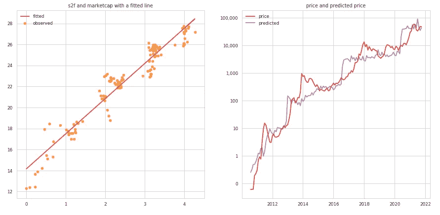

# BTC 和 LTC 的库存到流量模型。LTC 银在 crypto 吗？

> 原文：<https://medium.com/coinmonks/stock-to-flow-model-for-btc-ltc-is-ltc-silver-in-crypto-7abbbd8f3f0e?source=collection_archive---------1----------------------->

最近，当比特币的预测价格开始偏离曲线时，许多人对 S2F(股票到流量)模型投以怀疑的目光。S2F(库存-流量)比率在传统金融中用于商品和自然资源。比特币的供应量是有限的。这意味着我们的 BTC 供应量有限，每个区块的开采量也可以保持不变，直到下一个减半。它越来越稀缺，系统从第一天起就在基本的区块链协议中定义了可开采的数量。这是 PlanB 文章的出发点，为什么我们认为 S2F 可以像市场上的其他稀缺资产一样适用于 BTC。[【1】](/@100trillionUSD/modeling-bitcoins-value-with-scarcity-91fa0fc03e25)

专门从事加密货币的对冲基金潘迪拉资本在 4 月 [2020](https://blog.panteracapital.com/out-performing-bitcoin-pantera-blockchain-letter-june-2020-1d0ac9ec3482) 预测，通过使用这种模型，比特币到今年 8 月可能会涨到 115，000 美元。当然，正如你已经知道的，BTC 价格回到了 60，000 美元左右，但价格还没有飙升到 115，000 美元的水平。为什么？首先，S2F 模型关注供应方资产稀缺性，并应用回归技术预测未来价格。如果没有需求和购买力，供给就没有任何意义。"如果你不渴，为什么要买一瓶水？"回归技术也是一种通过学习数据中的特征和观察值之间的关系来从过去的数据预测值的方法。

我想测试一下莱特币(LTC)的 S2F 模型，看看 S2F 是否能在加密货币市场中得到普遍应用。使用更深刻的方法将是未来研究的主题。


Image by [Jan](https://pixabay.com/users/janjf93-3084263/) from [Pixabay](https://pixabay.com/).

# 放弃

本文既不是投资建议，也不是买卖任何投资的建议或邀约，不应用于评估做出任何投资决定的价值。不应将其作为会计、法律或税务建议或投资建议的依据。此处反映的内容可能会更改，但不会更新。这只是为了信息和娱乐的目的。

我想知道为什么人们只申请比特币的 S2F。当然，人们可能会说，从长远来看，比特币只能在加密货币中发挥重要作用，因此其他加密货币不能以同样的方式对待。但其他一些加密货币也具有有限供给和减半机制或耗尽机制。这听起来对我来说，那些资产也可以被视为自然资源，它们可能适用于 S2F 模型。我选择 **LTC(Litecoin)** 来应用 S2F，并通过使用相同的简单回归技术来确认差异。

起初，我使用 Anaconda3 和内置的 scikit-learn 库复制了比特币 s2f 模型。请注意，我计算了从 [**CoinMetric API**](https://docs.coinmetrics.io/api/v2#tag/Metrics) 获得的数据点中的流量和 S2F 比率。所以这些计算出来的值可能和其他人使用的不一样，包括文章中的 PlanB。流量数据也是通过减去前几个月的供应量并乘以 x12 来计算的，即假设年产量。这不是基于块的方法的精确计算(例如，从比特币中产生的平均块来估计块生产率)。

这是 2 x 2 的散点图。该组合由实际数字和自然对数数字以及 s2f 和 marketcap 或 s2f 和价格组成(左上:s2f 和 marketcap 在实际中，右上:s2f 和价格在实际中，左下:S2F 和 marketcap 在日志中，右下:S2F 和价格在日志中)。我用同样的方法对数值(本实验中不是轴)做自然对数，结果发现 ln(marketcap)或 ln(price)和 ln(s2f)之间有明显的线性关系。


scatter plots for relationships between price, marketcap and s2f ratio

我使用了一个简单的回归技术，并拟合了如下模型。正如所解释的，数据点必须与原始文章不同，我从 2010 年 8 月开始获取数据，这在 API 上是可用的。但是结果很相似，看起来也不差。斜率:3.34754805，截距:14.138984154543218 也没问题(普兰布公式:ln(y) = 3.31954 ln(x) + 14.6227，R2 得分为 0.947328)。我想以此为基线，在下一段扩展到 Litecoin(LTC)。如果你想预测比特币的未来价格，只需调用模型并给它未来假设的 S2F 值。github 中的所有代码都可以重现结果。

```
RMSE value: 0.9655475133041838
R2 score: 0.9290861664837493
Slope: [3.34754805], Intercept: 14.138984154543218
F-statistic: [1742.51558568], P-value: [2.68246322e-78]
```



linear regression fit for bitcoin price, marketcap and s2f ratio

# 对莱特币(LTC)使用库存-流量模型

第一点是，如果我们对莱特币(LTC)使用库存-流量模型会怎么样，但在这背后，我有一个假设，即具有有限供应和温和通胀或消耗机制(如自然资源)的加密货币也将在市场上面临同样的稀缺问题。因此，从存量到流量的模型在一定程度上不仅适用于比特币，也适用于其他加密货币。我认为值得对其他密码进行同样的测试，如 Cardano/ADA(450 亿 ADA)、Polygon/Matic(100 亿 Matic)或 Vechain/VET(86，712，634，466 VET)，我将在稍后讨论。

Litecoin 的数据点不同，因为旧的数据点在 API 上不可用。我从 2013 年 4 月开始运行相同的代码来收集数据。这可能影响了回归的结果，因为一些早期的数据丢失了。我为每个价格、市值和 S2F 比率绘制了一个线图，如下所示。这些是实数。而不是 S2F 比值本身，我确实看到了一个图表模式，即市值和价格在减半后的某个时候爆发并触及 ATH，莱特币的 S2F 值目前约为 25。


line plot price, marketcap and s2f ratio

这是 PlanB 文章的引文，我们确认 S2F 值 25 接近银牌的 S2F 值 22。白银市值在 2300 亿左右。在那篇文章中，黄金和白银点可以为比特币市场的 ln(marketcap)和 ln(s2f)之间的线性关系提供一些信心。但从这个稀缺水平(s2f=25)来看，莱特币的价格在我看来是被低估了(当然这只是从供应方的角度好像是自然资源)。

> 很有意思的是，黄金和白银这两个完全不同的市场，对于 SF 来说，是符合比特币模型价值观的。这给了模型额外的信心。请注意，在 2017 年 12 月牛市的顶峰时期，比特币 SF 为 22，比特币市值为 2300 亿美元，非常接近白银。

这是同样的 2 x 2 散点图。该组合由实际数字和自然对数数字以及 s2f 和 marketcap 或 s2f 和价格组成(左上:s2f 和 marketcap 在实际中，右上:s2f 和价格在实际中，左下:S2F 和 marketcap 在日志中，右下:S2F 和价格在日志中)。我用同样的方法对数值(本实验中不是轴)做自然对数，结果发现 ln(marketcap)或 ln(price)和 ln(s2f)之间有明显的线性关系。


scatter plots for relationships between price, marketcap and s2f ratio

嗯……这里面没有美。即使在拟合模型之前，我也看不出 Litecoin 的 ln(marketcap)和 ln(s2f)之间有任何强有力的联系…现在让我们试着建模吧。R2 分数大约是 0.626，这是不好的。斜率:1.71572674，截距:16.936876879198。当我看右边的图表时，我认为价格在某种程度上遵循了预测价格，偏差很大。看起来价格运动只是在减半后有所滞后。回归结果并不精确，但是 S2F 比率仍然是价格变动的主要驱动因素。

```
RMSE value: 1.295592692853654
R2 score: 0.6265166202843409
Slope: [1.71572674], Intercept: 16.934506876879198
F-statistic: [169.42702697], P-value: [2.49723157e-23]
```


linear regression fit for bitcoin price, marketcap and s2f ratio

如果我们考虑莱特币的采用水平和人们对莱特币的看法，莱特币可能有空间赶上大约 2400 亿的预期市值，这是白银的市场规模，S2F 比率为 22。这使得 Litecoin 在当前榜单中排名第三，每枚硬币的价格约为 3300 美元。当然，有许多因素不仅依赖于这个回归模型，还依赖于代币的主导地位、市场需求、法规等。但如果 S2F 模型在某种程度上对比特币和类似资产是合法的，并且当莱特币被更广泛地了解和采用时，这一假设将是现实的。

在 [CoinMarketCap](https://coinmarketcap.com/currencies/litecoin/) 中有这样的解释“截至 2021 年 1 月，莱特币是最广泛接受的加密货币之一，现在全球有超过 2000 家商家和商店接受 LTC”。它在场景中越来越有用和体面，我认为它正在被大规模采用。这是时间问题。

下一个。其他密码呢？比如卡尔达诺/阿达？

我们是否看到了比特币、莱特币和 ADA 之间的相似之处？是的，这些资产具有有限供给和通胀机制。而比特币、莱特币有减半机制，ADA 有自己的通货膨胀机制，通货膨胀率会逐渐降低。根据下面这篇文章，卡尔达诺通货膨胀率越来越低，预计 2030 年后将出现通货紧缩。我们有两个公式来计算 ADA 通货膨胀率如下。[【2】](https://solberginvest.com/blog/is-cardano-deflationary/)

1.  在任何时候，每个时期(5 天)都不会释放超过 0.3%的储备 ADA，在 Cardano 网络中最多可以释放 0.3%的储备。
2.  释放的 ADA 等于 0.3%乘以 ADA 的循环供应量的百分比。通货膨胀率将趋于零，但永远不会为零。

[](https://solberginvest.com/blog/is-cardano-deflationary/) [## 卡尔达诺是通货紧缩吗？阐述了 ADA 的表征组学

### ADA 是卡尔达诺区块链的本地加密货币，是一种令人兴奋的加密技术，拥有强大的追随者。在这个…

solberginvest.com](https://solberginvest.com/blog/is-cardano-deflationary/) 

> **卡尔达诺不通缩，但 2030 年及以后会通缩。目前，通货膨胀率为 5.7%。然而，通货膨胀率随时间呈指数下降，2030 年将为每年 0.9%。假设每年由于人为错误损失 1%的供给，卡尔达诺将会出现通货紧缩。**

现在你已经注意到 ADA 有一个动态的组合，用储备和流通中的股份比例来供给通货膨胀机制。这是我用来获取数据并对 ADA 应用相同函数的表格，S2F 值不像比特币和莱特币那样稳定，似乎不会影响价格行为(只有 10 个数据点)。但同样，和莱特币一样，我想强调的是，ADA 的 S2F 已经是一个很大的数字了。让我们记住 S2F 比例在这里是什么意思。这意味着以目前的年流动速度，需要 2F 年才能赶上目前的供应量。

艾达比我想象的要少得多。这 10 个数据点的平均 S2F 为 41.241，因此理论上 4700 亿是目标市值。这意味着根据 S2F 模型，ADA 有每枚硬币 10 美元的潜力。


line plot price, marketcap and s2f ratio

有些人可能会说，嘿，你在开玩笑吗？密码市场没有空间让其他代币增长到那个水平。因为比特币的主导地位一直在 50%左右(今天为 47.6%)，并将继续作为价值储存手段。从长远来看，这是比特币扮演的一个重要角色。我听说密码的总市值最高将达到 10 万亿美元，不会超过这个数字。但保守地说，从比特币在市场上被比作黄金和白银这一事实来看，只有比特币可能符合这一政策。其他加密货币不仅可以用于储值目的，还可以作为交换媒介，用于将本地代币与 Dapps 代币、股票、衍生品和应用程序进行交换。

在互联网时代，人们需要一个电路来连接到互联网，但他们不需要为访问网站和应用程序付费。在 crypto 时代，人们也不需要为使用 Dapps 和玩游戏付费，而是需要拥有一些令牌(至少现在包括原生令牌)。因此，加密市场的规模和价格不能仅从 S2F 模型来讨论，S2F 模型适用于商品和自然资源，尤其是在第 1 层区块链上运行应用程序的本地令牌。有一天，人们将无法想象没有 web3 和去中心化应用的生活，就像我们无法想象没有互联网和移动设备的生活一样。从这个本质上来说，随着[的大规模采用](https://cointelegraph.com/news/what-does-mass-adoption-mean-relating-to-crypto-experts-answer)，其他代币肯定有很大的空间来获得牵引力并比我们想象的增长更多。

从这个角度来看，我们可以尝试其他方法，例如将回归模型改进为多项式或具有多个解释变量的多元回归。或者我们可以使用 scikit-learn 库中机器学习技术的更复杂的方法。本文使用的 jupyter 笔记本上传于 github 如下。

[https://github.com/yuyasugano/stock-to-flow-model](https://github.com/yuyasugano/stock-to-flow-model)

# 参考

*   [1] [用稀缺性建模比特币价值](/@100trillionUSD/modeling-bitcoins-value-with-scarcity-91fa0fc03e25)
*   【2】[卡尔达诺是通货紧缩吗？ADA 的标记组学](https://solberginvest.com/blog/is-cardano-deflationary/)
*   [3][yuya sugano/库存到流程模型](http://References [1] yuyasugano/pancake-bakery-arbitrage [2] Comparison betwen Flashloan providers: Aave vs dYdX vs Uniswap [3] Flash Swaps — Uniswap V2)

> 加入 Coinmonks [电报频道](https://t.me/coincodecap)和 [Youtube 频道](https://www.youtube.com/c/coinmonks/videos)了解加密交易和投资

## 另外，阅读

*   [如何在 Uniswap 上交换加密？](https://blog.coincodecap.com/swap-crypto-on-uniswap) | [A-Ads 审查](https://blog.coincodecap.com/a-ads-review)
*   [WazirX vs CoinDCX vs bit bns](/coinmonks/wazirx-vs-coindcx-vs-bitbns-149f4f19a2f1)|[block fi vs coin loan vs Nexo](/coinmonks/blockfi-vs-coinloan-vs-nexo-cb624635230d)
*   [本地比特币评论](/coinmonks/localbitcoins-review-6cc001c6ed56) | [加密货币储蓄账户](https://blog.coincodecap.com/cryptocurrency-savings-accounts)
*   [比特币基地评论](/coinmonks/coinbase-review-6ef4e0f56064) | [德里比特评论](/coinmonks/deribit-review-options-fees-apis-and-testnet-2ca16c4bbdb2) | [FTX 评论](/coinmonks/ftx-crypto-exchange-review-53664ac1198f)
*   [n 零审核](/coinmonks/ngrave-zero-review-c465cf8307fc) | [Phemex 审核](/coinmonks/phemex-review-4cfba0b49e28) | [PrimeXBT 审核](/coinmonks/primexbt-review-88e0815be858)
*   最佳[区块链分析](https://bitquery.io/blog/best-blockchain-analysis-tools-and-software)工具| [赚比特币](/coinmonks/earn-bitcoin-6e8bd3c592d9)
*   [加密套利](/coinmonks/crypto-arbitrage-guide-how-to-make-money-as-a-beginner-62bfe5c868f6)指南| [如何做空比特币](/coinmonks/how-to-short-bitcoin-568a2d0b4ae5)
*   [德国最佳加密交易所](https://blog.coincodecap.com/crypto-exchanges-in-germany) | [Arbitrum:第二层解决方案](https://blog.coincodecap.com/arbitrum)
*   [币安交易机器人](/coinmonks/binance-trading-bots-d0d57bb62c4c) | [OKEx 评论](/coinmonks/okex-review-6b369304110f) | [Atani 评论](https://blog.coincodecap.com/atani-review)
*   [最佳加密交易信号电报](/coinmonks/best-crypto-signals-telegram-5785cdbc4b2b) | [MoonXBT 评论](/coinmonks/moonxbt-review-6e4ab26d037)
*   [Godex.io 审核](/coinmonks/godex-io-review-7366086519fb) | [邀请审核](/coinmonks/invity-review-70f3030c0502) | [BitForex 审核](https://blog.coincodecap.com/bitforex-review)