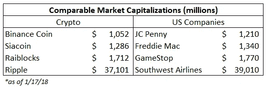

# 停止对加密的投资(来自某个投资巨大的人)

> 原文：<https://medium.com/coinmonks/stop-investing-in-crypto-from-someone-heavily-invested-8044d1664b38?source=collection_archive---------0----------------------->

*注意:我不是财务顾问，这不被视为财务建议，它仅仅是我的观点，在没有与合格的专业人士交谈之前，不应进行任何投资。*

## 背景

鉴于这是我的第一个媒体故事，我想简单介绍一下是合适的。我第一次接触比特币是在 2011 年，是由我看似疯狂的哥哥介绍的。我意识到了它的存在，但从未想过它的潜力或我的参与。几年后，我在大学学习金融，比特币似乎越来越受欢迎。最初，像大多数进入这个领域的人一样，我被价格上涨和赚钱的机会所吸引。

Live look at why most people get into crypto

我那时开始投资，我学到的第一件事，套用沃伦·巴菲特的话，就是永远不要投资你不了解的东西。为了听从他的警告，我决定尽可能多地了解比特币。从 Satoshi 著名的[白皮书](https://bitcoin.org/bitcoin.pdf)(每个参与其中的人都应该阅读)开始，我开始在网上搜索，关注这个领域所有聪明的人。最终，事情拼凑在一起，我认识到了抵制审查、分散的货币体系的真正潜力。(见[安德里亚斯·安东诺普洛斯](https://www.youtube.com/watch?v=oaMnJIAUKa8)和业内任何人一样清楚地总结了这一点)

然后开始向兔子洞深处下降…

## 为什么你应该(可能)停止投资加密

回到文章的原点。所以，你已经开始把钱投入到 cryptos，你可能已经取得了高百分比的回报。也许你做过研究，对比特币有很强的理解，也许你知道以太坊是一个支持智能合约的平台，也许你被 Monero 和它提供的强大隐私所吸引。你不断赚钱，所以你决定继续购买越来越多的硬币…..停下来。！

事实是，你可以从波洛涅克斯或币安的帽子里随便挑出不同名称的硬币，在当前的环境下，你可能会赚到钱。希望你不会天真到认为这种情况会无限期地持续下去。我非常尊敬的一个名字，Naval Ravikant，在这方面提供了很好的见解:

如果你认为你将成功地把钱投入到各种替代货币中，并持续赚钱，那你就错了。这不是如果的问题，而是你什么时候会被烧伤。我不知道 crypto 什么时候处于泡沫的顶峰，什么时候会破裂，但我知道当你的投资获得三位数以上的百分比回报时，被吸引是多么容易。我也知道，随着高回报而来的是寻求同样回报的大量资金流入。这导致愚蠢的资金被放在了不该放的地方，直到最终这些回报放缓。聪明的资金将开始获利，然后愚蠢的资金大量撤离，导致价格大幅下跌。(更新:这是一周前起草的，目前的价格下跌就是一个例子，当然有几个因素在起作用)

> [在您的收件箱中直接获得最佳软件交易](https://coincodecap.com/?utm_source=coinmonks)

为了揭示当前的价格，要破解前 30 枚硬币，你需要拥有 10 亿美元的[市值](https://coinmarketcap.com/)。虽然市值不是衡量硬币价值的完美标准，但这让人们对加密的现状有了一些看法。

这只是一个随机收集的可比较大小的硬币和公司来思考。由你来决定你是否相信这些估价是合理的。

## 也就是说…

许多硬币仍有很大的潜力。如果你做了大量的研究，并且真的相信硬币能提供什么，那么尽一切办法投资。我认为，从金融角度来看，一个平衡的、多样化的投资组合，加上偶尔的再平衡，是进入这个市场的最佳方式。

> *我还相信，数字货币不仅仅是一项好的投资，它能让你获得高回报，而且它们有潜力真正改变世界，对数十亿人的生活产生积极影响……*

…但那是另一天的文章。尽管文章标题如此，我仍然非常长期看好整个行业。

我在这里的观点是，市场上的非理性繁荣非常猖獗，成千上万枚硬币中的大多数都将失败。一旦这个新兴行业变得更加成熟和理性，你第一次进入这个市场的日子将会结束。

要打败死马，做你自己的研究。不，说真的。不要把你的钱投在你没有花大量时间研究的地方。否则你会发现自己在拿自己的财务玩俄罗斯轮盘赌，直到你损失惨重。

**资源**

如果我没有至少给你一些关于如何做你自己的研究的提示，这篇文章就不会那么有帮助。

*   在 twitter 上关注一些最聪明的人，阅读他们分享的文章，获得一些关于各种硬币的技术和基本面分析，或者听取他们对热门话题的看法
*   开始阅读白皮书，深入挖掘各种币和项目的网站。良好的通用分析指南是[宇航服 X](http://www.spacesuitx.org/) 框架
*   我强烈建议阅读安德烈亚斯·安东诺普洛斯[的《掌握比特币](https://www.amazon.com/Mastering-Bitcoin-Unlocking-Digital-Cryptocurrencies/dp/1449374042)和克里斯·伯恩斯克[的《加密资产](https://www.amazon.com/dp/B0743MPV9R/ref=dp-kindle-redirect?_encoding=UTF8&btkr=1),了解更多细节。

如果你喜欢你所读的，请随意“鼓掌”，它帮助我获得曝光率！我也喜欢听到反馈，所以评论总是很受欢迎。