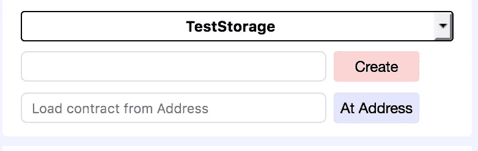
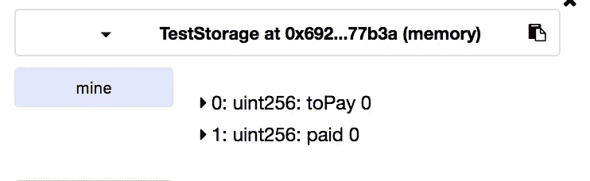
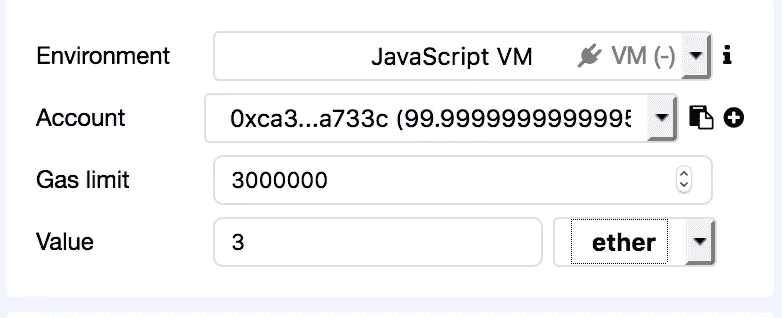
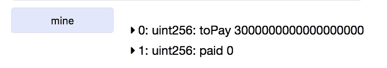

# 存储与存储的稳固性

> 原文：<https://medium.com/coinmonks/storage-vs-memory-in-solidity-8251847186fd?source=collection_archive---------1----------------------->


Lest we forget…

一个让你思考的简单例子

我今天看了一些 solidity 代码，我对它感到很困惑，所以我决定把它浓缩成一个简单的例子，解释内存和存储之间的区别。

使用 remix，我创建了一个契约，其结构映射如下

```
struct St {
        uint256  amountPaid;
        uint256  amountOut;
        bool registered;
}
mapping(address => St) store;
```

如果我想在某人汇款时更新他的`amountPaid`,我通常会这样做(忽略安全数学和其他重要问题)

```
function addMemFunds() public payable {
  St memory mine = store[msg.sender];
  mine.amountPaid += msg.value; // and the other members
  store[msg.sender] = mine;
} 
```

我很惊讶地发现下面的方法也有效。*

```
function addStorFunds() public payable {
  St storage mine = store[msg.sender];
  mine.amountPaid += msg.value;
}
```

*是的，它可能在文档中，但我从未找到它。
看起来我们是在使用一个指向结构的指针，而不是复制它。

完整的代码可以在 [github gist](https://gist.github.com/DaveAppleton/c13257ba5b68e04b4cfdbce501c9293e) 中找到，并且可以通过这个链接直接加载到 remix】中



Compile and launch the contract



click on “mine” to see the balance



Set a value



Click on either addStorFunds or addMemFunds and the value increases

一旦你这样做了，你可以通过调用带有值的`addMemFail`来证明没有它内存不会增加。你会看到点击`mine`显示该值没有被更新。

> [直接在您的收件箱中获得最佳软件交易](https://coincodecap.com/?utm_source=coinmonks)

[](https://coincodecap.com/?utm_source=coinmonks)