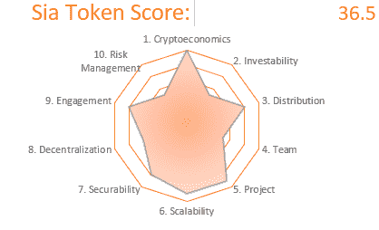

# 在新航储存或被储存

> 原文：<https://medium.com/coinmonks/store-or-be-stored-on-sia-6725e4618b20?source=collection_archive---------4----------------------->

# 加密的葫芦

深思熟虑的项目，具有良好的加密经济基础。看起来是可扩展的、安全的，并且有一个积极参与的社区支持它。担忧包括模糊团队的背景和对比特币的潜在依赖。结果得到 50 分中的 36.5 分。

[获得审核](http://cryptojungle.io/wp-content/uploads/2019/12/Sia-Audit.pdf)

[PDF 格式的完整报告](http://cryptojungle.io/wp-content/uploads/2019/12/Sia-Report.pdf)

# 概观

Sia 是一个点对点的云数据存储平台，由最初源于比特币的 Nebulous 技术构建。将具有备用存储容量的主机与需要存储数据的用户连接起来。

主机和用户之间的合同条款存储在 Sia 区块链上。主机需要使用 Sia 并定期证明用户文件可用。确保与用户达成的协议得到遵守。

区块链上的矿工验证宿主的声明，并获得金币作为奖励。

# 密码经济学(满分 5 分)

[Siacoin](https://messari.io/asset/siacoin/profile) 采用工作证明进行安全和令牌发射。价值是通过在网络上存储数据收取的交易费产生的。

通过要求主机提供存储证明，激励措施在利益相关方之间保持一致。他们需要定期证明他们同意存储的文件可供用户使用。

确保潜在用户的网络安全和令牌可用性。终点通胀率的目标是 2.3%。

网络效应是由主机产生的。主机越多，存储数据就越便宜，随着服务价格的下降，吸引了更多的用户。第二个影响是提供存储的合同选项非常灵活。提供多种存储数据方式的主机通过给用户更多的选择来吸引用户。

# 可投资性(5 分中的 2.5 分)

资本配置看起来很有规律。由[星云公司](https://www.linkedin.com/company/nebulousinc)驱动。，无法独立验证。在过去的 [90 天内](https://siastats.info/)，网络存储容量、存储提供商数量和存储用户数量都有所增加。

从网络存储服务的用户那里获取价值。进入需要用锡亚币支付。由于所提供的存储服务赚取的一部分费用支付给 Siafunds 令牌的持有人，这部分费用有所减少。

Siacoin 是首家推出市场且运营时间最长的分散式存储提供商，但其品牌并未获得预期的巨大收益。在围绕其融资过程的公关突击行动中，Filecoin 将分散存储概念的大部分注意力和信用都吸了进去。

提供存储是一个竞争异常激烈的领域，除了 Sia，还有许多集中式(Dropbox、AWS、谷歌等)和分散式(Storj、file 币、MaidSafeCoin 币)存储解决方案。除了成为低成本提供商之外，其他因素也让防御性变得很有挑战性。

# 分发(5 份中有 4 份)

Siacoin 的分销模式证明了其在没有预挖掘的情况下也能正常工作。通过持续释放新代币优化长期使用。

Siacoin 未发生代币销售。发展商须向 Siafund 代币持有人支付相等于合约存储价值 3.9%的奖励。专门分配给星云和其他内部人士，作为创建 Sia 的奖励。

sia 币通过采矿广泛分布。Siafunds 仅可由机构投资者购买，作为星云的流动性工具。

每年 2.3%的终点通胀限制了供应。这可能进一步限制了供应方烧掉存储主机所下注的代币，因为这些主机没有遵守与服务用户签订的合约条款。

# 团队(5 人中有 2.5 人)

推出 Siacoin 的 Inc . Inc .团队背景各异，主要技术专长相互重叠。这些背景似乎不包括存储行业或构建分布式计算系统的经验。

相反，他们决定分叉比特币并在此基础上进行构建。深信这将成为分散存储解决方案的坚实基础。他们在自己的 [Youtube 频道上透明而频繁地传达着自己的意图。](https://www.youtube.com/channel/UCYtlUu6bUghAca0ADmlxCKw)

# 项目(5 个中的 4.5 个)

该项目已上线，拥有活跃的[用户群](https://siastats.info/)。[白皮书](https://sia.tech/sia.pdf)写得很好，但只有短短的 6 页。它的代码是开源的。

团队频繁的公开沟通表明他们对文件存储生态系统的竞争力有着深入的了解。确立 Crypto Hulu 的独特价值主张，让它在人群中脱颖而出。优化服务，为网飞和 Hulu 等流媒体平台托管专业质量的视频内容。

# 可扩展性(5 个中的 4.5 个)

Nebulous Inc .拥有 15 名以上资质良好的员工。他们制定了详细的路线图，包括项目的长期、中期和短期目标。

该团队专注于改进开发人员工具。频繁更新新航的[软件开发包](https://sia.tech/get-started)。朦胧有什么似乎是一个可持续的燃烧率。因为他们是私人组织，所以不能被独立证实。

用户跨越[地球](https://sia.tech/)接入网络。

# 安全性(5 分之 4)

Siacoin 拥有超过 300 台存储主机[。持续的奖金被用来识别和解决错误。](https://siastats.info/)

Sia 团队致力于使采矿广泛分布。甚至开了一家公司 [Obelisk](https://obelisk.tech/) ，为网络建造采矿设备，试图维护公平。尽管做出了这些努力，采矿仍然合并成 4 个池。池中似乎有足够的参与者来形成相对分布的矿工网络。

奖励是分级的，Siafunds 持有人获得存储合同价值的 3.9%，Siacoin 持有人没有直接奖励。通过各种钱包选项轻松安全存放。

# 权力下放(五分之三)

这个项目得到了广泛的贡献，除了模糊的[之外，还有超过 30 名开发人员参与其中](https://gitlab.com/NebulousLabs)。存储主机在[世界](https://sia.tech/)随处可见。所有权是广泛分散的。

Sia 网络是 Nebulous Inc .的主要收入来源，该公司没有分散治理的计划，鉴于其对运营的重要性，未来也不太可能这样做。这使得 Nebulous 在 Sia 运作中的作用变得至关重要，如果没有他们的参与，该网络存活的可能性极小。

# 参与度(5 分之 4)

开发人员对该协议的采用程度很高，各种各样的项目都将其集成为存储解决方案。有一个大而活跃的 Reddit 社区欢迎新用户，也有同样高参与度的不和。

Twitter 情绪积极，包括经常提及。在加密冬天爆发期间，该项目在谷歌趋势上一直处于持续的下降趋势。

# 风险管理(5 分中的 2.5 分)

没有发生代码审核。被认为像比特币叉子一样结实。表现出一定的抗脆弱性，因为比特币自发行以来已被证明是抗脆弱的。需要对抗脆性进行独立确认，以对其坚固性充满信心。

融资风险较低，因为 Nebulous 已经筹集了美元资金来支持该项目。5 年的分散经营使监管风险降低。

虽然不是传统的攻击风险。Nebulous 在过去的通信中提到了用 Siacoin 交换另一项资产来运营网络的可能性，因为他们不认为这对项目的成功至关重要。

想开始进行你自己的审计吗？在这里下载[审计模板！](http://cryptojungle.io/wp-content/uploads/2019/10/CryptoJungle-Audit-Template.xlsx)

# 感谢阅读

注册我的[时事通讯](http://mpower365.com/newsletter-sign-up/)，了解我最新的加密资产研究。

> [直接在您的收件箱中获得最佳软件交易](https://coincodecap.com/?utm_source=coinmonks)

