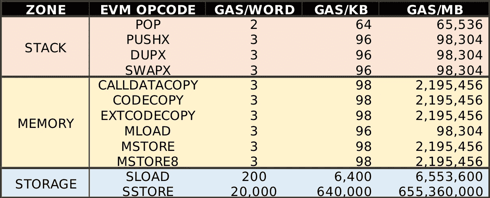
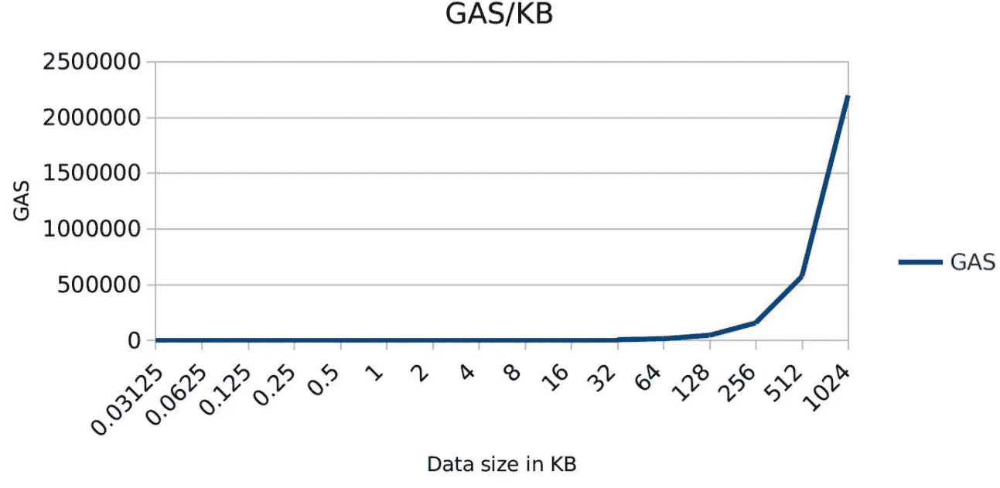
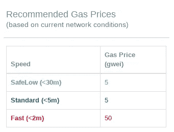
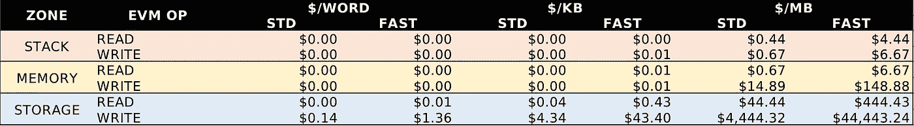

# 存储在以太坊上。分析成本

> 原文：<https://medium.com/coinmonks/storing-on-ethereum-analyzing-the-costs-922d41d6b316?source=collection_archive---------4----------------------->

当我们开发智能合同时，我们有不同类型的存储可用:

*   易失性堆栈访问:堆栈
*   易失性存储器访问:存储器
*   非易失性:存储

此外，我们还可以获得上下文信息:

*   与合同关联的代码
*   访问交易的数据字段

> 交易新手？试试[加密交易机器人](/coinmonks/crypto-trading-bot-c2ffce8acb2a)或者[复制交易](/coinmonks/top-10-crypto-copy-trading-platforms-for-beginners-d0c37c7d698c)

# 如何操作不同的存储类型

## 堆

除了 STOP、JUMPDEST 和 INVALID 操作之外，所有以太坊虚拟机操作(EVM 操作码)都使用堆栈来读取或写入堆栈。然而，我们将看到不执行任何计算就读取或写入数据的操作:

> 堆栈深度范围从 0 到最大值 1024

*   POP:获取堆栈顶部的值(0 级)
*   推送 1...PUSH32 (PUSHX):在堆栈顶部插入 X 个字节
*   DUP1…DUP16 (DUPX):在堆栈顶部复制 X 处的值
*   SWAP1…SWAP16 (SWAPX):交换 X 和堆栈顶部的值

## 记忆

对该存储器进行读取或写入的操作包括:

*   *CALLDATACOPY* :读取一个事务的数据字段，并加载到内存中
*   *CODECOPY* :读取与**当前合同**关联的代码，并加载到内存中
*   *EXTCODECOPY* :读取与**外部契约**相关联的代码，并将其加载到内存中
*   ***M****LOAD*:从存储器中读取一个值
*   ***M*** *存储*:在内存中存储一个字/32 字节的值
*   ***M****store 8*:在内存中存储一个 8 字节值

## 储存；储备

与堆栈和内存不同，存储在该内存上的数据将持久存储在约定地址上，以供将来访问。操作该存储器的操作是:

*   **S** 负载
*   **S** 店

值得一提的是，“S”和“M”分别表示存储和内存。

## 费用

所有以前的操作都有以气体单位表示的成本。当用户发送交易时，他/她设置每气单位的 ETH 价格。矿商已经设定了最低天然气价格，因此更高的最低天然气价格将获得更多利润，但会放弃更多交易。它产生了一个市场，在这个市场上，每种气体都可以进行乙烯醚交易。代码消耗的气体越少，执行代码所需的资源就越有效。下表显示了不同操作的天然气成本，具体取决于数据的大小:

最贵的是非易失性存储器。就 GAS 而言，当大小约为 KB 时，对存储器的操作类似于对堆栈的操作，但它随大小呈指数增长。下图显示了这种关系:

3*<words>+ROUND(POWER(<words>,2)/512,0)

如果我们根据[https://ETH gastation . info](https://ethgasstation.info/)在 ETH 中设定天然气价格:

2018/01/14 12:17 AM

我们可以根据 ETH 来估算每种存储类型的成本:

STD=5gwei, FAST=50gwei

上表中的数值是 ETH 中的价格。采矿者将包括具有更高价格的交易，因此当用户每气支付更多时，他/她的交易将更快地被包括在区块中。

最后，我们可以设置一个每以太网的价格，例如 1356.30 美元:

1356.3$ = 1 ETH, 2018/01/14 12:17 AM

# 结论

在以太坊上永久存储数据非常昂贵。使用以太坊存储数据是没有意义的。它应该只存储正常工作所需的数据，并将存储委托给其他解决方案:Swarm、Filecoin、IPFS 等。一个好主意是在外部服务上存储一个 [Merkle 树](https://en.wikipedia.org/wiki/Merkle_tree)根散列作为数据存储的防篡改。

此外，ETH 价格的意外快速上涨会将法定货币的运营成本提高到很高的水平。如果发生这种情况，矿商必须调整他们的最低天然气价格，以重新调整成本。

从天然气消耗的角度分析智能合同以控制运营成本非常重要。

# 参考

*   【https://ethereum.github.io/yellowpaper/paper.pdf 
*   [https://www.coindesk.com/ethereum-price/](https://www.coindesk.com/ethereum-price/)
*   [https://remix.ethereum.org](https://remix.ethereum.org)

> 加入 Coinmonks [电报频道](https://t.me/coincodecap)和 [Youtube 频道](https://www.youtube.com/c/coinmonks/videos)获取每日[加密新闻](http://coincodecap.com/)

## 另外，阅读

*   [复制交易](/coinmonks/top-10-crypto-copy-trading-platforms-for-beginners-d0c37c7d698c) | [加密税务软件](/coinmonks/crypto-tax-software-ed4b4810e338)
*   [电网交易](https://coincodecap.com/grid-trading) | [加密硬件钱包](/coinmonks/the-best-cryptocurrency-hardware-wallets-of-2020-e28b1c124069)
*   [密码电报信号](http://Top 4 Telegram Channels for Crypto Traders) | [密码交易机器人](/coinmonks/crypto-trading-bot-c2ffce8acb2a)
*   [最佳加密交易所](/coinmonks/crypto-exchange-dd2f9d6f3769) | [印度最佳加密交易所](/coinmonks/bitcoin-exchange-in-india-7f1fe79715c9)
*   [面向开发人员的最佳加密 API](/coinmonks/best-crypto-apis-for-developers-5efe3a597a9f)
*   最佳[密码借贷平台](/coinmonks/top-5-crypto-lending-platforms-in-2020-that-you-need-to-know-a1b675cec3fa)
*   [免费加密信号](/coinmonks/free-crypto-signals-48b25e61a8da) | [加密交易机器人](/coinmonks/crypto-trading-bot-c2ffce8acb2a)
*   杠杆代币的终极指南