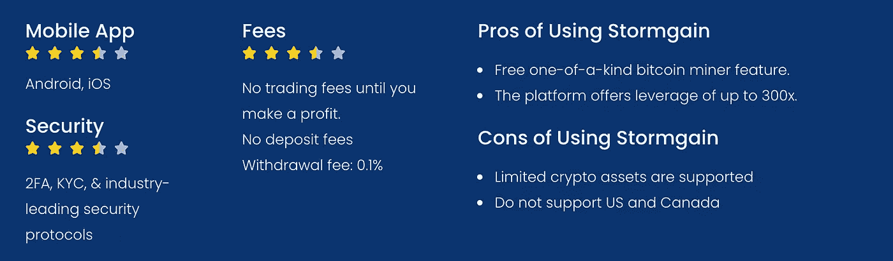

# Stormgain 评论:免费比特币，加密选项

> 原文：<https://medium.com/coinmonks/stormgain-review-ddb733d9e045?source=collection_archive---------6----------------------->

在本次 Stormgain 回顾中，我们将讨论该平台的所有关键特性。Stormgain 是一个全新的加密交易平台，它允许你进行零佣金交易，因为在你获得回报之前，平台不会向你收取任何费用。

# 详细摘要

*   [***storm gain***](https://go.stormgain.app/visit/?bta=112365&nci=7520)是一家成立于 2019 年的[英国加密交易所](https://coincodecap.com/copy-trading-platforms-uk)，支持加密指数和令牌化资产的交易，同时提供高达 300 倍的杠杆。
*   此外， [Stormgain](https://go.stormgain.app/visit/?bta=112365&nci=7520) 向所有用户提供免费的加密交易信号。
*   你也可以在 Stormgain 的模拟账户中练习你的交易和策略。
*   除此之外，Stormgain 还提供了一个特殊的比特币挖掘功能。通过部署新的矿工功能，您可以每 4 小时赚取免费比特币。
*   它还有六种不同类型的内置钱包。
*   您甚至可以通过参与其附属或推荐计划获得额外的好处。
*   Stormgain 不收取交易佣金。你只需要在平台上赚取利润时支付一笔费用。
*   这是一个安全的加密交易平台，具有直观易用的移动界面。

# 什么是风暴增益？

[Stormgain](https://go.stormgain.app/visit/?bta=112365&nci=7520) 成立于 2019 年，总部位于英国伦敦。该平台是区块链协会的成员，并在短期内获得了巨大的知名度。此外，该交易所还提供各种令人兴奋的新功能，如比特币采矿，在这种情况下，你每四个小时就可以获得免费的比特币。此外，在 Stormgain，你可以利用高达 300 倍的交易头寸。除此之外，该平台还是罗马著名职业体育俱乐部 [S.S. Lazio](https://en.wikipedia.org/wiki/S.S._Lazio) 的官方加密交易合作伙伴。

# Stormgain 的产品

平台提供各种产品；让我们试着理解它能提供什么:

*   **模拟账户:**使用 Stormgain 的模拟账户，你可以练习你的交易，并对它的运作有一个大致的了解。您也可以通过视频教育部分了解 Stormgain 提供的各种功能。
*   **内置加密钱包:** Stormgain 内置了加密钱包。您可以使用九种加密资产中的任何一种进行交易，避免额外的费用。此外，它还可以帮助你在应用程序上访问和管理资金。此外，如果你希望长期持有 HODL 资产，那么你可以使用[账本实时应用](https://coincodecap.com/ledger-live)赚取利息。
*   **比特币龙头/比特币挖矿:** Stormgain 想出了它的[云比特币挖矿](https://coincodecap.com/what-is-cloud-mining)功能。在这种情况下，你可以挖掘或赚取免费的比特币，而不是需要复杂设备的传统加密挖掘。此外，你可以登录你的 Stormgain 账户，点击 miner 选项卡，启动你的采矿程序，每四个小时赚取免费的 Satoshi(一个 Satoshi 是比特币的第一亿分之一)。然后你就可以用这些资产在 Stormgain 上交易，赚到的任何利润都会直接转入你的钱包。

*   **会员计划—** 如果你有一个良好的关系网，你甚至可以通过填写谷歌表格加入 Stormgain 会员计划。进而可以在平台上赚取多倍利润。
*   **推荐奖金—** 推荐你的朋友，有机会赢得 USDT 在使用免费比特币矿工后获得的 15%的推荐撤回奖金。
*   **忠诚度计划—** 您可以通过参与忠诚度计划获得更多利息。忠诚度计划旨在为高交易量的客户提供更优惠的条款。具体享受的条款根据客户的身份而定。欲了解更多信息，请访问 [Stormgain 忠诚度计划](https://go.stormgain.app/visit/?bta=112365&nci=7520)。

# Stormgain 评论:移动应用

Stormgain 的移动应用可用于 Android 和 iOS 操作系统。此外，该应用程序有一个直观和快速的用户界面。除此之外，交易的所有选项和功能都可以在应用程序上使用。此外，在部署挖掘功能时，使用应用程序比使用网站更方便。

# Stormgain 评论:交易选项

Stormgain 在多个交易对中提供各种交易选项。我们将简要介绍不同的交易选项-

*   **加密索引-** 将加密索引视为由若干加密资产组成的篮子。这个篮子有助于提高你的投资组合，而不会面临更大的风险偏好。你可以在 Stormgain 上投资这样的加密指数。截至 2021 年 8 月，该平台在一个篮子下提供 3、5 和 10 个加密索引。
*   **杠杆交易-** Stormgain 还允许其用户利用高达 300 倍的头寸。然而，虽然杠杆交易带来了高回报的机会，它也伴随着非常高的亏损机会。因此，新手应该永远远离杠杆交易。

# 如何使用 Stormgain？

下面是帮助你开始使用[***storm gain***](https://go.stormgain.app/visit/?bta=112365&nci=7520)的分步指南:

*   首先，进入 Stormgain 官网，点击入门按钮。
*   此外，输入您的电子邮件和电话号码，然后点击注册按钮。
*   此后，上传必要的文件，完成您的 KYC。
*   现在，你必须将一些资金存入你的 Stormgain 钱包，或者通过你的借记卡或银行账户转账购买一些。
*   在存款选项卡下，选择一个钱包，然后单击通过信用卡或借记卡购买加密。
*   之后，选择您想要购买的加密资产并点击购买按钮。
*   最后，单击“交易”选项卡，以高达 300 倍的杠杆交易各种加密资产。

# 什么是 Stormgain 加密交易信号？

[***storm gain***](https://go.stormgain.app/visit/?bta=112365&nci=7520)基于专业交易者的技术分析，提供免费交易信号。此外，您可以访问设置来更改止盈和止损订单，以抑制风险。此外，它帮助你完全自动化你的交易，同时给市场研究最少的时间

甚至我们还通过我们的 [CoinCodeCap Classic](https://t.me/coincodecap) 电报频道提供高级加密交易信号。你甚至可以使用 Cornix 交易机器人来自动化我们的加密信号。

# Stormgain 的令牌化资产

资产的令牌化是个人或实体在区块链上创建数字令牌的过程。此外，令牌从基础父资产中获得其价值，该基础父资产可以是数字的也可以是物理的。此外，Stormgain 将商品(黄金和白银)和股票(特斯拉、谷歌、亚马逊等)标记化。).

***也，读:*** [***【币安】杠杆代币的局限性，现在有什么替代方案？***](https://coincodecap.com/binance-leveraged-tokens-alternative)

# Stormgain 评论:加密选项

## 什么是加密选项？

加密期权是衍生工具，允许你**从基础数字资产的价格波动中获取回报，而无需实际拥有该资产**。此外，在使用加密期权交易时，您将根据当前市场价格和您开仓时的价格之间的差价来获取收益或损失。

例如，假设你预测比特币的价格将从**40，000 美元涨到**41，000 美元。如果你在现货市场交易，你的投资只获得了 2.5%的利润。然而，现在让我们假设同样的资本你已经投资了 1000 份看涨期权，每份价值 40 美元。现在让我们假设期权的价格上涨了 5 倍。因此，如果你以 200 美元(5×40)的新价格出售你所有的加密期权，同样的 40，000 美元投资你将得到 200，000 美元，这几乎是 500%的回报。然而，上述所有假设都可能出错，你可能会失去你的全部资本。

因此，在加密期权中始终要谨慎交易，并提供正确的信息；你可以从我们关于[期货交易](https://coincodecap.com/futures-trading)的深度文章中了解更多。

# 什么是 Stormgain 加密选项？

Stormgain 为你提供了一个交易各种加密期权的机会。您可以在 Stormgain 的期权市场上找到可用的加密资产列表。你可以开始交易加密期权，因为它提供了一个在相对较短的时间内获得可观回报的机会。然而，随之而来的是风险的增加；因此，建议新手甚至中级交易者避免加密期权交易。

# Stormgain 评论:费用

该平台向用户收取零交易费。也就是说，你可以在不收取任何费用的情况下开立和平仓交易头寸。然而，当你在平台上产生利润时，你只需付费，你总利润的 10%作为费用收取。

总之，在你使用借记卡/信用卡之前，没有存款费用。之后，根据您选择的资产，将收取提款费。此外，在使用 Stormgain 的交换时会收取佣金。你可以在风暴收益费用区查看[的详细信息。](https://stormgain.com/fees-and-limits)

# 暴风城安全吗？

Stormgain 在市场上享有良好的声誉，迄今为止还没有遇到任何安全威胁。此外，交易所拥有 [2FA 安全认证](https://en.wikipedia.org/wiki/Multi-factor_authentication)和 KYC 认证。简而言之，Stormgain 是一个安全、可靠、完全合法的加密交易平台。

# 客户支持

*storm gain 拥有庞大的知识库，或许能解答你的大部分疑问。此外，如果出现任何严重问题，您可以在 help & support 部分描述您的问题以及所有必要的详细信息，并联系支持团队。因此，您的问题将尽快得到解决。此外，该平台还提供了在[partnership@stormgain.com](mailto:partnership@stormgain.com)上邮寄您的疑问的选项，在紧急情况下，**您可以拨打+1–844–584–7390**。*

# *Stormgain 评论:利弊*

**

# *Stormgain 审查:结论*

*Stormgain 为所有交易者提供了一个享受独一无二的功能的绝佳机会，如 **miner、令牌化资产、加密选项**等。而且，它还提供了六种不同的内置钱包，无需四处游荡寻找合适的钱包。此外，初学者可以部署视频教程和 [**免费加密信号**](https://coincodecap.com/free-crypto-signals) ，在了解平台的同时获得回报。除此之外，像加密指数这样允许你投资一篮子不同的加密资产的功能，可以成为投资组合多样化的很好的选择。*

*此外，Stormgain 支持高达 300 倍的利用机会。除此之外，您只需遵循几个简单的步骤就可以开始使用该平台。你也可以使用加密选项来获得可观的回报。然而，加密期权容易产生高市场风险。在此之前，在加密期权市场开仓之前，一定要做好自己的研究(DYOR)。*

# *常见问题*

## *1.Stormgain 的官方加密交易合作伙伴是谁？*

*南 S. Lazio 是一家总部位于罗马的意大利职业体育俱乐部。此外，该俱乐部还是 Stormgain 的官方加密货币交易合作伙伴。*

## *2.在 Stormgain 有比特币奖金吗？*

*[Stormgain](https://blog.coincodecap.com/go/stormgain) 提供数字比特币挖矿功能，你可以每 4 小时赚取一次 satoshis。*

*   ***附属链接包括***

> *加入 Coinmonks [电报频道](https://t.me/coincodecap)和 [Youtube 频道](https://www.youtube.com/channel/UCbyDhTbOiKh2iUMKBi4-4Zg)了解加密交易和投资*

## *另外，阅读*

*   *[印度的加密税](https://coincodecap.com/crypto-tax-india) | [altFINS 审查](https://coincodecap.com/altfins-review) | [Prokey 审查](/coinmonks/prokey-review-26611173c13c)*
*   *[赢取注册奖金——10 大最佳加密平台](https://coincodecap.com/earn-sign-up-bonus)*
*   *[Blockfi vs 比特币基地](https://coincodecap.com/blockfi-vs-coinbase) | [BitKan 评论](https://coincodecap.com/bitkan-review) | [Bexplus 评论](https://coincodecap.com/bexplus-review)*
*   *[南非的加密交易所](https://coincodecap.com/crypto-exchanges-in-south-africa) | [BitMEX 加密信号](https://coincodecap.com/bitmex-crypto-signals)*
*   *[MoonXBT 副本交易](https://coincodecap.com/moonxbt-copy-trading) | [阿联酋的加密钱包](https://coincodecap.com/crypto-wallets-in-uae)*
*   *[Remitano 审查](https://coincodecap.com/remitano-review)|[1 英寸协议指南](https://coincodecap.com/1inch)*
*   *[iTop VPN 审查](https://coincodecap.com/itop-vpn-review) | [曼陀罗交易所审查](https://coincodecap.com/mandala-exchange-review)*
*   *[40 个最佳电报频道](https://coincodecap.com/best-telegram-channels) | [喜美元评论](https://coincodecap.com/hi-dollar-review)*
*   *[折叠 App 审核](https://coincodecap.com/fold-app-review) | [StealthEX 审核](/coinmonks/stealthex-review-396c67309988) | [Stormgain 审核](https://coincodecap.com/stormgain-review)*

**