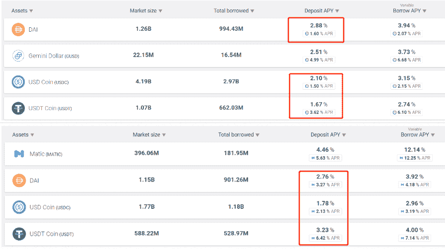
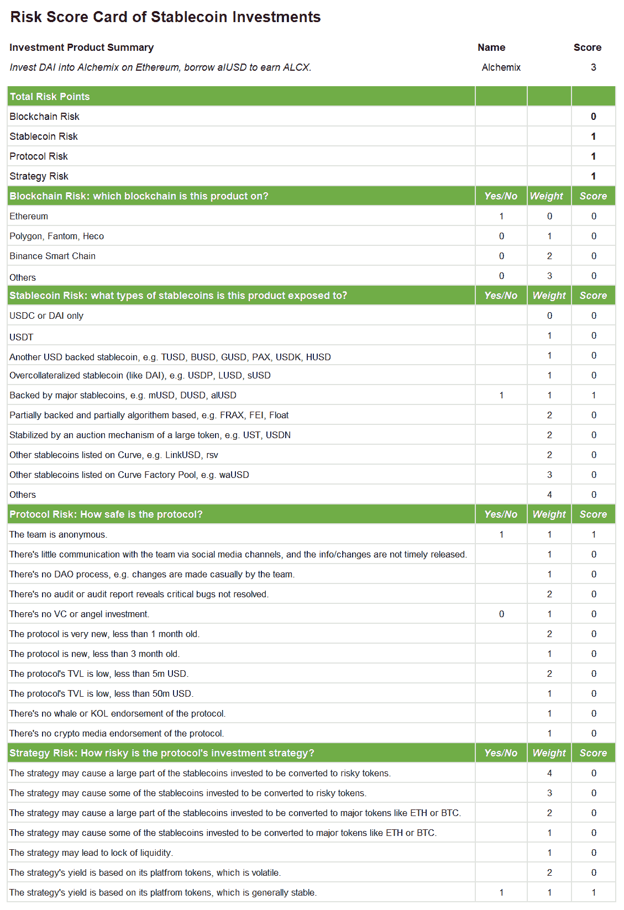

# [策略文件]评估稳定货币投资的风险

> 原文：<https://medium.com/coinmonks/strategy-paper-assess-the-risk-of-stablecoin-investments-5c221aee51c?source=collection_archive---------10----------------------->

我们之前发表过两篇关于稳定债券投资的文章:[资产支持稳定债券概述](/coinmonks/market-info-overview-of-asset-backed-stablecoin-7e111488e4af)和[稳定债券投资概述](/coinmonks/strategy-paper-overview-of-stablecoin-investments-c6af07fa06a1)。每周，我们都会在我们的[媒体](https://serenityfund.medium.com/)和[推特](https://twitter.com/SerenityFund)上发布选定的稳定币投资产品的收益。

回报可能是无限的，例如，如果你找到一个高收益产品，并多次投资，或者一开始就投资异国产品。然而，风险也可以是无限的。我们普遍认为加密货币市场足够大，流动性和透明度足够高；所以这是一个有效的市场——风险和回报高度正相关。

尽管如此，加密货币市场，尤其是成立一年的 De-Fi 市场，缺乏数据来证明这一点。我们都知道风险是存在的，但我们不擅长量化它们。例如，把你的稳定币从以太币转移到多边形币的风险溢价是多少？一种方法是观察在以太坊和多边形上沉积 DAI 在 Aave 中的产量差异。平均而言，在其他条件不变的情况下，主要的稳定债券为 Polygon 带来了 2.1%的高回报。 **所以，我们可以参考以太坊的隐含多边形风险溢价是 2.1%。像这样进行比较的方法实在不多。**

一个更通用但非定量的方法是为任何稳定的货币投资提供一个全面的记分卡。首先，我们将任何稳定的货币产品的风险分为 4 类:

1.  区块链风险
2.  稳定货币风险
3.  协议风险
4.  战略风险

**区块链风险**是区块链与以太坊相比的安全水平，例如 Polygon 可能比以太坊风险略高，但比其他新链更安全。

**稳定收益风险**指何种稳定收益用于投资目的。一些协议仅使用 USDC 或戴，例如 KeeperDAO 或 Idle Finance 有的把你的存款混到一个池子里，像 Curve 的 3pool，所以敞口就是、戴、；有些发行自己的稳定币，例如 Alchemix 的 alUSD。每个稳定点都有自己的风险，所以你可以根据自己的理解任意给它分配一个风险分数。

**协议风险**更容易理解。他们关心的是协议的安全性，即协议是否安全。因素包括匿名性、审计、TVL 规模、风险投资支持等。

**战略风险**稍微复杂一点，需要了解协议知识才能理解所涉及的风险。但简单地说，这是关于协议的经济设计，以及有多少你可以把你的本金和收益转换成一些其他的代币。

让我们以 Alchemix 的为例:

表中“是”的分数越高，风险的权重越大，风险分数越高，意味着风险越高。**所有的风险权重都是任意的，你可以自己给每个风险分配一个权重和/或修改风险类型。**

希望这有助于你了解你的稳定货币投资的风险。

(宁静队，2021 年 6 月 4 日，推特:【https://twitter.com/SerenityFund 

## 另请参阅:

*   [电网交易机器人](https://blog.coincodecap.com/grid-trading) | [Cryptohopper 审查](/coinmonks/cryptohopper-review-a388ff5bae88)
*   [加密复制交易平台](/coinmonks/top-10-crypto-copy-trading-platforms-for-beginners-d0c37c7d698c) | [如何在 WazirX 上购买比特币](/coinmonks/buy-bitcoin-on-wazirx-2d12b7989af1)
*   [CoinLoan 审核](/coinmonks/coinloan-review-18128b9badc4)|[Crypto.com 审核](/coinmonks/crypto-com-review-f143dca1f74c) | [火币保证金交易](/coinmonks/huobi-margin-trading-b3b06cdc1519)