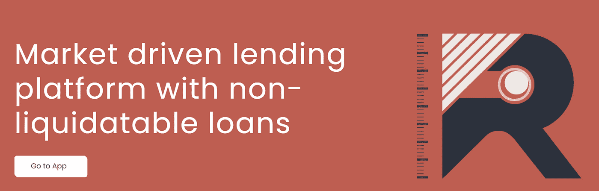
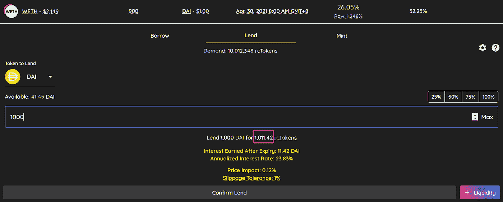
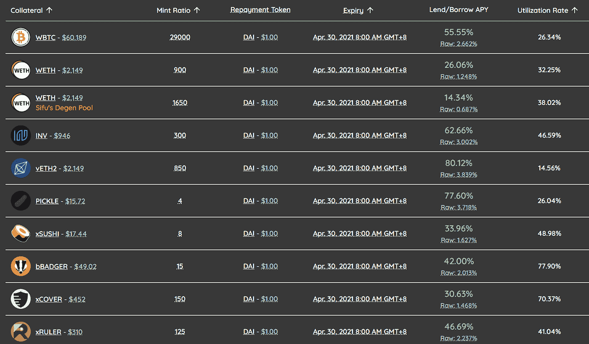
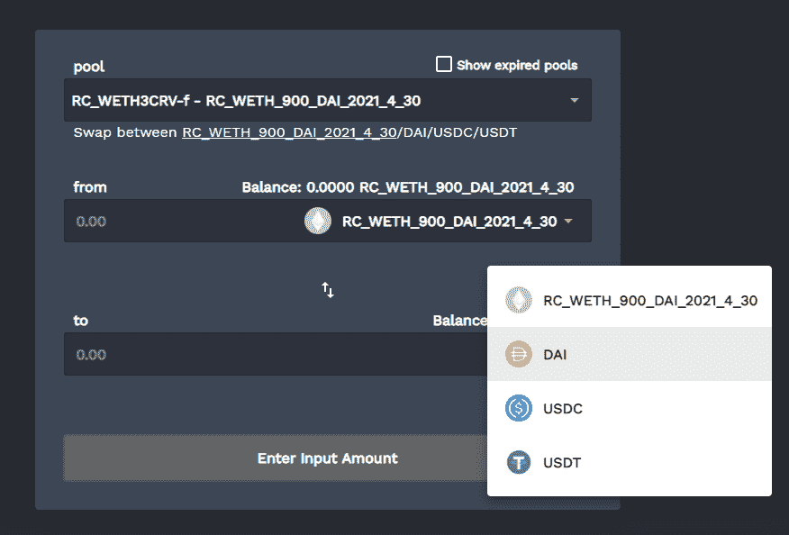
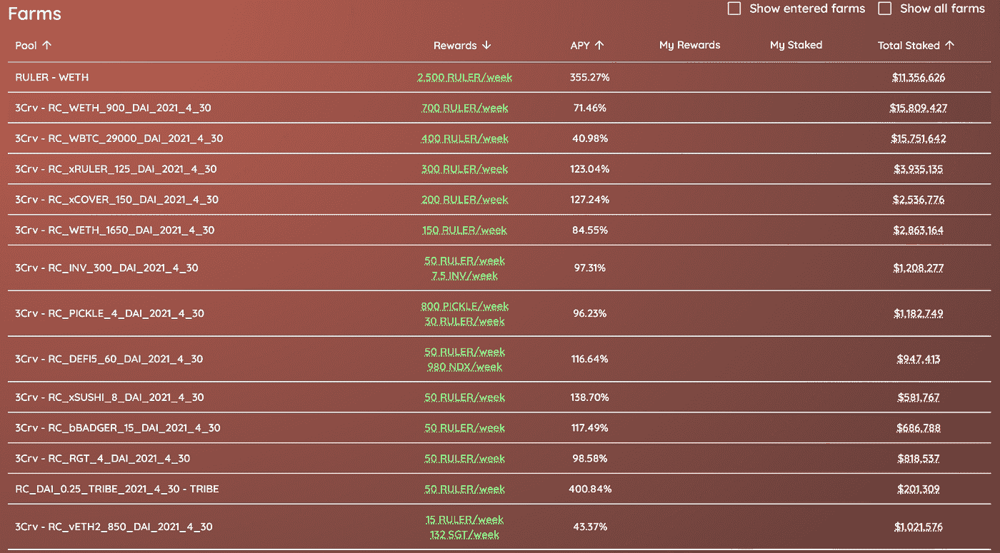

# 【策略论文】统治者协议固定利率借贷+挖矿

> 原文：<https://medium.com/coinmonks/strategy-paper-ruler-protocol-fixed-rate-lending-mining-dd8be94b729e?source=collection_archive---------6----------------------->

我们之前已经介绍过 [Ruler Protocol](https://serenityfund.medium.com/company-watch-ruler-cover-the-wild-card-of-defi-2f967e7570fd) ，这是 Cover Protocol 团队开发的一个固定利率贷款平台。一个月过去了，这个平台的收益率现在很稳定，因为统治者平台令牌的价格已经稳定下来。该平台还提供各种产品，创新从未停止。社区是成熟的，参与的，其中一个提出了一个产品变化，并已被团队接受。

Ruler Protocol 使投资者能够以一个月的固定利率向戴提供贷款。让我们再次重温一下统治者的机制:

1.  你仍然需要抵押。放下 1 ETH 就可以借 750 戴。
2.  没有清算机制。如果 ETH 低于 750(在这种情况下，到 3 月底)，你可以带着你借的 DAI 离开，并丧失 ETH。
3.  给你一对代币(如果借 750 戴)，750 rc 代币，750 rr 代币。每个 rc 代币可在 3 月底后赎回 1 DAI，或赎回抵押品。所以 rc token 是有市场价的，比如 95 分的戴。这是你可以借到的金额——当你卖出 rc 代币时，它的价格 x 750 就是你实际借到的金额。
4.  你可以在三月底前的任何时候偿还债务并取回你的第一枚硬币，支付统治者协议 750 戴和 750 rr 代币(或部分)。

从稳定币投资者的角度来看，一个人以 1 DAI 的折扣购买 rc 代币，并在贷款期结束时要求 1 DAI。

对于上述情况，人们可以以 1，000 DAI 的汇率购买 1，011.42 rc 代币。4 月 30 日后，Rc tokens 可用于兑换 1 个 DAI。这使得该期间的绝对利率为 1.25%，或 APY 为 26.05%。

这项投资的风险是，如果 ETH 的价格下降到某个阈值以下，在这种情况下是 900 美元，我们预计 DAI 的借款人不会赎回他们在 DAI 的抵押 ETH。在这种情况下，将使用 900 个 DAI(和上面步骤 3 中的 900 个 rr 令牌)来兑换 1 个 ETH。理性的投资者会选择不赎回，而是持有借来的戴。因此，DAI 的贷款人(那些使用 DAI 购买 rc 代币的人)将只能收取抵押品 ETH，并遭受损失。戴每投资 900 美元，损失金额为 4 月 30 日或之后 ETH 的市场价减去 900 美元。

因此，每个池的贷款利率是抵押品的波动性及其预先确定的违约价格的综合结果。从下面的列表中，我们看到一个从 14%到 80%的范围。

每个池都是不超过 30 天的短期贷款(从 30 天开始倒数)。我们通常不希望市场价格在一天之内下跌那么多，例如在 ETH 的情况下，一天之内从现在的 2100 美元下跌到 900 美元。如果出现大幅下跌，我们还可以立即在市场上为戴出售 rc 代币，而不必等待 ETH 跌破 900 美元。我们可能会损失一些预期的利息收入，但本金是安全的。在最坏的情况下，我们可以进一步做空 ETH 来保护本金。

除了贷款利率收入，Ruler 协议还为每个 rc 令牌提供了一个市场。该池基于 [Curve 的池工厂](https://resources.curve.fi/faq/pool-factory)(本质上是 3pool 元池的 DIY 版本)。这允许用户与戴、、交易 rc 代币。

由于 rc tokens 是以一个月的有效利率贴现的 1 DAI，所以折扣通常只有几个百分点。因此，rc 代币通常以 90 美分的价格交易，当贷款接近到期时，接近 1 DAI。因此，非永久性损失非常小(如果池中至少有 50%的戴、、的余额，或者一个大的[放大系数](http://Amplification Coefficient))，通常小于 1%。

那么，为这个池提供流动性是一个好主意，因为 rc 令牌总是接近 1 DAI 的值。Ruler 协议为这类资金池提供了诱人的收益。收益率从 40%到 130%不等。

虽然直接向资金池提供流动性是可能的，但我们认为将 DAI 转换为具有 Lend 功能的 rc 令牌以赚取贷款利息也是有益的。这是合理的，因为我们在任何情况下都暴露于池中 rc 令牌的波动性。

对于 1 DAI，有效收益率为:集合 X 贷款利率的 50 %+集合 X 养殖收益率的 100%。例如，对于 3CRV-WETH，它是 50% x 26.05%+71.46% = 84.49%；你也可以去其他泳池看看。

我们已将此作为一项战略(尽管这并不意味着我们将立即投资于此)，与镜像协议和封面协议一起放在 Stablecoin Exotics 下。我们将继续监控 Ruler 协议，并在必要时进行更新。

(宁静队，2021 年 4 月 12 日，推特:【https://twitter.com/SerenityFund 

> 加入 Coinmonks [Telegram group](https://t.me/joinchat/Trz8jaxd6xEsBI4p) 学习加密交易和投资

## 另外，阅读

*   最好的[加密交易机器人](/coinmonks/crypto-trading-bot-c2ffce8acb2a) | [网格交易机器人](https://blog.coincodecap.com/grid-trading)
*   [加密复制交易平台](/coinmonks/top-10-crypto-copy-trading-platforms-for-beginners-d0c37c7d698c) | [如何在 WazirX 上购买比特币](/coinmonks/buy-bitcoin-on-wazirx-2d12b7989af1)
*   【Crypto.com 评论】|[|](/coinmonks/crypto-com-review-f143dca1f74c)|[信用交易](/coinmonks/huobi-margin-trading-b3b06cdc1519)
*   [尤霍德勒 vs 科恩洛 vs 霍德诺特](/coinmonks/youhodler-vs-coinloan-vs-hodlnaut-b1050acde55a) | [Cryptohopper vs 哈斯博特](https://blog.coincodecap.com/cryptohopper-vs-haasbot)
*   [杠杆代币](/coinmonks/leveraged-token-3f5257808b22) | [最佳密码交易所](/coinmonks/crypto-exchange-dd2f9d6f3769) | [Paxful 点评](/coinmonks/paxful-review-4daf2354ab70)
*   [加密套利](/coinmonks/crypto-arbitrage-guide-how-to-make-money-as-a-beginner-62bfe5c868f6)指南| [如何做空比特币](/coinmonks/how-to-short-bitcoin-568a2d0b4ae5)
*   [如何在印度购买比特币？](/coinmonks/buy-bitcoin-in-india-feb50ddfef94) | [WazirX 评论](/coinmonks/wazirx-review-5c811b074f5b) | [BitMEX 评论](https://blog.coincodecap.com/bitmex-review)
*   [印度比特币交易所](/coinmonks/bitcoin-exchange-in-india-7f1fe79715c9) | [比特币储蓄账户](/coinmonks/bitcoin-savings-account-e65b13f92451)
*   [币安收费](/coinmonks/binance-fees-8588ec17965) | [僵尸加密审查](/coinmonks/botcrypto-review-2021-build-your-own-trading-bot-coincodecap-6b8332d736c7) | [热点审查](/coinmonks/hotbit-review-cd5bec41dafb)
*   [我的密码副本交易经验](/coinmonks/my-experience-with-crypto-copy-trading-d6feb2ce3ac5) | [BuyCoins 评论](https://blog.coincodecap.com/buycoins-review)
*   [Bybit 融资融券交易](/coinmonks/bybit-margin-trading-e5071676244e) | [币安融资融券交易](/coinmonks/binance-margin-trading-c9eb5e9d2116) | [Overbit 审核](/coinmonks/overbit-review-9446ed4f2188)
*   [加密货币储蓄账户](/coinmonks/cryptocurrency-savings-accounts-be3bc0feffbf) | [YoBit 审核](/coinmonks/yobit-review-175464162c62) | [Bitbns 审核](/coinmonks/bitbns-review-38256a07e161)
*   [Botsfolio vs nap bots vs Mudrex](/coinmonks/botsfolio-vs-napbots-vs-mudrex-c81344970c02)|[gate . io 交流回顾](/coinmonks/gate-io-exchange-review-61bf87b7078f)
*   [最佳比特币保证金交易](/coinmonks/bitcoin-margin-trading-exchange-bcbfcbf7b8e3) | [萝莉点评](/coinmonks/lolli-review-e6ddc7895ad8) | [比特币保证金交易](https://blog.coincodecap.com/bityard-margin-trading)
*   [创造并出售你的第一个 NFT](https://blog.coincodecap.com/create-nft) | [本地比特币评论](/coinmonks/localbitcoins-review-6cc001c6ed56)
*   [加密保证金交易交易所](/coinmonks/crypto-margin-trading-exchanges-428b1f7ad108) | [赚取比特币](/coinmonks/earn-bitcoin-6e8bd3c592d9) | [Mudrex 投资](https://blog.coincodecap.com/mudrex-invest-review-the-best-way-to-invest-in-crypto)
*   [如何在印度购买以太坊？](https://blog.coincodecap.com/buy-ethereum-in-india) | [如何在币安购买比特币](https://blog.coincodecap.com/buy-bitcoin-binance)
*   [顶级付费加密货币和区块链课程](https://blog.coincodecap.com/blockchain-courses) | [币安评论](/coinmonks/binance-review-ee10d3bf3b6e)
*   [MXC 交易所评论](/coinmonks/mxc-exchange-review-3af0ec1cba8c) | [Pionex vs 币安](https://blog.coincodecap.com/pionex-vs-binance) | [Pionex 套利机器人](https://blog.coincodecap.com/pionex-arbitrage-bot)
*   [在美国如何使用 BitMEX？](https://blog.coincodecap.com/use-bitmex-in-usa) | [BitMEX 评论](https://blog.coincodecap.com/bitmex-review)