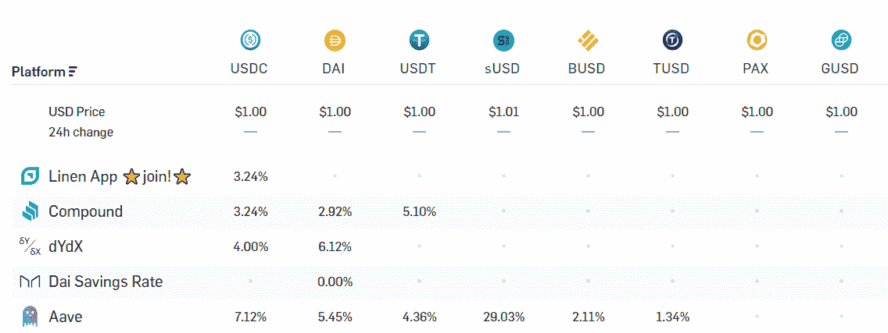
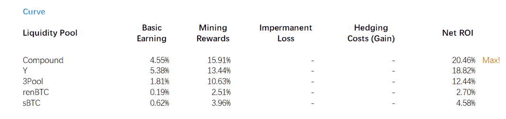
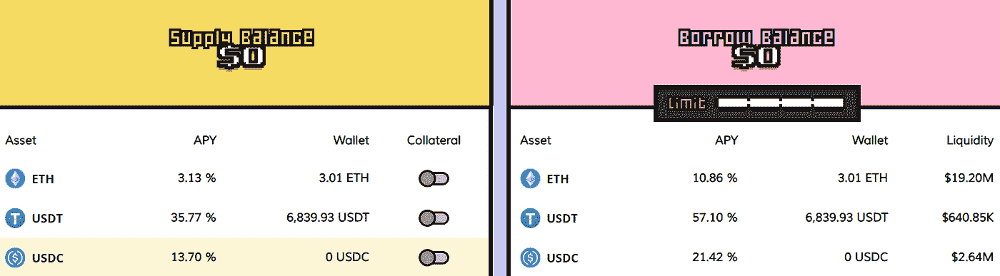
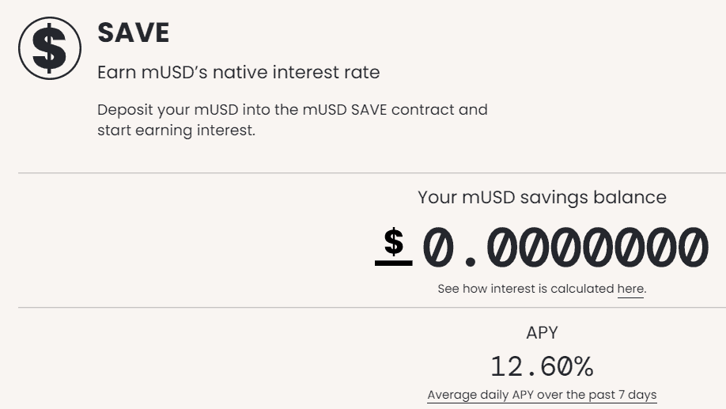
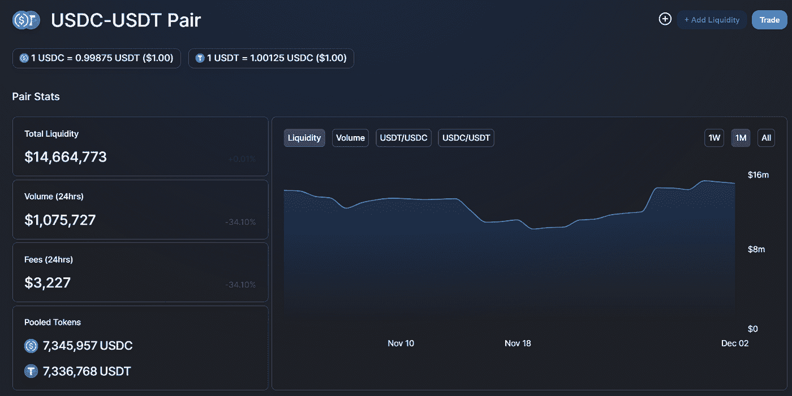
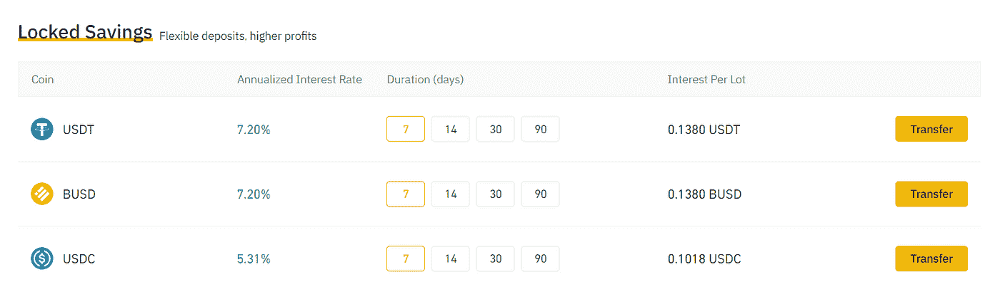

# [策略文件]稳定币回报汇总

> 原文：<https://medium.com/coinmonks/strategy-paper-stablecoin-return-summary-174ba59158b0?source=collection_archive---------6----------------------->

这篇文章总结了如果投资者只是持有稳定的债券或一些接近稳定的债券，他可以看到什么样的收益。我们在这里使用的数据是在 2020 年 12 月 2 日的不同时间。

**1)化合物/ AAVE / dYdX (3%-5%)**

最简单的办法就是直接存入大院或者 AAVE。APY 的利率约为个位数百分比。https://loanscan.io/给了 T2 一个费率的总结

**2)曲线/向往(10%-20%)**

曲线比存款平台有更好的利率。Curve 有两种类型的池，贷款池和非贷款池。对于借贷池，投资者将稳定的硬币放入池中，并将其曲线存入复合/AAVE/dYdX。Curve 通过与 Compound 这样的平台一起工作来直接做到这一点；或者通过曲线的 Y 形池。因此，曲线贷款池仍能从复利/AAVE/dYdX 获得供给端收益率。非贷款资金池不具备这一功能。

贷款和非贷款资金池都提供互换功能，例如将戴氏货币互换为货币，并收取一定费用。因此，当投资者将钱存入这些资金池时，他们还会赚取交易佣金，目前大约是每年 1%-2%。

最重要的是，Curve 向所有池提供其平台令牌 CRV 的采矿奖励。分配是流动性加权的，但受每周治理投票调整的影响。一些资金池也有来自合作平台的奖励。https://www.curve.fi/曲线的主页给出了所有池的最终计算的 apy。

值得注意的是，你可以通过下注 CRV 几个月到 4 年来增加你的 CRV 奖金。这里就不细说了。根据我们的计算，主要池的平均回报率为:

在此过程中，渴望服务于两个目的:1)通过基于市场利率将稳定的收益投资到复合/AAVE/dYdx 来管理曲线池；2)收集 CRV 代币，将其中的一部分(10%)用于提高收益，并将剩余部分出售以获得收益。我们将在以后的文章中解释关于向往的商业模式。把所有东西加在一起，向往的利率接近曲线利率。

**3)奶油(5%至 15%)**

奶油是一种化合物。除了接受更多的借出/借入令牌之外，它的工作方式与复合基本相同。因此，其平均借贷利率高于复利。

**4)其他稳定化合物(范围广泛)**

现在有相当多的 stablecoins，其中一些在平台上提供了保存功能。我们没有列出所有这些货币，你也不应该投资于稳定的货币，因为它与美元挂钩。每种稳定币都有不同的钉住方式，这有时会带来风险。

例如，mStable 的 mUSD 给出的回报率在 10%左右。

**5)集中交易中的对冲期货(8%至 10%)**

如果你不想受到市场波动的影响，我们已经发表了一篇关于如何赚取融资费的文章。这实质上是购买一种代币，并在类似币安硬币期货的交易所做空它的期货(在这里，同样的代币被用作抵押品)。请参考下面的链接，我们不做进一步阐述。

[https://serenity fund . medium . com/strategy-paper-hedged-futures-in-cex-387343 E3 b5 a5](https://serenityfund.medium.com/strategy-paper-hedged-futures-in-cex-387343e3b5a5)

**6) Uniswap 的 Stablecoins 对(2%至 20%)**

你可以将两个 stablecoins 作为交易对放入 Uniswap，并作为流动性提供者赚取费用。Uniswap 的 USDC-USDT 对实际上很受欢迎，尽管你可以在曲线上以低得多的佣金率交易这对组合。交易量来自间接交易，例如，如果你希望将 token X 交易到 USDT，但没有相当大的 TokenX-USDT 池，而有 TokenX-USDC 池。所以当你交易时，Uniswap 将 TokenX 换成 USDC，然后将 USDC 换成 USDT。这是常有的事。

可以说，在 Balancer 上也可以找到相同的一对。但是 Balancer 通过减少对这种池的奖励来阻止这种池，所以只有 Uniswap。

**7)加密平台(2%-8%)**

BlockFi、币安或 Poloniex 等集中式加密平台提供固定投资产品，让你的稳定收入在一段时间内获得固定回报。有相当多的，我们不在这里详述。

如果你有其他投资稳定收入的方法，请告诉我们。:)

(宁静队，2020 年 12 月 2 日)

## 另外，阅读

*   最好的[密码交易机器人](/coinmonks/crypto-trading-bot-c2ffce8acb2a)
*   [Uniswap API](https://bitquery.io/blog/uniswap-pool-api) —如何获取 Uniswap 数据？
*   [Deribit 审查](/coinmonks/deribit-review-options-fees-apis-and-testnet-2ca16c4bbdb2) |选项、费用、API 和 Testnet
*   [FTX 密码交易所评论](/coinmonks/ftx-crypto-exchange-review-53664ac1198f)
*   [Bybit 交换审查](/coinmonks/bybit-exchange-review-dbd570019b71)
*   最好的比特币[硬件钱包](/coinmonks/the-best-cryptocurrency-hardware-wallets-of-2020-e28b1c124069?source=friends_link&sk=324dd9ff8556ab578d71e7ad7658ad7c)
*   [密码本交易平台](/coinmonks/top-10-crypto-copy-trading-platforms-for-beginners-d0c37c7d698c)
*   [bits gap vs 3 commas vs quad ency](https://blog.coincodecap.com/bitsgap-3commas-quadency)
*   最好的[加密税务软件](/coinmonks/best-crypto-tax-tool-for-my-money-72d4b430816b)
*   [最佳加密交易平台](/coinmonks/the-best-crypto-trading-platforms-in-2020-the-definitive-guide-updated-c72f8b874555)
*   最佳[密码借贷平台](/coinmonks/top-5-crypto-lending-platforms-in-2020-that-you-need-to-know-a1b675cec3fa)
*   [莱杰纳米 S vs 特雷佐 one vs 特雷佐 T vs 莱杰纳米 X](https://blog.coincodecap.com/ledger-nano-s-vs-trezor-one-ledger-nano-x-trezor-t)
*   [block fi vs Celsius](/coinmonks/blockfi-vs-celsius-vs-hodlnaut-8a1cc8c26630)vs Hodlnaut
*   bits gap review——一个轻松赚钱的加密交易机器人
*   为专业人士设计的加密交易机器人
*   [PrimeXBT 审查](/coinmonks/primexbt-review-88e0815be858) |杠杆交易、费用和交易
*   [其他准备评审](https://blog.coincodecap.com/altrady-reivew)
*   [埃利帕尔泰坦评论](/coinmonks/ellipal-titan-review-85e9071dd029)
*   [SecuX Stone 评论](https://blog.coincodecap.com/secux-stone-hardware-wallet-review)
*   区块链评论 |从你的密码中赚取高达 8.6%的利息
*   开发人员的最佳加密 API
*   [最佳区块链分析工具](https://bitquery.io/blog/best-blockchain-analysis-tools-and-software)
*   [加密套利](/coinmonks/crypto-arbitrage-guide-how-to-make-money-as-a-beginner-62bfe5c868f6)指南:新手如何赚钱
*   顶级[比特币节点](https://blog.coincodecap.com/bitcoin-node-solutions)提供商
*   最佳[加密制图工具](/coinmonks/what-are-the-best-charting-platforms-for-cryptocurrency-trading-85aade584d80)
*   了解比特币最好的[书籍有哪些？](/coinmonks/what-are-the-best-books-to-learn-bitcoin-409aeb9aff4b)

> [直接在您的收件箱中获得最佳软件交易](/coinmonks/newsletters/coinmonks)

