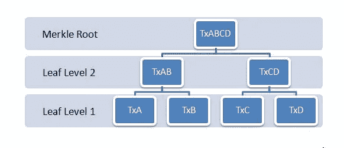

# 比特币区块的结构

> 原文：<https://medium.com/coinmonks/structure-of-a-bitcoin-block-7f6c4938a5fd?source=collection_archive---------0----------------------->

比特币区块记录了与比特币交易相关的数据。这些块被一个接一个地挖掘，网络中的所有交易都被永久地记录下来。作为一个非常安全的网络，比特币区块链很难修改或删除已经在区块上注册的数据。或多或少，一个块的作用就像一本分类账，每一页都指向一个块，并通过称为“散列”的地址连接到前一个和下一个块。将这些单独的分类账一个接一个地连接起来，就形成了区块链。块结构有几个元素。让我们来看看其中的一些块组件。

**1。**块标识符

**2。**块标题

**3。**交易

**1。** **块标识符:**块标识符是标识块的地址、高度和大小的元素。主要的块标识符有:

**a.** **哈希:**哈希是区分一个块与另一个块的唯一标识符。块哈希是通过 SHA256 算法传递块头元数据生成的。(加密中使用的安全哈希算法)。当块头被散列时，散列也被称为块头散列。块的散列由一系列数字和字母组成，并且被加密以使块免受恶意攻击。hash 的一个例子:

*f 7257 cbe6d 961 f 8 fef 0 f 93360245 a 90 D1 f 6962 c 3c 3 FBC 83213515 ad 809999 BD 3*

**散列是如何产生的**:区块链中的散列是通过称为散列函数的数学函数来完成的。哈希函数的工作原理是接受一定长度的输入，并总是生成固定长度的输出。无论输入数据有多长或多短，通过哈希函数生成的输出总是具有相同的长度。这使得散列函数是“确定的”(输出保持相同，输入也相同)，并且使用加密散列函数使得数据是安全的:攻击者不能通过解密输出来猜测输入的长度。

对输入值的简单改变导致完全不同的输出，这使得哈希函数具有抗冲突性:哈希函数的两个不同输入数据不会导致相同的输出。与此同时，散列函数也是抗镜像的:几乎不可能通过对输出进行逆向工程来得到输入，从而使攻击者很难猜出输入。哈希函数是安全区块链所固有的，不需要复杂的资源就能有效工作。

> 订阅 [**Coinmonks Youtube 频道**](https://www.youtube.com/c/coinmonks/videos) 获取每日加密新闻。

**块之间的父子关系:**区块链上的每个块都通过前一个块的散列地址连接到前一个块。如上所述，区块链的块就像账本的页面，每一页都有一个到前一页的链接，而这个链接就是前一个块的散列。链上挖掘的每个新块都成为前一个块的子块，前一个块称为父块。因此，除了自己的哈希值之外，子块还在其块头中携带其父块的哈希值。通过这种方式，所有区块都被连接起来，形成一个长链，比特币上有史以来开采的第一个区块被称为“创世纪区块”。这种连接性使得区块链可以抵抗攻击:如果前一个区块已经被篡改，任何被添加到链中的新区块都具有该信息。这意味着如果父块已经改变，则先前的块散列字段也改变，这进一步改变了子块的散列以在子块的子块(即孙块)中改变。这样区块链的所有街区都会受到影响。

由于比特币区块链是通过工作机制的证明来挖掘的，因此提供给哈希函数的随机输入会导致包含几个前导零的哈希输出，从而进一步降低了攻击的可能性。以下是 genesis 块(比特币网络中创建的第一块)的哈希:

*0000000000019d 6689 c 085 AE 165831 e 934 ff 763 AE 46 a2 a6 c 172 B3 f1 b 60 A8 ce 26 f*

**注:** *一个块只能有一个父块，但有时，这种情况会导致两个或更多的子块有同一个父块。当不同的矿工同时开采相同的区块并且都携带相同的父散列字段时，就会发生这种情况。这导致分叉，即不同的采矿者同时开采不同的区块。在多个子块中，任何一个子块都被附加到父块上，其余的被分支到一个较短的链上。*

**b.** **区块高度:**有史以来第一个比特币区块创建于 2009 年 1 月，被命名为“创世纪区块”。因为它是第一块，所以被指定为零高度。一个区块的高度是在起源区块和当前区块之间已经开采的区块数。例如，块高度 6234 意味着有 6234 个块堆叠在创世块的顶部，6234 是块高度。多个块可以具有相同的高度；即在区块链中不止一个块竞争成为下一个，这导致分叉的形成。由于块高度是元数据(提供关于块的信息)，所以它不存储在块中。

**2。** **块头:**区块链中的块由其唯一的块头标识。在工作验证机制中，块报头被散列多次，以便为每个块报头生成唯一的散列。这个块头散列成为块的标识符。比特币块头长度为 80 字节，由以下元数据组成:

**a.** 4 字节版本

**b.** 4 字节时间戳

**c.** 4 字节难度目标

**d.** 4 字节随机数

**e.** 32 字节前一个块哈希

32 字节 Merkle 根

矿工散列块头以获得正确的随机数，并将经验证的块添加到区块链。块头包含关于块的所有信息。

**a.** **版本:**通过版本号，矿工可以跟踪协议中的任何更改或升级。

**b.** **时间戳:**特定块被散列的时间。时间戳以 Unix 时间记录(计算从特定时间开始经过的秒数)。对于比特币区块链来说，那个特定的时间是 1970 年 1 月 1 日；这是 Unix 被发明的时间。时间戳容易被矿工操纵。

**c.** **难度目标**:难度衡量开采一个区块的计算能力。由于比特币使用工作证明机制，矿工们不断哈希寻找可以添加到区块链的区块。难度衡量的是开采一个新区块所需的时间。更高的难度目标表明需要更多的计算能力来挖掘新的区块。这意味着矿工需要使用更高的散列能力(更高效的机器)。难度级别以“位”的形式存储，以 1 字节指数后跟 3 字节系数的形式存储。创世纪方块的难度是 1。由于难度与计算或哈希能力成正比，所以它会不断变化。当散列能力越大(矿工越多)，难度越大，反之亦然。在比特币中，每 2016 块后，难度重新调整。

**d.** **Nonce(数字只使用一次):**这个 32 位数字的最大值可以有最大值 232。nonce 字符串被附加到块散列中并被重新散列。重新散列后，随机数与目标难度数进行比较。如果 nonce 小于目标值，则将该块添加到区块链中。如果不是，则改变随机数，并且重复该过程，直到找到其值小于目标值的随机数。

nonce 是一个十六进制数，矿工们竞相为每个块寻找它。除非发现一个 nonce 小于块头中设置的难度目标，否则矿工继续散列。最先找到随机数的矿工将获得奖励，该区块将被添加到区块链中。这个反复猜测正确随机数的过程被称为工作证明。难度目标越高，矿工需要花费更多的时间来猜测正确的随机数。挖掘者的重复散列动作导致所谓的“黄金现时”，即小于目标难度的散列值。小于目标哈希的哈希必须以零字符串开头。

**e .****Merkle Root:**Merkle Root 是一个块中所有事务哈希的哈希。每个块事务都有一个与之关联的唯一散列，这些事务散列以倒置 Merkle 树的形式保存。Merkle 根在它的顶端。事务是以 Merkle 树的形式组织的，这种方式可以有效地组织数据。所有的事务首先被散列，然后彼此配对。例如，一个事务散列“TxA”与另一个事务散列“TxB”配对，并被散列以产生另一个称为“TxAB”的散列。这个散列的“TxAB”然后与另一个散列配对，比如“TxCD”(由“TxC”和“TxD”的散列形成)。这会产生一个名为“TxABCD”的哈希。这样，从底部到顶部(顶部的值称为 Merkle 根)，形成了 Merkle 树。如果有人修改了任何一个散列事务，那么得到的 Merkle 根将是一个不同的值。

在 Merkle 树中，事务被称为树叶。这是叶层，哈希从这里开始，一直延续到 Merkle 根。Merkle 根具有所有块事务的信息，因为它是块中发生的所有事务的所有散列的散列版本。由于 Merkle 树的树状结构，交易的验证可以快速完成。Merkle 根散列被添加到块头中。

A Merkle Tree

**f.** **前一个块 Hash:** 每个块携带在其之前被挖掘的块的 Hash。这使得块具有不变性。

**3。** **交易:**当一个块被添加到一个区块链时，它被称为一个确认的交易或一个确认。在一个交易之后，当其他交易得到确认时，最初的交易得到进一步确认。每 10 分钟挖掘一个比特币块。

块的第一个事务被称为“比特币基地事务”或“生成事务”。在事务被验证之后，它被添加到块中并被调用以进行确认。出于安全目的，交易需要多次重新确认。只有在区块链中添加了一定数量的区块后，交易才被视为已确认。未确认的交易容易被撤销，因此交易必须至少有一个确认。高交易金额比低交易金额需要更多的确认。

**创建块标题的步骤**

挖掘节点需要添加块头的所有六个字段，从版本号开始。

**a.** 节点增加软件的版本号。

**b.** 添加前一个块的哈希。

**c.** 事务被添加到 Merkle 树，并创建 Merkle 根。添加比特币基地事务，然后添加剩余的事务。事务散列被配对和散列，直到 Merkle 根到达树的顶部。

**d.** 创建块的时间戳。

**e.** 难度目标以“难度位”的形式定义和存储。

定义了一个初始值为零的随机数。

一旦在块标题中创建了所有字段，就开始挖掘。不同的挖掘者相互竞争以找到低于在块标题中设置的难度目标值的现时值。挖掘器重复散列块头，除非它们找到正确的 nonce 值。矿工在这个过程中使用 SHA256 这样的算法。他们不断尝试不同的输入值，直到找到正确的值。所有不同输入的输出总是 256 位。找到正确的哈希(其值小于目标难度哈希)后，将其添加到块头中。网络上的所有节点创建并验证新的块。

> ***要了解更多关于比特币及其工作原理的信息，请访问这个*** [***加密博客***](https://giantsofcrypto.com/what-is-bitcoin/) ***。***

> 加入 Coinmonks [电报频道](https://t.me/coincodecap)和 [Youtube 频道](https://www.youtube.com/c/coinmonks/videos)了解加密交易和投资

## 另外，阅读

*   [电网交易机器人](https://blog.coincodecap.com/grid-trading) | [Cryptohopper 审核](/coinmonks/cryptohopper-review-a388ff5bae88) | [Bexplus 审核](https://blog.coincodecap.com/bexplus-review)
*   [7 个最佳零费用加密交易平台](https://blog.coincodecap.com/zero-fee-crypto-exchanges)
*   [如何在 FTX 交易所交易期货](https://blog.coincodecap.com/ftx-futures-trading) | [OKEx vs 币安](https://blog.coincodecap.com/okex-vs-binance)
*   [OKEx vs KuCoin](https://blog.coincodecap.com/okex-kucoin) | [摄氏替代品](https://blog.coincodecap.com/celsius-alternatives) | [如何购买 VeChain](https://blog.coincodecap.com/buy-vechain)
*   [币安期货交易](https://blog.coincodecap.com/binance-futures-trading)|[3 comas vs Mudrex vs eToro](https://blog.coincodecap.com/mudrex-3commas-etoro)
*   [如何购买 Monero](https://blog.coincodecap.com/buy-monero) | [IDEX 评论](https://blog.coincodecap.com/idex-review) | [BitKan 交易机器人](https://blog.coincodecap.com/bitkan-trading-bot)
*   [尤霍德勒 vs 科恩洛 vs 霍德诺特](/coinmonks/youhodler-vs-coinloan-vs-hodlnaut-b1050acde55a) | [Cryptohopper vs 哈斯博特](https://blog.coincodecap.com/cryptohopper-vs-haasbot)
*   [顶级付费加密货币和区块链课程](https://blog.coincodecap.com/blockchain-courses) | [币安评论](/coinmonks/binance-review-ee10d3bf3b6e)
*   [MXC 交易所评论](/coinmonks/mxc-exchange-review-3af0ec1cba8c) | [Pionex vs 币安](https://blog.coincodecap.com/pionex-vs-binance) | [Pionex 套利机器人](https://blog.coincodecap.com/pionex-arbitrage-bot)
*   [如何在印度购买比特币？](/coinmonks/buy-bitcoin-in-india-feb50ddfef94) | [WazirX 评论](/coinmonks/wazirx-review-5c811b074f5b) | [BitMEX 评论](https://blog.coincodecap.com/bitmex-review)
*   [印度的加密交易所](/coinmonks/bitcoin-exchange-in-india-7f1fe79715c9) | [比特币储蓄账户](/coinmonks/bitcoin-savings-account-e65b13f92451)
*   [加密货币储蓄账户](/coinmonks/cryptocurrency-savings-accounts-be3bc0feffbf) | [YoBit 审核](/coinmonks/yobit-review-175464162c62)
*   [Botsfolio vs nap bots vs Mudrex](/coinmonks/botsfolio-vs-napbots-vs-mudrex-c81344970c02)|[gate . io 交流回顾](/coinmonks/gate-io-exchange-review-61bf87b7078f)
*   [CoinFLEX 评论](https://blog.coincodecap.com/coinflex-review) | [AEX 交易所评论](https://blog.coincodecap.com/aex-exchange-review) | [UPbit 评论](https://blog.coincodecap.com/upbit-review)
*   [AscendEx 保证金交易](https://blog.coincodecap.com/ascendex-margin-trading) | [Bitfinex 赌注](https://blog.coincodecap.com/bitfinex-staking) | [bitFlyer 审核](https://blog.coincodecap.com/bitflyer-review)
*   [Bitget 回顾](https://blog.coincodecap.com/bitget-review)|[Gemini vs block fi](https://blog.coincodecap.com/gemini-vs-blockfi)|[OKEx 期货交易](https://blog.coincodecap.com/okex-futures-trading)
*   [AscendEx Staking](https://blog.coincodecap.com/ascendex-staking)|[Bot Ocean Review](https://blog.coincodecap.com/bot-ocean-review)|[最佳比特币钱包](https://blog.coincodecap.com/bitcoin-wallets-india)
*   [霍比评论](https://blog.coincodecap.com/huobi-review) | [OKEx 保证金交易](https://blog.coincodecap.com/okex-margin-trading) | [期货交易](https://blog.coincodecap.com/futures-trading)
*   [麻雀交换评论](https://blog.coincodecap.com/sparrow-exchange-review) | [纳什交换评论](https://blog.coincodecap.com/nash-exchange-review)
*   [美国最佳加密交易机器人](https://blog.coincodecap.com/crypto-trading-bots-in-the-us) | [经常性回顾](https://blog.coincodecap.com/changelly-review)
*   [在印度利用加密套利赚取被动收入](https://blog.coincodecap.com/crypto-arbitrage-in-india)