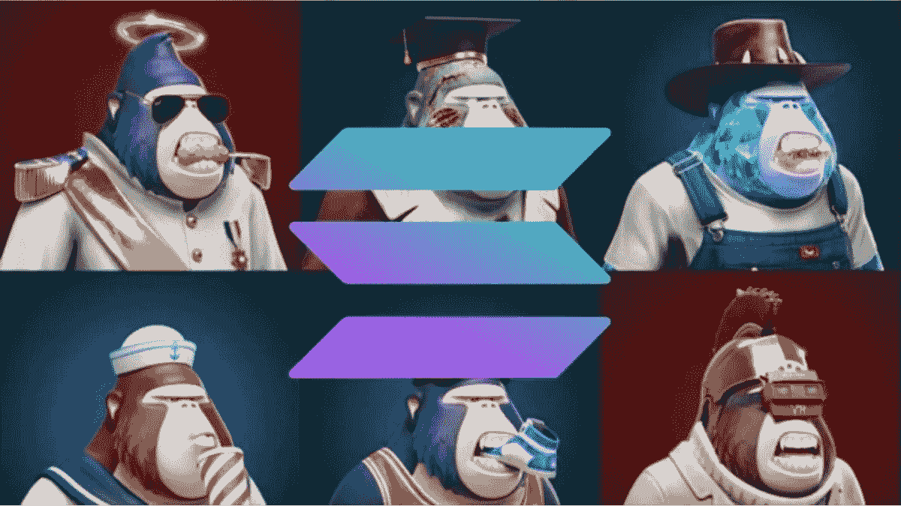
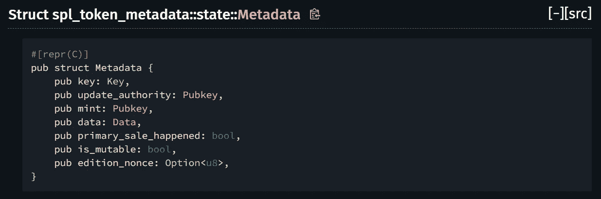
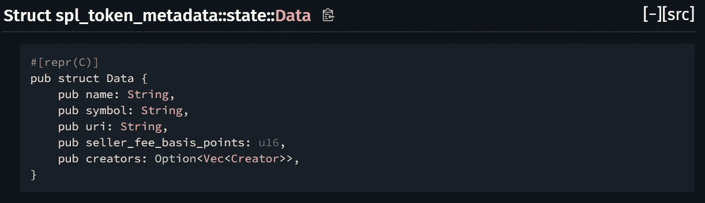
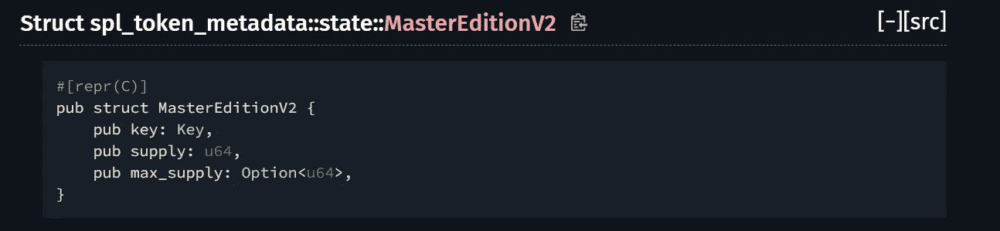

# 茄果类植物 NFT 的结构

> 原文：<https://medium.com/coinmonks/structure-of-metaplex-nft-c6ef4834a803?source=collection_archive---------0----------------------->

Solana Metaplex NFT

# Metaplex NFT 类型

这些是来自 [Metaplex 术语](https://docs.metaplex.com/about/terminology)

*   原版

母版版令牌在铸造时，既代表 Solana 上的不可替换令牌，也代表允许创作者控制从母版版创建的印刷品的出处的元数据。

创建打印的权限本身是令牌化的，母版版的所有者可以分发令牌，允许用户从母版版创建打印。此外，创作者可以设置母版版的最大供应量，就像 Solana 上的常规造币厂一样，主要区别是每张印刷品都是从中创建的编号版本。

原版的一个显著且令人满意的效果是，随着印刷品的售出，艺术品在艺术家的钱包中仍然可以看到原版，而印刷品则出现在购买者的钱包中。

*   版本

一个版本代表一个 NFT 的副本，并且是从主版本创建的。每个版本都有一个与之关联的版本号。

*   普通 NFT(没有 MasterEdition PDA，但有元数据帐户)

一个普通的 NFT(像一个主版本)在铸造时代表了一个不可替代的索拉纳和元数据的令牌，但缺乏打印的权利。

正常的 NFT 的一个例子是一件独一无二的艺术品，一旦售出，就不再在艺术家自己的钱包里，而是在购买者的钱包里。

# Metaplex NFT 组合

索拉纳上的 NFT 是一种小数为 0、总供应量为 1 的 spl-token。

和其他 spl 代币一样，NFT 代币也有**造币账户**和**代币账户**。

NFT 令牌还有**元数据账户**，它给了 NFT 一个名字、符号、uri、版权分成的创作者名单，以及它是否被出售。

> **元数据账号**是元数据程序的 PDA。它的地址(公钥)来自['元数据'，元数据 _ 程序 _Id，NFT _ 造币厂 _ 帐户 _Pk]的种子。用 **NFT 造币账户**的地址可以得到**元数据账户**的地址。

Structure of Metadata

Structure of Data in Metadata

此外，你可以给 NFT 一个额外的装饰 PDA，类型的原版。这个 PDA 表示造币厂是一种特殊类型的物体，可以铸造其他的造币厂，我们称之为版本(与原版相对，因为他们自己不能印刷其他的造币厂)。这使得这个造币厂就像当年唱片公司用来制作新唱片拷贝的“主唱片”。在这个过程中，原版 PDA 将从你那里拿走铸造和冻结的权力，并将包含关于总供应量、最大可能供应量等信息。

> **MasterEdition 账号**也是元数据程序的 PDA。它的地址(公钥)来自['元数据'，元数据 _ 程序 _Id，NFT _ 造币厂 _ 帐户 _Pk，'版本']的种子。您可以通过 **NFT 造币厂账户**的地址获得**主账户**的地址。

Structure of MasterEditionV2

如果 NFT 升级到大师版，你就不能刻录 NFT，因为 NFT 的造币局变成了大师版账号，大师版不支持刻录。

> 如果你有任何关于冻结大师版 NFT 的想法，你可以在 stackoverflow 回答[这个问题。](https://stackoverflow.com/questions/69958777/how-can-i-freeze-masteredition-nft-token-account)

# 更新 Metaplex NFT 的元数据

如果您拥有 NFT 更新权限，您可以更新 NFT 的形象、名称和标志。

> 您可以在链上或链下完成此操作。您可以在 [Stackoverflow](https://stackoverflow.com/questions/69956957/update-metadata-of-metaplex-nft) 找到有关详细信息。

您可以使用**update _ metadata _ accounts**创建指令，然后**调用**更新元数据**。**

使用 spl _ token _ metadata::{指令::{ update_metadata_accounts }

let update _ metadata _ instruction = update _ metadata _ accounts(……)；

调用(&update_metadata_instruction，&[…])

> 如果你创造了 NFT，你应该是它的更新权威。你可以更新 NFT 的形象、名字和标志。但是，如果你修改 NFT，在它被出售后，那么一个社会问题可能会发生。为了防止这种情况，您应该将更新权限修改为 NULL，这样就没有人能够修改 NFT。

# 结论

与以太坊上的 ERC721 不同，索拉纳上的 NFT 非常复杂。由 MasterEdition 印刷的版本可以被认为是以太坊上的 ERC1155。

也因为超大型购物中心 NFT 的限制，NFT 市场的方式与以太坊有很大的不同。

> 要出售您的 Metaplex NFT，您应该将您的 NFT 发送到 Marketplace wallet。如果你的 NFT 在待售名单上，你在钱包里看不到它。

无论如何，索拉纳是最快和最便宜的区块链，它吸引了这么多的用户。索拉纳上的 NFT 和 DeFi 结构与以太坊明显不同，但如果你是高级区块链开发者，这就不再是问题了。

> 加入 Coinmonks [电报频道](https://t.me/coincodecap)和 [Youtube 频道](https://www.youtube.com/c/coinmonks/videos)了解加密交易和投资

## 另外，阅读

*   [加拿大最好的加密交易机器人](https://blog.coincodecap.com/5-best-crypto-trading-bots-in-canada) | [赌注加密](https://blog.coincodecap.com/staking-crypto)
*   [如何在印度购买比特币？](/coinmonks/buy-bitcoin-in-india-feb50ddfef94) | [WazirX 审核](/coinmonks/wazirx-review-5c811b074f5b)
*   [最佳网上赌场](https://blog.coincodecap.com/best-online-casinos) | [硬件钱包](/coinmonks/hardware-wallets-dfa1211730c6)
*   [如何在 WazirX 上购买柴犬(SHIB)币？](https://blog.coincodecap.com/buy-shiba-wazirx)
*   [比特币主根](https://blog.coincodecap.com/bitcoin-taproot) | [排名前 6 的比特币信用卡](/coinmonks/bitcoin-credit-card-bc8ab6f377c6)
*   [最佳免费加密信号](https://blog.coincodecap.com/free-crypto-signals) | [YoBit 评论](/coinmonks/yobit-review-175464162c62) | [Bitbns 评论](/coinmonks/bitbns-review-38256a07e161)
*   [huo bi 的加密交易信号](https://blog.coincodecap.com/huobi-crypto-trading-signals) | [BitMEX 评论](https://blog.coincodecap.com/bitmex-review)
*   [7 个最佳零费用加密交易平台](https://blog.coincodecap.com/zero-fee-crypto-exchanges)
*   [分散交易所](https://blog.coincodecap.com/what-are-decentralized-exchanges) | [比特 FIP](https://blog.coincodecap.com/bitbns-fip) | [Pionex 审查](https://blog.coincodecap.com/pionex-review-exchange-with-crypto-trading-bot)
*   [用信用卡购买密码的 10 个最佳地点](https://blog.coincodecap.com/buy-crypto-with-credit-card)
*   [OKEx 评论](/coinmonks/okex-review-6b369304110f) | [Kucoin 交易机器人](/coinmonks/kucoin-trading-bot-automate-your-trades-8cf0ca2138e0) | [期货交易机器人](/coinmonks/futures-trading-bots-5a282ccee3f5)
*   [AscendEx Staking](https://blog.coincodecap.com/ascendex-staking)|[Bot Ocean Review](https://blog.coincodecap.com/bot-ocean-review)|[最佳比特币钱包](https://blog.coincodecap.com/bitcoin-wallets-india)
*   [霍比审核](https://blog.coincodecap.com/huobi-review) | [OKEx 保证金交易](https://blog.coincodecap.com/okex-margin-trading) | [期货交易](https://blog.coincodecap.com/futures-trading)
*   [Godex.io 审核](/coinmonks/godex-io-review-7366086519fb) | [邀请审核](/coinmonks/invity-review-70f3030c0502) | [BitForex 审核](https://blog.coincodecap.com/bitforex-review)
*   [Crypto.com 费用](/coinmonks/binance-fees-8588ec17965) | [僵尸加密审查](/coinmonks/botcrypto-review-2021-build-your-own-trading-bot-coincodecap-6b8332d736c7) | [替代品](https://blog.coincodecap.com/crypto-com-alternatives)
*   [有哪些交易信号？](https://blog.coincodecap.com/trading-signal) | [Bitstamp vs 比特币基地](https://blog.coincodecap.com/bitstamp-coinbase) | [买索拉纳](https://blog.coincodecap.com/buy-solana)
*   [ProfitFarmers 回顾](https://blog.coincodecap.com/profitfarmers-review) | [如何使用 Cornix Trading Bot](https://blog.coincodecap.com/cornix-trading-bot)
*   [MXC 交易所评论](/coinmonks/mxc-exchange-review-3af0ec1cba8c) | [Pionex vs 币安](https://blog.coincodecap.com/pionex-vs-binance) | [Pionex 套利机器人](https://blog.coincodecap.com/pionex-arbitrage-bot)
*   [我的密码交易经验](/coinmonks/my-experience-with-crypto-copy-trading-d6feb2ce3ac5) | [比特币基地评论](/coinmonks/coinbase-review-6ef4e0f56064)
*   [CoinFLEX 评论](https://blog.coincodecap.com/coinflex-review) | [AEX 交易所评论](https://blog.coincodecap.com/aex-exchange-review) | [UPbit 评论](https://blog.coincodecap.com/upbit-review)
*   [AscendEx 保证金交易](https://blog.coincodecap.com/ascendex-margin-trading) | [Bitfinex 赌注](https://blog.coincodecap.com/bitfinex-staking) | [bitFlyer 评论](https://blog.coincodecap.com/bitflyer-review)