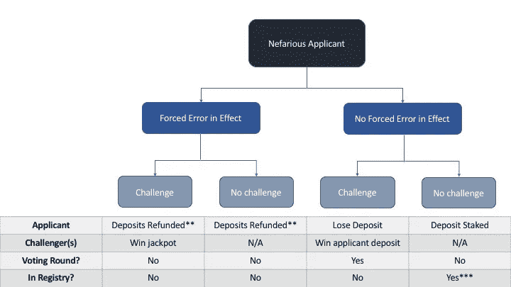
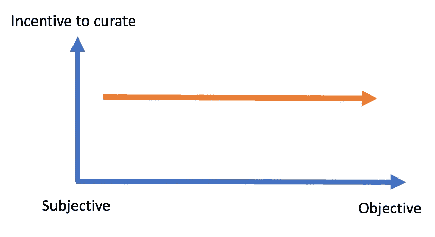

# 主观与客观 TCR

> 原文：<https://medium.com/coinmonks/subjective-vs-objective-tcrs-a21f5d848553?source=collection_archive---------7----------------------->

令牌管理的注册中心(TCR)是一种新兴的密码经济原语，可能会成为[令牌工程师工具包](http://tokenengineering.net/)中受欢迎的构建模块。我们已经看到[许多团队](/@tokencuratedregistry/token-curated-registries-in-development-4533a52cc9ba)在他们的平台设计中使用 TCR。鉴于这种受欢迎程度的激增，机构群体彻底研究 TCR 中起作用的激励因素并设计一个可持续和稳健的方案至关重要。俗话说“给我看动机，我给你看结果”。

在这篇文章中，我将区分客观和主观治疗，并证明当前的 TCR 协议并没有适当地激励客观治疗。然后，我将提出一个通用的协议变更，利用这种区别来实现一个更细粒度的激励模型，可以应用于任何 TCR。

## 例子

TCR 可以有各种形状和大小。虽然 TCR 总是处理二元属性，但是这种属性可以存在于从完全主观到完全客观的范围内。例如:“芝加哥的这家餐馆是好是坏”是相当主观的属性，而“这个人是美国的执业医师吗”是相当客观的。

作为一个例子，考虑一个 TCR，它包含所有优秀的美国职业棒球大联盟运动员的列表。让我们假设，类似于棒球名人堂，进入这个 TCR 有 2 个客观标准:1)必须在 MLB 打了至少 10 个赛季，2)在申请 TCR 时必须退役 5 年。这里有两种非常不同的策展激励方式:

1.  目标:策展人搜集不符合 2 个目标要求的申请人/会员名单，希望赢得一个简单的挑战。
2.  主观的:对棒球充满热情的策展人，对值得加入 TCR 的成员有着强烈的感情，他们愿意为此投资。

这个 TCR 似乎不太可能引起所谓“客观策展人”的注意。经济上获利的机会太少，可能不值得努力。然而，我们可以合理地预期大多数申请人将经历一次挑战，并且对于每一次挑战都有一轮相当活跃的投票。该 TCR 证明了主观属性固化的激励模型不同于客观属性固化的激励模型。

## 背景

最近，亚历山大·布尔金(Aleksandr Bulkin)在[博客上发表了一篇](https://blog.coinfund.io/curate-this-token-curated-registries-that-dont-work-d76370b77150)文章，质疑 TCR 解决主观属性的可行性。在这篇文章中，他认为许多提议的 TCR 注定要失败，因为它们没有满足三个必要条件:

(1)客观性(即客观答案存在)
(2)公开性(即它是公众可观察的)
(3)廉价可观察性(即观察它是非常廉价的)

虽然我同意 Bulkin 先生的第(2)点，但我部分不同意他的第(3)点，完全不同意他的第(1)点。当我在 2017 年 10 月首次开始考虑 TCRs 时，我将大部分推理集中在策展人执行的**工作(W)** 的概念上(即，令牌持有者需要做多少工作才能可靠地识别一个非知名演员？)和**报酬(P)** (即诚实地完成工作并向网络报告您的发现有什么经济奖励？).我推断策展人的唯一动机是最大化他们的报酬工作比。关于第(3)点，注意到 P:W 比的概念与廉价可观测性的条件相冲突。相对什么便宜？如果审查 TCR 的申请需要 10 个小时的工作，这是否一定比需要 5 个小时的工作但支付 1/3 报酬的 TCR 更容易观察到？与其说这是一个易于观察的问题，不如说是适当地激励手头的任务。

为了点(1)，我在 2017 年 10 月的思考过程使我得出这样的结论:当涉及到主观观点时，P:W 比率低得不可估量。这让我得出结论，主观 TCR 是不可行的。然而，我现在认为这是一个错误的决定。**相反，损益比率应仅适用于 TCR 物业的客观组成部分，并作为激励模型中的独立变量剔除**。就像任何其他预测市场一样，TCR 的主观方面可以由人群来策划。

## 天堂的烦恼

在 TCR 解决主观属性的情况下，人们可以合理地期待一个积极的监管机构群体，导致频繁的争议性挑战和后续投票。这并不是说所有的 TCR 都保证有一个积极热情的策展人群体，而是说主观性与功能性 TCR 并不对立。

通过前面的例子，在当前的 TCR 协议下，似乎是 TCR 处理客观属性，这将不可避免地对继续验证产生适当的激励。从现有 TCR 设计中获取经济利益的唯一初始机会是成功地向注册管理机构质疑恶意申请人。在客观属性的情况下，知道向注册管理机构的恶意申请几乎肯定会受到质疑，导致存款损失，我们可以合理地预计将有最少的恶意申请。结果，挑战者从他们的监管努力中获得经济利益的机会很少。换句话说，随着 TCR 属性变得更加客观，P:W 比率呈下降趋势。挑战者停止参与监管过程，从而允许恶意申请人进入注册中心。这些不一致的激励阻止了可接受的均衡的形成，并导致次优效用的登记。

> “过去的经验表明，每个经济体系迟早都必须依靠某种形式的利润动机来激励个人和群体提高生产力。”—威尔和阿里尔·杜兰特

Diminishing incentives to curate objective TCRs

一个极端的例子发生在 [TrueBit 协议](https://people.cs.uchicago.edu/~teutsch/papers/truebit.pdf)中——解算者提交计算，并期望如果计算没有正确执行，将会提出质疑。因为计算是非常*客观的，所以发现可质疑错误的概率几乎为零。为了解决这个问题，TrueBit 引入了“强迫错误”的概念，在这个概念中，解算者以一定的概率随机提交故意不正确的计算，以确保勤奋的挑战者将从他们的验证中获得有利可图的回报。*

## 机器工作与人工工作

强制错误的概念赋予了密码经济学家在协议级别控制 P:W 比率的能力。相对于 TrueBit 协议中的“机器工作”,这如何应用于“人类工作”?答案是分离底层 TCR 属性的所有客观方面，并建立该策划信号的价值。

在棒球名人堂的案例中，管理 TCR 客观方面的价值相当低。然而，以 Messari TCR 为例，它最近为希望被列入其 TCR 白名单的项目详细说明了一种“标准化披露格式”。或者，在 [MedCredits TCR](/medcredits/the-first-decentralized-registry-of-physicians-ca88a7d5f252) 中，管理员的任务是审查公开提供的认证文件和执照信息，并客观地定义谁是医生，谁不是医生。当谈到“人类工作”时，一个人如何创造一个强迫错误？

## 协议概述

* * *该协议现已过时。当前协议请参考[https://medium . com/medx protocol/a-TCR-protocol-design-for-objective-content-6 abb 04 AAC 027](/medxprotocol/a-tcr-protocol-design-for-objective-content-6abb04aac027)* * *

设计这种 TCR 的第一步是明确地考虑:**策展的客观领域是什么？**在 MedCredits TCR 中，我们可以将准确的客观治疗项目提取到个人合法提供医生服务所需的各种文档中。

MedCredits’ explicitly defined objective items of curation

一旦确定了目标字段，就可以在一个数组中为每个字段的每个可能选项分配一个值。在提交新的申请之前，申请人在客户端产生随机性，将数组中的一个项目交换为另一个项目。这有效地插入了一个强制错误，除非策展人实际执行了必要的工作项目，否则这个错误会被很好地掩盖。例如，贝勒医学院可以替换为哥伦比亚大学内科和外科学院，或者可以用一个随机的 9 位数来代替所提供的许可证号。

然后，申请人向区块链提交两个散列，代表准确的申请和包含随机强制错误的申请。与 TrueBit 协议非常相似，强制错误是通过将在申请人的客户端上生成的随机位与在提交应用程序哈希之后立即挖掘的块的哈希相结合来确定的。一旦这些信息可用，申请人指定两个哈希中的哪一个引用了策展人应该评估的申请。

然后，管理员审查指定的申请，并确定是否有理由提出质疑。对当前 TCR 协议的实质性改变是多个挑战者的可能性。因为申请人是第一个知道强制错误是否有效的人，所以他们可能会提交第一个质疑。这将违背引入强制误差的全部目的。相反，在质询期间允许多次质询。为了防止西比尔行为，支付给挑战者的总奖励取决于挑战的次数， *n* ，并且是 1/(2^(n-1)).的乘积

在质询期之后，申请人披露强制错误是否有效。这决定了:是否必须举行投票，申请人是否获准进入注册中心，以及如何向所有利益相关方支付奖励(见下图)。

* It is assumed that applicants will cast a challenge and therefore be compensated for the inconvenience of having to resubmit their application;

**This is an edge case in which a nefarious applicant can profit (parameters must be set so that this is not a long-term winning strategy); ***this is an undesirable protocol outcome;

## 公平竞争

当涉及到对客观数据的监管时，协议有必要对监管者所做的工作进行公平且可预测的奖励。因此，在确定了监管的目标领域后，密码经济学家应该对这个目标监管的公平价值进行粗略的估计(这可以通过某种形式的分散协议治理随着时间的推移进行调整)。

为了不断奖励管理者，协议必须保证这些支出的资金。这是通过每个申请人向登记处支付的不可退还的“申请费”来完成的。申请费不同于赌注保证金，用于支付支付挑战强制错误的挑战者的累积奖金。**客观监管工作的报酬由协议规定的强制错误频率和申请费大小控制。**

## 结论

尽管令牌工程领域还处于起步阶段，但它已经显示出成熟的迹象。在这篇文章中，我区分了主观和客观的策展任务，并建议在协议层面上明确考虑这种区别。**区块链是激励机器。我们对潜在激励的理解越透彻，我们就能更好地为特定结果设计系统。**

## 感谢

非常感谢 Trent McConaghy 和 Matt Condon 对这篇文章的早期版本提供了反馈。再次参考 TrueBit 白皮书，其中借鉴了许多想法:[https://people.cs.uchicago.edu/~teutsch/papers/truebit.pdf](https://people.cs.uchicago.edu/~teutsch/papers/truebit.pdf)

