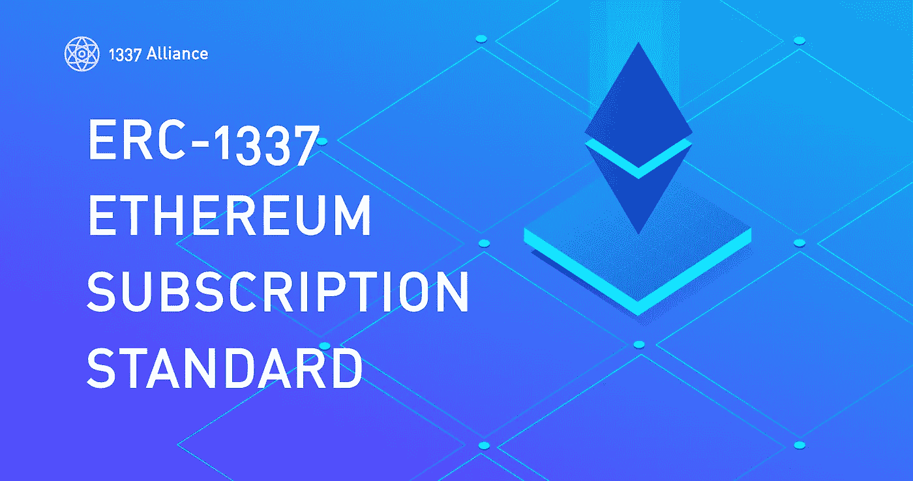

# 以太坊上基于订阅的支付- ERC-1337

> 原文：<https://medium.com/coinmonks/subscription-based-payments-on-ethereum-are-live-now-a0bf17c255fa?source=collection_archive---------5----------------------->

将临时用户与 web3 融合的努力一直是区块链社区讨论的焦点。最近，一个名为 ERC-1337 的开源项目进一步缩小了这个差距。

> ERC-1337 是区块链上用于定期订阅的标准化接口。

这意味着，ERC-1337 是一个令牌协议，使企业能够轻松建立一个使用加密货币的循环支付系统。

订阅模式已被证明是互联网上最健康的收入模式，并获得了很大的人气。将它引入加密领域将证明对用户和 dapp 创始人都有利。在[官方 gitcoin 页面](https://gitcoinco.github.io/ERC-1337/)上提到:

## 对用户的好处:

*   无需阅读复杂的白皮书即可使用 dapps 实用程序(与实用程序令牌相反)
*   跳过理解创始人的授权时间表
*   随时取消

## dapp 所有者的优势:

*   获得稳定的现金流，因为你知道你的用户数，流失率，转换率
*   专注于让你的客户满意(而不是有两个角色:投机者和用户)

ERC 1337 使得 dapp 拥有者能够以他希望的任何代币接收定期付款，或者甚至给予订户选择代币的选项。所有者可以选择支付的时间间隔，订户可以选择他想在每期支付多少以及他愿意向 dapp 所有者总共支付多少。

## 使用案例:

让我们以 ERC-1337 的用例为例。约翰想建立一个博客 Dapp。他可以通过制作白皮书、制作 ICO、空投、奖金等方式完成创建新 ERC20 令牌的整个过程。或者，现在在 ERC1337 的帮助下，他可以简单地在他的网站上添加一个订阅按钮，允许他的 Dapp 用户在订阅的基础上付费，并随时选择退出。

> 为了让 web3 成为浏览互联网的主流方式，我们必须迎合主流受众。

查看[1337 联盟](https://1337alliance.com)的网站了解更多信息。