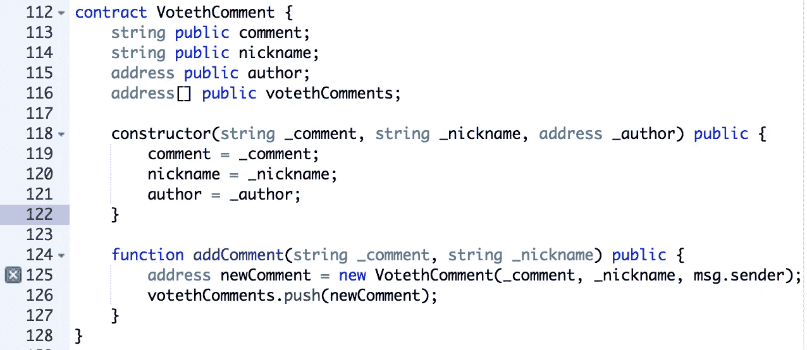
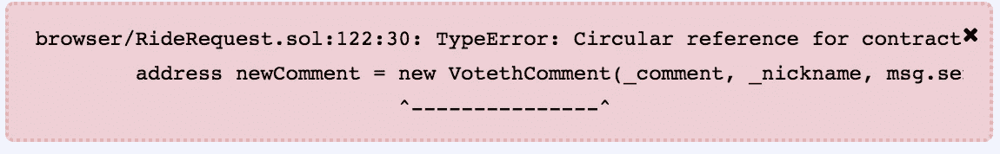
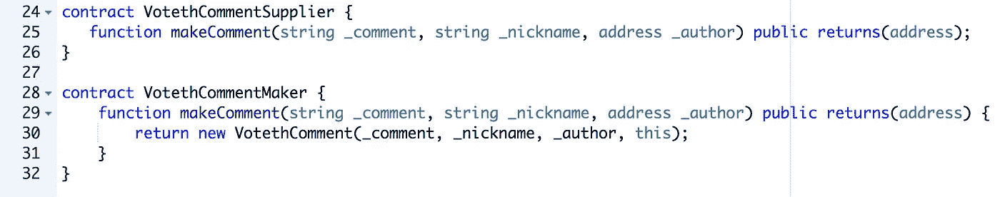
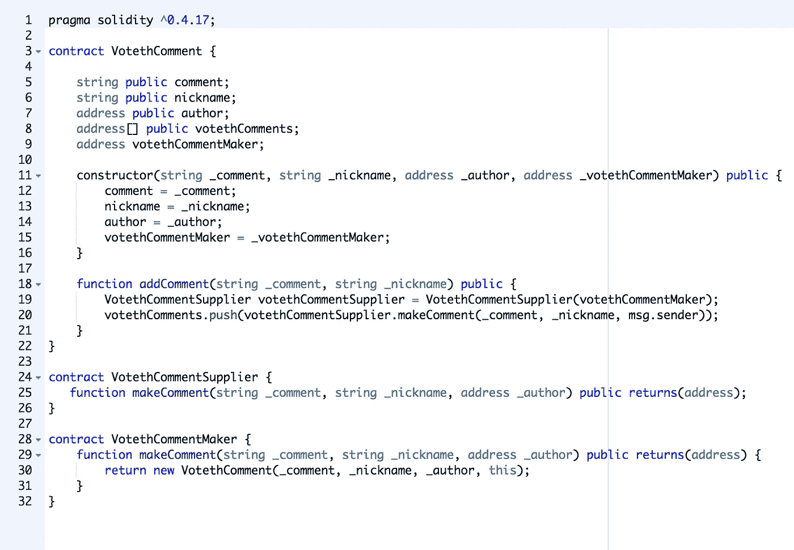
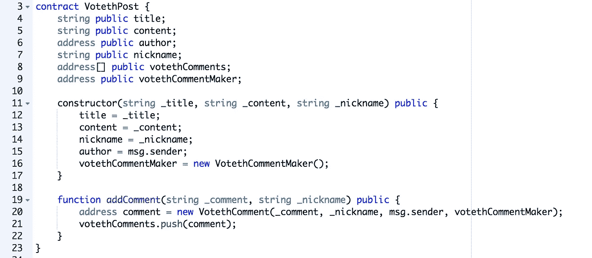

# 在坚固性上颠覆循环参考误差

> 原文：<https://medium.com/coinmonks/subverting-the-circular-reference-error-in-solidity-f7167bf9fdb?source=collection_archive---------12----------------------->

最近，在我的 Solidity adventures 中，我一直在开发一个简单的留言板合同(仍在开发中)，带有类似于 reddit 的投票机制。在尝试实现注释链之前，我一直在宁静中编码。如果你不知道评论链风格的留言板(欢迎来到互联网，你一定是新来的)，这里有一个来自 reddit 的例子。

如你所见，一个评论可以包含许多子评论，子评论可以有自己的子评论。

## 遇到循环引用错误

在匆忙中，我编写了一个简单的实现，其中注释契约只是存储了一组其他注释的地址。这样，我的应用程序的前端就可以在合同中查询评论的子评论。这个不可编译的实现如下所示。

Note: Much of the contract left out for brevity. Using remix.ethereum.org IDE.

对于像我这样的日常工作的 java 开发人员来说，这种类型的引用是正常的，但是在 solidity 中，您不能进行这样的循环引用，否则将会收到一个编译器错误。

Circular reference error

## (丑陋的)解决方案

不幸的是，我没有找到解决这个错误的干净的方法，但是有志者事竟成。我们可以通过创建两个新契约来颠覆这个编译错误。我将这些合同命名为**制造商**和**供应商**合同。 **Maker** 契约包含创建您希望存储的任何契约的实际功能，在我的例子中，是 VotethComment，而 **Supplier** 契约是对 Maker 契约的抽象，所以当我们使用它时，编译器并不知道。要创建这个供应商契约，您所需要的就是 maker 契约的方法签名。供应商将是我们在主合同中使用的合同。

Comment maker and supplier contracts.

现在这个实现带有一个警告，我们现在必须生成一个 Maker 契约，并把它的地址传递给我们的主契约。新的 VotethComment 契约现在看起来会是这样的。

Full code with main contract, maker contract, and supplier contract

如您所见，我们现在必须将生成的 **Maker** 契约传递给构造函数。addComment 函数也进行了修改。现在我们用制造商的地址创建一个**供应商**。这通常是在创建调用现有契约的契约时完成的([又名抽象契约](https://ethereum.stackexchange.com/questions/9733/calling-function-from-deployed-contract?utm_medium=organic&utm_source=google_rich_qa&utm_campaign=google_rich_qa))。供应商现在可以创建一个 VotethComment，我们将该注释添加到 VotethComments 数组中，以便在前端使用。哒哒！评论链！(至少在后端……)

## 打扫干净

因为我正在创建一个 reddit 风格的留言板应用程序，所以我能够通过将 Maker 契约放在 VotethComment 契约的父契约中来清理它的生成，而不是手动生成这个类。这使得我可以忽略漂浮在区块链某处的 Maker 契约的存在，将它存储在 VotethPost 契约中以供继续使用。

正如您在这里看到的，当我调用“new VotethComment()”时，我传递的是方便地存储在创建时的 VotethPost 契约中的注释标记。

你可以在我的 github 上的这里查看完整的示例解决方案[！请随意在混音中使用它！](https://github.com/Kyrrui/SoliditySandbox/blob/master/CircularReferenceExampleSolution.sol)

如果你对我有任何建议或替代方案，请在下面的评论中告诉我！

# 感谢阅读！

我的以太坊地址:0x 947 dee 856 a 22 e 8598 addfe 4 EC 3175248235 eef 01

我的 LinkedIn:【https://www.linkedin.com/in/kyle-c-bryant/】T2

我这个月会去布宜诺斯艾利斯参加[黑客马拉松](https://ethbuenosaires.com/)，请告诉我你是否会去，这样我们就可以联系了！