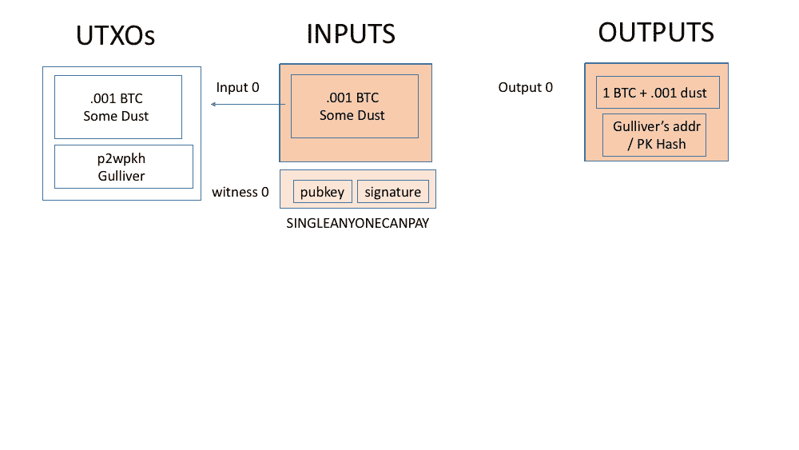
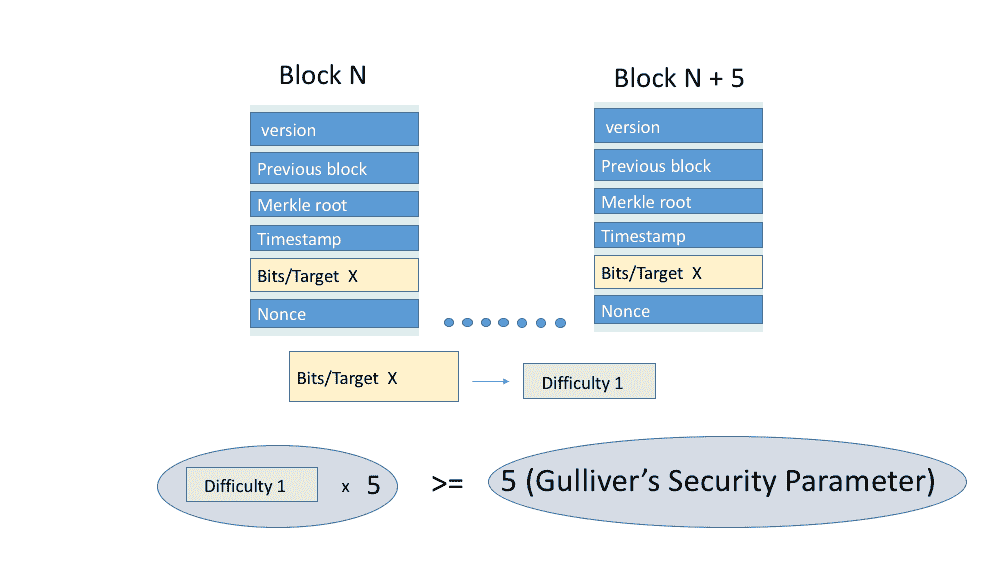
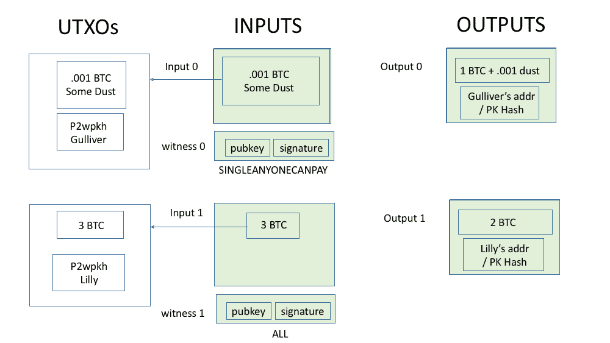
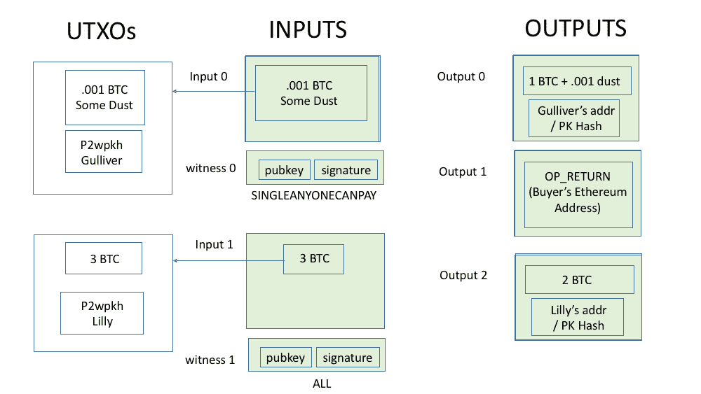
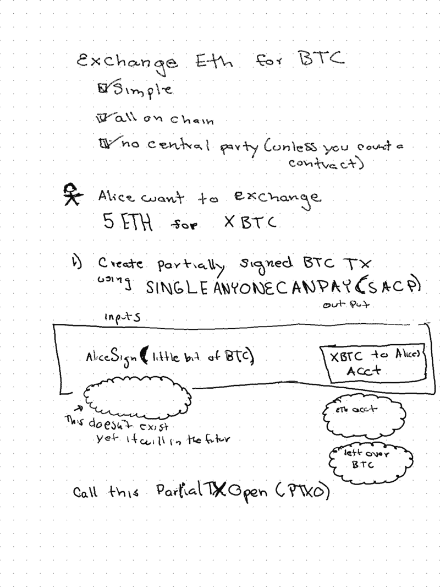
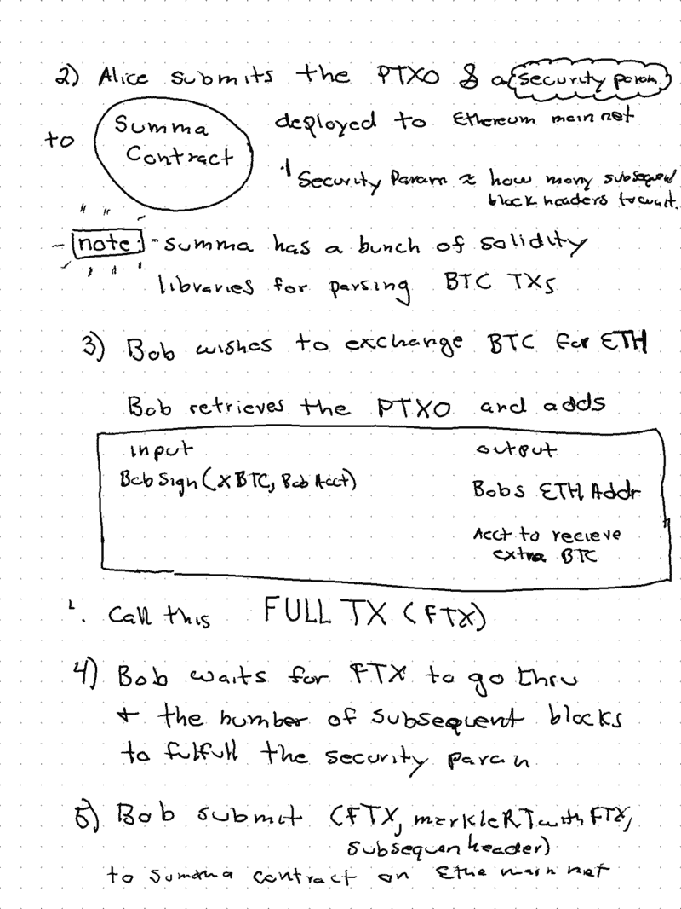
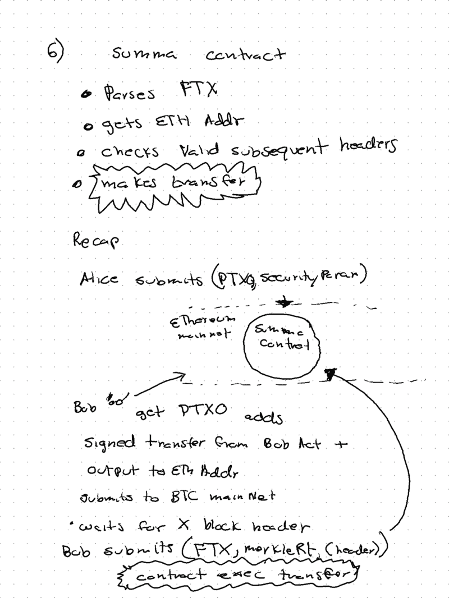

# Summa:解放创造力

> 原文：<https://medium.com/coinmonks/summa-ingenuity-unchained-6be812cd740b?source=collection_archive---------0----------------------->

## 工作证明的力量！

在 ETHDenver，我有幸见到了 James Prestwich 老师，他解释了他的公司 T2 Summa T3 如何在没有任何中央系统的情况下，通过巧妙使用 PoW，实现 ETH 和 BTC 之间的互换。他的设计激起了我的兴趣，所以我想我应该把它写下来。

Summa 的跨链“无状态”互换通过以太坊合约工作，该合约部署在[以太坊](https://blog.coincodecap.com/tag/ethereum/)主网上，并提供以太网< - > BTC 的链上交换。

我会尽量简短，提供更深入文章的链接。让我们来看看流程:

# 关键词

**BTC/以太**:比特币和以太坊分别为货币。

**比特币/以太坊:**区块链。

**UTXO** :未使用的交易输出，比特币维护一个 UTXO 集，该集是以前交易的输出，为了使用 BTC，交易的输入必须指向有效的 UTXO。一旦用作事务的输入，UTXO 就不再有效。

**灰尘**:极少量的 BTC。

**卖家/制作人**:希望出售/开价的演员:用 ETH 换 BTC。

**买方/接受方**:希望以请求的 BTC 金额接受卖方提供的 ETH 的行为者。

**格列佛**:ETH 的卖家。

礼来公司:瑞士联邦理工学院(与 BTC)的买家。

我们将浏览一个场景，在这个场景中，Gulliver 希望以 1 BTC 换 5 个 ETH，并在 Summa 合同中创建一个报价。礼来公司接受了他的提议，给了他 1 BTC，作为回报，他得到了 5 埃特。

# 格列佛想用 5 个 ETH 换 1 个 BTC

1.  Gulliver 创建了一个部分 BTC 交易，输入少量“灰尘”(例如 0.001 BTC)，输出 1 BTC，所需金额加上灰尘，转移到他的比特币账户。该交易尚未生效，因为欧智华的 0.001 投入不等于 1.001 BTC 的产出。要成为有效的比特币交易，输入 UTXOs 的总和必须等于或大于输出 UTXOs 的总和:Sum(input utxo)> = Sum(outputsUTXO)(如果输入 UTXOs 大于输出，任何多余的部分都要支付给矿工)。
    这里的窍门是，Gulliver 创建了这个交易，这样任何获得交易字节的人(通过电子邮件、信号、FTP、智能合同等)。)可以添加缺失的输入和输出，并使事务有效。现在有效的交易可以提交给比特币 T2 网络。一旦有效交易在比特币区块链被接受，格列佛的 1BTC 输出将被转移到他的账户。

Partial Bitcoin (SACP) Transaction

[技术细节这部分可以跳过]
这要归功于一个鲜为人知的 SIGHASH 修饰符 SINGLEANYONECANPAY，James 在[通过比特币双花费的跨链拍卖中分解了这个修饰符](/summa-technology/summa-auction-bitcoin-technical-7344096498f2):

> 比特币协议定义了三种不同的 sighash 类型:SIGHASH_ALL、SIGHASH_SINGLE 和 SIGHASH_NONE。在你问之前，惯例是利用它们。很烦。为了方便起见，我们称这两种类型为“all”和“SINGLE”我们可以忽略“没有”，因为这是一个坏主意，我们不会再谈论它。当您对输入进行签名时，您可以选择这些 sighash 类型之一。
> 
> 对整个事务的所有提交:每个输入和每个输出。一旦你签署了所有，没有人能以任何方式改变交易，除非你的签名无效。这意味着你对任何改变都有完全的否决权。另一方面，SINGLE 提交所有输入，但只有一个输出。用 SINGLE 签名确保没有人可以添加更多的输入，但是任何人都可以添加更多的输出。
> 
> 除了 sighash 类型，我们还可以设置一个修饰符:ANYONECANPAY。它可以混合在一起或单独使用。如果设置了 ANYONECANPAY，那么我们不提交每个输入，而是只提交我们要签名的特定输入。这意味着其他人可以在交易中加入新的投入——就像上面说的，任何人都可以支付！ALLANYONECANPAY 锁定所有输出，而 singlanyonecanpay(**SACP**)**只提交一个输出**。因此，SACP 给其他人增加投入和/或产出的余地。

格列佛创建的部分 SACP 比特币交易具有小的单个 ANYONECANPAY 签名的 UTXO 输入(又名 dust)，以及具有 BTC·格列佛同意以例如 1 BTC 的价格出售其 ETH 的金额的输出。

SACP Partial Bitcoin Transaction

此部分交易无效，因为输入了. 001 BTC！= 1.001 BTC 输出。

2.格列佛现在有一个部分交易，买家可以拿起它，添加输入和输出，以使它有效，并提交给比特币区块链。接下来，他选择一个可配置的*安全参数*，其中表示卖方为了“欺骗”买方支付 ETH 而不接收 BTC 而必须花费的估计金额。这就是工作证明的巧妙运用的来源。

*安全参数*是挖掘连续区块链的难度，从每个比特币区块头中设置的目标参数中导出。目标字段指示挖掘单个块的难度(粗略地说，发现的 PoW 哈希需要包含的前导 0 的数量才能有效)。该目标每 2016 个区块重新计算一次，以将区块承诺率保持在 10 分钟左右。卖家可以根据当前链头中的当前难度设置的模糊计算来设置*安全参数*，James/Summa 会说一个合理的默认应该是> =4 个头。Summa 契约将只接受 N 个块的链，其中难度之和大于安全参数。安全参数是产生 X 个块的近似成本，例如，从接受交易的块开始创建 X 个块的链需要多少散列能力。

*安全参数*基于在每个比特币区块头上设置的难度数，每个区块的 PoW(采矿)的法定成本可以粗略地和概率地计算出来，因此如果 Gulliver 想要设置等于 100 万美元的安全参数(即，买家将花费超过 100 万美元来“愚弄”Gulliver)，他将要求买家/接受者在交易被接受后等待 N 个区块(稍后将详细介绍)。

截至本文撰写之时，当前难度为 [6068891541676](https://bitcoinwisdom.com/bitcoin/difficulty) ，但是对于我们的示例，我们将假设当前块的难度为 1。难度源于块头中的**位**字段，也称为**目标**。如果 Gulliver 选择安全参数 5，那么买方将不得不等待 5 个街区，直到 Summa 合同接受交换。注意，比特/目标字段必须被转换成难度表示:难度= 0xffff x 256⁰x1d-3/target。

格列佛选择了一个*安全参数* == 5

Security Parameter Explained

3.现在格列佛已经拥有了他所需要的在 Summa 合同中创造报价的条件。Gulliver 发送一个以太坊交易，包括对 Summa 合约的 **SACP** 部分比特币交易、5 ETH 的转移以及对 Summa 合约的*安全参数*。

# 礼来公司接受 1 BTC 换 5 ETH 的报价

1.  Lilly 看到了用 5 个 ETH 换 1 个 BTC 的提议，想要接受。
2.  Lilly 在比特币网络上有账户，她接受部分 **SACP** 比特币交易，并用她 BTC 账户的相关密钥签署 3 BTC UTXO 输入。1.001BTC 输出保持固定在卖方/格列佛的账户上。Lilly 添加了一个新的 2 BTC 的 UTXO 输出，该输出进入她拥有的帐户，所以她可以得到零钱。现在我们有一个有效的比特币交易。
    3.001 输入== 3.001 输出，以及有效签名(SACP 和所有)。

Valid Bitcoin TX

3.此外，Lilly 添加了一个输出，该输出指定了她的以太坊地址，如果交换被接受，Gulliver 的 5 ETH 将被发送到该地址。

4.Lilly 然后提交有效的比特币交易，并等待她的交易被接受到块 x 中。

5.然后，她等待 X + N 个模块，使得 X + N 个模块的难度总和等于 Gulliver 设置的安全参数 Y。在我们的例子中，格列佛的安全参数是 5，每个方块的难度是 1，所以 Lilly 等待 5 个方块。

6.一旦比特币链中接受的块数满足安全参数要求，Lilly 将获得 Merkle 根(包含证明)和 X 个后续块头，并将她的购买操作提交给以太坊主网上的 Summa 合同。

注意:没有混乱/不安全的超时，Lilly 不知道她的事务和后续块需要多长时间才能得到确认。如果 Gulliver 想要撤回他的提议，他必须向[区块链](https://blog.coincodecap.com/tag/blockchain/)网络提交取消交易，花费他的 dust 输入，这将取消出售提议，因为没有其他人能够提交部分交易(SACP ),因为输入已经花费，并且随后尝试提交交易将指向相同的输入 dust UTXO，并且由于双重花费保护而失败。

7.Summa 合同将根据安全参数检查 Merkle 包含根和块头，如果一切正常，合同将把 Gulliver 的 5 ETH(托管)转移到 Lilly 在以太坊主网上的以太坊账户。嘭！

# 利用 UTXOs

比特币有一个限制，即输入到 TX 的 UTXO 只能消费一次，不能重复消费，这意味着只有一次卖方出价的购买交易才能进入比特币网络。这也用于取消卖单，所有取消或完成都发生在比特币端。

# 取消

欧智华(瑞士联邦理工学院的卖方)有一个公开要约，其中部分 **SACP** 比特币交易尚未被 chain 接受，他希望取消该交易。没问题！Summa 对此有比特币解决方案。Gulliver 只需使用来自 Summa 合约中开放的 **SACP** 比特币交易的相同(固定)UTXO dust 输入，将完整的**所有**(与开放的 **SACP** 交易相反，没有开放的输入)比特币交易直接提交给比特币区块链。一旦比特币网络接受了 **ALL** 取消交易，Summa 合约中的 SACP 将不再有效，因为它现在有一个已被花费的输入 UTXO！

现在，Gulliver 可以将接受他的取消交易的块的 Merkle root 和后续的比特币块发送到 Summa 合约，5 ETH 将被发送到他在取消交易输出中指定的以太坊地址。

# 重温那些很酷的东西

*   简单的火花快乐！简单并不容易，但是当你得到它的时候你就知道了。有最小的相互交织的关注，每个部分是独立的，但有一个重要的功能。
*   没有时间假设。
*   使用像乐高积木这样的比特币原语来构建一个功能性的、安全的(可配置的)系统。
*   它以一种新颖的方式使用 PoW，展示了非交互式分布式系统算法的强大功能。我总是对战俘感到兴奋。
*   它使用 UTXOs 作为强制约束，以避免双重花费，在 Summa 的情况下，双重花费是指两个参与者执行相同的订单，例如，比特币网络上的两个参与者成功提交了完整的比特币交易。
*   他们做了一些很酷的库来解析 BTC 块。

感谢[詹姆斯·普雷斯蒂奇](https://twitter.com/_prestwich)提出 Summa，并对其进行解释和回顾！

# 更多深度链接

[通过比特币双花费的跨链拍卖](/summa-technology/summa-auction-bitcoin-technical-7344096498f2)
[如何在以太坊验证比特币支付(只需 700k 气！)](/summa-technology/cross-chain-auction-technical-f16710bfe69f)
[介绍黎曼](/summa-technology/introducing-riemann-7c1c3cb4a52)
[Summa](https://summa.one)
[Summa Twitter](https://twitter.com/summa_one)

# [我的非凡笔记](https://remarkable.mention-me.com/m/ol/mb5oo-libby-kent)

> [直接在您的收件箱中获得最佳软件交易](https://coincodecap.com/?utm_source=coinmonks)

