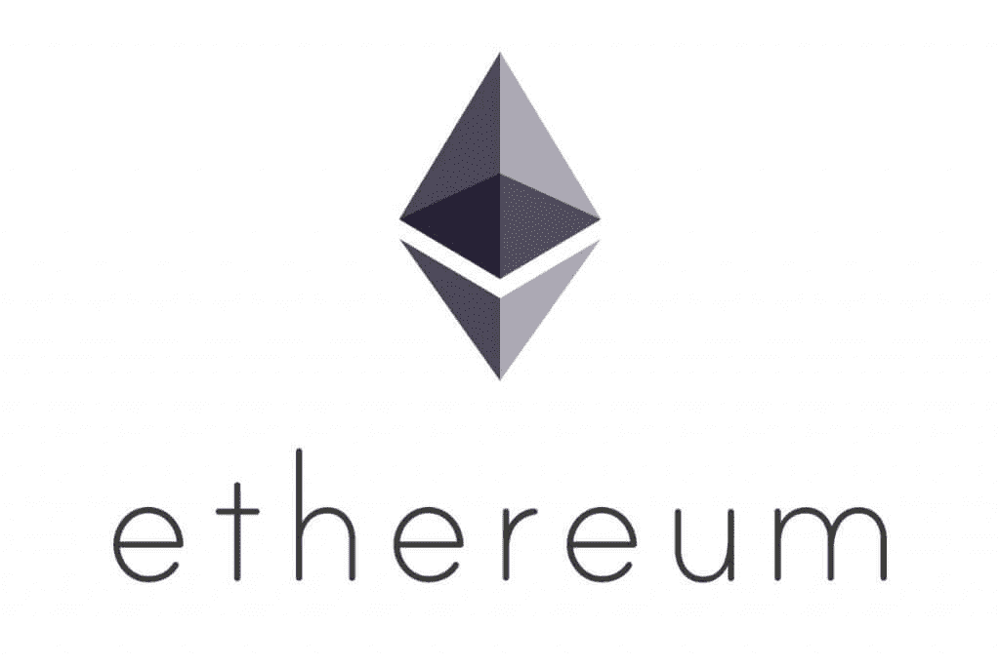
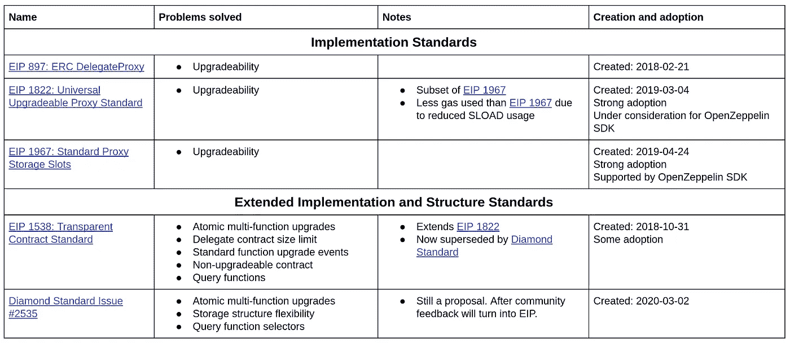

# 以太坊可升级智能合约 R&D 摘要—第二部分— 2020 年

> 原文：<https://medium.com/coinmonks/summary-of-ethereum-upgradeable-smart-contract-r-d-part-2-2020-db141af915a0?source=collection_archive---------0----------------------->

本文总结了 2018 年以来可升级以太坊智能合约领域的新研发成果。它介绍了扩展以太坊可升级智能合约摘要的新作品和标准。请阅读它，熟悉这篇文章的背景。

本文旨在为理解可升级智能合约策略提供一个方便、集中的平台。如果你正在关注或参与 R&D 的这个领域，请对这篇文章发表评论，提供任何可能对他人有用的见解、反馈或评论。

感谢[尼克·穆奇](https://medium.com/u/ca7b1065d06a?source=post_page-----db141af915a0--------------------------------)和[圣地亚哥·帕拉迪诺](https://medium.com/u/abfab5c96ac6?source=post_page-----db141af915a0--------------------------------)对本文的贡献和评论！

# 可升级的采用

大多数以太坊项目都使用可升级的智能合同策略。代理模式是目前为止最常用的项目，如 [Gnosis](https://blog.gnosis.pm/solidity-delegateproxy-contracts-e09957d0f201) 、 [AragonOS](https://hack.aragon.org/docs/aragonos-intro.html) 、 [Compound Finance](https://compound.finance/) 、 [Melonport](https://github.com/melonproject/melon-mail/blob/782aeff9418ac8cdd80875fd6c400bf96f3b03b3/solidity/contracts/DelegateProxy.sol) 、 [Limechain](https://github.com/LimeChain/UpgradeableSolidityContract/blob/14bcabc338130fb2aba2ce8bd27b885305566fce/contracts/Upgradeability/Forwardable.sol) 、 [WindingTree](https://windingtree.com/) 、 [Terminal](https://terminal.co/) 、[deconland](https://github.com/decentraland/land/blob/5154046844f6f94a5074e82abe01381e6fd7c39d/contracts/upgradable/DelegateProxy.sol)以及许多其他使用这种模式的完全或部分可升级的合同系统。

OpenZeppelin SDK 可升级的 T2 智能合约工具是这项技术的主要推动者。根据 Github 和 growing 的数据，每周超过 2300 次下载[、@openzeppelin/upgrades](https://www.npmjs.com/package/@openzeppelin/upgrades) 和 [zos-lib](https://www.npmjs.com/package/zos-lib) ，总下载量超过 18 万次。OpenZeppelin SDK 目前使用符合 EIP 1967 可升级契约标准的透明代理模式。

[以太扫描](https://etherscan.io/)，全球使用最广泛的[以太坊](https://blog.coincodecap.com/tag/ethereum/)块浏览器，支持多种可升级代理模式，允许透明监控可升级智能合同数据和升级:

*   [EIP 1967 年](https://eips.ethereum.org/EIPS/eip-1967)
*   [EIP 1822 年](https://eips.ethereum.org/EIPS/eip-1822)
*   [OpenZeppelin 的永恒储存](https://blog.openzeppelin.com/smart-contract-upgradeability-using-eternal-storage/)

EIP 1538 是采用最多的高级可升级合同标准，目前由 [EIP 1155 多令牌标准](https://eips.ethereum.org/EIPS/eip-1155)提出。

独立的逻辑和数据契约的使用最近还没有被采用。

# 新 R&D

新的研究和开发完全集中在可升级代理模式上。这些作品分为两类:

# 实施标准

这些提供了代理模式的标准实现。在很大程度上，这些标准中的每一个都用稍微不同的底层实现来解决可升级的契约问题。主要的区别在于执行效率和社区对标准的支持。

使用代理模式的可升级合同失去了透明度:

*   数据结构和功能不太容易理解，因为它们是在逻辑契约中定义的，而不是代理本身。
*   了解合同何时升级需要了解升级功能签名

实现标准允许外部查看者(例如，块浏览器)和其他契约了解如何读取和执行契约中的所有功能，并知道何时发生升级以使契约再次透明。

自 2018 年以来，已经创建了三个实施标准:

*   [**EIP 897: ERC 委托代理人**](https://eips.ethereum.org/EIPS/eip-897) :已创建 2018-02-21
*   [**EIP 1822:通用可升级代理标准(UUPS)**](https://eips.ethereum.org/EIPS/eip-1822) :创建于 2019–03–04 这个标准似乎被广泛使用。它是 EIP 1967 的子集。
*   [**EIP 1967:标准代理存储插槽**](https://eips.ethereum.org/EIPS/eip-1967) :已创建 2019–04–24。OpenZeppelin SDK 的[透明代理模式](https://blog.openzeppelin.com/the-transparent-proxy-pattern/)和[非结构化存储代理](https://docs.openzeppelin.com/upgrades/2.7/proxies#unstructured-storage-proxies)符合该标准，因此得到了广泛应用。

# 扩展实现和结构标准

这些标准与实现标准具有相同的功能和标准化。这些工作解决了简单代理模式中的问题，并使用最新的[以太坊](https://blog.coincodecap.com/tag/ethereum/) EVM 和编译器特性定义了数据结构、升级和事件的标准命名约定。

以下两个标准都包含了建立在代理模式之上的多项创新，如下所述。钻石标准建立在 EIP 1358 之上。两部作品都由尼克·穆奇领导。

[**EIP 1538:透明合同标准**](https://eips.ethereum.org/EIPS/eip-1538) :创建于 2018-10-31

*   **原子多功能升级** —在以前的标准中，每个代理指向一个逻辑契约，该契约定义了可升级契约的所有功能和数据。这意味着升级一个功能必须升级整个逻辑契约。这个标准允许每个代理有多个逻辑契约，每个函数指定它所使用的逻辑契约。这样做的结果是，通过升级其中一个逻辑契约，可以一次添加、删除和更改多个功能。这种功能级别的可升级性首先在[阿拉冈诺斯](https://hack.aragon.org/docs/aragonos-intro.html)上实现和部署。
*   **委托合同大小限制** —以太坊合同最大限制为 24kb。通过允许多个逻辑契约，这种限制被消除了。开发人员能够跨多个逻辑契约编译所需的业务逻辑。然后，代理就能够拥有实际上无限的功能代码库，这些代码库被分成几个逻辑契约。
*   **标准功能升级事件** —由于该标准允许功能级升级和原子多功能升级，因此引入了*事件签名*来标准化升级监控。
*   **不可升级的合同** —本标准实现了一种使合同不可升级的标准方法。这是通过在逻辑契约中定义升级功能来实现的，使得升级功能是可移除的。
*   **查询函数** —为契约提供一种标准化的方式来查询存在哪些函数以及它们使用了哪些逻辑契约。

[**钻石标准发布#2535**](https://github.com/ethereum/EIPs/issues/2535) :创建于 2020–03–02

*   **原子多功能升级** —利用 ABIencoderV2(从 Solidity v0.6.0 开始不是实验性的)，升级功能能够采用功能和逻辑契约的动态列表来升级，并在同一事务中一次自动升级它们。这消除了契约状态不一致的可能性。在 EIP 1538 中，多个功能只有在它们存在于同一个逻辑契约中时才能被升级。
*   **存储结构灵活性** —利用新的 Solidity v0.6.4 语言特性，逻辑契约只需要继承它实际将要使用的状态变量，而不是任何逻辑契约和代理曾经使用的所有状态变量。
*   **查询功能选择器** —本标准不使用*功能签名*，而是对每个可升级功能使用*功能选择器*，以降低燃气成本并提高正确使用/读取合同的能力。这也利用了 ABIencoderV2。
*   还增加了一些命名约定，如“钻石”契约。

# 未解决的挑战

可升级代理模式的逻辑契约定义了不能改变顺序的变量布局。每个单独的逻辑契约对此负责(通常通过继承存储契约)——这是开发人员的责任。更多细节请参见本 [OpenZeppelin 指南](https://docs.openzeppelin.com/upgrades/2.7/writing-upgradeable)和本[测试库](https://github.com/theblockstalk/upgradeable-proxy)。这对 OpenZeppelin SDK，甚至对 Diamond 标准都有影响。

对以太坊 WASM 和以太坊 2.0 架构的升级可能会导致代理可升级合同的重大变更。

当前部署的可升级合同不能更改可升级性策略。

出于上述原因，仍然建议将所有功能[设为可禁用](https://github.com/OpenZeppelin/openzeppelin-contracts/blob/master/contracts/lifecycle/Pausable.sol)，以便在可升级性出现预期或意外问题时，可以通过硬分叉安全地升级合同。

# 结论

多个可升级的代理标准已经被创建并被社区采用。标准允许可升级的合同变得透明和更有用。EIP 1822 和 1967 已被社区广泛采用，没有安全问题的报告。

使用最新的[以太坊](https://blog.coincodecap.com/tag/ethereum/)编译器和虚拟机，改进和扩展代理模式功能的高级标准已经开发出来并投入使用。EIP 1538 已被社区采用。钻石标准建立在 EIP 1538 的基础上，在成为 EIP 标准之前仍在发展中。

使用最新标准使新合同部署的可升级性、向前兼容性和问题缓解更加容易。已经部署的合同不能更改其可升级性策略。使用可升级策略的开发人员应该对它们提供的机制和限制感到满意。

# 参考

1.  [https://github.com/ethereum/solidity/releases/tag/v0.6.4](https://github.com/ethereum/solidity/releases/tag/v0.6.4)
2.  [https://medium . com/1 million devs/solidity-storage-layout-for-proxy-contracts-and-diamonds-c4f 009 b 6903](/1milliondevs/solidity-storage-layout-for-proxy-contracts-and-diamonds-c4f009b6903)
3.  [https://medium . com/1 million devs/new-storage-layout-for-proxy-contracts-and-diamonds-98d 01 d0 eadb](/1milliondevs/new-storage-layout-for-proxy-contracts-and-diamonds-98d01d0eadb)
4.  [https://medium . com/ethers can-blog/and-finally-proxy-contract-support-on-ethers can-693 E3 da 0714 b](/etherscan-blog/and-finally-proxy-contract-support-on-etherscan-693e3da0714b)
5.  [https://github.com/ethereum/solidity/releases/tag/v0.6.0](https://github.com/ethereum/solidity/releases/tag/v0.6.0)
6.  [https://solidity . readthedocs . io/en/latest/060-breaking-changes . html](https://solidity.readthedocs.io/en/latest/060-breaking-changes.html)
7.  [https://github.com/ethereum/EIPs/issues/170](https://github.com/ethereum/EIPs/issues/170)

> [直接在您的收件箱中获得最佳软件交易](https://coincodecap.com/?utm_source=coinmonks)

