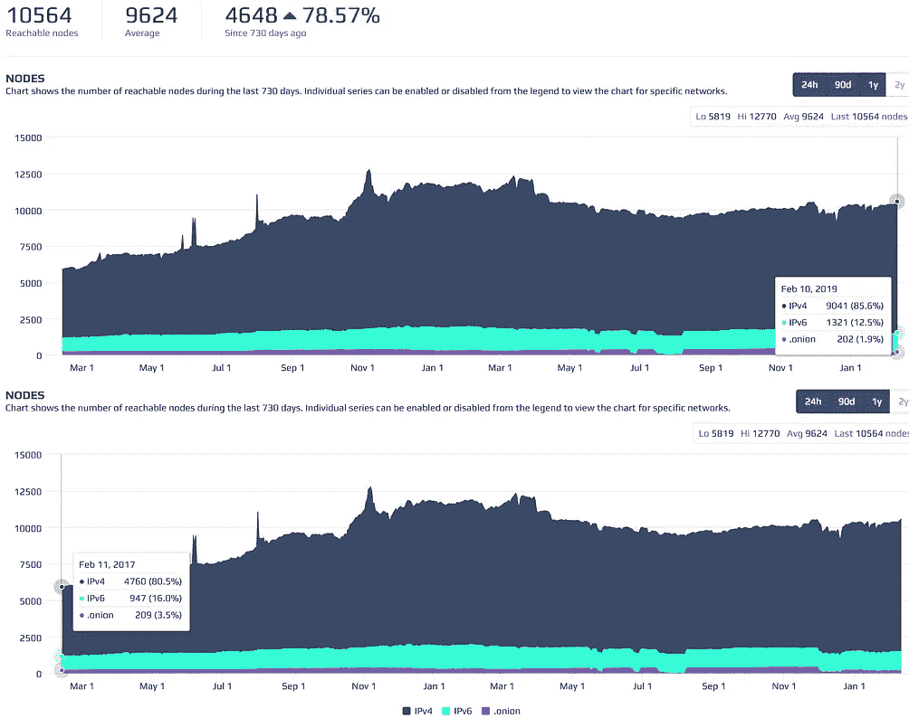
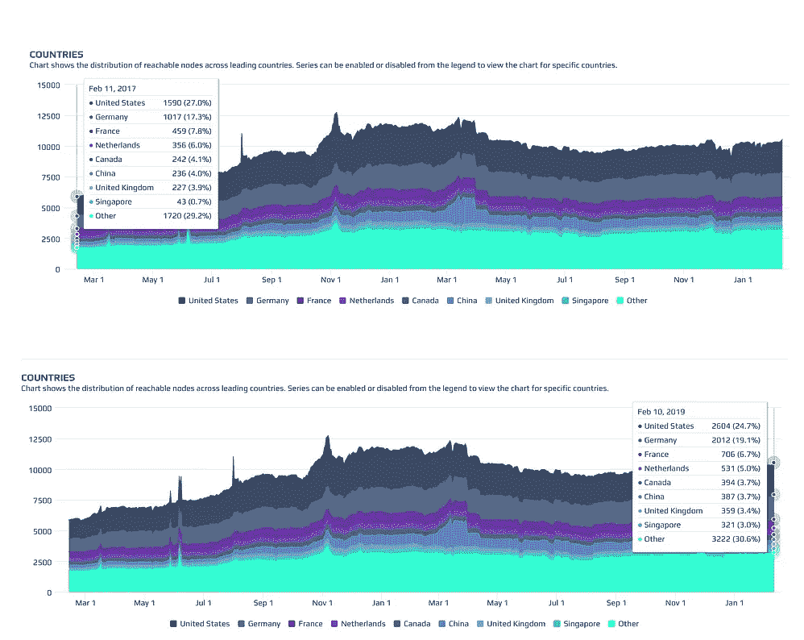

# 总结:降低比特币的块大小和块重量限制

> 原文：<https://medium.com/coinmonks/summary-reducing-the-block-size-and-block-weight-limits-in-bitcoin-d1a44f1589eb?source=collection_archive---------1----------------------->

最近，关于比特币目前的块大小和块重量限制，Twitter 上发生了很多争议。这一争议的主要来源是标志性的比特币核心开发者小卢克(Luke-Jr .)。讨论主要是关于**去中心化**与以下方面的关系:

*   初始块下载(IBD):这是对等方用来从对等方下载和验证区块链的初始同步。用户下载所有块并验证其中的所有事务& UTXOs。运行完整节点的用户拥有完全的主权，因为他们不仅拥有整个历史，而且可以使用该历史来授权他们自己运行符合该历史和网络的共识规则。因此，无论如何，他们都能以一种不信任的方式来保护自己的财富。
*   带宽:在 IBD 期间，用户需要大量的带宽来可靠地下载块，并与网络保持同步
*   CPU:用户需要处理能力来执行 IBD 验证、保持同步以及在合理的时间内处理事务和块。在小型设备上，验证块所需的 [CPU 能力会成为一个巨大的瓶颈](https://twitter.com/erickuhn19/status/1095553655086804993)。
*   I/O:存储在内存中与磁盘读写量相关的数据。在大多数设备上可以忽略不计，但在非常小的设备(物联网)上变得更加重要。

**降低块重限制的理由:**

*   用户执行比特币完整节点的初始块下载并保持与比特币网络同步的成本更低、速度更快。最终，下载整个区块链会非常麻烦，用户根本不会这样做，而是求助于 SPV/Neutrino 或可信的第三方解决方案来与区块链接口
*   潜在地允许用户在移动电话和具有有限带宽的低带宽和低功率设备上运行完整的节点
*   增加使用 TOR 的节点数量，因为 TOR 的带宽更加有限
*   已经有太多的块空间，因此如果我们不减少块大小并强制形成一个费用市场，由于闪电网络，未来的交易费用可能不够高

**原因*不*减少块重限制:**

*   争议更少:社区可以专注于通过教育让更多的用户运行完整的节点，而不是在 Twitter 上争论
*   通过改善运行完整节点的用户的 UX，例如向比特币核心客户端和钱包 GUI 添加本机硬件钱包签名支持(PSBT ),可以更好地提高去中心化
*   更强大的 CPU 和更高的带宽在全球范围内持续增长
*   完整的节点并不那么重要，除非用户实际上正在使用它们
*   我们没有足够的数据来为讨论提供信息
*   担心的理由更少，因为公司现在正在提供比特币全节点硬件:[@ nodl _ it](http://twitter.com/nodl_it)[@ casa hodl](http://twitter.com/CasaHODL)[@ lightninginabox](http://twitter.com/lightninginabox)
    [@ BitseedOrg](http://twitter.com/BitseedOrg)[@ SamouraiWallet](http://twitter.com/SamouraiWallet)

**区块限重降低建议:**

*   暂时减轻缸体重量。这将比当前 4mb 的理论数据块重量限制减少 3-6 个月，实际上大约为 2.1mb。
*   300kb 意味着理论上的数据块重量限制约为 1.2mb，因此最大数据块容量约为 700kb
*   600kb 的数据块大小意味着理论上的数据块重量限制约为 2.4mb，因此最大数据块容量约为 1.4mb

# **目前的数据告诉我们什么？**

在过去的两年中，可达全节点的数量增加了 78.57%。 ***完整节点数的波动似乎也与牛市和熊市*** 相关，因为我们看到 2017 年 11 月 1 日左右的峰值将持续到 2018 年春天。到 2019 年 11 月，节点数量似乎又开始缓慢增长，这可能与从硬件提供商那里购买完整节点的人数增加有关。

不相信我？你自己看吧:【https://bitnodes.earn.com/dashboard/?days=730】T21

我目前的观点是，主张这种改变的人根本没有数据来支持他们的断言，即降低块大小/重量限制将增加完整节点的数量。我一再要求更多的数据，但它显然不存在。

# 那么，我们如何获得我们需要的数据呢？

我想看看各种设备和位置是如何受到影响的。我觉得这是一个很好的机会，可以推断出一些数据，并以某种方式将这些数据可视化，从而传达几个不同场景的总成本(手机、笔记本电脑 wifi 和高端台式机)

请让我知道我是否遗漏了什么，或者是否有需要改正的地方。

> [直接在您的收件箱中获得最佳软件交易](https://coincodecap.com/?utm_source=coinmonks)

