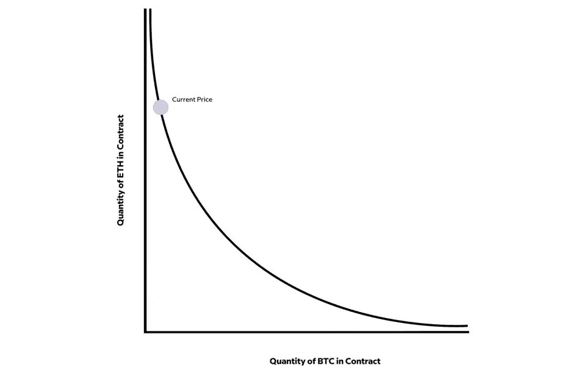
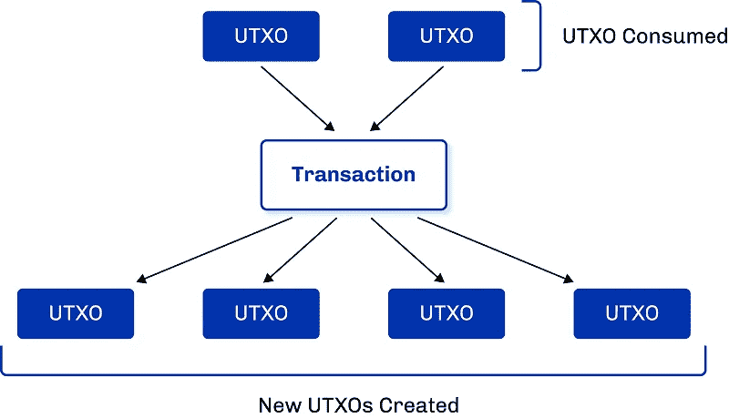
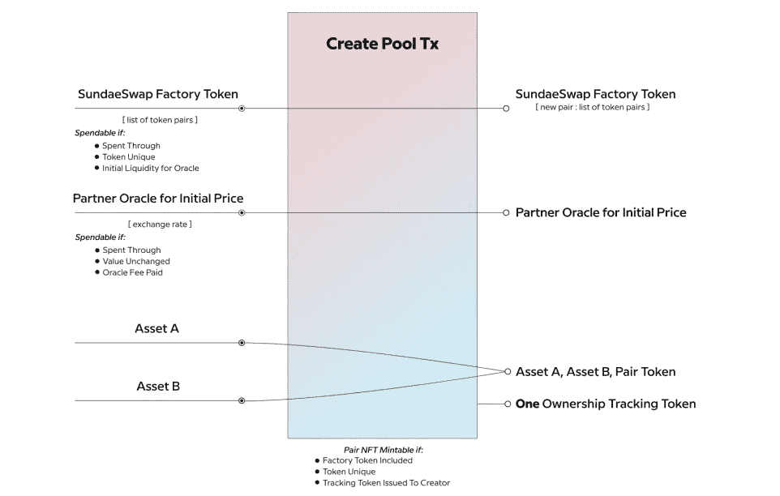
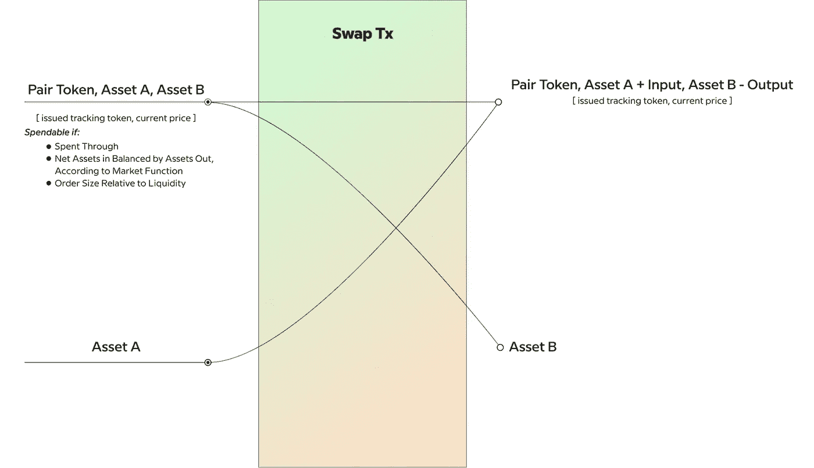
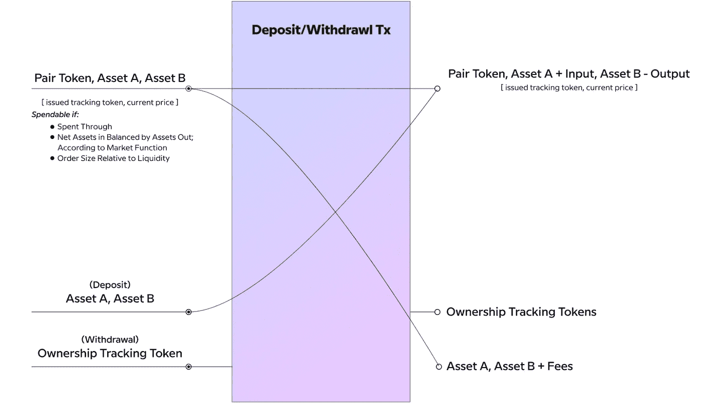
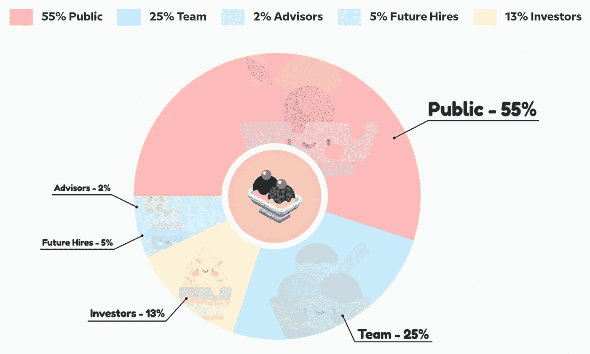

# SundaeSwap:Defi 中的最新指数

> 原文：<https://medium.com/coinmonks/sundaeswap-the-latest-dex-in-defi-f6ea8e9eea92?source=collection_archive---------1----------------------->

image: [sundaeswap.finance](https://www.sundaeswap.finance/)

SundaeSwap 是在卡尔达诺区块链建立的第一个分散式交易所(DEX)。如果你熟悉 UniSwap 或其他指数，那么它是非常相似的。如果没有，我建议花几分钟时间阅读我的另一篇文章[这里](/@gavin.stein1/blockchains-decentralisation-of-financial-services-decentralised-exchanges-3c6f2bb81c11)。那篇文章将从总体上讨论 DEXs 它们存在的原因和运作方式。在本文中，我将讨论 SundaeSwap 的实现以及它计划如何分发它的令牌；圣代冰淇淋。

> 我不是 SundaeSwap 团队的成员，这篇文章是从外部角度进行的独立讨论和分析。

# 履行

SundaeSwap 的目标是成为 Cardano 网络的 UniSwap，并将实现相同的常量产品池 AMM 算法: *x * y = k*

image: [https://www.sundaeswap.finance/papers/SundaeSwap-2021-06-01-Fundamentals.pdf](https://www.sundaeswap.finance/papers/SundaeSwap-2021-06-01-Fundamentals.pdf)

虽然最终产品和用户体验非常相似，但这种新 DEX 的实现却大不相同。这是因为卡尔达诺的会计模式不同。与以太坊的记账模式不同，卡尔达诺使用的是 eUTXO 来自比特币网络的“未用交易输出”模型的扩展实现。在这种模式下，区块链上的资产托管作为交易的未用产出进行跟踪。这些未动用的产出作为新交易的投入被消费，从而产生更多未动用的产出。

image: [https://iohk.io/en/blog/posts/2021/03/12/cardanos-extended-utxo-accounting-model-part-2/](https://iohk.io/en/blog/posts/2021/03/12/cardanos-extended-utxo-accounting-model-part-2/)

由于 Cardano 的会计模型，常量产品池模型的实现需要对 UniSwap 的以太坊实现进行一些修改。SundaeSwap 有四种类型的令牌:

**$圣代代币**

*   这是协议的治理令牌。

**全局池工厂令牌**

*   允许创建资产对 LP 令牌和流动性池的唯一令牌。

**资产对 LP 令牌**

*   这些令牌与该池的流动性一起锁定在一个脚本中。

**跟踪令牌**

*   这些代币交给流动性提供者，以跟踪他们有权获得的流动性池部分。

在该协议中，有四种类型的事务可以执行:

1.  创建流动性池
2.  交换代币
3.  存款流动性
4.  提取流动性

我现在将简要讨论这些事务中的每一个，以及它们是如何在 eUTXO 模型中实现的。

## 创建流动性池

该事务接受四个输入:

1.  SundaeSwap 工厂令牌
2.  合作伙伴 Oracle 的初始价格
3.  资产 A
4.  资产 B

并且具有四个输出:

1.  SundaeSwap 工厂令牌
2.  合作伙伴 Oracle 的初始价格
3.  资产 A、资产 B、配对令牌
4.  一个跟踪令牌

image: [https://www.sundaeswap.finance/papers/SundaeSwap-2021-06-01-Fundamentals.pdf](https://www.sundaeswap.finance/papers/SundaeSwap-2021-06-01-Fundamentals.pdf)

投入 1 和投入 2 通过；换句话说就是基本上不被消耗，并构成产出 1 和 2。该交易将铸造两个新代币；资产对 LP 令牌和跟踪令牌，它们构成输出 4 和输出 3 的一部分。输入 3 和 4 被消耗并构成输出 3 的剩余部分。只有当资产对是唯一的，并且协议中不存在这些资产的流动性池时，才会执行交易。

## 交换代币

该事务接受两个输入:

1.  配对令牌，资产 A，资产 B(您可以看到这与上面创建池事务的未用输出 3 相同)
2.  资产 A

并且具有两个输出:

1.  配对令牌，资产 A +输入，资产 B -输出
2.  资产 B

image: [https://www.sundaeswap.finance/papers/SundaeSwap-2021-06-01-Fundamentals.pdf](https://www.sundaeswap.finance/papers/SundaeSwap-2021-06-01-Fundamentals.pdf)

该交易不铸造或焚烧任何代币，作为产出返回的资产 B 的数量取决于流动性池的市场函数( *x*y=k* )。

## 存款流动性

该事务接受两个输入:

1.  配对令牌，资产 A，资产 B
2.  资产 A，资产 B

并且具有两个输出:

1.  配对令牌，资产 A +输入，资产 B +输入
2.  跟踪令牌

image: [https://www.sundaeswap.finance/papers/SundaeSwap-2021-06-01-Fundamentals.pdf](https://www.sundaeswap.finance/papers/SundaeSwap-2021-06-01-Fundamentals.pdf)

如果您存入流动资金，此交易将生成一个跟踪令牌，其数量将与您存入的流动资金数量成比例。目前还不清楚交易是否强制要求存入相等价值的资产 A 和 B，但不这样做是不明智的，因为流动性提供者会因套利交易者而立即损失资本。

## 提取流动性

该事务接受两个输入:

1.  配对令牌，资产 A，资产 B
2.  跟踪令牌

并且具有两个输出:

1.  配对令牌，资产 A —输出，资产 B —输出
2.  资产 A，资产 B

此交易将烧掉跟踪令牌，并根据跟踪令牌输入占跟踪令牌总供应量的比例，返还池中的部分流动性。这一机制将返还比存款更多的流动性，因为它包括资金池赚取的一部分费用。

## 实现可伸缩性缺陷

理论上，这种实现是可行的，但是它有一个严重的缺陷，白皮书中已经强调了这一点。每个 eu txo——如配对令牌和资产对——在单次交易中，每个 block⁴.只能使用一次在卡尔达诺的区块链上，大约每 20 秒钟增加一块积木。这意味着流动性池每 20 秒只能促成一次互换。这远非理想，并且会阻止该协议获得任何形式的成功。SundaeSwap 团队声称有一个解决方案，但尚未公布任何细节。根据白皮书，扩展解决方案将在未来的白皮书中讨论。

## 协议升级过程

协议的未来升级已经被主动考虑，SundaeSwap 团队已经允许一个相对无缝的解决方案来保持协议版本之间的流动性。为每个池持有流动性的验证智能合约有一个未来版本的列表——最初没有。该列表中的任何未来版本都将能够访问该智能合约的流动性。该协议的治理允许圣代令牌持有者投票，他们可以选择将未来版本添加到列表中。

# 令牌分发

SundaeSwap 的初始令牌分发已经公布，有一些好的和坏的外卖。下图说明了令牌将被分发到的位置。

image: [sundaeswap.finance](https://www.sundaeswap.finance/)

55%的代币将归公众所有，而剩下的 45%将在 SundaeSwap 团队、其他贡献者和投资者之间分配。我们不知道这个利益相关者群体有多多样化，但是如果为了分散化而降低这个比例会更好。由于一小部分利益相关者持有如此大比例的令牌(接近大多数),这就对去中心化的想法提出了挑战，并对团队的动机以及他们最初为什么要创建该协议提出了质疑。然而，归根结底，这一决定和协议的方向取决于他们。

## 首次股份池发行(ISO)

代币的公开发行将通过多种方式进行，主要是通过提供流动性和产量农业。他们还将在推出 DEX 的同时推出首次股票池发行(ISO)。这是有针对性的发生在卡达诺网络的阿隆索硬分叉旁边。ISO 将运行 25 天(5 个时期)。在每个时段，总代币的 1%将分配给赌注池参与者，整个活动的总代币为 5%。最吸引人的是，除了常规的 ADA 赌注奖励之外，委派者还将获得$圣代代币。

他们已经表示将有不止一个 stakepool⁵的赌注池将不会由 SundaeSwap 团队管理，而将由从社区中选择的独立 Cardano 赌注池运营商管理。做出这一决定是为了增加社区参与，并在这些社区成员中分发代币。

一些批评指向分配给 ISO 的令牌数量(5%)，这些人希望这个数字更高。由于 ISO 的性质，这个数字是合适的。社区无需冒险或花费任何资本就能获得代币。如果他们想要接收更多的代币，他们有能力参与协议并提供流动性。通过这样做，流动性提供者将能够获得更多代币，以换取风险资本和支持该协议。此外，在 ISO 中分发更多的令牌可能会看到这些令牌最终进入鲸鱼的钱包。虽然 SundaeSwap 团队将实施机制来劝阻鲸鱼积累大多数令牌，但这仍然是一个风险。出于这些原因，5%的分配是合理的。

ISO 也将在为 SundaeSwap 开发的法律框架内进行。这个框架还没有在法庭上测试过，但它是基于当前的测试和案例法，如果是在 challenged⁶.，它会被考虑

# 结论

这基本上概括了卡尔达诺区块链的新协议。我没有讲太多细节，但我希望这足以让你有一个像样的了解。议定书也远未完成。它的治理模式和可扩展性仍需改进，该团队希望包括更多功能，如集中 liquidity⁷(uni swap v3 最近推出的功能)和二级衍生品市场。围绕这一新指标，还有更多的讨论。一个重要的话题是流动性。由于 SundaeSwap 将位于 Cardano，defi 中存在的大量流动性最初将不会提供给它。虽然将有一个 ERC20 转换器来跨资产进行转换，但看看这如何进行会很有趣。

# 参考

[1][https://www.youtube.com/watch?v=OqNU99s6o_Q&t = 1s](https://www.youtube.com/watch?v=OqNU99s6o_Q&t=1s)

[2][https://www . SundaeSwap . finance/papers/SundaeSwap-2021-06-01-fundamentals . pdf](https://www.sundaeswap.finance/papers/SundaeSwap-2021-06-01-Fundamentals.pdf)

[3][https://iohk . io/en/research/library/papers/the-extended-utxo-model/](https://iohk.io/en/research/library/papers/the-extended-utxo-model/)

[4]见 2。

[5]见 1。

[6]见 1，据 SundaeSwap 小组称，概述这一法律框架的绿皮书将很快发表。

[7]见 2。

> 加入 [Coinmonks 电报频道](https://t.me/coincodecap)，了解加密交易和投资

## 也阅读

 [## 最佳加密交易所| 2021 年十大加密货币交易所

### 加密货币交易所的加密交易需要了解市场，这可以帮助你获得利润…

blog.coincodecap.com](https://blog.coincodecap.com/crypto-exchange)  [## 2021 年 9 大最佳加密借贷平台

### 当谈到加密货币贷款时，大量因素等同于良好的收入状况。此外，借款的一部分…

blog.coincodecap.com](https://blog.coincodecap.com/crypto-lending)  [## 2021 年最佳加密交易机器人(免费和付费)

### 2021 年币安、比特币基地、库币和其他密码交易所的最佳密码交易机器人。四进制，位间隙…

medium.com](/coinmonks/crypto-trading-bot-c2ffce8acb2a)  [## 最佳 4 个加密交易信号电报通道

### 这是乏味的找到正确的加密交易信号提供商。因此，在本文中，我们将讨论最好的…

medium.com](/coinmonks/best-crypto-signals-telegram-5785cdbc4b2b)  [## BlockFi 评论 2021:利弊和利率

### 今天，我们提出了一个全面的 BlockFi 评论，这是一个成立于 2017 年的加密贷款平台，拥有其…

blog.coincodecap.com](https://blog.coincodecap.com/blockfi-review)  [## 如何在印度购买比特币？2021 年购买比特币的 7 款最佳应用[手机版]

### 如何使用移动应用程序购买比特币印度

medium.com](/coinmonks/buy-bitcoin-in-india-feb50ddfef94)  [## 加密税务软件——五大最佳比特币税务计算器[2021]

### 不管你是刚接触加密还是已经在这个领域呆了一段时间，你都需要交税。

medium.com](/coinmonks/best-crypto-tax-tool-for-my-money-72d4b430816b)  [## Pionex 评论 2021 |免费加密交易机器人和交换

### Pionex 是为交易自动化提供工具的后起之秀。Pionex 上提供了 9 个加密交易机器人…

medium.com](/coinmonks/pionex-review-exchange-with-crypto-trading-bot-1e459d0191ea)  [## 存储比特币的最佳加密硬件钱包[2021]

### 保管您的数字资产很容易，但找到正确的存储方式却是一项繁琐的任务。在线钱包有一个风险…

blog.coincodecap.com](https://blog.coincodecap.com/best-hardware-wallet-bitcoin)