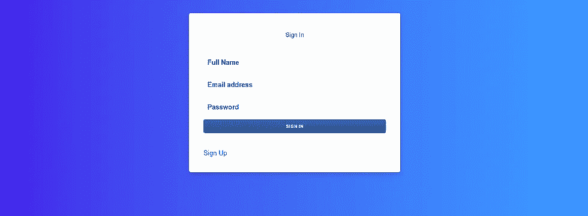

# Supabase:设置身份验证

> 原文：<https://medium.com/coinmonks/supabase-setting-up-authentication-15021c6d08e1?source=collection_archive---------0----------------------->


# 1.概观

在本文中，我们将学习如何在 angular 中使用 supabase 设置身份验证。 [Supabase](https://supabase.io/) 是一款开源 Firebase 替代产品，可在 2 分钟内创建后端。使用 Postgres 数据库、身份验证、即时 API、实时订阅和存储启动项目。

对于这个教程，我使用 angular 作为我的前端框架，可以自由使用任何你选择的框架。

> 源代码可以在这里找到

# 2.先决条件

1.  应安装角度
2.  在 supabase 上创建项目。
3.  在 supabase 数据库中创建`profiles`表

```
create table profiles (id uuid references auth.users,name text);
```


# 3.履行

1.  我们将从创建一个新的角度项目开始。我正在创建名为`supabase-app`的项目。可以使用`ng new supabase-app`命令创建该应用程序。


2.创建角度项目后，我们就可以使用命令`npm install [@supabase/supabase-js](http://twitter.com/supabase/supabase-js)`安装 supabase 软件包。


3.现在，让我们创建`signup`、`login`和`home`组件以及`authguard`和`supabaseclient`服务。


4.现在是时候用我们的 angular app 设置 supabase 了。将 supabase 项目 URL 和秘密放入`environment.ts`文件中。你可以在设置> API >配置中找到你的项目 URL 和秘密。


5.现在我们将创建 supabase 服务，此服务具有用户注册、登录和创建用户配置文件的方法。

6.我们必须在`signup.component.html`和`login.component.ts`中创建注册表单和登录表单。



7.在注册过程中，我们还会捕获名称并将该名称存储在数据库中的`profiles`表中。

8.现在是时候建立`AuthGuard`了。我们将检查用户会话是否已经存在，然后重定向到`home`组件，但如果该会话不存在，则将重定向到`login`组件。

# 4.结论

在本文中，我们看到了如何使用 supabase 实现身份验证。Supabase 还支持第三方身份验证 OAuth 提供商，如谷歌签名、facebook 登录等。您可以在这里参考详细文档[。](https://supabase.io/docs/guides/auth)

如果你觉得这篇文章很有帮助，请点击拍手按钮，并跟随我阅读更多这样的信息丰富的文章。

你可以在 [Linkedin](https://linkedin.com/in/adityajoshi12) 上找到我或者在 [GitHub](https://github.com/adityajoshi12) 上跟踪我？如果这对你来说太社交化了，如果你想和我讨论技术，就给 adityaprakashjoshi1@gmail.com 发封邮件。


> 加入 [Coinmonks 电报频道](https://t.me/coincodecap)，了解加密交易和投资

## 另外，阅读

*   [什么是融资融券交易](https://blog.coincodecap.com/margin-trading) | [成本平均法](https://blog.coincodecap.com/dca)
*   [BigONE 交易所评论](/coinmonks/bigone-exchange-review-64705d85a1d4) | [电网交易机器人](https://blog.coincodecap.com/grid-trading)
*   最佳[加密交易机器人](https://blog.coincodecap.com/best-crypto-trading-bots)
*   [3 商业评论](/coinmonks/3commas-review-an-excellent-crypto-trading-bot-2020-1313a58bec92) | [Pionex 评论](/coinmonks/pionex-review-exchange-with-crypto-trading-bot-1e459d0191ea) | [Coinrule 评论](/coinmonks/coinrule-review-2021-a-beginner-friendly-crypto-trading-bot-daf0504848ba)
*   [莱杰 vs n rave](/coinmonks/ledger-vs-ngrave-zero-7e40f0c1d694)|[莱杰 nano s vs x](/coinmonks/ledger-nano-s-vs-x-battery-hardware-price-storage-59a6663fe3b0) | [币安评论](/coinmonks/binance-review-ee10d3bf3b6e)
*   [Bybit Exchange 审查](/coinmonks/bybit-exchange-review-dbd570019b71) | [Bityard 审查](https://blog.coincodecap.com/bityard-reivew) | [CoinSpot 审查](https://blog.coincodecap.com/coinspot-review)
*   [3 commas vs crypto hopper](/coinmonks/3commas-vs-pionex-vs-cryptohopper-best-crypto-bot-6a98d2baa203)|[赚取加密利息](/coinmonks/earn-crypto-interest-b10b810fdda3)
*   最好的比特币[硬件钱包](https://blog.coincodecap.com/best-hardware-wallet-bitcoin) | [BitBox02 回顾](/coinmonks/bitbox02-review-your-swiss-bitcoin-hardware-wallet-c36c88fff29)
*   [BlockFi vs 摄氏](/coinmonks/blockfi-vs-celsius-vs-hodlnaut-8a1cc8c26630) | [Hodlnaut 点评](/coinmonks/hodlnaut-review-best-way-to-hodl-is-to-earn-interest-on-your-bitcoin-6658a8c19edf) | [KuCoin 点评](https://blog.coincodecap.com/kucoin-review)