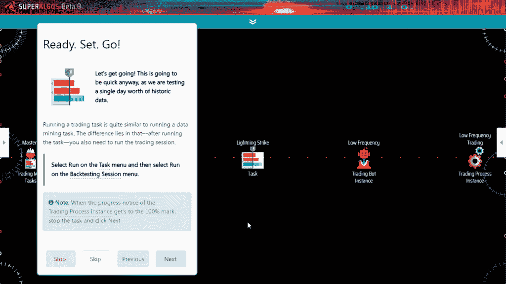

# Superalgos 评论 2021 |免费和开源加密交易机器人

> 原文：<https://medium.com/coinmonks/superalgos-review-332a2801e3cb?source=collection_archive---------0----------------------->

## 比特币和其他加密货币的社区驱动交易自动化工具

Superalgos 是一个加密市场研究和交易自动化平台。该平台的目标是整合产生交易智能所需的所有关键要素。正是这种集成到一个无所不包的平台中，才允许从信息中提取最大价值，并制定明智的战略。

用户选择[超级机器人](https://blog.coincodecap.com/go/superalgos)来构建复杂的[密码交易机器人](/coinmonks/crypto-trading-bot-c2ffce8acb2a)。它主要面向寻找健壮、灵活和强大工具的用户。

[Superalgos](https://blog.coincodecap.com/go/superalgos) 不是一个简单的即插即用的机器人，你一个周末就能掌握。这是一个庞大的系统。如果你想开发能让你在市场中获得优势的交易机器人，你将会体会到 Superalgos 可能释放的力量。

# Superalgos 评论:功能

[Superalgos](https://blog.coincodecap.com/go/superalgos) 是围绕一个视觉环境构建的。整个界面极具视觉效果。该系统使用这种视觉元素来帮助用户理解加密交易中涉及的许多概念之间的复杂关系。

典型的工作流程包括从[加密交易所](https://blog.coincodecap.com/go/crypto-exchange)下载数据，对其进行处理以提取有价值的信息，并在交易策略中使用该信息，您可以测试并最终部署为全自动交易机器人。

# 从交易所下载市场数据

*   你可以同时从多个交易所和多个市场下载 [OHLCV](https://en.wikipedia.org/wiki/Open-high-low-close_chart) (开盘、盘高、盘低、收盘、成交量)数据，定义日期范围和其他参数。

## 将数据处理成传统和定制指标

*   您可以将 OHLCV 数据转换为所有支持时间段的蜡烛图。
*   原始市场数据可以转换成传统指标。

*   该系统采用可视化脚本解决方案，以最少的编码需求构建定制指示器。
*   指标可以相互依赖对方的产出。也就是说，您可以嵌套数据流程，并在其他指标之上构建指标。

# 可视化传统和自定义指示器

*   您可以不用编码来构建绘图仪。绘图仪为自定义数据集创建图形，以便所有数据，甚至自定义指标，都可以绘制在图表上。

## 训练机器学习算法(Beta 9)

*   在 Beta 9 中，你将能够训练 [TensorFlow](https://www.tensorflow.org/) 算法。
*   训练数据集可以用内置的数据处理能力来产生。
*   由此产生的模型可以在交易策略中使用，将信号与传统的技术分析方法相结合。

## 战略的视觉设计

*   交易系统是按照分阶段组织策略的专业框架建立的。
*   这是一个基于规则的框架:你编写规则来触发一个策略，采取立场，管理立场，并关闭它。

*   你可以使用市价单和限价单，并设置复杂的执行算法。

*   你可以用定义如何在描述目标的任意数量的公式之间切换的规则来分阶段处理止盈和止损目标。

*   您可以结合多个指标和多个时间框架进行分析。
*   以上都不需要编码。简单的本地语法用于描述条件的数学比较和编写公式。
*   如果你会编码，你可以把你的设置提升到一个更高的水平。

## 策略的可视化测试和调试

*   交易时段有四种类型:回溯测试、纸上交易、远期测试和现场交易。

*   所有这些都在图表上产生视觉模拟。
*   模拟可以绘制出交易引擎为每笔交易处理的所有信息。

*   这使得整个操作透明而直接。它有助于准确理解机器人在每根蜡烛上做什么。
*   错误处理与内置的交互式文档集成在一起，因此您可以获得关于错误或警告的完整信息。

*   工作流有利于生产率:回溯测试，浏览图表上的结果，调整策略，然后再次测试。
*   模拟显示了每个蜡烛线的有效条件、公式的值等等。

*   交易引擎跟踪每一个变量，并通过图形用户界面提供给用户，这样你就可以了解交易过程中的每一步。

## 部署交易场

*   [Superalgos](https://blog.coincodecap.com/go/superalgos) 实现了交易农场的概念。
*   任务可以以协调的方式部署在多个物理和虚拟机器上。
*   这支持各种部署和设置，例如，共享相同数据源的多个交易机器人、独立的测试和生产环境、可扩展的操作等。

# Superalgos 如何工作

安装 [Superalgos](https://blog.coincodecap.com/go/superalgos) 需要安装 Node.js，因为 Superalgos 客户端是 Node.js 应用程序。安装 Git 允许使用 Superalgos 更新和贡献函数。

安装很简单:派生/克隆 [Superalgos 库](https://github.com/Superalgos/Superalgos/)然后就可以开始了。

你一启动这个应用程序，一个交互式的欢迎教程就会向你打招呼，带你参观整个系统，教你所有的基本操作。在教程中，你将从[币安](https://blog.coincodecap.com/go/binance)下载市场数据，将其处理成几个指标，用演示交易系统进行回溯测试，如果你愿意，甚至可以进行实时交易。

还有几个互动教程可以帮助你应对学习曲线。这个系统是完全记录在案的，所以你可以研究这些文件，并在学习几天后开始产生智能。

# Superalgos 与其他产品的比较

商业平台的业务是从用户身上获取价值。很残酷，但却是事实。相反， [Superalgos](https://blog.coincodecap.com/go/superalgos) 是用户为用户搭建的以用户为中心的平台。

这个事实有很多分支。例如，商业平台希望你相信交易很容易，一个简单的机器人可以让你赚钱。不是真的。他们卖给你一些你不需要的、不起作用的功能。他们人为地限制你可以做或不可以做什么来卖给你高级计划和升级。我可以一直说下去，但我相信你已经明白了。你的成功不是他们的首要兴趣。

商业交易机器人平台有三种类型:

*   有些提供简单的工具，产生不复杂的算法。这些大多是垃圾或简单的骗局。
*   有些仅限于自动化机械任务，没有真正的智能。如果您需要这种简单的自动化，您可能会发现一些有用的东西。
*   有些专门研究单边方法(即:特定的策略或过程)。有些在他们的范围内是好的。

[Superalgos](https://blog.coincodecap.com/go/superalgos) 完全不是这样。Superalgos 集成了交易智能的所有重要方面，因此当与熟练的用户配对时，智能可能会出现。把 Superalgos 想象成一个没有限制的一站式解决方案。

与其他开源解决方案相比，Superalgos 是独一无二的，因为它提供了在其他地方找不到的大规模基础设施。此外，该基础架构是为概念的无缝集成以及可伸缩性而设计的。

没有其他系统能够处理大型交易操作的复杂性，在多个市场的多个[加密货币交易所](https://blog.coincodecap.com/go/crypto-exchange)的多台虚拟或物理机器上部署多个机器人。

例如， [Superalgos](https://blog.coincodecap.com/go/superalgos) 组织你所有的数据处理。您可以在多台机器上部署协调的数据任务。该系统将多个时间框架内每个指标的数据集标准化。它处理嵌套指标的相关性，以便您可以根据其他指标的输出来构建指标。所有这些处理可以通过历史数据离线完成，也可以通过实时交易时的实时数据源在线完成。

然后，这些数据可供交易系统内部的用户使用，或者用于训练机器学习算法。不用说，ML algos 生成的模型也可以在交易系统中使用。事实上，你所有的数据都可能被运行在不同机器上的多个交易机器人所消耗。这就是系统如何巧妙地整合所有这些概念。

如果您是一名开发人员，在可视化脚本环境中构建、测试和调试策略比编写普通代码更容易管理和扩展。这在 [Superalgos](https://blog.coincodecap.com/go/superalgos) 中也相当独特。

正如前面所暗示的，该系统从 A 到 z 都有。它可以完成构建真正强大的机器人所需的一切，独特的视觉环境允许管理大型交易操作中的所有复杂性。

# Superalgos 评论:用户体验

只要你做了欢迎教程，你就会意识到 [Superalgos](https://blog.coincodecap.com/go/superalgos) 是你见过的最强大的平台。这很明显，也是新用户早期反馈的共同线索。

然而，学习该系统并实现其全部潜力需要时间。因为这个系统是高度灵活的，它不会限制你做什么或不做什么。虽然这是一个很好的功能，可以确保用户通过该技术获得权力，但这也是有代价的:你可能会做一些毫无意义的事情。

强烈建议在冒险之前做所有的互动教程来学习所有的基础知识。

[Superalgos](https://blog.coincodecap.com/go/superalgos) 具有令人印象深刻的集成文档，可与界面交互。每个节点、特性和功能都有完整的文档记录。

一旦所有的基本信息都明白了，你就可以展开新的翅膀飞翔了。

# 性能和安全性

Superalgos 对您可以或不可以使用该系统做什么没有限制。您将会发现由您的硬件设置的物理约束的限制。

例如，图表空间允许您加载无限数量的蜡烛，同时可视化无限的指示器。但是，您的硬件将决定它可以显示多少信息，以及它可以以什么帧速率刷新屏幕。

同样，系统允许你部署无限的数据和交易任务。

[Superalgos](https://blog.coincodecap.com/go/superalgos) 处理性能的神奇之处在于，它可以无缝处理跨多台机器的部署，包括物理机和虚拟机。

关于安全性，Superalgos 不实施任何特殊的安全措施，因为软件在您的场所运行，由您控制。没有登录，没有注册，没有下载或安装所需的个人信息。Superalgos 与您的机器一样安全。你不需要信任你的资金，与任何第三方交换钥匙、个人信息或策略。

**该软件是开源的**，每天都有一个庞大的开发者社区在查看代码库。Superalgos 运行在易于阅读和理解的未编译代码上，即使对于非编码人员也是如此。代码保存在一个使用 Git 技术的公共 Github.com 存储库中，通过 Git 技术，代码中的每一个变化都永远可以被审计。

没有第三方参与网络通信。你的机器人直接与交易所的 API 进行交易，你直接从你在交易所的账户内进行交易。

在安全性方面值得一提的是，软件是项目的支柱，项目的利益与用户的利益完全一致。这一优势起初可能并不明显，但如果你看看[华尔街最佳和罗宾汉](/coinmonks/the-evolution-of-the-wallstreetbets-phenomenon-change-is-coming-and-cant-be-stopped-9e359e86f610?source=friends_link&sk=4fd78a7c7cd737b27101aa54eeef6e07)的事件，你可能会意识到这一点的重要性，以及一个至关重要的安全特性:没有人能把你锁在交易之外。

最后，项目背后的团队不是匿名的。相反，[他们在网站](https://superalgos.org/about-team.shtml)上被介绍，并以真实姓名出现在所有[社区群](https://superalgos.org/community-join.shtml)中。

# Superalgos 定价

Superalgos 永远 100%免费使用、修改和分发。没有分层或门控通道。每个人都可以无限制地访问所有功能。

# Superalgos 评论:利弊

我已经介绍了优点，可以总结为绝对的力量和灵活性。

在缺点方面，有几个需要考虑:

*   不包括合约(衍生品)。在某个时候会的，但不是现在。所以目前只有现货市场。
*   学习曲线很陡。这是一个庞大的系统，一个新的范式，需要时间来消化如此灵活的平台所包含的复杂性。也就是说，互动教程非常棒，应用内文档质量很高，社区也非常有帮助。
*   目前的交易机器人是低频的，工作时间为 1 分钟及以上。整个基础设施适用于高频交易，但它需要一个高频交易机器人，目前还没有。
*   视觉界面在开始时会让人不知所措。需要时间来适应。但是当你理解它所解决的问题时，你就会开始欣赏它:它使复杂性变得易于管理。

# Superalgos 审查:结论

总而言之，Superalgos 是一款令人印象深刻的软件。很明显，成千上万个小时都花在了开发它上，并且它已经经历了几次迭代才达到目前的状态。几乎很难相信它是免费和开源的，直到你发现集体商业模式，这也是非常有趣的。

也就是说，这可能不是一个为周末战士寻找快捷方便的系统。这是一种严肃的武器，必须学会正确运用它的力量。

# 快速链接

*   [网站](https://superalgos.org/)
*   [下载&安装](https://github.com/Superalgos/Superalgos/)
*   [社区](https://t.me/superalgoscommunity)

# 常见问题(常见问题)

**1。为什么如此神奇的软件是开源的？**

因为 Superalgos 项目是关于[一个涉及软件所有用户的集体企业](https://superalgos.org/community-business.shtml)。软件是商业的支柱，并且将永远是免费和开源的，以降低进入门槛。集体企业是关于在一个象征性经济中发展、部署和启动一个分散的、无许可的、抵制审查的金融服务市场。令牌在[参与项目](https://superalgos.org/community-contribute.shtml)的用户中分发。

**2。Superalgos 是基于网络的服务吗？**

不需要。Superalgos 是一款在本地下载并运行的应用程序。这是为了满足无信任部署的要求:您不需要信任您的资金、与任何第三方交换密钥、个人信息或策略。

**3。我可以与哪些交易所合作？**

Superalgos 实现了[CCXT 库](https://github.com/ccxt/ccxt/wiki/Exchange-Markets)，支持超过 120 个交换。也就是说，并不是所有的都符合图书馆的标准，所以目前只有一个子集——大约一半——可供使用。目前，我们只与现货市场合作。每个支持的交易所列出的所有市场都可用。

**4。Superalgos 有现成的策略吗？**

是的，但主要是为了演示和教育目的。

**5。我需要成为开发者才能使用 Superalgos 吗？**

不。开发人员有优势，因为他们可以建立更复杂的设置。但是非编码人员仍然可以利用可视化框架来开发复杂的策略。任何以技术为导向的人都可以从 Superalgos 中受益。此外，社区是欢迎的，总是愿意帮助。没有技术背景的交易者经常和不太懂交易的开发者合作。这是双赢。

> 加入 Coinmonks [Telegram group](https://t.me/joinchat/EPmjKpNYwRMsBI4p) 并了解加密交易和投资

## 另外，阅读

*   什么是[闪贷](https://blog.coincodecap.com/what-are-flash-loans-on-ethereum)？
*   最好的[密码交易机器人](/coinmonks/crypto-trading-bot-c2ffce8acb2a) | [网格交易](https://blog.coincodecap.com/grid-trading)
*   [3 商业评论](/coinmonks/3commas-review-an-excellent-crypto-trading-bot-2020-1313a58bec92) | [Pionex 评论](/coinmonks/pionex-review-exchange-with-crypto-trading-bot-1e459d0191ea) | [Coinrule 评论](https://blog.coincodecap.com/coinrule-review-a-perfect-trading-bot)
*   [AAX 交易所评论](/coinmonks/aax-exchange-review-2021-67c5ea09330c) | [德里比特评论](/coinmonks/deribit-review-options-fees-apis-and-testnet-2ca16c4bbdb2) | [FTX 交易所评论](/coinmonks/ftx-crypto-exchange-review-53664ac1198f)
*   [n rave 零点回顾](/coinmonks/ngrave-zero-review-c465cf8307fc) | [Phemex 回顾](/coinmonks/phemex-review-4cfba0b49e28) | [PrimeXBT 回顾](/coinmonks/primexbt-review-88e0815be858)
*   [Bybit Exchange 审查](/coinmonks/bybit-exchange-review-dbd570019b71) | [Bityard 审查](https://blog.coincodecap.com/bityard-reivew) | [CoinSpot 审查](https://blog.coincodecap.com/coinspot-review)
*   [3 commas vs crypto hopper](/coinmonks/3commas-vs-pionex-vs-cryptohopper-best-crypto-bot-6a98d2baa203)|[赚取加密利息](/coinmonks/earn-crypto-interest-b10b810fdda3)
*   最好的比特币[硬件钱包](/coinmonks/the-best-cryptocurrency-hardware-wallets-of-2020-e28b1c124069?source=friends_link&sk=324dd9ff8556ab578d71e7ad7658ad7c) | [BitBox02 回顾](/coinmonks/bitbox02-review-your-swiss-bitcoin-hardware-wallet-c36c88fff29)
*   [莱杰 vs n 格拉夫](https://blog.coincodecap.com/ngrave-vs-ledger) | [莱杰纳米 s vs x](https://blog.coincodecap.com/ledger-nano-s-vs-x)
*   [加密副本交易平台](/coinmonks/top-10-crypto-copy-trading-platforms-for-beginners-d0c37c7d698c) | [比特码副本交易](https://blog.coincodecap.com/bityard-copy-trading)
*   [Vauld Review](https://blog.coincodecap.com/vauld-review)|[you hodler Review](/coinmonks/youhodler-4-easy-ways-to-make-money-98969b9689f2)|[BlockFi Review](/coinmonks/blockfi-review-53096053c097)
*   最好的[加密税务软件](/coinmonks/best-crypto-tax-tool-for-my-money-72d4b430816b) | [硬币追踪评论](/coinmonks/cointracking-review-a-reliable-cryptocurrency-tax-software-5114e3eb5737)
*   最佳[密码借贷平台](/coinmonks/top-5-crypto-lending-platforms-in-2020-that-you-need-to-know-a1b675cec3fa) | [杠杆令牌](/coinmonks/leveraged-token-3f5257808b22)
*   [莱杰纳米 S vs 特雷佐 one vs 特雷佐 T vs 莱杰纳米 X](https://blog.coincodecap.com/ledger-nano-s-vs-trezor-one-ledger-nano-x-trezor-t)
*   [BlockFi vs Celsius](/coinmonks/blockfi-vs-celsius-vs-hodlnaut-8a1cc8c26630)|[Hodlnaut 回顾](https://blog.coincodecap.com/hodlnaut-review)
*   [Bitsgap 审核](https://blog.coincodecap.com/bitsgap-review) | [Quadency 审核](/coinmonks/quadency-review-a-crypto-trading-automation-platform-3068eaa374e1) | [Bitbns 审核](https://blog.coincodecap.com/bitbns-review)
*   [埃利帕尔泰坦评论](/coinmonks/ellipal-titan-review-85e9071dd029) | [赛克斯斯通评论](https://blog.coincodecap.com/secux-stone-hardware-wallet-review)
*   [DEX Explorer](https://explorer.bitquery.io/ethereum/dex)|[w](https://explorer.bitquery.io/graphql)|[local bitcoins 评论](https://blog.coincodecap.com/localbitcoins-review)
*   最佳[区块链分析](https://bitquery.io/blog/best-blockchain-analysis-tools-and-software)工具| [赚比特币](https://blog.coincodecap.com/earn-bitcoin)
*   [加密套利](/coinmonks/crypto-arbitrage-guide-how-to-make-money-as-a-beginner-62bfe5c868f6)指南:新手如何赚钱
*   最佳[加密制图工具](/coinmonks/what-are-the-best-charting-platforms-for-cryptocurrency-trading-85aade584d80) | [最佳加密交易所](/coinmonks/crypto-exchange-dd2f9d6f3769)
*   [如何在印度购买比特币](https://blog.coincodecap.com/buy-bitcoin-app-india)？
*   [印度比特币交易所](/coinmonks/bitcoin-exchange-in-india-7f1fe79715c9) | [比特币储蓄账户](https://blog.coincodecap.com/bitcoin-savings-account)
*   了解比特币最好的[书籍有哪些？](/coinmonks/what-are-the-best-books-to-learn-bitcoin-409aeb9aff4b)

> [直接在您的收件箱中获得最佳软件交易](/coinmonks/newsletters/coinmonks)

*原载于 2021 年 3 月 2 日 https://blog.coincodecap.com***。**