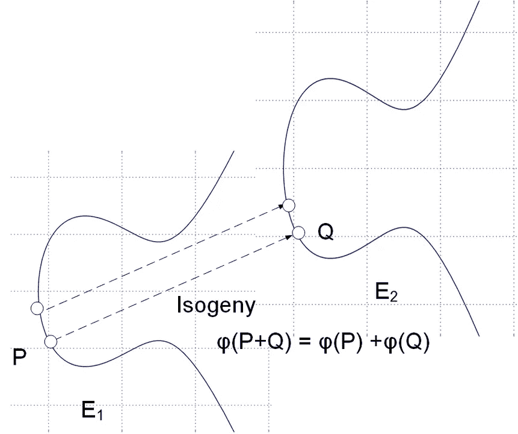

# 用于后量子计算机密钥生成的超奇异同源 Diffie-Hellman (SIDH)

> 原文：<https://medium.com/coinmonks/supersingular-isogeny-diffie-hellman-sidh-for-post-quantum-computer-key-generation-6742d2ea78dc?source=collection_archive---------2----------------------->

同源更简单的解释是这里的。

## 介绍

好吧。系好安全带，完全理解这里的基本程序可能需要一段时间，但是，如果你对未来的量子鲁棒世界感兴趣，这可能是值得的。在我们开始之前，您可能想了解一下 RSA…